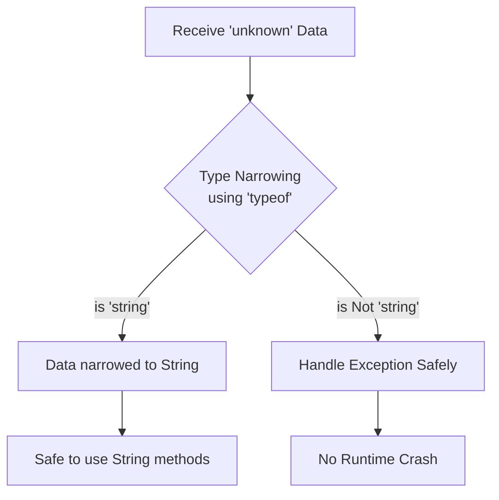

# Comprehensive Type Safety: Fundamentals, `any` vs `unknown`, and Type Narrowing

### What is Type Safety?
Simply put, **Type Safety** is like a quality control checkpoint in programming. It ensures that variables only hold the type of data they are expected to hold (such as text, numbers, or true/false values) and ensures you don't perform invalid operations on them. 

To understand this, let's look at two examples:

**1. Statically Typed Example (C++)**
In C++, you must declare the type upfront. If you try to put a word into a number variable, the program will simply refuse to run, saving you from a future bug.
```cpp
int age = 25;
age = "twenty-five"; // Compile-time error! C++ protects you from this mistake.
```

**2. Dynamically Typed Example (JavaScript)**
In JavaScript, types are flexible. A variable can start as a number and later become a string. While this is convenient, it can lead to unexpected crashes when the program runs.
```javascript
let age = 25;
age = "twenty-five"; // Valid in JS! But it might crash later if you try to do math:
console.log(age * 2); // Results in NaN (Not a Number) at runtime.
```

---

#### 1) Dynamically vs. Statically Typed Languages
Programming languages approach type safety differently:

* **Dynamically Typed Languages (e.g., JavaScript, Python):** Do not require explicit type declarations. They use runtime type inference. This allows flexibility but increases the chance of runtime errors.
* **Statically Typed Languages (e.g., Java, C++):** Require explicit type declarations. The compiler enforces strict type rules and catches type mismatches at compile time, greatly improving code reliability.

| Feature | Dynamically Typed | Statically Typed |
|---------|-------------------|------------------|
| **Type declaration** | Not required | Required |
| **Type checking** | At runtime | At compile time |
| **Variable type changes** | Allowed | Not allowed |
| **Risk of runtime errors** | Higher | Lower |

#### 2) `any`: The Type Safety Hole in TypeScript
TypeScript is a statically typed layer over JavaScript, designed to catch errors early. However, developers sometimes use the `any` type to bypass these checks. As mentioned in the official TypeScript documentation:

> *"TypeScript also has a special type, `any`, that you can use whenever you don't want a particular value to cause typechecking errors. When a value is of type `any`, you can access any properties of it (which will in turn be of type `any`), call it like a function, assign it to (or from) a value of any type, or pretty much anything else that's syntactically legal."*

It is considered a "Type Safety Hole" because it completely silences the compiler. It lets you do extremely dangerous things by telling TypeScript to ignore potential errors.

**Problem Code:**
```typescript
const user: any = {
  name: "John",
  age: 30,
};

// TypeScript won't warn us, but this will CRASH at runtime!
user.roles.push("admin"); 
// Output: TypeError: Cannot read properties of undefined (reading 'push')
```
In the example above, `roles` doesn't exist on the `user` object. TypeScript allows it because of `any`, but it crashes the program when executed.

#### 3) The Solution: Using `unknown` and Type Narrowing
For unpredictable data, the safer alternative is `unknown`. The `unknown` type is a type-safe counterpart of `any`. It can hold any value, but it requires you to perform a type check before using the variable.

This process of checking and refining an `unknown` type into a specific, predictable type is called **Type Narrowing**.

**Solution Code:**
```typescript
function greet(name: unknown) {
  // Action is forbidden until we know what it is!
  // name.toUpperCase(); // Compile-time Error!
  
  // Type Narrowing: Checking before acting
  if (typeof name === "string") {
    // Now it's safe to use string methods
    console.log(`Hello, ${name.toUpperCase()}!`);
  } else {
     console.log("Name must be a string.");
  }
}

greet("John"); // Output: Hello, JOHN!
greet(123);    // Output: Name must be a string.
```

**Workflow of Type Narrowing:**


#### 4) A Real-Life Analogy
Imagine receiving a mysterious parcel from a courier (Unpredictable Data). 
- **With `any`:** You blindly assume it's food and take a bite without looking. If it's a solid rock, you break your teeth (Runtime Error)! 
- **With `unknown`:** You acknowledge it's a mysterious parcel. You don't interact with it until you open it (Type Narrowing) and verify whether it's food or a rock. This ensures your safety.

**Analogy Code:**
```typescript
function handleMysteryParcel(parcel: unknown) {
    // Action is forbidden until we know what it is!
    
    // Type Narrowing: Checking before acting
    if (typeof parcel === "string") {
        console.log(`Reading the letter: ${parcel}`);
    } else if (typeof parcel === "number") {
        console.log(`Paying the bill amount of: $${parcel}`);
    } else {
        console.log("Keeping the parcel safe in storage.");
    }
}

handleMysteryParcel("Hello from Bangladesh!");
handleMysteryParcel(500);
```

---

### Final Thoughts
Type safety balances flexibility and error prevention. By understanding the difference between statically and dynamically typed systems, and by embracing tools like `unknown` and Type Narrowing over `any`, developers can write safer, highly predictable, and crash-resistant applications. Always choose compile-time safety over runtime flexibility!

---

### References
* **Medium Blog:** [Avoid the `any` Type in TypeScript](https://medium.com/@ExplosionPills/avoid-the-any-type-in-typescript-aba2496d1e6a)
* **Total TypeScript Concept:** [The `any` Type](https://www.totaltypescript.com/concepts/any-type)
* **TypeScript Handbook:** [Everyday Types](https://www.typescriptlang.org/docs/handbook/2/everyday-types.html)