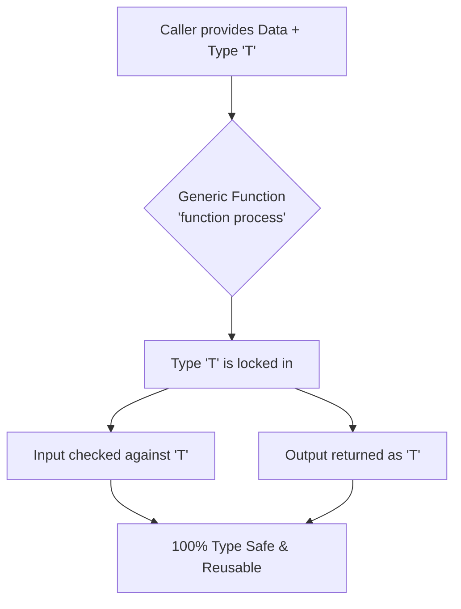

# Mastering Reusability and Type Safety with TypeScript Generics

### The Need for Reusability
In software development, building reusable functions or components is a core principle. However, in a statically typed language like TypeScript, achieving reusability without sacrificing type safety can be challenging. If you hardcode a specific type, the function is not reusable. If you use `any` to accept multiple types, you lose type safety entirely.

This is where **Generics** come in.

### Understanding Generics
Generics act as a placeholder or a "variable" for types. They allow you to define a function, class, or interface that can work with any data type, while still maintaining strict type-checking at compile time. Instead of the defining function deciding the type, the *caller* of the function passes the type along with the data.

#### The Problem: Hardcoding Types or Using `any`
Let's say we want a function that takes an item and returns it inside an array.

**Without Generics (Hardcoded):**
```typescript
function makeNumberArray(item: number): number[] {
  return [item];
}
// What if we want a string array? We would have to write a completely new function!
```

**Without Generics (Using `any`):**
```typescript
function makeArray(item: any): any[] {
  return [item];
}

// Now it is reusable, but we lost type safety. 
const strArray = makeArray("Hello");
strArray[0].toFixed(2); // No compile-time error, but CRASHES at runtime!
```

#### The Solution: The Power of Generics
By using a generic type parameter (usually denoted as `<T>`), we capture the data type provided by the user and apply it consistently throughout the function. Think of `<T>` as a placeholder that gets filled in when you actually call the function.

**With Generics:**
```typescript
function identity<T>(value: T): T {
  return value;
}

// Case 1: Passing a number
const resultOne = identity(123); 
// TypeScript automatically knows that T is a 'number'.
// resultOne is strictly typed as a number.

// Case 2: Passing a string
const resultTwo = identity("Hello Generics");
// TypeScript automatically knows that T is a 'string'.
// resultTwo is strictly typed as a string.
```
In the example above, `identity` is completely reusable for any data type, but we haven't lost static type-checking!

#### Generic Interfaces
Generics are not just for functions; they can be applied to interfaces and classes too. This offers massive flexibility for defining data structures:

```typescript
interface Box<T> {
  value: T;
}

const numberBox: Box<number> = { value: 123 };
const stringBox: Box<string> = { value: "TypeScript" };
// Both use the same structure, but safely handle different data types!
```

#### Multiple Type Parameters
You can also use more than one generic type parameter at a time. This is useful when a component needs to link two different data types together.

```typescript
interface Pair<T, U> {
  first: T;
  second: U;
}

const myPair: Pair<number, string> = { first: 10, second: "Hello" };
console.log(myPair.first, myPair.second); // Output: 10 Hello
```

#### Generic Classes
Similarly, classes can use generics to remain highly reusable. A classic example is a `Stack` data structure which can hold a list of items of ANY single type:

```typescript
class Stack<T> {
  private items: T[] = [];

  push(item: T): void {
    this.items.push(item);
  }

  pop(): T | undefined {
    return this.items.pop();
  }
}

const numberStack = new Stack<number>();
numberStack.push(10);
numberStack.push(20);
console.log(numberStack.pop()); // Output: 20

const stringStack = new Stack<string>();
stringStack.push("Hello");
// stringStack.push(100); // Compile Error! TypeScript STRICTLY expects strings here.
```

#### Reusing Type Aliases with Generics
We can also bind a Generic `<T>` to a `type` alias instead of writing explicit function signatures every time. This creates "Type Templates."

```typescript
// Step 1: Create a generic "Blueprint" or Template.
// This means: "I take an array of type T, and return an array of type T"
type ArrayTransformer<T> = (input: T[]) => T[];

// Step 2: Use the Blueprint for Numbers (<number>)
// TypeScript automatically knows 'input' is exactly 'number[]'
const reverseArray: ArrayTransformer<number> = (input) => {
    return [...input].reverse(); // Using [...] to prevent changing the original array
};

// Step 3: Use the EXACT SAME blueprint for Strings (<string>)
// TypeScript automatically knows 'input' is exactly 'string[]'
const duplicateArray: ArrayTransformer<string> = (input) => {
    return [...input, ...input]; // Duplicates the array
};

// --- Testing the Functions ---
console.log(reverseArray([1, 2, 3, 4])); 
// Output: [4, 3, 2, 1]

console.log(duplicateArray(["A", "B"])); 
// Output: ["A", "B", "A", "B"]
```

### Advanced Reusability: Generic Constraints
Sometimes you want reusable code, but you still need to ensure that the passed type meets certain minimum requirements. You can restrict Generics using the `extends` keyword. This is called a **Generic Constraint**.

For example, imagine we want a function that extracts a value from an object. We want TypeScript to strictly warn us if we accidentally ask for a property that doesn't exist in that object:

```typescript
// 'K extends keyof T' means K MUST be a valid key inside our object T
function getProperty<T, K extends keyof T>(obj: T, key: K) {
  return obj[key];
}

const user = { name: "John", age: 25 };

// ✅ Works perfectly! "name" exists in user.
const userName = getProperty(user, "name"); 
console.log(userName); // Output: "John"

// ❌ Compile Error! "email" does not exist in our user object.
// const userEmail = getProperty(user, "email"); 
```

### Best Practices with Generics
Using Generics effectively in large applications requires following some basic principles to keep the codebase readable:

1. **Use Meaningful Names (When Applicable):** While `T`, `K`, and `U` are standard, using more descriptive names like `<Type>`, `<Input>`, or `<Model>` can make complex generic interfaces easier to understand.
2. **Apply Constraints:** Do not leave generic parameters completely open if they need specific fields. Always use `extends` to restrict them (like `T extends Lengthwise` or `T extends Identifiable`).
3. **Leverage Utility Types:** TypeScript already provides fantastic built-in generics called Utility Types. Instead of manually mapping properties, you can use:
   * `Partial<T>`: Makes all properties optional.
   * `Readonly<T>`: Makes all properties immutable.
   * `Pick<T, K>`: Extracts a specific set of properties from an object.

*(Note: Under the hood, Utility Types like `Partial` use something called **Mapped Types**. It maps through the keys of `<T>` and reshapes them. For instance, `type Optional<T> = { [K in keyof T]?: T[K] };` is exactly how `Partial` makes everything optional!)*

```typescript
// Example of Utility Type Partial<T> (Mapped Type under the hood)
interface User {
    id: number;
    name: string;
}

// Gives us { id?: number, name?: string }
const partialData: Partial<User> = { name: "Alice" }; 
```

### Troubleshooting Common Issues
When working with Generics, beginners often see a few specific errors. Here is how to fix them:

* **"Type is not generic" / "Generic type requires 1 type argument(s)"**
  This happens when a generic type (like `Array`) is used without specifying what it holds.
  * *Error:* `const myArr: Array = [1, 2, 3];`
  * *Fix:* Give it the missing type argument: `const myArr: Array<number> = [1, 2, 3];`

* **"Cannot find name 'T'"**
  This occurs if you try to use a generic variable type *without* declaring it in the angle brackets `<>` first.
  * *Error:* `function doSomething(val: T): T` -> TypeScript doesn't know what `T` is!
  * *Fix:* Declare `<T>` in the function signature: `function doSomething<T>(val: T): T`

### Visualizing Generics



### Final Thoughts
Generics bridge the gap between flexibility and strict typing. They allow developers to write a piece of logic once and use it across various data structures, all while keeping TypeScript's powerful compile-time safety intact. By mastering Generics, you can build highly dynamic, scalable, and bug-resistant codebases.

---

### References
* **DigitalOcean Tutorial:** [How To Use Generics in TypeScript](https://www.digitalocean.com/community/tutorials/how-to-use-generics-in-typescript)
* **TypeScript Handbook:** [Generics](https://www.typescriptlang.org/docs/handbook/2/generics.html)
* **LogRocket Blog:** [Using TypeScript generics to create reusable components](https://blog.logrocket.com/using-typescript-generics-create-reusable-components/)
* **DEV Community:** [Understanding Generics in TypeScript for Improved Code Reusability](https://dev.to/jefersoneiji/understanding-generics-in-typescript-for-improved-code-reusability-4279)
* **Medium Article:** [Generics in TypeScript: Exploring the power of Type Safety](https://medium.com/@chandrashekharsingh25/generics-in-typescript-exploring-the-power-of-type-safety-f911582a3e22)
* **Medium Article (Yulia Batrakova):** [Mastering Generics in TypeScript](https://medium.com/@happycarrot/mastering-generics-in-typescript-enhance-function-reusability-and-type-safety-39f470070f98)