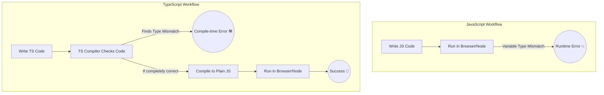

# Module 01: TypeScript Foundations

## 1.1 Why TypeScript?

In simple terms, **TypeScript** is a superset of **JavaScript**. While JavaScript is great for building web applications, as your project grows, the chances of encountering bugs increase. TypeScript helps catch these bugs *before* your code even runs.

### Main Difference (JavaScript vs TypeScript)

JavaScript is **Dynamically Typed**. This means you don't have to specify what kind of data (number, string, object) a variable will hold. As a result, sudden errors can appear when the program is running (Runtime).

On the other hand, TypeScript is **Statically Typed**. You have to explicitly define what type of data a variable will store beforehand. Because of this, Code Editors (like VS Code) can catch errors while you are writing the code (Compile-time).

### Diagram: JS vs TS Workflow



### Why is TypeScript needed for a Beginner?

1. **Early Bug Detection:** In JavaScript, if you store a number in a variable and later try to use it as a string, you won't know it's a mistake until you run it. TypeScript will warn you with red squiggly lines as soon as you type it.
   
2. **Awesome Autocomplete (IntelliSense):** Since TypeScript knows exactly what properties your objects or functions have, VS Code provides excellent suggestions and autocomplete. This makes writing code much faster.

3. **Better Readability:** When looking at someone else's code (or your own code from months ago), it is easy to understand what input a function takes and what output it returns.

4. **Confident Refactoring:** If you change the name or parameter of a function, TypeScript automatically points out everywhere else in the project you need to update it.

---

## 1.2 Why is NVM (Node Version Manager) Needed?

When working with JavaScript or TypeScript outside the browser, you need **Node.js** installed on your computer. However, different projects often require different versions of Node.js. 

Here is why **NVM** is crucial:

1. **Multiple Versions:** It allows you to seamlessly install multiple versions of Node.js on a single machine.
2. **Easy Switching:** You can switch between Node.js versions with a simple command (e.g., `nvm use 18`, `nvm use 20`) depending on the project you are currently working on.
3. **Avoids Permission Issues:** NVM installs Node.js packages in your user directory. This means you do not need `sudo` or Administrator privileges to install global npm packages, which prevents many common installation errors.
4. **Project Specificity:** You can create an `.nvmrc` file in your project folder to lock a specific Node version. Anyone who joins the project can just run `nvm use` to automatically switch to the correct version required for that project.

---

## 1.3 TypeScript Beginner's Guide: Setup & Compilation

### What is `tsc`?
`tsc` stands for **TypeScript Compiler**. Browsers and Node.js cannot run TypeScript (`.ts` files) directly; they only understand plain JavaScript (`.js` files). `tsc` acts as a translator—it reads your TypeScript code and converts (compiles) it into JavaScript so that it can run.

### 1. How to Install TypeScript
To install TypeScript globally on your system, open your terminal and run:

```bash
npm install -g typescript
```
*(The `-g` flag stands for global, meaning you can now run TypeScript commands from any folder).*

To verify the installation was successful, check the version:
```bash
tsc --version
```

### 2. Converting (Compiling) a TypeScript File
Let's say you create a file named `test.ts`. To convert it into JavaScript, run:

```bash
tsc test.ts
```
This generates a new file called `test.js` in the same directory. You can now execute this file using Node:
```bash
node test.js
```

### 3. Creating `tsconfig.json` Setup
Instead of converting one file at a time (`tsc test.ts`), we can set up project-wide rules. Run this command inside your project folder:

```bash
tsc --init
```
This will create a `tsconfig.json` file. Think of this file as the master settings or config file for your TypeScript project. It tells `tsc` exactly how it should compile your code.

### 4. Organizing Files with `rootDir` and `outDir`
As a beginner, a great best practice is to organize your code properly. You don't want your `.ts` source files and `.js` compiled files mixed together in the same place. We can fix this using `tsconfig.json`.

Open `tsconfig.json`, find the following lines, and update them (make sure to remove the `//` at the start to uncomment them):

*   **`"rootDir": "./src"`** 
    This tells the compiler: *"Look for all my `.ts` files inside a folder named `src`."*
*   **`"outDir": "./dist"`** 
    This tells the compiler: *"Put all the newly generated `.js` files into a folder named `dist` (distribution)."*

**How to use this setup:**
1. Create a `src` folder and put your `test.ts` inside it.
2. Go to your terminal and just run:
   ```bash
   tsc
   ```
   **Magic!** `tsc` will automatically find the files in `src`, compile them, and put the JavaScript files cleanly inside the `dist` folder.

> **💡 Pro Tip:** If you run `tsc -w` (or `tsc --watch`), TypeScript will stay actively running in the terminal. Every time you save a `.ts` file, it will instantly convert it to JS without you having to run the command again manually!

---

## 1.4 Primitive Types: Implicit vs Explicit

In TypeScript, there are several primitive data types, just like in JavaScript: `string`, `number`, `boolean`, `null`, `undefined`, and `symbol`. TypeScript protects you from mixing them up. You can define these types in two ways:

### 1. Explicit Type (Type Annotation)
You explicitly tell TypeScript what kind of data a variable will hold. Once defined, you **cannot** assign a different type of data to it.

```typescript
let userName: string = "Moon";
let age: number = 25;
let isStudent: boolean = true;

// ❌ ERROR: Type 'number' is not assignable to type 'string'.
userName = 12; 
```

### 2. Implicit Type (Type Inference)
If you do not explicitly declare the type, TypeScript is smart enough to guess (infer) the type based on the initial value you assign to it.

```typescript
let country = "Bangladesh"; // TypeScript implicitly infers this as a 'string'

// ❌ ERROR: Type 'number' is not assignable to type 'string'.
country = 100; 
```

> **💡 Best Practice:** If you assign a value immediately, you can rely on Implicit typing (Type Inference). But if you declare a variable first and assign a value later, always use Explicit typing.

---

## 1.5 Troubleshooting: VS Code Not Showing Errors (Red Lines)

Sometimes, VS Code might not show red squiggly lines for TypeScript errors. If this happens, follow these steps to fix it:

### Fix 1: Make it a Module
If your file doesn't have any `import` or `export` statements, TypeScript treats it as a global script. Add this to the bottom of your file to force it to act as an isolated module:
```typescript
export {};
```

### Fix 2: Update `tsconfig.json`
Tell the TypeScript language service explicitly to check your `src` folder. Add the `"include"` array to your `tsconfig.json`:
```json
{
  "compilerOptions": {
    "rootDir": "./src",
    "outDir": "./dist"
    // ... other options
  },
  "include": ["src"]
}
```

### Fix 3: Force Enable VS Code Validation
Sometimes VS Code's internal validation is turned off. You can force-enable it for your workspace.
Create a folder named `.vscode` in your project root, and inside it, create a `settings.json` file. Add the following configuration:
```json
{
  "typescript.tsserver.enable": true,
  "typescript.validate.enable": true,
  "javascript.validate.enable": true
}
```

> **💡 Pro Tip:** After making these changes, press `Ctrl + Shift + P` (or `Cmd + Shift + P` on Mac), search for **TypeScript: Restart TS server**, and hit Enter. This will instantly refresh the error checker!
