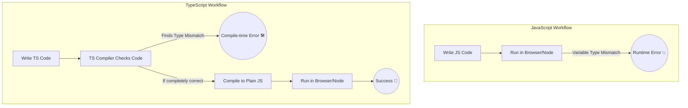

# Module 01: TypeScript Foundations

## 1.1 Why TypeScript?

In simple terms, **TypeScript** is a superset of **JavaScript**. While JavaScript is great for building web applications, as your project grows, the chances of encountering bugs increase. TypeScript helps catch these bugs *before* your code even runs.

### Main Difference (JavaScript vs TypeScript)

JavaScript is **Dynamically Typed**. This means you don't have to specify what kind of data (number, string, object) a variable will hold. As a result, sudden errors can appear when the program is running (Runtime).

On the other hand, TypeScript is **Statically Typed**. You have to explicitly define what type of data a variable will store beforehand. Because of this, Code Editors (like VS Code) can catch errors while you are writing the code (Compile-time).

### Diagram: JS vs TS Workflow



### Why is TypeScript needed for a Beginner?

1. **Early Bug Detection:** In JavaScript, if you store a number in a variable and later try to use it as a string, you won't know it's a mistake until you run it. TypeScript will warn you with red squiggly lines as soon as you type it.
   
2. **Awesome Autocomplete (IntelliSense):** Since TypeScript knows exactly what properties your objects or functions have, VS Code provides excellent suggestions and autocomplete. This makes writing code much faster.

3. **Better Readability:** When looking at someone else's code (or your own code from months ago), it is easy to understand what input a function takes and what output it returns.

4. **Confident Refactoring:** If you change the name or parameter of a function, TypeScript automatically points out everywhere else in the project you need to update it.

---

## 1.2 Why is NVM (Node Version Manager) Needed?

When working with JavaScript or TypeScript outside the browser, you need **Node.js** installed on your computer. However, different projects often require different versions of Node.js. 

Here is why **NVM** is crucial:

1. **Multiple Versions:** It allows you to seamlessly install multiple versions of Node.js on a single machine.
2. **Easy Switching:** You can switch between Node.js versions with a simple command (e.g., `nvm use 18`, `nvm use 20`) depending on the project you are currently working on.
3. **Avoids Permission Issues:** NVM installs Node.js packages in your user directory. This means you do not need `sudo` or Administrator privileges to install global npm packages, which prevents many common installation errors.
4. **Project Specificity:** You can create an `.nvmrc` file in your project folder to lock a specific Node version. Anyone who joins the project can just run `nvm use` to automatically switch to the correct version required for that project.

---

## 1.3 TypeScript Beginner's Guide: Setup & Compilation

### What is `tsc`?
`tsc` stands for **TypeScript Compiler**. Browsers and Node.js cannot run TypeScript (`.ts` files) directly; they only understand plain JavaScript (`.js` files). `tsc` acts as a translator—it reads your TypeScript code and converts (compiles) it into JavaScript so that it can run.

### 1. How to Install TypeScript
To install TypeScript globally on your system, open your terminal and run:

```bash
npm install -g typescript
```
*(The `-g` flag stands for global, meaning you can now run TypeScript commands from any folder).*

To verify the installation was successful, check the version:
```bash
tsc --version
```

### 2. Converting (Compiling) a TypeScript File
Let's say you create a file named `test.ts`. To convert it into JavaScript, run:

```bash
tsc test.ts
```
This generates a new file called `test.js` in the same directory. You can now execute this file using Node:
```bash
node test.js
```

### 3. Creating `tsconfig.json` Setup
Instead of converting one file at a time (`tsc test.ts`), we can set up project-wide rules. Run this command inside your project folder:

```bash
tsc --init
```
This will create a `tsconfig.json` file. Think of this file as the master settings or config file for your TypeScript project. It tells `tsc` exactly how it should compile your code.

### 4. Organizing Files with `rootDir` and `outDir`
As a beginner, a great best practice is to organize your code properly. You don't want your `.ts` source files and `.js` compiled files mixed together in the same place. We can fix this using `tsconfig.json`.

Open `tsconfig.json`, find the following lines, and update them (make sure to remove the `//` at the start to uncomment them):

*   **`"rootDir": "./src"`** 
    This tells the compiler: *"Look for all my `.ts` files inside a folder named `src`."*
*   **`"outDir": "./dist"`** 
    This tells the compiler: *"Put all the newly generated `.js` files into a folder named `dist` (distribution)."*

**How to use this setup:**
1. Create a `src` folder and put your `test.ts` inside it.
2. Go to your terminal and just run:
   ```bash
   tsc
   ```
   **Magic!** `tsc` will automatically find the files in `src`, compile them, and put the JavaScript files cleanly inside the `dist` folder.

> **💡 Pro Tip:** If you run `tsc -w` (or `tsc --watch`), TypeScript will stay actively running in the terminal. Every time you save a `.ts` file, it will instantly convert it to JS without you having to run the command again manually!

---

## 1.4 Primitive vs Non-Primitive Types

Before learning how to assign types, it is important to understand the two main categories of data types in JavaScript and TypeScript:

### 1. Primitive Types
These are the most basic, simple data types. They hold only a **single value** and are stored directly in memory (stack). They are immutable (the value itself cannot be changed, though the variable can be reassigned).
* **Examples:** `string`, `number`, `boolean`, `null`, `undefined`, and `symbol`.
* **Why use them?** To represent simple, standalone pieces of data like a single name, an age, or a simple true/false condition.

### 2. Non-Primitive (Reference) Types
These are complex data types that can hold **collections of values** or more complex entities. They are stored as references in memory (heap) and are mutable (you can change their internal properties).
* **Examples:** `Array`, `Object`, and `Function`.
* **Why use them?** To group related data together (like all details of a user in an object) or to store lists of items (like a list of scores in an array).

---

## 1.5 Type Declaration: Implicit vs Explicit

TypeScript protects you from mixing up these types by enforcing strict rules. You can define types for your variables in two ways:

### 1. Explicit Type (Type Annotation)
You explicitly tell TypeScript what kind of data a variable will hold. Once defined, you **cannot** assign a different type of data to it.

```typescript
let userName: string = "Moon";
let age: number = 25;
let isStudent: boolean = true;

// ❌ ERROR: Type 'number' is not assignable to type 'string'.
userName = 12; 
```

### 2. Implicit Type (Type Inference)
If you do not explicitly declare the type, TypeScript is smart enough to guess (infer) the type based on the initial value you assign to it.

```typescript
let country = "Bangladesh"; // TypeScript implicitly infers this as a 'string'

// ❌ ERROR: Type 'number' is not assignable to type 'string'.
country = 100; 
```

> **💡 Best Practice:** If you assign a value immediately, you can rely on Implicit typing (Type Inference). But if you declare a variable first and assign a value later, always use Explicit typing.

---

## 1.6 Working with Non-Primitive Types (Arrays & Tuples)

Now let's see how we can strictly define types for non-primitive data like Arrays and Tuples in TypeScript based on real code examples.

### 1. Arrays (Single Type)
If you want an array to only hold a specific type of data (for example, only strings), you specify the type followed by `[]`:

```typescript
let list: string[] = ["alu", "begun", "dim"];

// ❌ ERROR: Argument of type 'number' is not assignable to parameter of type 'string'.
// list.push(9); 
```

### 2. Mixed Arrays (Union Types)
If your array needs to hold multiple types of data (like both strings and numbers), you can use a Union type `(type1 | type2)[]`:

```typescript
let mixedArr: (string | number)[] = ["egg", 1, "alu"];

mixedArr.push(9); // ✅ Works perfectly!
```

### 3. Tuples
A **Tuple** is a special type of strict array in TypeScript. In a Tuple, the **exact length** and the **specific type at each position** are fixed. This is extremely useful for things like coordinates or key-value pairs.

```typescript
// This tuple MUST hold exactly two numbers.
let coordinates: [number, number] = [20, 30];

// This tuple MUST hold exactly a string first, and a number second.
// Note: Always use lowercase 'string' instead of uppercase 'String' for primitive types.
let attendance: [string, number] = ["Moon", 7]; 
```
> *(⚠️ Note on numbers: If you get an error like "Octal literals are not allowed", it happens when you use a leading zero like `07` instead of just `7`. Standard numbers are preferred.)*

---

## 1.7 Working with Objects (Object Literals)

Just like arrays and primitives, TypeScript is incredibly smart when it comes to objects. You can either let TypeScript guess the object structure (Implicit) or strictly define it yourself (Explicit).

### 1. Implicit Object Typing
If you create an object and assign values to it, TypeScript automatically detects the shape (schema) of that object.

```typescript
const user = {
    firstName: "Aziz",
    lastName: "Muntasir",
    age: 26,
    isAdmin: true
};

// 💡 Try hovering over 'user' in VS Code! 
// TypeScript automatically knows: user: { firstName: string; lastName: string; age: number; isAdmin: boolean; }
```

### 2. Explicit Object Typing (Literal, Optional, Readonly)
When creating complex objects, you often want strict rules. For example, maybe a user *must* have a specific university name, a department that cannot be changed later, and an optional middle name.

```typescript
const user1: {
    university: "Netrokona University"; // 1. Literal Type (The value itself acts as the type)
    readonly dept: string;              // 2. Readonly Modifier (Cannot be modified after creation)
    firstName: string;
    middleName?: string;                // 3. Optional Property (Notice the '?')
    lastName: string;
} = {
    university: "Netrokona University",
    dept: "Computer Science",
    firstName: "Aziz",
    lastName: "Muntasir"
    // 'middleName' is missing, but it's totally fine because it is optional!
};

// ❌ ERROR: Cannot assign to 'dept' because it is a read-only property.
// user1.dept = "English"; 

// ❌ ERROR: Type '"Dhaka University"' is not assignable to type '"Netrokona University"'.
// user1.university = "Dhaka University"; 
```

**Key takeaways from Explicit Objects:**
*   **Literal Type (`"Value"`):** Forces a property to only accept that specific exact value.
*   **Readonly (`readonly`):** Makes a property unchangeable once initialized (like a constant inside an object).
*   **Optional Parameter (`?`):** Tells TypeScript that this property might or might not be there.

---

## 1.8 Functions in TypeScript

Functions work essentially the same as they do in JavaScript. However, TypeScript allows us to strictly define both the **parameters** (inputs) and the **return value** (output) of these functions. 

Here are the four common ways functions are used, and how to type them:

### 1. Normal (Regular) Function
You can specify the type of data the parameters will accept, and what type of data the function will return (after the parenthesis).

```typescript
function add(num1: number, num2: number): number {
    return num1 + num2;
}
```

### 2. Arrow Function
The exact same rules apply to ES6 Arrow functions. If you try to pass an incorrect type (like a string instead of a number), TypeScript will throw an error immediately.

```typescript
const addArrow = (num1: number, num2: number): number => num1 + num2;

// ❌ ERROR: Argument of type 'string' is not assignable to parameter of type 'number'.
// addArrow(2, "3"); 
```

### 3. Methods (Functions inside Objects)
In JavaScript, when a function is inside an object, it's called a **Method**. You can apply return types here just as easily. Because you define `balance: 0` as a number, TypeScript knows `this.balance` is perfectly valid to add.

```typescript
const poorUser = {
    name: "Moon",
    balance: 0,
    addBalance(value: number): number {
        return this.balance + value;
    }
};

poorUser.addBalance(100);
```

### 4. Callbacks (Functions in Array Iterations/Loops)
When you pass a function into an array method like `.map()`, `.filter()`, or `.forEach()`, it is called a **Callback**. TypeScript usually infers the element types from the array automatically, but you can explicitly define the parameter and return type just to be safe.

```typescript
const arr: number[] = [1, 3, 4];

const squareArr = arr.map((elem: number, idx: number): number => {
   return elem * elem;
});
```

---

## 1.9 Spread and Rest Operators

In TypeScript (and JavaScript), the `...` syntax is an incredibly powerful tool. Depending on where and how you use it, it acts as either the **Spread Operator** or the **Rest Operator**.

### 1. The Spread Operator (`...`)
The spread operator is used to "unpack" or "spread out" elements from an array or properties from an object.

**Spreading Arrays:**
If you try to push a whole array directly into a `string[]` array, TypeScript will give an error because it expects individual strings, not a nested array.
```typescript
const friends = ["Nayon", "Abdullah"];
const varsityFriends = ["Imtius", "Zia", "Anup"];

// ❌ ERROR: Argument of type 'string[]' is not assignable to parameter of type 'string'.
// friends.push(varsityFriends); 

// ✅ SUCCESS: Using the spread operator to unpack the array.
friends.push(...varsityFriends); 
// Now it looks like this behind the scenes: friends.push("Imtius", "Zia", "Anup")
```

**Spreading Objects:**
You can easily merge two or more objects into a new one using the spread operator.
```typescript
const user = { name: "Moon", phone: "01488546353" };
const otherInfo = { hobby: "Read Manga" };

const userInfo = { ...user, ...otherInfo }; 
// Result: { name: 'Moon', phone: '01488546353', hobby: 'Read Manga' }
```

### 2. The Rest Operator (`...`)
While Spread *unpacks* values, the **Rest Operator** *packs* multiple discrete values into a single array. It is primarily used in function parameters when you don't know exactly how many arguments will be passed.

In the example below, we use `...friends: string[]` to collect an unlimited number of string arguments into a single array named `friends`.

```typescript
const sendInvite = (...friends: string[]) => {
    friends.forEach(friend => {
        console.log(`Come to my wedding, dear ${friend}!`);
    });
}

// You can pass as many string arguments as you want!
sendInvite("Faysal", "Waz", "Mursalin", "Joy");
```

---

## 1.10 Destructuring (Object and Array)

Destructuring is an incredibly useful JavaScript feature that allows you to easily extract values from arrays or properties from objects and instantly assign them to distinct variables. TypeScript perfectly infers the types during this process.

### 1. Object Destructuring
When you destructure an object, you extract properties by their **exact keys**.

```typescript
const user = {
    id: 123,
    name: {
        firstName: "Aziz",
        middleName: "Muntasir",
        lastName: "Moon"
    },
    gender: "male"
};

// Extracting properties, using Alias (Renaming), and Nested Destructuring
const { 
    gender: sex,                     // 💡 Name Alias: We renamed the 'gender' variable to 'sex'
    name: { middleName }             // 💡 Nested Destructuring: Extracting a property from an inner object
} = user;

console.log(sex); // Output: "male"
console.log(middleName); // Output: "Muntasir"
```

> **⚠️ Crucial Note for TypeScript:** In object destructuring, writing `gender: string` will **NOT** set the type of `gender` to string. Instead, it renames the variable to a new name called `string` (Name Alias). TypeScript infers the types automatically from the object, so you usually don't need to explicitly type them while destructuring.

### 2. Array Destructuring
Unlike objects, arrays are destructured based on their **position/index**, not by key names. You can name the extracted variables whatever you like.

```typescript
const friends = ["Abdullah", "Faysal", "Reza"];

// 💡 Skipping elements: We use empty commas (,) to skip elements we don't need.
// friend2 now holds the value at the 3rd position ("Reza").
const [, , friend2] = friends; 

console.log(friend2); // Output: "Reza"
```

---

## 1.11 Type Aliases

When writing TypeScript, you might find yourself explicitly writing the exact same complex type over and over again. A **Type Alias** solves this by letting you create a custom name for any type, making your code cleaner, easier to read, and reusable.

### 1. Object Type Alias
Instead of writing out the entire object structure every time you create a new user, you can define a `type` once and use it everywhere.

```typescript
// Defining the custom Type Alias
type User = {
  id: number;
  name: {
    firstName: string;
    lastName: string;
  };
  gender: "male" | "female"; // Literal Union Type: it MUST be one of these exact strings
};

// Using the User type for a new variable
const user1: User = {
    id: 123,
    name: {
        firstName: 'Mr.',
        lastName: 'X'
    },
    gender: 'male'
};
```

### 2. Function Type Alias
Type Aliases aren't just for objects. You can also define the "signature" (parameters and return type) of a function. This is especially useful for Arrow Functions.

```typescript
// Defining a type for a function structure
type AddFunc = (num1: number, num2: number) => number;

// Using the AddFunc type
// Notice how clean it looks! We don't need to put types on num1 and num2 anymore because TypeScript already knows from 'AddFunc'.
const add: AddFunc = (num1, num2) => num1 + num2;
```

---

## 1.12 Union and Intersection Types

TypeScript gives you operators to combine multiple types together. Think of Union as **"OR"** and Intersection as **"AND"**. 

### 1. Union Types (`|`)
The Union type allows a value to be **one of several types**. You use the pipe `|` symbol. This is great for things like specific strings/roles, or when a variable can tolerate a string OR a number.

```typescript
type UserRole = "admin" | "user";

const getDashboard = (role: UserRole) => {
    if (role === "admin") {
        return "Welcome Boss!";
    } else if (role === "user") {
        return "Hello User!";
    }
};

// getDashboard("guest"); // ❌ ERROR: Argument of type '"guest"' is not assignable to parameter of type 'UserRole'
```

### 2. Intersection Types (`&`)
The Intersection type combines multiple types into **one single, unified type**. You use the ampersand `&` symbol. To create an object of an Intersection type, the object **MUST** have all the properties from every type involved.

```typescript
type Employee = {
    name: string;
    age: number;
}

type Manager = {
    department: string;
}

// Intersecting Employee AND Manager
// The ManagementEmployee type now requires: name, age, AND department.
type ManagementEmployee = Employee & Manager;

const employee1: ManagementEmployee = {
    name: "John",
    age: 30,
    department: "HR"    // ✅ All required properties are present
};

const employee2: ManagementEmployee = {
    name: "Jane",
    age: 25,
    department: "Finance"
};

/* ❌ ERROR Example: 
const employee3: ManagementEmployee = {
    name: "Moon",
    age: 25 
    // Error: Property 'department' is missing
};
*/
```

---

## 1.13 Ternary, Nullish Coalescing, and Optional Chaining

TypeScript gives us some fantastic, time-saving operators to handle conditional logic and undefined data gracefully.

### 1. Ternary Operator (`? :`)
The ternary operator is simply a shortcut for the `if-else` statement. 
* **Syntax:** `Condition ? Return if True : Return if False`

```typescript
const userAge = 21;

// If userAge is >= 18, return 'Yes', else return 'No'
const isAdult = userAge >= 18 ? 'Yes' : 'No';

console.log(isAdult); // Output: 'Yes'
```

### 2. Nullish Coalescing Operator (`??`)
The `??` operator is used to set a **default fallback value**. 
It is very special because it **only** triggers if the checked value is exactly `null` or `undefined`. Unlike the logical OR (`||`) operator, it will **not** trigger on other falsy values like `false`, `0`, or an empty string `""`.

```typescript
const userTheme1 = undefined;
const userTheme2 = null;
const userTheme3 = false;

// Since userTheme1 is undefined, it falls back to 'light'
const theme1 = userTheme1 ?? 'light'; 

// Since userTheme3 is false (which is NOT null/undefined), it keeps 'false'
const theme3 = userTheme3 ?? 'light'; 

console.log(theme1); // Output: 'light'
console.log(theme3); // Output: false
```

### 3. Optional Chaining (`?.`)
When dealing with complex objects, sometimes a nested property might not exist. If you try to access it normally, JavaScript throws an error and crashes your app. **Optional Chaining (`?.`)** allows you to safely check if the property exists before digging deeper. If any part of the chain is `null` or `undefined`, it safely returns `undefined` instead of crashing.

```typescript
const user = {
    name: 'Alice',
    address: {
        city: 'New York',
        zip: '10001'
    }
};

// Safely tries to find user -> address -> city. 
// If successful, it gets the city. If anything is missing, it returns 'Unknown' (using the ?? operator).
const userCity = user?.address?.city ?? 'Unknown';

console.log(userCity); // Output: 'New York'
```

---

## 1.14 Nullable, Unknown, and Never Types

TypeScript has a few special types to handle unique situations regarding existence, uncertainty, and impossibility.

### 1. Nullable (`null` and `undefined`)
By default, TypeScript is very strict. If a variable is a `number`, you cannot assign `null` to it. But sometimes, a variable starts as empty (`null` or `undefined`) and gets a value later. You can allow this by using a Union type.

```typescript
// Allow age to be null initially, later it can be a number
let age: number | null = null;
age = 25; // ✅ Valid

// Allow userName to be undefined initially
let userName: string | undefined = undefined;
userName = "Alice"; // ✅ Valid
```

### 2. Unknown Type (`unknown`)
The `unknown` type is the safer sibling of `any`. When you use `unknown`, you are telling TypeScript: *"I don't know what type of data will come here yet"*. You can assign anything to it, BUT TypeScript will force you to check its actual type before you can perform operations on it later.

```typescript
let data: unknown;

data = "Hello, World!"; // ✅ Valid
data = 42;              // ✅ Valid
data = { name: "Bob", age: 30 }; // ✅ Valid
```

### 3. Never Type (`never`)
The `never` type is used when a function is **literally impossible to finish executing normally**. This usually happens in two scenarios:
1. The function throws an Error (crashing the execution).
2. The function has an infinite loop (`while(true)`).

Since the function never reaches a `return` statement, its return type is `never`.

```typescript
// This function throws an error, meaning it will never "return" anything.
function throwError(message: string): never {
    throw new Error(message);
}

// Usage:
// throwError("Something went wrong!"); // Code execution stops here
```

---

## 1.15 Troubleshooting: VS Code Not Showing Errors (Red Lines)

Sometimes, VS Code might not show red squiggly lines for TypeScript errors. If this happens, follow these steps to fix it:

### Fix 1: Make it a Module
If your file doesn't have any `import` or `export` statements, TypeScript treats it as a global script. Add this to the bottom of your file to force it to act as an isolated module:
```typescript
export {};
```

### Fix 2: Update `tsconfig.json`
Tell the TypeScript language service explicitly to check your `src` folder. Add the `"include"` array to your `tsconfig.json`:
```json
{
  "compilerOptions": {
    "rootDir": "./src",
    "outDir": "./dist"
    // ... other options
  },
  "include": ["src"]
}
```

### Fix 3: Force Enable VS Code Validation
Sometimes VS Code's internal validation is turned off. You can force-enable it for your workspace.
Create a folder named `.vscode` in your project root, and inside it, create a `settings.json` file. Add the following configuration:
```json
{
  "typescript.tsserver.enable": true,
  "typescript.validate.enable": true,
  "javascript.validate.enable": true
}
```

> **💡 Pro Tip:** After making these changes, press `Ctrl + Shift + P` (or `Cmd + Shift + P` on Mac), search for **TypeScript: Restart TS server**, and hit Enter. This will instantly refresh the error checker!
