# Module 02: Advanced TypeScript Types

## 2.1 Type Assertion

**Type Assertion** is essentially a way to tell TypeScript, *"I know more about this variable's type than you do!"*

When we declare a variable with the `any` type, TypeScript has no idea about the actual value it holds. As a result, code editors cannot provide any **Autocomplete** or **IntelliSense** for methods related to that value. 

### Diagram: How Type Assertion Works

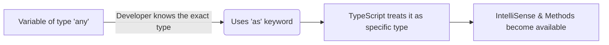

### Example from Code: The Problem with `any`

Based on your comments in `typeAssertion.ts`:

```typescript
let anything: any = "Hello, TypeScript!";

// anything. not giving any method cause hes not sure what is it hold
```

Because the type of `anything` is `any`, the editor will not suggest any string methods (such as `length` or `toUpperCase`) because it is not sure that the variable holds a string.

### Solution: Using Type Assertion (`as` syntax)

We can specify the exact type using the `as` keyword. As demonstrated in your code:

```typescript
anything = 222;

// (anything as number).  now giving me number method
```

When we write `(anything as number)`, TypeScript understands that we are asserting this variable as a number. Therefore, it will immediately start suggesting all number-related methods (such as `.toFixed()`, `.toString()`).

---

### In-Depth Example: Handling Union Types in Functions

When you have a function that accepts and returns multiple types (Union Types), TypeScript often gets confused about the exact return type, even if *you* (the developer) know exactly what it should be.

Let's look at the `kgToGMConverter` from your code:

```typescript
const kgToGMConverter = (input: string | number): string | number | undefined => {
    // If we get a number, we return a number
    if (typeof input === "number") return input * 1000;
    
    // If we get a string (e.g., "2 kg"), we extract the number part and return a formatted string
    else if (typeof input === "string") {
        const [value] = input.split(" ");
        return `Output is ${Number(value) * 1000}`;
    }
}
```

**The Problem:**
When you call this function, you know that passing `2` should return a `number`, and passing `'2 kg'` should return a `string`. However, TypeScript isn't that smart. It looks at the function definition and gives both results a union type:  `string | number | undefined`.

```typescript
const result1 = kgToGMConverter(2);       // TS thinks this is: string | number | undefined
const result2 = kgToGMConverter('2 kg');  // TS thinks this is: string | number | undefined
```

**The Solution with Type Assertion:**
Because *we developers* are 100% sure about what the output type will be, we can use **Type Assertion** to correct TypeScript:

```typescript
const result1AsNumber = result1 as number;
const result2AsString = result2 as string;

console.log(result1AsNumber); // 2000 (Now we can access math methods)
console.log(result2AsString); // "Output is 2000" (Now we can access string methods)
```

---

### Real-World Example: Catching Errors

In JavaScript/TypeScript, when an error is caught in a `try...catch` block, its type is always `unknown` or `any`. You cannot directly access `err.message` without TS yelling at you. Type assertion solves this elegantly:

```typescript
type CustomError = {
    message: string;
}

try {
    // some risky code
} catch (err) {
    // We assert that the caught error matches our CustomError shape
    const customError = err as CustomError;
    console.log(customError.message);
}
```

---

### 📌 Summary: When should you use Type Assertion?

According to standard developer practices, you should use Type Assertion:
1. **When you are sure about the type** of the variable, but TypeScript is not sure about it (like the `kgToGMConverter` result).
2. **When you want to unlock specific methods**: Telling TypeScript a variable is of a specific type gives you access to IntelliSense and the methods of that exact type.
3. **When converting variables**: Safely casting a broader type (like `any` or `unknown`) into a more specific, predictable type (like `CustomError` or `number`).

---

## 2.3 Interface vs Type Alias

In TypeScript, both `type` (Type Alias) and `interface` are used to define the shape and structure of data, mostly objects. So, what is the difference, and when should you use which?

### Diagram: Type Alias vs Interface

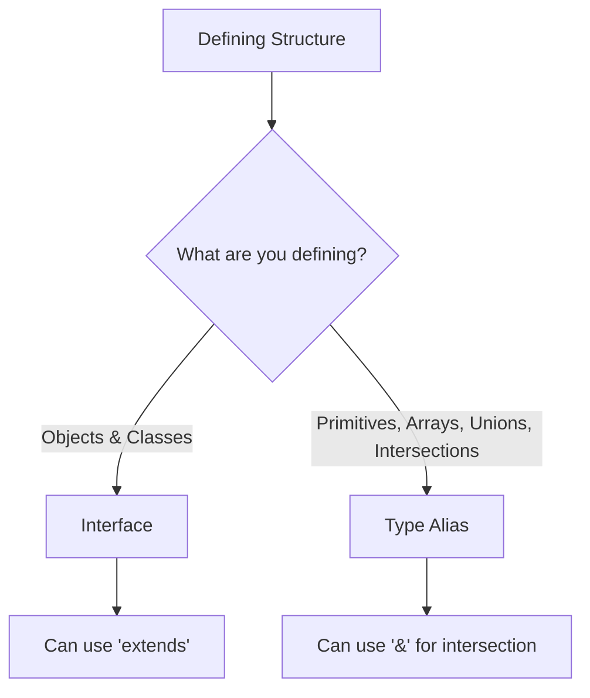

### 1. The Core Difference
* **`interface`** can **only** be used for Object structures (and Classes).
* **`type` (Alias)** can be used for anything: Objects, Primitives (`string`, `number`), Unions (`A | B`), Intersections (`A & B`), Arrays, and Functions.

```typescript
// ✅ Type Alias can be used for Primitives and Unions
type RollNumber = number;
type ID = string | number;

// ❌ Interface CANNOT be used for Primitives directly. It MUST be an object.
// interface RollNumber = number; // ERROR
```

### 2. Working with Objects

When defining standard objects, both act very similarly. 

```typescript
// Using Type Alias
type User = {
    name: string;
    age: number;
}
const user1: User = { name: "John", age: 30 };

// Using Interface
interface IUser {
    name: string;
    age: number;
}
const user2: IUser = { name: "Jane", age: 28 };
```

### 3. Extending / Intersecting (Adding more properties)

This is where the syntax differs. 
* To add properties to a `type`, you use the Intersection operator `&`.
* To add properties to an `interface`, you use the `extends` keyword (just like Object-Oriented Programming).

```typescript
// 1. Extending a Type Alias (Intersection)
type Admin = {
    role: string;
}
type AdminUser = User & Admin; // Merges the properties of 'User' and 'Admin'

// 2. Extending an Interface
interface IAdmin {
    role: string;
}
interface IAdminUser extends IUser, IAdmin {} // Inherits from 'IUser' and 'IAdmin'
```

### 4. Arrays and Functions in Interfaces

While `type` makes working with Arrays and Functions very clean, you *can* do it with `interface` using something called an **Index Signature** (for arrays) or an unnamed function signature.

**Array Example:**
```typescript
// ❤️ Using Type Alias (Clean & Preferred)
type Friends = string[];

// 🤔 Using Interface (Index Signature)
interface IFriendList {
    [index: number]: string; // "If the index is a number, the value MUST be a string"
}
const friendList: IFriendList = ["Alice", "Bob"];
```

**Function Example:**
```typescript
// ❤️ Using Type Alias (Clean & Preferred)
type AddFunction = (a: number, b: number) => number;

// 🤔 Using Interface
interface IFunction {
    (a: number, b: number): number; // Unnamed function definition
}
const add: IFunction = (a, b) => a + b;
```

---

### 📌 Summary: When to use what?

1. Use **`interface`** if you are strictly defining the shape of an Object, or building Classes in Object-Oriented Programming (OOP) where you need the `extends` keyword.
2. Use **`type` (Type Alias)** almost everywhere else—specifically when you need to define Unions (`|`), Intersections (`&`), Tuples, or simple Arrays/Functions.

*(Rule of thumb: Start with `interface` for your main data models like `IProduct` or `IUser`, and use `type` for everything else!)*

---

## 2.4 Introduction to Generics

**Generics** are like variables, but for types! Instead of hardcoding a specific type (like `string` or `number`), Generics allow you to dynamically generate types based on the input type. 

They help you write reusable, flexible, and strictly typed code without duplicating it for every data type.

### Diagram: How Generics Work
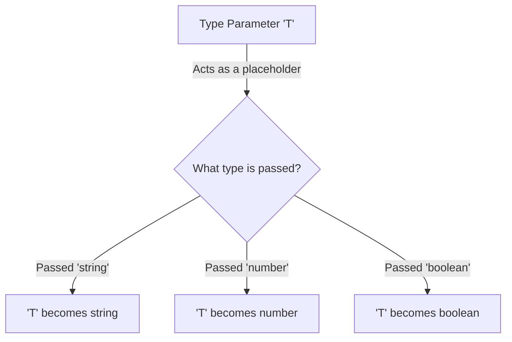

### Step 1: The Built-in Array Generic
You are already familiar with writing arrays like `string[]`. In TypeScript, this is actually shorthand for using the built-in generic `Array<T>`.

```typescript
// Old way (Shorthand)
const friends1: string[] = ["Alice", "Bob", "Charlie"];
const rollList: number[] = [1, 2, 3];

// Generic way (Behind the scenes)
const friends2: Array<string> = ["Alice", "Bob", "Charlie"];
const rollArray: Array<number> = [1, 2, 3];
const booleanArray: Array<boolean> = [true, false, true];
```

### Step 2: Creating Your Own Generic Type
You can create your own dynamic types using the `<T>` syntax. `T` just stands for "Type" (like `x` in algebra).

```typescript
// We created a custom generic type alias named 'myarray'
// It receives a type 'T' and creates an Array of that exact type
type myarray<T> = Array<T>;

// Passing primitives dynamically:
const stringArray: myarray<string> = ["Alice", "Bob", "Charlie"];
const numberArray: myarray<number> = [1, 2, 3, 4, 5];
```

### Step 3: Using Generics with Complex Objects
Generics become incredibly powerful when you pass arrays of Objects. You don't need to define multiple Array types for different Object shapes; you just pass the shape into the Generic `<T>`!

```typescript
// 1. Array of simple objects
const userList: myarray<{ name: string; age: number }> = [
    { name: "Alice", age: 25 },
    { name: "Bob", age: 40 },
];

// 2. Array of Coordinates
const coordinates: myarray<{ x: number; y: number }> = [
  { x: 1, y: 2 },
  { x: 3, y: 4 },
];

// 3. Using it in function parameters
function printCoordinates(coords: myarray<{ x: number; y: number }>) {
  coords.forEach((coord) => {
    console.log(`x: ${coord.x}, y: ${coord.y}`);
  });
}
```

### Real-World Example: API Responses
Imagine you are building a frontend app fetching data from an API. Sometimes it returns a user object, sometimes a list of products. Instead of rewriting the response structure, use a Generic!

```typescript
// A perfectly reusable API Response structure using Generic '<T>'
type APIResponse<T> = {
    statusCode: number;
    message: string;
    data: T; // The actual data will dynamically change
}

// Scenario 1: Fetching a single user
const response1: APIResponse<{ name: string }> = {
    statusCode: 200,
    message: "Success",
    data: { name: "Muntasir Moon" }
}

// Scenario 2: Fetching an array of strings (e.g., categories)
const response2: APIResponse<Array<string>> = {
    statusCode: 200,
    message: "Success",
    data: ["Electronics", "Clothing", "Toys"]
}
```

---

## 2.5 Generics with Interface

Just as we used generics with `type` aliases, we can also use them with **Interfaces**. This is extremely useful when the core structure of an object is mostly the same, but one or two properties need to be highly flexible or dynamic.

### Diagram: How Generic Interfaces Work

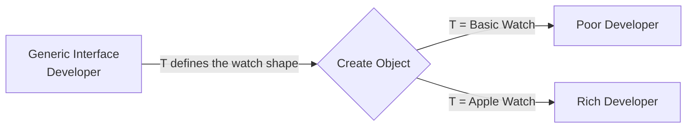

### The Problem: Inline Generics (Messy & Hard to Read)
Imagine you have a `Developer` interface. Every developer has a `name`, a `salary`, and a `device`, but their `smartWatch` can be totally different based on how rich they are! We can use a generic `<T>` to dynamically define their watch later.

```typescript
// Building a generic Developer interface
interface Developer<T> {
  name: string;
  salary: number;
  device: {
    brand: string;
    model: string;
    releaseYear: string;
  };
  smartWatch: T; // The type of smartwatch will be decided dynamically when creating the object!
}

// Creating a developer by passing the literal object shape into <T>
const poorDeveloper: Developer<{ 
    brand: string; 
    heartRateMonitor: boolean; 
    stopWatch: boolean 
}> = {
    name: "John Doe",
    salary: 20,
    device: { brand: "Lenevo", model: "ThinkPad", releaseYear: "2020" },
    smartWatch: { brand: "Xiaomi", heartRateMonitor: true, stopWatch: false }
}
```
**Issue with this approach:** Writing the full object shape `<{ brand: string; ... }>` directly inside the angle brackets makes the code very long, messy, and hard to maintain if you have hundreds of developers.

### The Solution: Cleaner Code with Separate Interfaces
Instead of writing the whole object shape inline, we can define a completely separate interface for the watch, and then pass *that* interface elegantly into our Generic `Developer` interface.

```typescript
// 1. Create a specific, detailed interface for the variable part (SmartWatch)
interface SmartWatch {
    brand: string;
    heartRateMonitor: boolean;
    stopWatch: boolean;
    gps?: boolean; // Optional property
}

// 2. We already have our generic interface Developer<T> from earlier

// 3. Combine them elegantly! We use Developer as the base and pass SmartWatch as <T>
const richDeveloper: Developer<SmartWatch> = {
    name: "Jane Doe",
    salary: 200,
    device: {
        brand: "Apple",
        model: "MacBook Pro",
        releaseYear: "2021",
    },
    smartWatch: { // This must now strictly follow the SmartWatch interface logic!
        brand: "Apple",
        heartRateMonitor: true,
        stopWatch: true,
        gps: true,
    },
}
```

**Why this is good (Refactoring Benefits):** 
The code is now much cleaner, strictly typed, and highly maintainable. If the smartwatch features change in the future, you do not need to update `Developer` or every object inline! You just update the `SmartWatch` interface once, and it applies everywhere securely.

---

## 2.6 Generics in Functions

Just like interfaces, we can generalize **Functions** using Generics. This allows a single function to handle any type of input and output while maintaining 100% type safety.

### Diagram: How Generic Functions Work

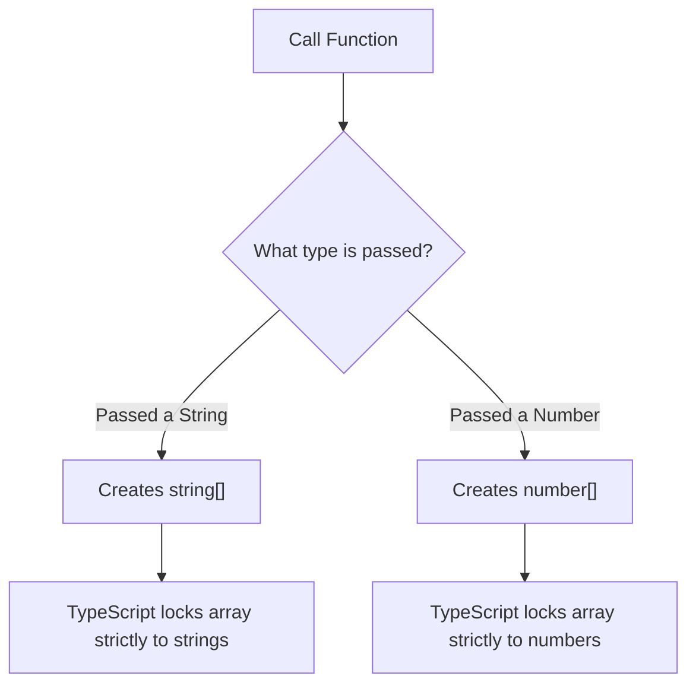

### The Problem: Code Duplication
If we don't use Generics and want to create arrays containing different types, we have to write separate functions or use `any` (which loses type safety).

```typescript
// For strings...
const createStringArray = (val: string): string[] => [val];

// For numbers, we have to duplicate the function logic...
const createNumberArray = (val: number): number[] => [val];
```

### The Solution: `<T>` to the Rescue
By adding `<T>` right before the parentheses, we tell TypeScript: *"I am going to pass a dynamic type here, please learn it and strictly apply it to everything else inside this function."*

```typescript
// 1. Defining the Generic Function
const createArrayWithGenerics = <T>(val: T): T[] => {
    return [val];
}

// 2. Calling it dynamically while keeping strict types!
const stringArray = createArrayWithGenerics<string>("hello");
const numberArray = createArrayWithGenerics<number>(42);

numberArray.push(100);       // ✅ This is completely fine!
// numberArray.push("text"); // ❌ ERROR: TypeScript knows this array only accepts numbers!
```

### Multiple Generics `<T, U>` (Tuple Example)
You aren't limited to just one generic! You can use `<T, U>`, `<X, Y, Z>`, or any other letters to represent multiple dynamic types. This is perfect for creating Tuples.

```typescript
// Defining a function with two dynamic types (T and U)
const createTupleWithGenerics = <T, U>(val1: T, val2: U): [T, U] => {
    return [val1, val2];
}

// Creating a tuple with a String and a Number
const tuple1 = createTupleWithGenerics<string, number>("hello", 42); 
// Result: ["hello", 42]

// Creating a tuple with a Boolean and a String using the exact same function!
const tuple2 = createTupleWithGenerics<boolean, string>(true, "World"); 
// Result: [true, "World"]
```

### Real-World Example: Enhancing Objects
Let's say you want to write a function that takes *any* student object and attaches a `course` property to it. If you don't use generics, TypeScript might forget the original properties of the student object you passed.

```typescript
const student1 = { name: "John", id: 123, hasPencil: true };
const student2 = { name: "Jane", id: 456, isMarried: false, hasCar: true };

// Using <T> to tell TypeScript: "Remember the exact shape of whatever object I pass in!"
const addStudentToCourse = <T>(studentInfo: T) => {
    return {
        ...studentInfo,  // Spread all existing dynamically typed properties
        course: "Next Level TypeScript" // Add the new property
    }
}

// TypeScript perfectly remembers that student1 has a 'hasPencil' property!
const student1WithCourse = addStudentToCourse(student1);
console.log(student1WithCourse); 
// Output: { name: 'John', id: 123, hasPencil: true, course: 'Next Level TypeScript' }

const student2WithCourse = addStudentToCourse(student2);
```

---

## 2.7 Constraints in Generics

When using Generics (`<T>`), we allow the user to pass *any* type of data. But sometimes, we want to **restrict** or **force** the user to pass data that meets certain minimum requirements. This is known as adding a **Constraint** to a Generic.

### Diagram: How Constraints Work

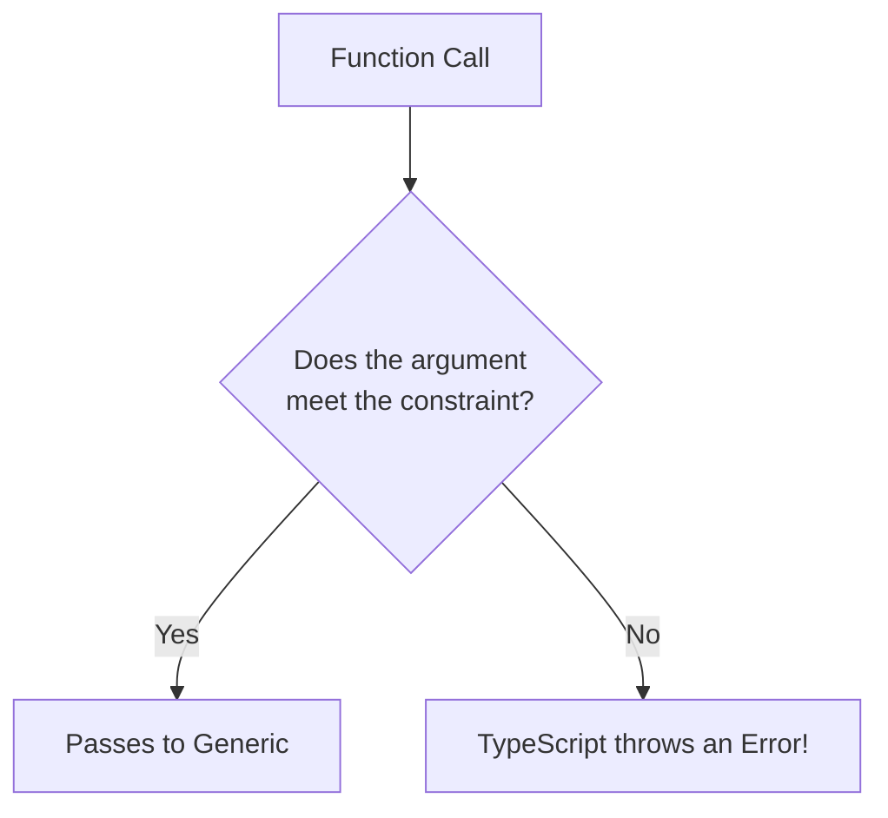

### The Problem: Generics are TOO Flexible
Let's continue with the `addStudentToCourse` function from the previous section. Because we used `<T>`, a user can pass absolutely *anything*, even an object that isn't a valid student!

```typescript
const student3 = {
    hasPencil: true // It's missing 'name' and 'id'!
}

// ⚠️ This works perfectly, but it shouldn't! student3 has no name or ID.
console.log(addStudentToCourse(student3)); 
```

### The Solution: Using `extends` to enforce rules
To fix this, we can force the Generic `<T>` to inherit minimum properties using the `extends` keyword.

```typescript
// 1. Inline Constraint
// T MUST be an object that has at least a 'name' (string) and an 'id' (number).
const addStudentWithConstraint = <T extends { name: string; id: number }>(studentInfo: T) => {
    return {
        ...studentInfo,
        course: "Next Level TypeScript"
    }
}
```

### Best Practice: Constraints with Interfaces
Instead of writing the constraint inline (which makes it messy), you should define an Interface and extend it!

```typescript
// Step 1: Define what a minimum valid student looks like
interface Student {
    name: string;
    id: number;
}

// Step 2: Constrain <T> so it MUST include everything from the Student interface
const addStudentSecurely = <T extends Student>(studentInfo: T) => {
    return {
        ...studentInfo,
        course: "Next Level TypeScript"
    }
}

const student1 = { name: "John", id: 123, hasPencil: true };
const fakeStudent = { hasPencil: true };

// ✅ SUCCESS: student1 has 'name' and 'id'
console.log(addStudentSecurely(student1)); 

// ❌ ERROR: Argument of type '{ hasPencil: boolean; }' is not assignable to parameter of type 'Student'.
// console.log(addStudentSecurely(fakeStudent)); 
```

### 📌 Summary: Why use Constraints?
1. **Prevent Bad Data:** They stop developers from passing incorrect or incomplete data to generic functions.
2. **Predictability:** Inside the function, TypeScript knows for sure that `studentInfo.name` and `studentInfo.id` exist, so it provides full **IntelliSense** for them!
3. **Flexibility + Security:** You keep the flexibility of Generics (maintaining extra properties like `hasPencil`) while enforcing absolute minimum security rules.

---

## 2.8 Generic Constraints with `keyof` Operator

The `keyof` operator in TypeScript is a magical keyword that takes an Object Type and extracts all of its keys (property names), turning them into a strict Union Type (`"key1" | "key2"`). 

When we combine `keyof` with Generics, we can create incredibly flexible and 100% type-safe dynamic functions!

### Diagram: How `keyof` Works

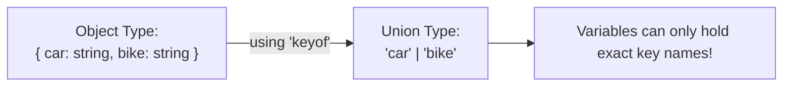

### Step 1: Understanding `keyof`
Imagine you have a type for vehicles. If you want a variable to just hold the *name* of the vehicles, you could manually write a Literal Union Type. But `keyof` does this automatically!

```typescript
type RichPeopleVehicles = {
   car: string;
   bike: string;
   yacht: string;
}

// ❌ Manual Way (Hard to maintain if properties are added)
type MyVehicle = "car" | "bike" | "yacht";

// ✅ Smart Way (Dynamically creates "car" | "bike" | "yacht")
type MyVehicleUsingKeyOf = keyof RichPeopleVehicles;

const myVehicle1: MyVehicleUsingKeyOf = "car"; // ✅ Valid
// const myVehicle2: MyVehicleUsingKeyOf = "plane"; // ❌ ERROR: "plane" is not a key
```

### Step 2: The Problem (Dynamic Property Access)
In JavaScript, it is very common to retrieve a value from an object using its key: `obj[key]`. But if we try doing this in a TypeScript function by setting the key as a simple `string`, TypeScript will throw an error because a generic `string` might not exist in the object!

```typescript
const user = { name: "John", age: 30 };

// ❌ ERROR: Element implicitly has an 'any' type because expression of type 'string' can't be used to index type '{}'.
const getPropertyFromObj = (obj: object, key: string) => {
    return obj[key]; 
}

// TypeScript stops this because 'key' could be "address", which doesn't exist on 'user'.
```

### Step 3: Hardcoded Solution vs Generic Solution
If we strictly type the function for just one object (like `User`), it loses reusability. Let's see how Generics + `keyof` solves this perfectly.

```typescript
const user1 = { name: "John", age: 30 };
const product = { id: 1, name: "Laptop", price: 999 };

// ❤️ The Ultimate Solution: Generics + keyof
// T is the whole Object. 'key' MUST be one of the keys of T.
const getDynamicProperty = <T>(obj: T, key: keyof T) => {
    return obj[key]; 
}

// ✅ SUCCESS with 'user1' (TypeScript knows key must be "name" | "age")
const result1 = getDynamicProperty(user1, "name"); // Output: "John"

// ✅ SUCCESS with 'product' (TypeScript knows key must be "id" | "name" | "price")
const result2 = getDynamicProperty(product, "price"); // Output: 999

// ❌ ERROR: "salary" does not exist in 'product'
// getDynamicProperty(product, "salary"); 
```

### 📌 Summary
1. **`keyof`** extracts keys from an object type and creates a strict union of string literals.
2. You can use `<T>(obj: T, key: keyof T)` to build highly reusable, dynamic functions that safely access object properties.
3. It prevents runtime errors by catching invalid object keys at compile time!

---

## 2.9 Enums in TypeScript

**Enum** (short for Enumeration) is a special feature in TypeScript used to define a collection of fixed, named constants. If you have a specific set of values that will never change (like Roles, Directions, or Colors), you can group them together under a single Enum.

### Diagram: How Enums Group Constants
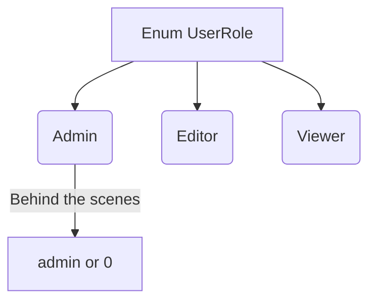

### Type 1: Numeric Enums
By default, Enums in TypeScript are numeric. If you don't assign a value, TypeScript automatically assigns numbers starting from `0`.

```typescript
enum Direction {
  Up,     // 0
  Down,   // 1
  Left,   // 2
  Right   // 3
}

// console.log(Direction.Up) would print 0
```

### Type 2: String Enums
You can explicitly assign string values to your enums. This is much more readable and easier to debug than random numbers.

```typescript
enum UserRoleEnum {
  Admin = "admin",
  Editor = "editor",
  Viewer = "viewer",
}

// Function using String Enum
const canEditEnum = (role: UserRoleEnum) => {
  if (role === UserRoleEnum.Admin || role === UserRoleEnum.Editor) {
    return true;
  }
  return false;
};

console.log(canEditEnum(UserRoleEnum.Admin)); // true
```

### ⚠️ IMPORTANT: Why Senior Developers Avoid Enums

While Enums look clean, many senior developers and modern style guides (like StandardJS) prefer **not** to use them. Instead, they use simple **Union Types** or **Constant Objects (`as const`)**. 

**Why?**
1. **JavaScript doesn't have Enums!** When TypeScript compiles your Enum into JavaScript, it generates a weird, complex, and heavy object (known as an IIFE).
2. **Performance & Bundle Size:** Because of how it compiles, Enums add unnecessary extra lines of code to your final JavaScript file, increasing the bundle size.

**The Preferred Alternative (Union Types):**
Instead of the heavy Enum, just use a simple Literal Union. It does the exact same job but produces zero extra JavaScript code!

```typescript
// ❤️ The Preferred Way (Zero overhead in JavaScript)
type UserRole = "admin" | "editor" | "viewer";

const canEdit = (role: UserRole) => {
  if (role === "admin" || role === "editor") {
    return true;
  }
  return false;
};

console.log(canEdit("admin")); // true
```
> *(Bonus Tip: Later in the course, we will explore another powerful alternative called `as const` which is even better!)*

---

## 2.10 `as const` and Object Literal Types (The Enum Alternative)

In the previous section, we discussed why senior developers often avoid Enums. So, what is the exact alternative? The answer is using **Constant Objects** with `as const`, combined with TypeScript's powerful `typeof` and `keyof` operators!

### The Setup: Creating a Read-Only Object
First, we create a standard JavaScript object and append `as const` to it. This makes the object completely immutable (read-only) and tells TypeScript to lock in the exact literal values instead of treating them as generic strings.

```typescript
const userRoles = {
  Admin: "ADMIN",
  Editor: "EDITOR",
  Viewer: "viewer"
} as const; 

// userRoles.Admin = "anything"; 
// ❌ ERROR: Cannot assign to 'Admin' because it is a read-only property.
```

### Extracting Types: A Deep Dive (Step-by-Step)

Let's break down exactly what happens behind the scenes when we extract types. This will make the complex syntax `typeof userRoles[keyof typeof userRoles]` super easy to understand!

#### Step 1: Getting the Object's Exact Shape (`typeof`)
When we use `typeof` on our `as const` object, TypeScript reads its exact literal values instead of basic strings.
```typescript
// 1. Getting the exact shape
type RoleShape = typeof userRoles;

// TypeScript sees this internally:
// {
//    readonly Admin: "ADMIN";
//    readonly Editor: "EDITOR";
//    readonly Viewer: "viewer";
// }
```

#### Step 2: Extracting the Keys (`keyof typeof`)
Now that we have the object's shape, we use `keyof` to extract all the **properties (keys)** as a Union Type.
```typescript
// 2. Getting the keys
type RoleKeys = keyof typeof userRoles; 

// Result: "Admin" | "Editor" | "Viewer"
```

#### Step 3: Accessing Specific Values (Bracket Notation)
If we want to know the *exact value type* of a specific key, we pass the key name inside brackets `['...']` (just like JS objects).
```typescript
// 3. Accessing one property's value type at a time
type AdminValue = typeof userRoles['Admin'];   // Result: "ADMIN"
type EditorValue = typeof userRoles['Editor']; // Result: "EDITOR"
type ViewerValue = typeof userRoles['Viewer']; // Result: "viewer"
```

#### Step 4: Extracting ALL Values at Once (The Magic Trick)
We don't want to extract values one by one! We want a Union Type of **all the values combined**. 
To do this, we pass all the keys (from Step 2) inside the brackets at the exact same time!

```typescript
// 4. Passing all keys inside the bracket!
// We are literally doing this behind the scenes:
// typeof userRoles["Admin" | "Editor" | "Viewer"]

type RoleValues = typeof userRoles[keyof typeof userRoles];

// FINAL RESULT: "ADMIN" | "EDITOR" | "viewer"
```
Now, `RoleValues` represents the exact possible values of our object. This catches any typo or invalid string right at compile time!

### Diagram: The Extraction Process
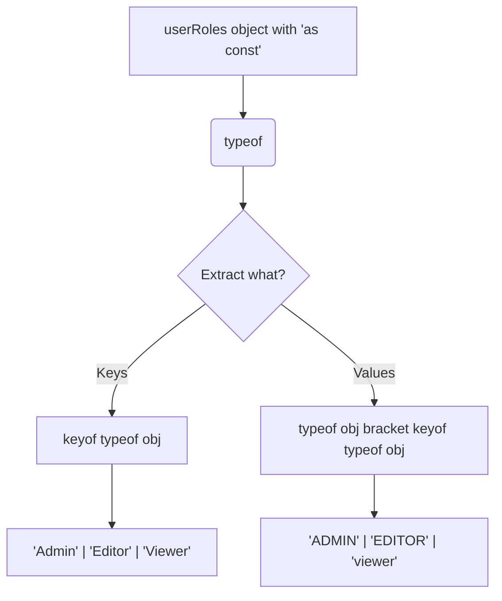

### Real World Example
Now we can use our extracted `RoleValues` in our functions! This catches errors at **compile time**!

```typescript
// Using the extracted values type
const canEdit = (role: typeof userRoles[keyof typeof userRoles]) => {
  if (role === userRoles.Admin || role === userRoles.Editor) {
    return true;
  }
  return false;
};

console.log(canEdit("ADMIN")); // ✅ true
console.log(canEdit(userRoles.Viewer)); // ✅ false

// console.log(canEdit("editor")); // ❌ Error: "editor" is not valid. It expects "EDITOR" (the actual exact value)
// console.log(canEdit("admin"));  // ❌ Error: expects "ADMIN"
```

### Why is this better than Enums?
1. **Type Safety:** You get exact, strict literal types (e.g., `"ADMIN"` instead of a vague `string`).
2. **Immutability:** Setting `as const` prevents anyone from modifying your config objects at runtime.
3. **Zero JavaScript Overhead:** Unlike Enums, this process doesn't generate weird, heavy IIFE wrapper functions when compiled to JavaScript. It remains a clean, standard Javascript object.

---

## 2.11 Conditional Types

In TypeScript, a **Conditional Type** allows you to create a type that depends on a condition. It works exactly like the ternary operator (`condition ? true : false`) in standard JavaScript, but it operates purely on **Types** instead of values!

### Syntax & Diagram
The basic syntax relies on the `extends` keyword to check if one type is assignable (or matches) another:
`SomeType extends OtherType ? TrueType : FalseType`

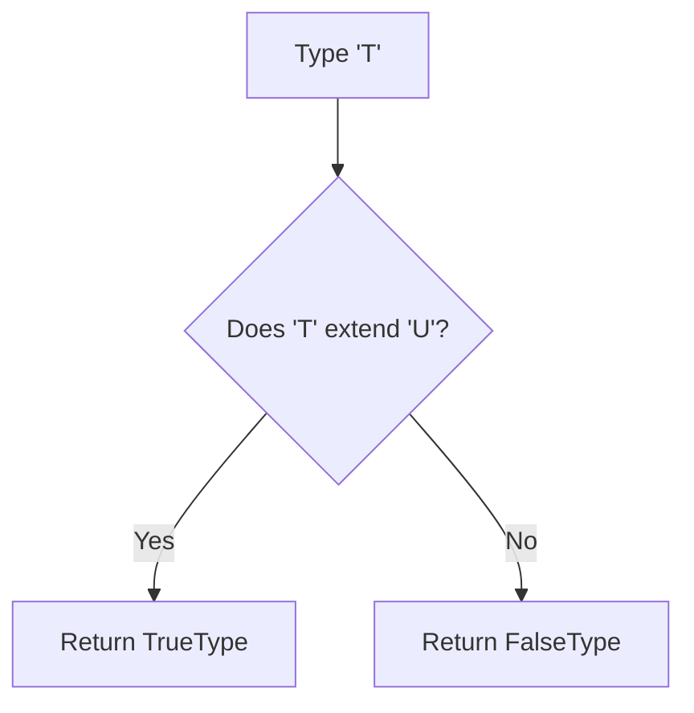

### Step 1: Basic Conditional Types
You can check simple types like `null` or `undefined` against each other to conditionally assign a specific type:

```typescript
type A = null;
type B = undefined;

// If 'A' is exactly 'null', the type becomes 'string', otherwise 'number'
type C = A extends null ? string : number; // Result: string
type E = A extends undefined ? string : number; // Result: number
```

### Step 2: Nested Conditional Types
Just like nested ternary operators in standard logic, you can chain conditional types for multiple checks:

```typescript
// If A is number -> string
// Else If B is undefined -> string
// Else -> number
type G = A extends number ? string : B extends undefined ? string : number; 
// Result: string (because B is undefined)
```

### Step 3: Real World Scenario (Checking Properties)
Conditional types become extremely powerful when dealing with objects. Imagine checking if a specific item exists within a list of allowed vehicles.

**Manual Way (Hardcoding the Union):**
```typescript
type CheckVehicle<T> = T extends "bike" | "car" | "ship" ? true : false;

type HasBike = CheckVehicle<"bike">;   // Result: true
type HasPlane = CheckVehicle<"plane">; // Result: false
```

**The Smart Way (Dynamic with `keyof`):**
Instead of hardcoding `"bike" | "car" | "ship"`, you can extract the keys from an existing object type using `keyof`!

```typescript
type RichPeopleVehicle = {
  bike: string;
  car: string;
  ship: string;
};

// Next level dynamics: Check if the given Type 'T' exists as a key inside 'RichPeopleVehicle'
type CheckVehicle2<T> = T extends keyof RichPeopleVehicle ? true : false;

type HasBike2 = CheckVehicle2<"bike">;   // Result: true
type HasPlane2 = CheckVehicle2<"plane">; // Result: false
```
By combining `Conditional Types` with `keyof`, your types become highly flexible, reusable, and perfectly synced to your object structures!

---

## 2.12 Mapped Types

**Mapped Types** in TypeScript allow you to take an existing model (or type) and transform each of its properties into a new type. It is exactly like using the `.map()` function on arrays in JavaScript, but for **Types**!

### Diagram: Array `.map()` vs Type Mapping
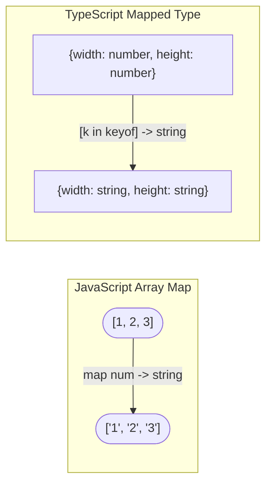

### Step 1: The JavaScript Intuition
In JavaScript, if you have an array of numbers and want an array of strings, you use `.map()`:
```typescript
const arrOfNumbers: number[] = [1, 2, 3, 4, 5];
const arrayOfStringUsingMap: string[] = arrOfNumbers.map((num) => num.toString());
```

### Step 2: The Object Type equivalent (Lookup Type)
With Types, we first need a base shape. We can access the type of a specific property using "Lookup Types" (square brackets notation):
```typescript
type AreaOfNum = {
  width: number;
  height: number;
};

// Getting just the "height" type (which is 'number')
type HeightType = AreaOfNum["height"];
```

### Step 3: Building the Mapped Type
What if we want to change BOTH `width` and `height` to be `string` instead of `number`? We don't want to rewrite the whole type manually. Instead, we map over it using the `[key in keyof TargetType]` syntax!

```typescript
// The 'k' acts as a loop variable. It loops through "height" | "width"
type AreaOfStringUsingMappedType = {
  [k in keyof AreaOfNum]: string;
};

// TypeScript sees this internally as:
// {
//    width: string;
//    height: string;
// }
```

### Step 4: Making it Reusable with Generics `<T>`
Instead of hardcoding `string` or `boolean`, we can pass a Generic Type `<T>` so our mapped type becomes perfectly dynamic and reusable!

```typescript
// A perfectly reusable Mapped Type!
type AreaOfType<T> = {
  [k in keyof AreaOfNum]: T;
};

// Now we can create whatever shape we want instantly!
type AreaOfString = AreaOfType<string>;
type AreaOfBoolean = AreaOfType<boolean>;
```

> *(Bonus Fact: Mapped Types are heavily used behind the scenes in advanced TypeScript Utility Types to efficiently parse properties and make them optional, required, or read-only!)*

---

## 2.13 Utility Types

TypeScript comes with several powerful built-in **Utility Types**. These are like shortcut functions for Types. Instead of rewriting types from scratch, you can use these utilities to transform an existing type into a new shape. 

### The Base Type
To understand these utilities, let's assume we have a master `Product` type for an ecommerce app:
```typescript
type Product = {
  id: number;
  name: string;
  price: number;
  stock: number;
  color?: string; // Optional property
};
```

### 1. `Pick<T, Keys>` (Choosing what you need)
If you only need a few properties from the base type, use `Pick`.
```typescript
// We only need the 'id' and 'name' for the summary.
type ProductSummary = Pick<Product, "id" | "name">;

// Behind the scenes: { id: number; name: string; }
const summary: ProductSummary = {
  id: 1,
  name: "Product 1"
  // price: 100 ❌ Error: 'price' does not exist in ProductSummary
};
```

### 2. `Omit<T, Keys>` (Removing what you don't need)
If you want EVERYTHING except one or two properties, use `Omit`. It's the inverse of `Pick`.
```typescript
// We want the whole product details, but hide the stock.
type ProductDetailsWithoutStock = Omit<Product, "stock">;

// Behind the scenes: { id: number; name: string; price: number; color?: string; }
```

### 3. `Partial<T>` (Making everything Optional)
Takes an object type and makes ALL of its properties optional (`?`). This is heavily used when writing "Update" or "Patch" functions where you only send modified fields.
```typescript
type UpdateProductPayload = Partial<Product>;

// We can update just the price without providing id, name, etc. No errors!
const productUpdate: UpdateProductPayload = {
  price: 150
};
```

### 4. `Required<T>` (Making everything Mandatory)
The exact opposite of `Partial`. Takes an object type and makes ALL of its properties required.
```typescript
// Even though 'color' was optional (?) in the base type, it is now REQUIRED!
type StrictProduct = Required<Product>;

const myProduct: StrictProduct = {
  id: 1,
  name: "Product 1",
  price: 100,
  stock: 10,
  color: "red" // 👈 Must be provided now!
};
```

### 5. `Readonly<T>` (Locking the object)
Makes all properties read-only. You can assign them once upon creation, but you cannot change them later.
```typescript
type LockedProduct = Readonly<Product>;

const finalProduct: LockedProduct = { id: 1, name: "Product", price: 100, stock: 10 };
// finalProduct.price = 200; ❌ Error: Cannot assign to 'price' because it is a read-only property.
```

### 6. `Record<Keys, Type>` (Creating Object Maps)
Creates an object type whose property keys are `Keys` and values are `Type`. This is incredible for creating generic dictionaries or mapping objects!
```typescript
// Creating an object where the key is a string, and the value is a completely structured Product
type ProductDictionary = Record<string, Product>;

const myInventory: ProductDictionary = {
  "prod_001": { id: 1, name: "P1", price: 10, stock: 5 },
  "prod_002": { id: 2, name: "P2", price: 20, stock: 8 }
};
```

### 7. Union Helpers (`Exclude`, `Extract`, `NonNullable`)
These utilities work directly on **Union Types** instead of objects.

- **`Exclude<UnionType, ExcludedMembers>`**: Removes items from a Union.
  ```typescript
  type Union1 = "id" | "name" | "price" | "stock";
  type WithoutStock = Exclude<Union1, "stock">; 
  // Result: "id" | "name" | "price"
  ```
- **`Extract<UnionType, TargetMembers>`**: Keeps ONLY the specified items from a Union.
  ```typescript
  type ExtractedOnly = Extract<Union1, "id" | "name">; 
  // Result: "id" | "name"
  ```
- **`NonNullable<Type>`**: Strips out `null` and `undefined` from a union.
  ```typescript
  type ValidData = NonNullable<string | number | null | undefined>; 
  // Result: string | number
  ```

### 8. Function Helpers (`Parameters`, `ReturnType`)
Used to automatically extract type definitions from existing functions.

- **`Parameters<FunctionType>`**: Extracts the parameters of a function as a Tuple (Array) Type.
  ```typescript
  type MyFuncArgs = Parameters<(a: number, b: string) => void>; 
  // Result: [a: number, b: string]
  ```
- **`ReturnType<FunctionType>`**: Extracts exactly what type the function returns.
  ```typescript
  type MyFuncReturn = ReturnType<() => string>; 
  // Result: string
  ```

---

## 2.14 How to Run TypeScript Files

Browsers and Node.js cannot execute `.ts` files directly. There are two primary ways to run your TypeScript code:

### Method 1: Compile and Run (Standard / Production Way)
First, you must compile your TypeScript `.ts` file into regular JavaScript `.js` file, and then run that compiled file.

```bash
# 1. Compile the TypeScript file into JavaScript
tsc src/typeAssertion.ts

# 2. Execute the generated JavaScript file
node src/typeAssertion.js
```
*Why use this?* This is the industry standard for production environments (like deploying a backend server) because servers only understand JavaScript.

### Method 2: Using `ts-node` (Quick / Development Way)
For active development, repeatedly compiling and running is tedious. You can use the `ts-node` package to execute `.ts` files directly without manually generating a `.js` file.

First, install it globally on your machine:
```bash
npm install -g ts-node
```

Then, run your file directly:
```bash
ts-node src/typeAssertion.ts
```
*Why use this?* This is perfect for learning, practicing, and fast development since it saves you from typing two separate commands and managing extra compiled files.

---

## Extra: Customizing Your Terminal Prompt (Linux/Mac)

When working in a terminal, deep folder structures can make your prompt path incredibly long and hard to read. You can customize the prompt string (`PS1`) temporarily to clean things up!

### 1. Show Only the Current Folder (Recommended)
This hides the long absolute path and shows only the folder you are currently in.
```bash
PS1='\u@\h:\W$ '
```

### 2. Show Only Username
If you want an ultra-clean terminal and don't even want to see the folder name, use this. *(Tip: Use the `pwd` command anytime to see your current location).*
```bash
PS1='\u$ '
```

### 3. Revert to Default (Full Path)
If you want your original long terminal path back, apply this command:
```bash
PS1='\u@\h:\w\$ '
```
*(Alternatively, just closing and reopening your terminal will auto-reset it).*

### What do the special characters mean?
* `\u` = Current User's Name (e.g., `moon`).
* `\h` = Hostname / PC Name (e.g., `muntasir`).
* `\W` (Uppercase W) = Current Folder Name only.
* `\w` (Lowercase w) = Full absolute Path directory.
* `$` = The prompt character indicating you are a normal user.

---

## Extra 2: Terminal Autocomplete Magic (Tab Completion)

Typing long file paths (like `ts-node src/typeAssertion.ts`) over and over again can be exhausting. Luckily, Linux and Mac terminals have a built-in superpower called **Tab Completion**.

### How to use Tab Completion:
Instead of typing the whole file or folder name, just type the first few letters and press the **`Tab`** key on your keyboard. The terminal will magically auto-fill the rest of the name for you!

**Example:**
1. You want to run your file, so you type just this:
   ```bash
   ts-node src/t
   ```
2. Now, press the **`Tab`** key.
3. The terminal instantly completes it to:
   ```bash
   ts-node src/typeAssertion.ts
   ```
> *(💡 Tip: If there are multiple files starting with the letter "t", press `Tab` twice rapidly to see a printed list of all matching files!)*

---

## Bonus: Current Workspace Folder Structure

As projects grow, keeping track of where your files live is crucial, especially to avoid `Cannot find module` errors in the terminal. Here is the visual tree structure of our TypeScript learning workspace:

```text
01 BE A TYPESCRIPT TECHNOCRAT/
│
├── MODULE 01.TYPESCRIPT FOUNDATIONS/
│   ├── README.md
│   ├── tsconfig.json
│   └── src/
│       ├── destructuring.ts
│       ├── primitive.ts
│       └── ... (and other foundational files)
│
└── MODULE 02.ADVANCED TYPESCRIPT TYPES/  <-- (You are currently working here)
    ├── README.md
    ├── tsconfig.json
    └── src/
        └── typeAssertion.ts
```

*Understanding this tree structure helps you know exactly where you are when navigating the terminal using commands like `cd` (Change Directory) and `ls` (List).*
