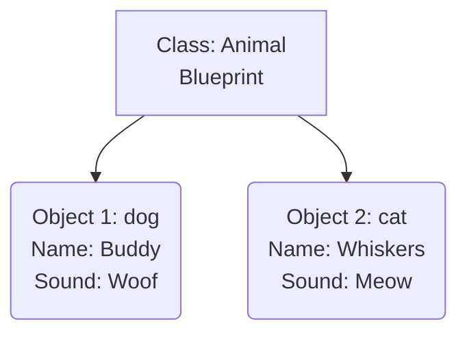
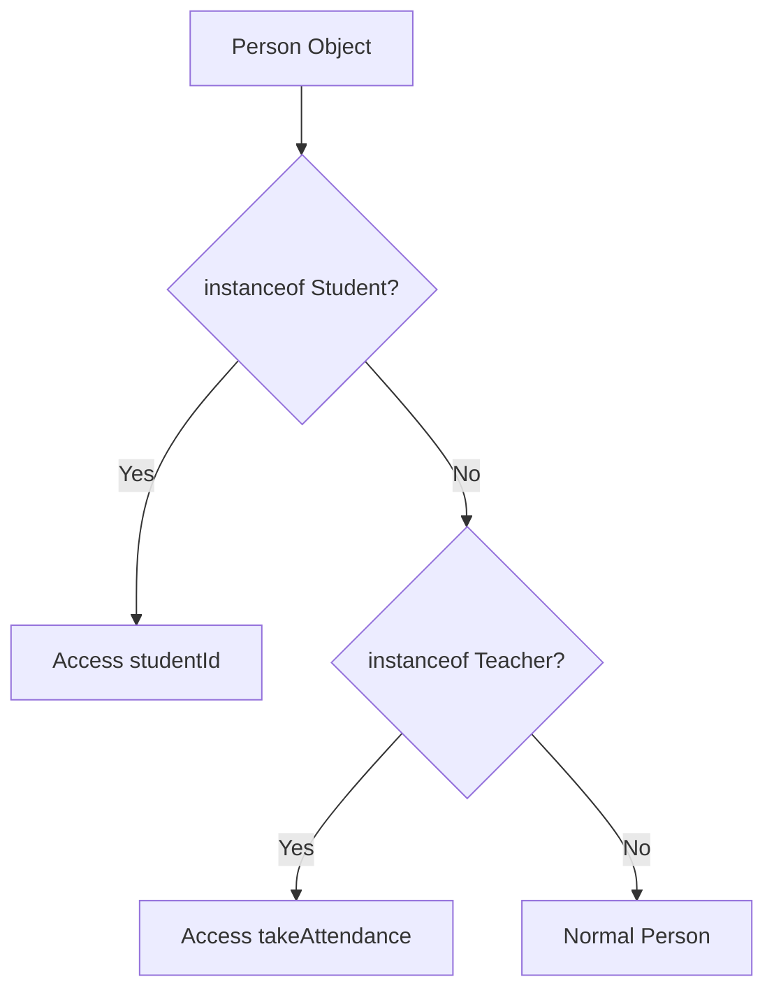
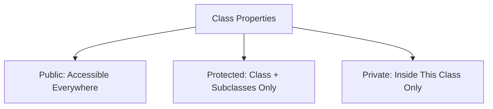
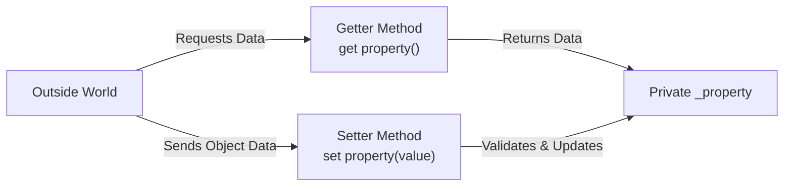
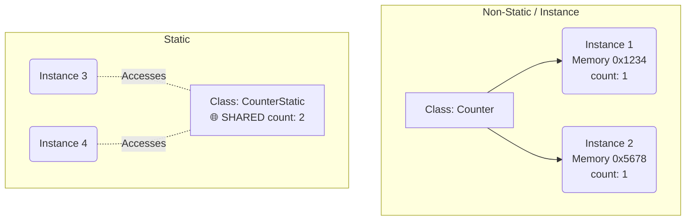
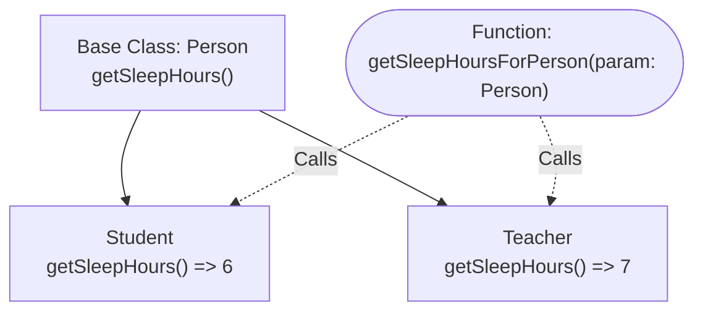
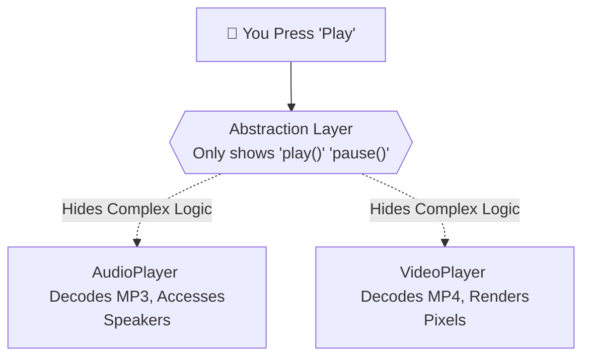
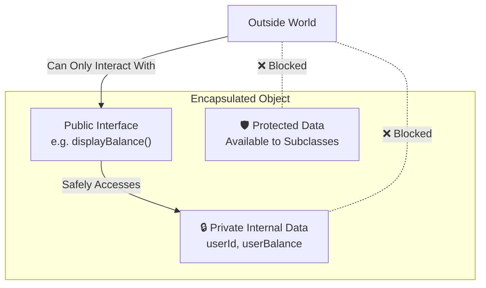

# Object-Oriented Programming (OOP): Classes & Objects

## 1. Introduction: Why Write This Code?

Before diving into syntax, let's understand **why** we need Classes and Objects at all. 

*   **Class:** A blueprint or template.
*   **Object:** A specific, real-world instance created using that blueprint. 

### ❌ Problem: Life without OOP (Messy & Repetitive)
If we don't use OOP, creating multiple animals means declaring generic, standalone variables. This makes code repetitive and hard to manage.

**Problem Code:**
```typescript
const dogName = "Buddy";
const dogSpecies = "Dog";
const dogSound = "Woof";

const catName = "Whiskers";
const catSpecies = "Cat";
// Imagine doing this for 100 animals! 🤯
```

### ✅ Solution: Life with OOP (Clean & Reusable)
By creating an `Animal` class, we build a **blueprint**. Now, we can easily create as many animals as we want in a single line, keeping our code clean.

**Your Code Example:**
```typescript
class Animal {
    name: string;
    species: string;
    sound: string;
    constructor(name: string, species: string, sound: string) {
        this.name = name;
        this.species = species;
        this.sound = sound;
    }
}

const dog = new Animal("Buddy", "Dog", "Woof");
const cat = new Animal("Whiskers", "Cat", "Meow");
```

---

## 2. Visualizing Classes and Objects



---

## 3. Code Breakdown (`class&Object.ts`)

Let's carefully break down every single concept mentioned in your `class&Object.ts` file.

### Step 1: The Initialization Error & Constructors
*   **What it happens:** We defined `name`, `species`, and `sound` properties inside the `Animal` class.
*   **The Problem:** TypeScript throws a strict error: *"Property 'sound' has no initializer and is not definitely assigned in the constructor"*. TypeScript wants to ensure no variables remain empty (undefined).

**Problem Code:**
```typescript
class Animal_Uninitialized {
    name: string;
    species: string;
    sound: string; // ❌ ERROR: Property 'sound' has no initializer
}
```

*   **The Solution:** We create a `constructor` function to pass values directly when the object is created.

**Your Code Example:**
```typescript
class Animal {
    name: string;
    species: string;
    sound: string;
    // ✅ The constructor provides the initial values
    constructor(name: string, species: string, sound: string) {
        this.name = name;
        this.species = species;
        this.sound = sound;
    }
}
```

*   💡 **Real-Life Analogy:** Think of an **Application Form**. The Class is a blank form. The Problem is handing in a blank form (TypeScript rejects it). The Solution (Constructor) is making sure you fill the required fields before submitting it.

**Analogy Code:**
```typescript
class ApplicationForm {
    applicantName: string;
    constructor(fillNameHere: string) {
        this.applicantName = fillNameHere; 
    }
}
const myForm = new ApplicationForm("John Doe");
```

---

### Step 2: The `this` Keyword
*   **What it is:** `this` refers to the *current instance* of the class. 
*   **The Problem:** In `constructor(name: string)`, we have a parameter named `name`, and the class also has a property called `name`. How does the code know which is which?
*   **The Solution:** Using `this.name = name`. This means: "Take the `name` argument you just received, and assign it to *this specific object's* `name` property."

**Your Code Example:**
```typescript
class Animal {
    name: string;
    constructor(name: string, species: string, sound: string) {
        // "this.name" points to the property, "name" is the value passed in
        this.name = name; 
    }
}
```

*   💡 **Real-Life Analogy:** Imagine you and your friend both buy identical smartphones. When you say **"My Phone"** (`this` phone), you are referring perfectly to your specific instance, not your friend's phone.

**Analogy Code:**
```typescript
class Smartphone {
    owner: string;
    constructor(ownerName: string) {
        this.owner = ownerName; // "This phone belongs to..."
    }
}
const myPhone = new Smartphone("Alice");
```

---

### Step 3: Parameter Properties (Shorthand Syntax)
*   **What it is:** A TypeScript shortcut to declare and assign variables inside the constructor at the same time.
*   **The Problem:** Writing out the property list, passing them in the constructor, and then typing `this.name = name` for every single one is highly repetitive.
*   **The Solution:** Just add an access modifier (like `public`) directly inside the constructor parameters! 

**Your Code Example:**
```typescript
class Animal2 {
    // ✅ TypeScript handles the declaration and this.assignment automatically!
    constructor(public name: string, public species: string, public sound: string) {
    }
    makeSound() {
        console.log(`${this.name} says ${this.sound}`);
    }
}
const dog2 = new Animal2("Buddy", "Dog", "Woof");
```

*   💡 **Real-Life Analogy:** **Buying a PC Combo Deal vs Custom Build**. The old way is buying parts separately and assembling them (`this.x = x`). Parameter Properties is like an "All-in-One Combo"—you pay once and everything is set up instantly.

**Analogy Code:**
```typescript
class AIO_Computer {
    constructor(public monitor: string, public cpu: string, public ram: string) {}
}
const mySetup = new AIO_Computer("24-inch", "Intel i7", "16GB");
```

---

## 4. Inheritance & Code Reusability (`inheritance.ts`)

### Step 1: Inheritance (`extends`)
*   **What it is:** Inheritance allows a new class (Child) to use the properties and methods of an existing class (Parent).
*   **The Problem:** In your raw code, both `Student` and `Teacher` classes had identical properties (`name`, `age`, `address`) and methods (`getDetails()`). This is **Code Duplication**.
*   **The Solution:** Create a common base class called `Person` and use the `extends` keyword.

**Your Code Example:**
```typescript
class Person {
    name: string;
    age: number;
    address: string;
    constructor(name: string, age: number, address: string) {
        this.name = name;
        this.age = age;
        this.address = address;
    }
    getDetails() {
        return `Name: ${this.name}, Age: ${this.age}, Address: ${this.address}`;
    }
}

// ✅ Student1 inherits everything from Person!
class Student1 extends Person {
    constructor(name: string, age: number, address: string) {
        super(name, age, address); 
    }
    studyHours(hours: number) {
        return `${this.name} studies for ${hours} hours.`;
    }
}
```

*   💡 **Real-Life Analogy:** **A Hospital ID System**. Doctors and Nurses share "Name" and "Age" (Base Class). Instead of making a new ID system from scratch, the hospital prints a standard ID template and only adds specific additions (like "Ward" for Nurses).

**Analogy Code:**
```typescript
class HospitalID {
    constructor(public name: string, public idNumber: number) {}
}

class NurseID extends HospitalID {
    constructor(name: string, idNumber: number, public ward: string) {
        super(name, idNumber);
    }
}
```

---

### Step 2: The `super` Keyword (Constructor & Methods)
*   **What it is:** The `super` keyword is used inside a child class to call the `constructor` or methods of its parent class.
*   **The Problem:** The `Teacher1` class needs to initialize `name`, `age`, and `address`, but it also adds `designation`. In its `getDetails()` method, it wants the parent's string BUT with `designation` appended.
*   **The Solution:** Use `super(name, age, address)` to pass initialization duty to `Person`. Use `super.getDetails()` to grab the original string and append to it.

**Your Code Example:**
```typescript
class Teacher1 extends Person {
    designation: string;
    constructor(name: string, age: number, address: string, designation: string) {
        // ✅ Calls the constructor of the base class
        super(name, age, address); 
        this.designation = designation;
    }
    getDetails() {
        // ✅ Calls the getDetails method of the base class
        return `${super.getDetails()}, Designation: ${this.designation}`; 
    }
}
```

*   💡 **Real-Life Analogy:** **Upgrading a Car**. You buy a base model car from the factory (`super()`). Instead of building a new car just to get a spoiler, you take the base car and simply attach the spoiler to it.

**Analogy Code:**
```typescript
class BaseCar {
    build() { return "Car Chassis + Engines"; }
}

class SportsCar extends BaseCar {
    build() {
        return `${super.build()} + Racing Spoiler`; 
    }
}
```

---

## 5. Type Guards (`typeGaurd.ts`)

Let's break down the learnings from your `typeGaurd.ts` file. A **Type Guard** is a way to check and verify the exact type of a variable before performing an action on it.

### Step 1: The `typeof` Guard (For Primitive Types)
*   **What it is:** The `typeof` operator allows you to check if a variable is a primitive type like `"number"` or `"string"` at runtime.
*   **The Problem:** If a function accepts multiple types (like `number | string`), TypeScript will stop you from doing operations like addition (`+`). It says: "Wait! What if you try to add a number and a string together?"

**Problem Code:**
```typescript
function add_bad(a: number | string, b: number | string) {
    // ❌ ERROR: Operator '+' cannot be applied to types 'number | string'
    return a + b; 
}
```

*   **The Solution:** Use `if (typeof x === "...")` to narrow down the type. Once TypeScript sees this "guard", it confidently allows the operation.

**Your Code Example:**
```typescript
type alphaNumeric = number | string;

function add2(a: alphaNumeric, b: alphaNumeric) {
    // ✅ Solution: We explicitly check the types first (Guarding)
    if (typeof a === "number" && typeof b === "number") {
        return a + b; // TypeScript knows both are numbers here
    } else if (typeof a === "string" && typeof b === "string") {
        return a + b; // TypeScript knows both are strings here
    } else {
        throw new Error("Invalid arguments");
    }
}

console.log(add2(1, 2)); // 3
console.log(add2("Hello, ", "world!")); // Hello, world!
```

*   💡 **Real-Life Analogy:** **A Recycling Center**. You have a mixed bag of trash (`number | string`). You can't just throw the whole bag into the paper shredder. You must first check the material (`typeof trash === "paper"`) before sending it to the correct machine.

**Analogy Code:**
```typescript
function recycle(item: "plastic" | "paper") {
    if (typeof item === "string" && item === "plastic") {
        console.log("Melting plastic into new bottles.");
    } else {
        console.log("Shredding paper into new notebooks.");
    }
}
```

---

### Step 2: The `in` Guard (For Objects)
*   **What it is:** The `in` operator helps you check if a specific property exists *inside* an object.
*   **The Problem:** You have two different object types (`NormalUser` and `AdminUser`). The function accepts either one. But how do you know if the user passed into the function is an admin or not? You can't use `typeof` because both will just return `"object"`.

**Problem Code:**
```typescript
type User1 = { name: string; };
type Admin1 = { name: string; role: "admin"; };

const getUserInfo_bad = (user: User1 | Admin1) => {
    // ❌ ERROR: 'role' does not exist on type 'User1'.
    if (user.role === "admin") { 
        return "I am an admin";
    }
}
```

*   **The Solution:** Use `"propertyName" in object` to safely verify if that property exists before trying to access it!

**Your Code Example:**
```typescript
type NormalUser = {
    name: string;
}

type AdminUser = {
    name: string;
    role: "admin"; // Only AdminUser has this unique property
}

const getUserinfo = (user: NormalUser | AdminUser) => {
    // ✅ Solution: Checking if the property "role" exists inside the "user" object
    if ("role" in user) {
        return `I am an admin and my name is ${user.name}`;
    } else {
        return `I am a normal user and my name is ${user.name}`;
    }
}

console.log(getUserinfo({name: "John"})); 
console.log(getUserinfo({name: "Jane", role: "admin"})); 
```

*   💡 **Real-Life Analogy:** **VIP Lounge Access**. Two people walk into an event. They are both "People" (Objects). The guard doesn't ask "Are you a person?" (`typeof`). Instead, the guard checks if a "VIP Pass" exists *inside* their wallet (`"vip_pass" in wallet`).

**Analogy Code:**
```typescript
type RegularGuest = { ticket: string; };
type VIPGuest = { ticket: string; vip_lounge_access: boolean; };

function checkAccess(guest: RegularGuest | VIPGuest) {
    if ("vip_lounge_access" in guest) {
        console.log("Welcome to the VIP Lounge! Enjoy the free drinks.");
    } else {
        console.log("Welcome! Please take a seat in the general area.");
    }
}
```

---

## 6. Type Guards with `instanceof` & Structural Typing (`instanceOf.ts`)

### 🎨 Visualizing `instanceof` & Type Guards


### Step 1: The `instanceof` Operator and Function Guards

#### A. What it is
The `instanceof` operator is used to check whether an object belongs to a specific class. A "Function Guard" is a custom function (like `isStudent`) that uses `instanceof` and returns a boolean. This tells TypeScript's compiler the exact type of the object, so we can safely access its specific properties block by block.

#### B. The Problem (With Problem Code)
When a function receives a base class object (e.g., `Person`), TypeScript doesn't automatically know if it's actually a `Student` or a `Teacher`. If you try to access a specific child property or method directly, TypeScript gets angry and throws an error.

```typescript
// ❌ Problem Code
const processUser = (user: Person) => {
    // TypeScript throws an error here!
    // Property 'takeAttendance' does not exist on type 'Person'.
    user.takeAttendance(); 
}
```

#### C. The Solution (With User's EXACT Code)
We use `instanceof` checks inside dedicated **Function Guards** featuring type predicates (e.g., `user is Student`). This acts as a gateway. If the guard returns true, TypeScript safely narrows down the type inside that specific `if` block!

```typescript
// ✅ Solution Code (User's Exact Code)
class Person {
  name: string;
  constructor(name: string) {
    this.name = name;
  }
}

class Student extends Person {
  studentId: number;
  constructor(name: string, studentId: number) {
    super(name);
    this.studentId = studentId;
  }
}

class Teacher extends Person {
  constructor(name: string) {
    super(name);
  }

  takeAttendance() {
    console.log(`${this.name} is taking attendance.`);
  }
}

// 👇 Function guard returning a type predicate
const isStudent = (user: Person): user is Student => {
  return user instanceof Student;
};

const isTeacher = (user: Person): user is Teacher => {
  return user instanceof Teacher;
};

const getUserInfoWithGuard = (user: Person) => {
  if (isStudent(user)) {
    console.log(`${user.name} is a student.`);
  } else if (isTeacher(user)) {
    console.log(`${user.name} is a teacher.`);
  } else {
    console.log(`${user.name} is a person.`);
  }
};
```

#### D. Real-Life Analogy (With Analogy Code)
**🏦 Bank Customer Service**
Imagine you walk into a bank point. You are recognized as a general "Customer". When you talk to the receptionist, they don't know if you have a "Credit Card Account" or a "Loan Account". They check your ID and account type (`instanceof`). Once they verify you have a Loan Account, they can safely talk to you about your specific "Loan Interest Rate".

```typescript
// 💡 Analogy Code
class Customer {
    name: string;
    constructor(name: string) { this.name = name; }
}

class LoanCustomer extends Customer {
    loanAmount: number;
    constructor(name: string, loanAmount: number) {
        super(name);
        this.loanAmount = loanAmount;
    }
}

const isLoanCustomer = (cust: Customer): cust is LoanCustomer => {
    return cust instanceof LoanCustomer;
}

const assistCustomer = (cust: Customer) => {
    if (isLoanCustomer(cust)) {
        console.log(`Your remaining loan is $${cust.loanAmount}`);
    } else {
        console.log(`Welcome, ${cust.name}!`);
    }
}
```

---

### Step 2: Structural Typing (Duck Typing) & The `never` Error

#### A. What it is
TypeScript doesn't base types simply by checking class names. It checks the **shape** (the exact properties and methods). If two classes have the exact same properties, TypeScript rigidly considers them to be identical types. This behavior is called **Structural Typing** or **Duck Typing** (If it walks like a duck and quacks like a duck, it's a duck! 🦆).

#### B. The Problem (With Problem Code)
Previously in your code, both the `Student` and `Teacher` classes had no extra properties. They only had the `name: string` property inherited directly from `Person`. 

When you used your check `if (isStudent(user))`, TypeScript became deeply confused! Because structurally, `Student` and `Person` were exactly the same thing. So when the check failed and reached the `else` block, TypeScript assumed no more types could exist, turning `user` into `never`, resulting in the confusing error: `Property 'name' does not exist on type 'never'`.

```typescript
// ❌ Problem Code (Structural Typing Nightmare)
class PersonBad {
  name: string;
  constructor(name: string) { this.name = name; }
}

// StudentBad has NO unique properties!
class StudentBad extends PersonBad {
  constructor(name: string) { super(name); }
}

const checkUser = (user: PersonBad) => {
    if (user instanceof StudentBad) {
        // ...
    } else {
        // 🔴 ERROR! user becomes type 'never' because StudentBad 
        // and PersonBad are structurally identical to TypeScript.
        console.log(user.name); 
    }
}
```

#### C. The Solution (With User's EXACT Code)
The immediate solution is to intentionally **break** the structural similarity! By simply adding a unique property to the `Student` class (like `studentId: number`), TypeScript finally parses `Student` as a separate, distinct type from `Person`. The compiler stops crying. ✅

```typescript
// ✅ Solution Code (User's Exact Code - Added Unique Property)
class Student extends Person {
  // 👇 Adding a unique property breaks the Duck Typing similarity!
  studentId: number; 
  constructor(name: string, studentId: number) {
    super(name);
    this.studentId = studentId;
  }
}

const student1 = new Student("Alice", 101);
```

#### D. Real-Life Analogy (With Analogy Code)
**🚗 Two Identical Red Cars Without License Plates**
Imagine you have two identical Red Honda Civics. Without a license plate, the police (TypeScript) cannot differentiate them at all—they are structurally the exact same car (Duck Typing). To identify one specifically, you put a unique bumper sticker (like `studentId`) on one of them. Now, you can safely tell them apart anywhere!

```typescript
// 💡 Analogy Code
class Car {
    color: string = "Red";
}

// Just a red car, exactly the same as Car
class IdenticalCar extends Car {} 

// A red car WITH a bumper sticker! Now it's structurally unique.
class UniqueCar extends Car {
    bumperSticker: string = "I love TS!";
}

const checkCar = (car: Car) => {
    if (car instanceof UniqueCar) {
        console.log(`Found the unique car with sticker: ${car.bumperSticker}`);
    }
}
```
---

## 7. Access Modifiers (`accessModifier.ts`)

### 🎨 Visualizing Access Modifiers


### Step 1: The `public` Modifier
#### A. What it is
By default in TypeScript, all properties and methods are `public`. This means they can be read or modified freely from anywhere—both inside and outside the class.

#### B. The Problem (With Problem Code)
Sometimes you *want* the outside world to freely interact with certain properties (like a simple display name or ID). If all properties were strictly hidden (like default behaviors in C++ or Java), you'd be forced to write unnecessary "getter" and "setter" methods just to read a basic value, making the code overly verbose.

```typescript
// ❌ Problem Code (Verbose & Unnecessary for safe data)
class UserBad {
    /* Imagine this is strictly hidden by default */
    name: string = "Alice"; 
    
    // Forced to write this extra boolean just to read the name!
    getName() { return this.name; } 
}
const u = new UserBad();
console.log(u.getName()); 
```

#### C. The Solution (With User's EXACT Code)
The `public` modifier (which is the default in TypeScript) solves this by allowing instant, direct access without extra boilerplate. It's meant for data that is perfectly safe to be read and modified from anywhere!

```typescript
// ✅ Solution Code (User's Exact Code)
class BankAccount {
    userId: number; // Public by default!
    userName: string; // Public by default!
    userBalance: number;

    constructor(userId: number, userName: string, userBalance: number) {
        this.userId = userId;
        this.userName = userName;
        this.userBalance = userBalance;
    }

    displayBalance() {
        console.log(`User ${this.userName} has a balance of ${this.userBalance}`);
    }       
}

const account1 = new BankAccount(1, "Alice", 1000);
// The solution: We can access safe properties instantly and directly!
console.log(account1.userName); // Output: Alice
```

#### D. Real-Life Analogy (With Analogy Code)
**🏞️ A Public Park**
A public park is open to everyone. Anyone from anywhere can enter, sit on a bench, and enjoy the scenery without needing special permission.

```typescript
// 💡 Analogy Code
class PublicPark {
    public parkName = "Central Park";
}
const myPark = new PublicPark();
console.log(`Welcome to ${myPark.parkName}! ANYONE can see this.`);
```

---

### Step 2: The `private` Modifier & Indirect Modification
#### A. What it is
The `private` modifier locks down a property or method so it can **only** be accessed from inside the exact class it was defined in. 

#### B. The Problem (With Problem Code)
If a property is protected by `private`, we cannot touch it from the outside to add money! Attempting to directly assign it simply crashes the compiler.

```typescript
// ❌ Problem Code
class BasicBank {
    private balance: number = 100;
}
const myBank = new BasicBank();
// 🔴 ERROR: Property 'balance' is private
// myBank.balance = 500; 
```

#### C. The Solution (With User's EXACT Code)
We intentionally make the property `private` to protect it, and expose a `public` method (like `deposit`) that safely modifies the private data under our strict rules (e.g., checking if amount > 0).

```typescript
// ✅ Solution Code (User's Exact Code)
class BankAccountWithDeposit {
    private userId: number;
    private userName: string;
    private userBalance: number;

    constructor(userId: number, userName: string, userBalance: number) {
        this.userId = userId;
        this.userName = userName;
        this.userBalance = userBalance;
    }

    // Public method acting as a safe gateway to a private property!
    deposit(amount: number) {
        if (amount > 0) {
            this.userBalance += amount;
            console.log(`Deposited ${amount}. New balance is ${this.userBalance}`);
        } else {
            console.log("Deposit amount must be positive.");
        }
    }
}

const account3 = new BankAccountWithDeposit(3, "Charlie", 3000);
account3.deposit(500); // Indirectly and safely modifies userBalance!
```

#### D. Real-Life Analogy (With Analogy Code)
**🏦 The Bank Vault & The Teller**
The vault containing the money is `private`. Customers cannot walk directly into the vault to grab money. However, the Bank Teller is a `public` method. You give money to the teller, they verify it, and *they* put it in the vault safely.

```typescript
// 💡 Analogy Code
class BankBranch {
    private vaultCash: number = 1000000; // Locked inside

    public bankTeller(amount: number) {
        console.log("Validating money...");
        this.vaultCash += amount; // Teller can access the vault
        console.log("Money safely secured.");
    }
}
```

---

### Step 3: The `readonly` Modifier
#### A. What it is
`readonly` ensures that a property can only be assigned a value **once** (typically inside the constructor). After that, it becomes permanently unchangeable.

#### B. The Problem (With Problem Code)
Important identity data like `userId` shouldn't ever change once an object is created. Leaving it unprotected is dangerous.

```typescript
// ❌ Problem Code
class WeakUser {
    userId: number = 1;
}
const badUser = new WeakUser();
badUser.userId = 999; // Accidentally changed their immutable ID!
```

#### C. The Solution (With User's EXACT Code)
Simply add the `readonly` keyword. TypeScript will throw a compiler error if you ever try to reassign it!

```typescript
// ✅ Solution Code (User's Exact Code)
class User {
    readonly userId: number;
    userName: string;

    constructor(userId: number, userName: string) {
        this.userId = userId;
        this.userName = userName;
    }
}

const user1 = new User(1, "Alice");
// 🔴 ERROR if uncommented: Cannot assign to 'userId' because it is a read-only property.
// user1.userId = 2; 
```

#### D. Real-Life Analogy (With Analogy Code)
**🪪 A Printed Passport**
When the government issues your passport, they print your Passport ID (`readonly`). You can change your name (`userName`), but you cannot take a pen and change the Passport ID.

```typescript
// 💡 Analogy Code
class Passport {
    readonly passportId: string;
    public currentCountry: string;

    constructor(id: string, country: string) {
        this.passportId = id; // Set once at creation!
        this.currentCountry = country;
    }
}
```

---

### Step 4: The `protected` Modifier
#### A. What it is
`protected` perfectly balances `private` and `public`. A protected property is hidden from the outside world, BUT it is completely accessible to its own class **and any Child classes** that `extends` it.

#### B. The Problem (With Problem Code)
If you make a base class property `private`, even the child classes cannot use it. What if a `StudentAccount` child needs to calculate a completely customized discount on the inherited `balance`?

```typescript
// ❌ Problem Code
class BaseBank {
    private balance: number = 100;
}
class ChildBank extends BaseBank {
    addBonus() {
        // 🔴 ERROR: Property 'balance' is private! Child cannot see it.
        // this.balance += 50; 
    }
}
```

#### C. The Solution (With User's EXACT Code)
Make `balance` `protected`! Now, outside code is still blocked, but `StudentAccount` can happily interact directly with the inherited `balance`.

```typescript
// ✅ Solution Code (User's Exact Code)
class BankAccount1{
    public readonly accountNumber: number;
    protected balance: number; // 👇 Protected!

    constructor(accountNumber: number, balance: number) {
        this.accountNumber = accountNumber;
        this.balance = balance;
    }
}

class StudentAccount extends BankAccount1 {
    constructor(accountNumber: number, balance: number) {
        super(accountNumber, balance);
    }

    applyStudentDiscount() {
        // ✅ Child class can successfully access protected property 'balance'!
        this.balance *= 0.9; 
        console.log(`Student discount applied. New balance is ${this.balance}`);
    }
}

const studentAccount = new StudentAccount(12345, 1000);
studentAccount.applyStudentDiscount(); // Output: Student discount applied...
```

#### D. Real-Life Analogy (With Analogy Code)
**👨‍👩‍👧‍👦 A Family Heirloom Recipe**
The recipe is kept secret from the public (outside world). But anyone inside the Family (Class) or any children born into the family (Subclasses/Children) are allowed to learn and tweak the recipe.

```typescript
// 💡 Analogy Code
class Grandparent {
    protected secretRecipe: string = "1 cup sugar, 2 cups magic";
}

class Grandchild extends Grandparent {
    makeCake() {
        // Grandchild uses the protected secret!
        return `Baking with: ${this.secretRecipe} + Chocolate Chips!`;
    }
}
```


---

## 8. Getters and Setters (`getterSetter.ts`)

### 🎨 Visualizing Getters and Setters


### Step 1: Getters and Setters (`get` & `set`)
#### A. What it is
Getters (`get`) and Setters (`set`) are special methods that allow you to read and write private properties just like normal variables, but with hidden logic and validation taking place behind the scenes.

#### B. The Problem (With Problem Code)
If a property is simply `public`, anyone can assign bad or dangerous data to it (like a negative bank balance). If it is `private` and we use traditional methods like `setBalance(amount)`, the syntax becomes clunky because it looks like a function call instead of simple property assignment.

```typescript
// ❌ Problem Code (Dangerous Data Manipulation)
class BankAccountBad {
    balance: number = 1000; // Public, exposed, and vulnerable
}
const myAccount = new BankAccountBad();
// Anyone can bypass rules and set an invalid negative balance directly
myAccount.balance = -5000; 
```

#### C. The Solution (With User's EXACT Code)
We make the actual property `private` (often using an underscore `_name` to indicate it is internal). Then, we use the `set` keyword to intercept any assignments, validate the data, and update the private property. The `get` keyword is used to safely return the value.

```typescript
// ✅ Solution Code (User's Exact Code - BankAccount)
class BankAccount {
    // 🔒 Underscore denotes this is an internal private property
    private _balance: number;

    constructor(initialBalance: number) {
        this._balance = initialBalance;
    }

    // ✅ GETTER: Retrieves the balance cleanly
    get balance(): number {
        return this._balance;
    }

    // ✅ SETTER: Validates the data before updating the balance
    set balance(amount: number) {
        if (amount < 0) {
            console.log("Balance cannot be negative.");
        } else {
            this._balance = amount;
        }
    }
}

const account = new BankAccount(1000);
// 💡 Notice there are no parentheses! It acts like a variable, but secretly runs the getter function.
console.log(account.balance); // Output: 1000

// 💡 It acts like an assignment, but secretly runs the setter validation function!
account.balance = 1500; 
console.log(account.balance); // Output: 1500

// 🛡️ Protected! The setter intercepts this and rejects the negative number.
account.balance = -500; // Output: Balance cannot be negative.
console.log(account.balance); // Output: 1500 (balance remains unchanged)   
```

#### D. Real-Life Analogy (With Analogy Code)
**🎰 A Vending Machine** 
You don't directly put your hands inside the machine to grab chips (that's accessing a `private` property directly). Instead, you put money in the coin slot (the `Setter`). The coin slot *validates* if the money is real. If it is, the machine gives you the chips through the bottom tray (the `Getter`).

```typescript
// 💡 Analogy Code
class VendingMachine {
    private _chips: number = 10;

    // The Tray (Getter)
    get outputTray(): string {
        return `Chips remaining in machine: ${this._chips}`;
    }

    // The Coin Slot (Setter)
    set coinSlot(moneyInserted: number) {
        if (moneyInserted < 5) {
            console.log("Validation Failed: Need at least $5!");
        } else {
            this._chips -= 1;
            console.log("Validation Passed: Dispensing Chips 🍟");
        }
    }
}
```

---

### Step 2: Advanced Security combining Getters and Methods
#### A. What it is
Sometimes a basic `getter` isn't enough because Getters in TypeScript **cannot accept parameters**. If you need authentication (like asking for a password), you must use a standard custom method alongside your properties.

#### B. The Problem (With Problem Code)
You want to force a user to enter a password before seeing their balance. You might try to put a parameter inside the `get balance()` function, but TypeScript strictly prevents this.

```typescript
// ❌ Problem Code (Invalid TypeScript Syntax)
class SecureBankAccountBad {
    private _balance: number = 2000;
    
    // 🔴 ERROR: A 'get' accessor cannot have any parameters.
    get balance(password: string) { 
        if (password === "secret") return this._balance; 
    }
}
```

#### C. The Solution (With User's EXACT Code)
Leave the standard `get balance` property as a placeholder or warning, and implement a dedicated authenticating method (like `getBalance(password)`) to handle parameters cleanly!

```typescript
// ✅ Solution Code (User's Exact Code - SecureBankAccount)
class SecureBankAccount {
    private _balance: number;
    private _password: string;

    constructor(initialBalance: number, password: string) {
        this._balance = initialBalance;
        this._password = password;
    }

    // ✅ The getter acts as a front door warning
    get balance(): number | string {
        return "Please provide a password to access the balance.";
    }

    // ✅ Dedicated method used because Getters cannot accept parameters
    getBalance(password: string): number | string {
        if (password === this._password) {
            return this._balance;
        } else {
            return "Incorrect password. Access denied.";
        }
    }

    // setter for balance
    set balance(amount: number) {
        // ... validation logic
        this._balance = amount;
    }
}

const secureAccount = new SecureBankAccount(2000, "mySecretPassword");

// Accessing the standard property gives the warning:
console.log(secureAccount.balance); // Output: Please provide a password...

// Accessing the method correctly authenticates the user:
console.log(secureAccount.getBalance("wrongPassword")); // Output: Incorrect password...
console.log(secureAccount.getBalance("mySecretPassword")); // Output: 2000
```

#### D. Real-Life Analogy (With Analogy Code)
**🏨 A Hotel Safe**
A hotel safe has a digital display. If you just press the "View" button (`Getter`), it simply says "LOCKED - ENTER PIN". It doesn't instantly show you the gold inside. You must explicitly run the `enterPin()` function (`Method`) to actually retrieve the contents.

```typescript
// 💡 Analogy Code
class HotelSafe {
    private _secret: string = "Diamond Ring";
    
    get contents(): string {
        return "LOCKED - ENTER PIN";
    }

    unlockSafe(pin: number) {
        if (pin === 1234) return this._secret;
        return "Wrong PIN! ALARM SOUNDING! 🚨";
    }
}
```

---

### Step 3: OOP in Real-Life Software (Data Integrity)
#### A. What it is
In real-world software, Objects (like Users or Products) represent important database entities. Getters and Setters ensure absolute **Data Integrity** so the software doesn't crash or save corrupted data into its database.

#### B. The Problem (With Problem Code)
If you blindly save raw input from users into your code, your database will fill up with garbage values like empty strings for names, or negative prices for products. 

```typescript
// ❌ Problem Code (Vulnerable Database Entries)
class BadProduct { price: number = 0; }
const buggyProduct = new BadProduct();

// You accidentally paid the customer to buy your product!
buggyProduct.price = -999; 
```

#### C. The Solution (With User's EXACT Code)
Utilize getters and setters systematically across all your models (`User`, `Product`) using simple validation checks like `.trim() !== ""` and `< 0`.

```typescript
// ✅ Solution Code (User's Exact Code - User & Product)

// 1️⃣ USER MODEL
class User {
    private _name: string;

    constructor(name: string) {
        this._name = name;
    }

    get name(): string { return this._name; }

    // Ensures nobody saves empty blank spaces as their name!
    set name(newName: string) {
        if (newName.trim() === "") {
            console.log("Name cannot be empty.");
        } else {
            this._name = newName;
        }
    }
}

const user = new User("Alice");
user.name = ""; // Attempt to set an empty name
console.log(user.name); // Output: Alice (name remains strictly unchanged) 


// 2️⃣ PRODUCT MODEL
class Product {
    private _price: number;

    constructor(price: number) {
        this._price = price;
    }

    get price(): number { return this._price; }

    // Ensures your e-commerce site doesn't have negative pricing!
    set price(newPrice: number) {
        if (newPrice < 0) {
            console.log("Price cannot be negative.");
        } else {
            this._price = newPrice;
        }
    }
}

const product = new Product(100);
product.price = -50;  // Attempt to set a negative price
console.log(product.price); // Output: 100 (price remains strictly unchanged)  
```

#### D. Real-Life Analogy (With Analogy Code)
**🚥 A Nightclub Bouncer**
The nightclub (Software Database) only wants valid patrons (Proper Data) inside. The Bouncer (Setter) checks everybody at the door. If they don't meet the dress code or age criteria, they get turned away immediately.

```typescript
// 💡 Analogy Code
class Nightclub {
    private _guestCount: number = 0;

    get activeGuests() { return this._guestCount; }

    // The Bouncer Logic
    set enteredGuestAge(age: number) {
        if (age < 18) { 
            console.log("Bouncer: Under 18? Access Denied!"); 
        } else { 
            this._guestCount++; 
            console.log("Bouncer: Welcome in!"); 
        }
    }
}
```

---

## 9. Static Properties and Methods (`static.ts`)

### 🎨 Visualizing Static vs Instance Memory


### Step 1: The Problem with Instance Memory (Without Static)
#### A. What it is
By default, whenever you create a new object (instance) from a class using the `new` keyword, TypeScript allocates a brand new, completely separate memory location for its properties.

#### B. The Problem (With Problem Code)
If you want to track a value that is shared across everything (like tracking "How many total instances were created?"), normal instances fail. Each instance tracks its own independent value. If `instance1` increments its count, `instance2` has absolutely no idea about it!

```typescript
// ❌ Problem Code (Independent memory, nothing is shared)
class CounterBad {
    count: number = 0;
    
    increment() {
        return ++this.count;
    }
}

const instance1 = new CounterBad();  // separate memory
console.log(instance1.increment()); // 1

const instance2 = new CounterBad(); // separate memory
// Problem: This starts at 0 again! It doesn't know about instance1's count.
console.log(instance2.increment()); // 1 
```

#### C. The Solution (With User's EXACT Code)
To make sure data isn't separated but rather *shared* across everything, we simply add the `static` keyword. However, you encountered a strict rule while trying to access it!

### Step 2: The `static` Keyword & The Access Error
#### A. What it is
The `static` keyword means the property or method belongs directly to the **Class itself**, not to the instances (objects). It sits in one single shared memory location.

#### B. The Problem (With Problem Code)
In your code, you made `increment` a `static` method, but then you tried to access it through instances (`instance3.increment()`). TypeScript threw a strict error: *"Property 'increment' does not exist on type 'CounterStatic'. Did you mean to access the static member 'CounterStatic.increment' instead?"*

```typescript
// ❌ Problem Code (The Access Error)
class CounterStaticBad {
    static count: number = 0;
    
    static increment() {
        return ++CounterStaticBad.count;
    }
}

const instance3 = new CounterStaticBad();
// 🔴 ERROR: Property 'increment' does not exist on type 'CounterStaticBad'. 
// Because 'increment' belongs to the Class, NOT the instance!
instance3.increment(); 
```

#### C. The Solution (With User's EXACT Code)
Don't use `this.count` or `instance.increment()`. Since `static` members belong to the class, you must access them by referencing the **Class Name Directly**. 

```typescript
// ✅ Solution Code (User's Exact Code - Fixed with Comments)
class CounterStatic {
    // 🌐 Shared Memory Location for the entire Class
    static count: number = 0;
    
    static increment() {
        // Accessing via the Class Name, not 'this'
        return ++CounterStatic.count; 
    }
    static decrement() {
        return --CounterStatic.count;
    }
}

// ✅ Correct Way: We do NOT need to create instances (new CounterStatic())
// We call the method directly on the blueprint (Class) itself!
console.log(CounterStatic.increment()); // Output: 1
console.log(CounterStatic.increment()); // Output: 2

// Even from anywhere in the codebase, the shared value persists:
console.log(CounterStatic.decrement()); // Output: 1
```

#### D. Real-Life Analogy (With Analogy Code)
**💧 Personal Water Bottles vs. The Office Water Dispenser**
Normal properties are like **Personal Water Bottles** (instances). If you drink water from your bottle, your coworker's bottle stays full. 
A `static` property is like the **Office Water Dispenser** (shared). Everyone in the office goes to the *same* dispenser. If you drink from it, the water level goes down for everyone else too. You don't try to find a water dispenser inside your pocket (calling `instance.dispenser()`); you walk up to the main Dispenser (calling `Office.dispenser()`).

```typescript
// 💡 Analogy Code
class Office {
    // 🌐 The Shared Water Dispenser
    static waterGallons: number = 50;

    static drinkWater() {
        if(Office.waterGallons > 0) {
            Office.waterGallons--;
            console.log(`Water drunk! Remaining: ${Office.waterGallons}`);
        }
    }
}

// ❌ WRONG: const myDesk = new Office(); myDesk.drinkWater();
// ✅ CORRECT: Go directly to the Office Shared Dispenser!
Office.drinkWater(); // 49
Office.drinkWater(); // 48
```

---

### Step 3: Static Utility Functions
#### A. What it is
Static methods can also be used to create **Utility/Helper Functions**. These are simple functions that perform a generic operation (like a math calculation) without needing to interact with any instance-specific data.

#### B. The Problem (With Problem Code)
If you don't use the `static` keyword for a standalone utility function, you are forced to pointlessly create an object (using `new`) just to access the method. This wastes memory and clutters the code.

```typescript
// ❌ Problem Code (Wasting memory for a simple utility)
class CircleBad {
    calculateArea(radius: number): number {
        return Math.PI * radius * radius;
    }
}

// 🔴 Why is this bad? We don't need any unique instance data, 
// but we are still forced to instantiate a whole object just to do some math!
const uselessInstance = new CircleBad();
console.log(uselessInstance.calculateArea(5)); 
```

#### C. The Solution (With User's EXACT Code)
By making the method `static`, it becomes available globally on the Class itself. No instantiation or object creation is required!

```typescript
// ✅ Solution Code (User's Exact Code - Utility Function)
class Circle {
  // 👇 Made static so it can be used directly without 'new Circle()'
  static calculateArea(radius: number): number {
    return Math.PI * radius * radius;
  }
}

// ✅ Correct Way: Calling the utility function directly on the Class
console.log(Circle.calculateArea(5)); // Output: 78.53981633974483
```

#### D. Real-Life Analogy (With Analogy Code)
**🧮 Public Calculator App vs Building Your Own Calculator**
If you need to quickly add two numbers, you just open up the built-in Calculator App on your phone (`static`). You don't buy plastic and circuits to physically build your own personal calculator (`new Calculator()`) just to perform a single 1+1 operation!

```typescript
// 💡 Analogy Code
class SimpleMath {
    // A globally available tool, no assembly required
    static add(a: number, b: number) {
        return a + b;
    }
}

// Just use the tool immediately!
console.log(SimpleMath.add(10, 20)); // 30
```

---

## 10. Polymorphism (`polymorphism.ts`)

### 🎨 Visualizing Polymorphism


### Step 1: Polymorphism & Method Overriding
#### A. What it is
"Polymorphism" means "many forms." It allows different Child classes to **override** a method inherited from a Parent class to provide their own specific implementation. You can then use a single, generic function to handle all of them dynamically.

#### B. The Problem (With Problem Code)
If you don't use polymorphism, you are forced to write messy, hard-coded `if/else` statements for every single type, or worse, use completely different method names for every class, making generic functions impossible.

```typescript
// ❌ Problem Code (Messy if/else instead of Polymorphism)
class PersonBad { type = "Person"; }
class StudentBad { type = "Student"; }

const getSleepHoursBad = (user: any) => {
    // We have to manually check every single type and hardcode the logic!
    if (user.type === "Student") return 6;
    if (user.type === "Person") return 8;
    // What if we add 50 more types? This function becomes a nightmare!
}
```

#### C. The Solution (With User's EXACT Code)
We define a generic method in the base `Person` class, and let each child class override it. The generic function simply calls `.getSleepHours()`, and TypeScript automatically knows which "form" of the method to execute!

```typescript
// ✅ Solution Code (User's Exact Code - Person)
class Person {
  getSleepHours(): number {
    return 8; // Default sleep hours for a person
  }
}

class Student extends Person {
  getSleepHours(): number {
    return 6; // Students typically sleep less
  }
}

class Teacher extends Person {
  getSleepHours(): number {
    return 7; // Teachers typically sleep a bit more than students
  }
}

// 👇 Generic function accepts the Parent type, but works flawlessly for ALL children
const getSleepHoursForPerson = (param: Person) => {
    console.log(`Person sleeps for ${param.getSleepHours()} hours.`);
}

const person = new Person();
const student = new Student();
const teacher = new Teacher();

getSleepHoursForPerson(person);  // Output: Person sleeps for 8 hours.
getSleepHoursForPerson(student); // Output: Person sleeps for 6 hours.
getSleepHoursForPerson(teacher); // Output: Person sleeps for 7 hours.
```

#### D. Real-Life Analogy (With Analogy Code)
**🎮 A Universal Remote Control**
A universal remote has a single generic "Power Button" (the method). When you point it at the TV, it turns on the TV. When you point it at the AC, it turns on the AC. It is the *exact same button press*, but it takes on "many forms" out in the real world depending on the target object.

```typescript
// 💡 Analogy Code
class ElectronicDevice {
    pressPowerButton() { console.log("Device turns on/off"); }
}

class Television extends ElectronicDevice {
    pressPowerButton() { console.log("TV Screen Lights Up 📺"); }
}

class AirConditioner extends ElectronicDevice {
    pressPowerButton() { console.log("AC Blows Cold Air ❄️"); }
}

const useRemote = (device: ElectronicDevice) => {
    device.pressPowerButton(); // Same action, different dynamic results!
};
```

---

### Step 2: Strict Method Signatures in Polymorphism
#### A. What it is
When a child class overrides a parent's method, the **structure (signature)** of the method MUST match exactly. It must take the same identical parameters and return the same data type.

#### B. The Problem (With Problem Code)
If the Parent class has a method `area()` that takes *zero* parameters, you cannot override it in the Child class by creating an `area(radius: number)` method that expects a parameter. TypeScript strict rules will break the polymorphism link because the structures no longer perfectly match.

```typescript
// ❌ Problem Code (Breaking the Method Signature)
class ShapeBad {
    area(): number { return 0; }
}

class CircleBad extends ShapeBad {
    // 🔴 ERROR: Property 'area' in type 'CircleBad' is not assignable 
    // to the same property in base type 'ShapeBad'. 
    // Types of parameters 'radius' and 'none' are incompatible.
    area(radius: number): number {
        return Math.PI * radius * radius; 
    }
}
```

#### C. The Solution (With User's EXACT Code)
Keep the method structure strictly identical (`area(): number`). Instead of passing dynamic values into the method itself, pass them into the `constructor` during object creation (like `this.radius`) and use them internally.

```typescript
// ✅ Solution Code (User's Exact Code - Shape)
class shape {
    area(): number {
        return 0; // Default area for a shape
    }
}

class CircleShape extends shape {
    radius: number;

    constructor(radius: number) {
        super();
        this.radius = radius;
    }
    
    // ✅ SUCCESS: Structure exactly matches the parent's area(): number
    area(): number {
        return Math.PI * this.radius * this.radius; 
    }
}

class RectangleShape extends shape {
    width: number;
    height: number;

    constructor(width: number, height: number) {
        super(); // Good practice to call super() to setup parent initialization
        this.width = width;
        this.height = height;
    }

    // ✅ SUCCESS: Structure exactly matches the parent's area(): number
    area(): number {
        return this.width * this.height; 
    }
}

const calculateArea = (shapeObj: shape) => {
    console.log(`Area: ${shapeObj.area()}`);
}

const circle = new CircleShape(5);
const rectangle = new RectangleShape(4, 6);

calculateArea(circle);    // Output: Area: 78.53981633974483
calculateArea(rectangle); // Output: Area: 24
```

#### D. Real-Life Analogy (With Analogy Code)
**🔌 Electrical Wall Sockets**
Think of the Parent method signature as a standard 2-pin electrical wall socket. If you build a new device (Child class) and give it a 3-pin plug (`area(radius) `), it physically will not fit into the standard socket (`area()`). The plug structures must remain strictly identical to achieve connection (Polymorphism).

```typescript
// 💡 Analogy Code
class WallSocket {
    plugIn2Pin() { console.log("Receiving power..."); }
}

class Lamp extends WallSocket {
    // Success: Exact same 2-pin structure!
    plugIn2Pin() { console.log("Lamp turns on! 💡"); } 
}
```

---

## 11. Abstraction (`abstraction.ts`)

### 🎨 Visualizing Abstraction


### Step 1: Abstraction via Interfaces
#### A. What it is
Abstraction is the process of completely hiding the complex, messy implementation details and only showing the clean, simple functionality to the user. An `interface` acts as an absolute contract that guarantees classes will have specific methods, without caring *how* those methods are written.

#### B. The Problem (With Problem Code)
If you don't use interfaces, different developers on your team might name their methods completely different things. This destroys consistency. You wouldn't be able to confidently loop through different players because one uses `startAudio()` and another uses `playVid()`.

```typescript
// ❌ Problem Code (No Abstraction, No Consistency)
class MessyAudioPlayer {
    startAudio() { /* ... */ } // Developer 1 named it this
}
class MessyVideoPlayer {
    playVid() { /* ... */ } // Developer 2 named it this
}
// Chaos! We have no standard 'play()' method to rely on.
```

#### C. The Solution (With User's EXACT Code)
We use an `interface` to define the "what" (the functionality rules). Classes use the `implements` keyword to provide the "how" (the hidden complex details).

```typescript
// ✅ Solution Code (User's Exact Code - Interface)

// 👇 The Abstraction Layer: Only shows what it can do!
interface MediaPlayer {
  play(): void;
  pause(): void;
  stop(): void;
}

// Implementations are forced to be consistent with the interface
class AudioPlayer implements MediaPlayer {
  play() { console.log("Playing audio..."); }
  pause() { console.log("Pausing audio..."); }
  stop() { console.log("Stopping audio..."); }
}

class VideoPlayer implements MediaPlayer {
  play() { console.log("Playing video..."); }
  pause() { console.log("Pausing video..."); }
  stop() { console.log("Stopping video..."); }
}

const audioPlayer = new AudioPlayer();
audioPlayer.play(); // Output: Playing audio...

const videoPlayer = new VideoPlayer();
videoPlayer.play(); // Output: Playing video...
```

#### D. Real-Life Analogy (With Analogy Code)
**☕ A Coffee Machine**
When you want coffee, you just press a button named "Make Espresso" on the outside (Interface). You don't need to know how the machine grinds the beans, boils the water, and mixes the milk inside (Implementation Details). The machine *hides* the complex process from you.

```typescript
// 💡 Analogy Code
interface CoffeeMachineInterface {
    pressEspressoButton(): void;
}

class OfficeCoffeeMachine implements CoffeeMachineInterface {
    // Hidden complex logic
    private grindBeans() { console.log("Grinding beans..."); }
    private boilWater() { console.log("Boiling water to 90C..."); }
    
    // The only thing exposed to the user
    pressEspressoButton() {
        this.grindBeans();
        this.boilWater();
        console.log("☕ Here is your Espresso!");
    }
}
```

---

### Step 2: Abstraction via Abstract Classes
#### A. What it is
An `abstract class` is a special type of class that acts purely as a blueprint. It **cannot** be used to create objects directly (you can't `new` it). It can contain both complete methods and empty abstract methods that *must* be implemented by children.

#### B. The Problem (With Problem Code)
In your code, you tried to write empty methods inside a class without the `abstract` keyword, and TypeScript immediately threw an error: *"Function implementation is missing or not immediately following the declaration."* Furthermore, you should never be able to instantiate a half-finished concept.

```typescript
// ❌ Problem Code (Missing abstract keyword & Implementation)
abstract class MediaPlayerAbstractBad {
  // 🔴 ERROR: Function implementation is missing!
  // It lacks the 'abstract' keyword, so TS expects full logic here { ... }
  play(): void; 
  pause(): void;
  stop(): void;
}

// 🔴 ERROR: Cannot create an instance of an abstract class.
// const badInstance = new MediaPlayerAbstractBad(); 
```

#### C. The Solution (With User's EXACT Code)
We must explicitly mark the incomplete methods with the `abstract` keyword. Because you cannot create an instance from an abstract class directly, you MUST `extend` it into a Child class, finish the code, and then create an instance of the Child.

```typescript
// ✅ Solution Code (User's Exact Code - Abstract Class)

// 1️⃣ The Abstract Class Blueprint
abstract class MediaPlayerAbstract {
  // ✅ Adding 'abstract' keyword tells TS: "The child will write the code for this!"
  abstract play(): void;
  abstract pause(): void;
  abstract stop(): void;
}

// 2️⃣ The Child provides the actual implementation
class AudioPlayerAbstract extends MediaPlayerAbstract {
  play() {
    console.log("Playing audio...");
  }
  pause() {
    console.log("Pausing audio...");
  }
  stop() {
    console.log("Stopping audio...");
  }
}

// 3️⃣ Creating the instance from the Child class!
const audioPlayerAbstract = new AudioPlayerAbstract();
audioPlayerAbstract.play(); // Output: Playing audio...
audioPlayerAbstract.pause(); // Output: Pausing audio...
audioPlayerAbstract.stop(); // Output: Stopping audio...
```

#### D. Real-Life Analogy (With Analogy Code)
**🏗️ A Master House Blueprint**
An Architectural Blueprint (Abstract Class) has a rule: "There must be a Front Door" (Abstract Method). However, you cannot actually live inside the paper blueprint (`new Blueprint()`). You must build a specific Real House (`Child Class`) based on the blueprint, install the actual door, and then you can live there (`new RealHouse()`).

```typescript
// 💡 Analogy Code
abstract class ArchitecturalBlueprint {
    // A rule that must be followed, but no physical door exists yet
    abstract installFrontDoor(): void;
}

class RealHouse extends ArchitecturalBlueprint {
    // Actually building the door!
    installFrontDoor() {
        console.log("Installing a solid oak mahogany door 🚪");
    }
}

// We live in the Real House, not the paper blueprint!
const myHouse = new RealHouse();
myHouse.installFrontDoor();
```

---

## 12. Encapsulation (`encapsulation.ts`)

### 🎨 Visualizing Encapsulation


### Step 1: Encapsulation with `private`
#### A. What it is
Encapsulation is the core OOP concept of **hiding the internal details** (data/state) of an object from the outside world, and only exposing a safe, controlled `public` interface (methods) to interact with it.

#### B. The Problem (With Problem Code)
If you don't encapsulate your data, the internal state of your object is completely exposed. Anyone from the outside can modify sensitive data directly, leading to broken data, bugs, or security issues.

```typescript
// ❌ Problem Code (No Encapsulation - Data is totally exposed)
class UnsafeBankAccount {
    userId: number = 1;
    userBalance: number = 1000; // Public by default!
}
const unsafeAccount = new UnsafeBankAccount();
// 🔴 Problem: Anyone can directly manipulate the balance from outside!
unsafeAccount.userBalance = 999999999; 
```

#### C. The Solution (With User's EXACT Code)
We use the `private` access modifier to lock the data inside the class. We then provide a controlled public method (`displayBalance`) so the outside world can read or interact with the object safely, without ever touching the raw data directly.

```typescript
// ✅ Solution Code (User's Exact Code - Private Encapsulation)
class BankAccount {
    // 🔒 Internal details are strictly hidden
    private userId: number;
    private userName: string;
    private userBalance: number;

    constructor(userId: number, userName: string, userBalance: number) {
        this.userId = userId;
        this.userName = userName;
        this.userBalance = userBalance;
    }

    // ✅ Public Interface: The only safe way to interact with the data
    displayBalance() {
        console.log(`User ${this.userName} has a balance of ${this.userBalance}`);
    }       
}

const account1 = new BankAccount(1, "Alice", 1000);
account1.displayBalance(); // Output: User Alice has a balance of 1000

// 🔴 ERROR: Property 'userId' is private and only accessible within class 'BankAccount'.
// console.log(account1.userId); 
```

#### D. Real-Life Analogy (With Analogy Code)
**💊 A Medical Capsule**
Think of a real medicine capsule. The powerful, bitter medicine powder (Data) is hidden inside the plastic shell (Encapsulated). You don't try to open the capsule and directly interact with the powder. You simply swallow the capsule whole (Public Interface), and it safely does its job inside your body.

```typescript
// 💡 Analogy Code
class MedicalCapsule {
    // Hidden internal medicine powder
    private bitterChemical: string = "Ibuprofen 400mg";

    // Safe public interface for the patient
    swallowCapsule() {
        console.log(`Safely digesting: ${this.bitterChemical} to cure headache.`);
    }
}
const myMedicine = new MedicalCapsule();
myMedicine.swallowCapsule(); // Works perfectly!
```

---

### Step 2: Encapsulation with `protected` (Subclass Access)
#### A. What it is
Sometimes `private` is too strict. If a Child class (`StudentAccount`) inherits from a Parent class, it cannot access `private` properties. The `protected` modifier maintains encapsulation from the outside world, but safely shares the hidden data with Subclasses.

#### B. The Problem (With Problem Code)
If data is strictly `private`, Child classes are completely blocked from doing their specific jobs, like calculating a specialized student discount based on the inherited balance. 

```typescript
// ❌ Problem Code (Private is too strict for inheritance)
class BaseBankBad {
    private userBalance: number = 1000;
}
class StudentBankBad extends BaseBankBad {
    applyDiscount() {
        // 🔴 ERROR: Property 'userBalance' is private! Child cannot see it.
        // return this.userBalance * 0.9;
    }
}
```

#### C. The Solution (With User's EXACT Code)
We change the parent's data to `protected`. The outside world still gets an error if they try to access it, but the `StudentAccount` can happily grab `this.userBalance` to calculate the discounted balance and display it.

```typescript
// ✅ Solution Code (User's Exact Code - Protected Encapsulation)
class BankAccountProtected {
    // 🛡️ Protected: Hidden from outside, but visible to Children
    protected userId: number;
    protected userName: string;
    protected userBalance: number;

    constructor(userId: number, userName: string, userBalance: number) {
        this.userId = userId;
        this.userName = userName;
        this.userBalance = userBalance;
    }

    displayBalance() {
        console.log(`User ${this.userName} has a balance of ${this.userBalance}`);
    }       
}

class StudentAccount extends BankAccountProtected { 
    private studentId: number;
    private discount: number;
    
    constructor(userId: number, userName: string, userBalance: number, studentId: number, discount: number  ) {
        super(userId, userName, userBalance);
        this.studentId = studentId;
        this.discount = discount;
    }
    
    // ✅ The subclass successfully accesses 'this.userBalance' and 'this.userName'
    displayBalance() {
        const discountedBalance = this.userBalance - (this.userBalance * this.discount);
        console.log(`Student ${this.userName} has a discounted balance of ${discountedBalance}`);
    }
}

const studentAccount1 = new StudentAccount(2, "Bob", 1000, 12345, 0.1);
studentAccount1.displayBalance(); // Output: Student Bob has a discounted balance of 900

// 🔴 ERROR: Outsiders are still strictly BLOCKED!
// console.log(studentAccount1.userBalance); 
```

#### D. Real-Life Analogy (With Analogy Code)
**🏰 A Royal Castle's Secret Tunnel**
The Castle has a Secret Tunnel (`protected`). Peasant villagers outside the castle (`Outside World`) have no idea it exists and cannot enter it. However, the King (Parent Class) and the Prince (Child Class) can freely access and use the Secret Tunnel to move around safely.

```typescript
// 💡 Analogy Code
class RoyalCastle {
    protected secretTunnelPath: string = "Path to the saferoom";
}

class Prince extends RoyalCastle {
    escapeDuringSiege() {
        console.log(`Prince safely escapes using: ${this.secretTunnelPath}`);
    }
}

const thePrince = new Prince();
thePrince.escapeDuringSiege(); // Prince uses the protected tunnel safely.
```
