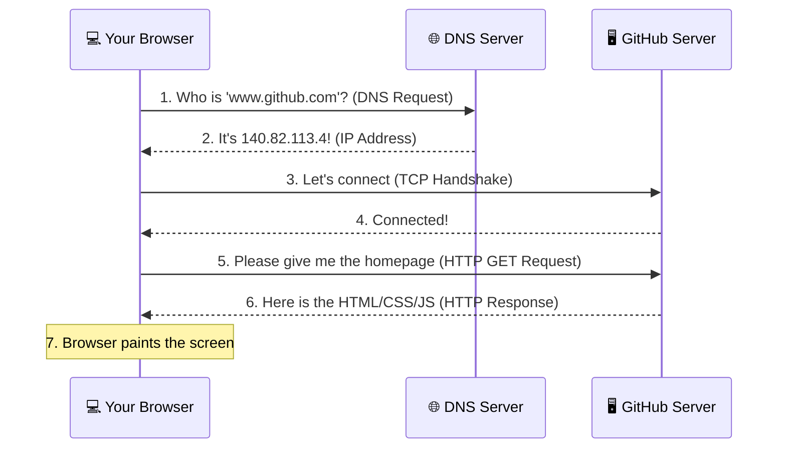
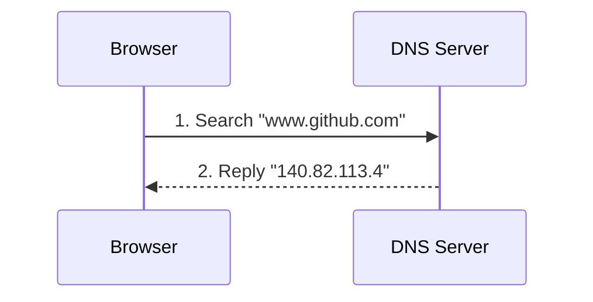
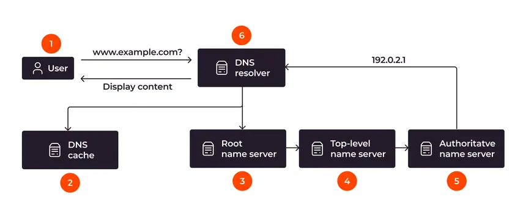
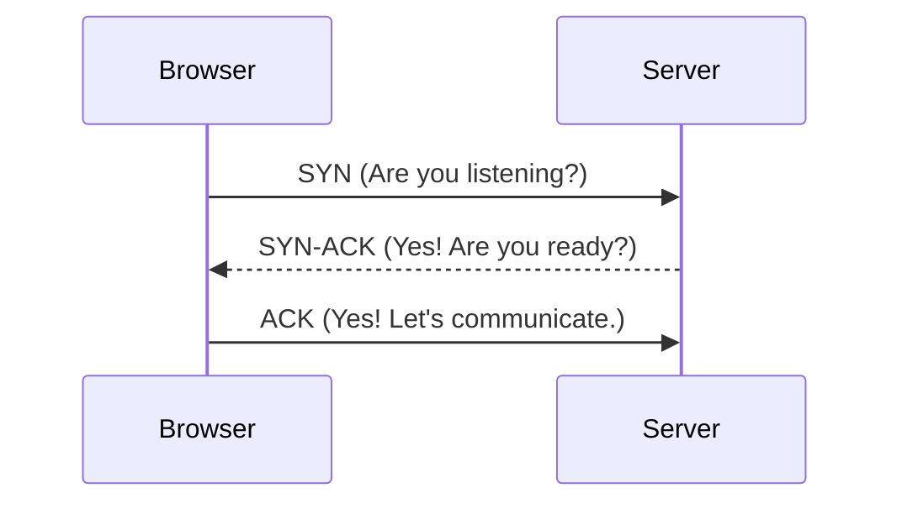
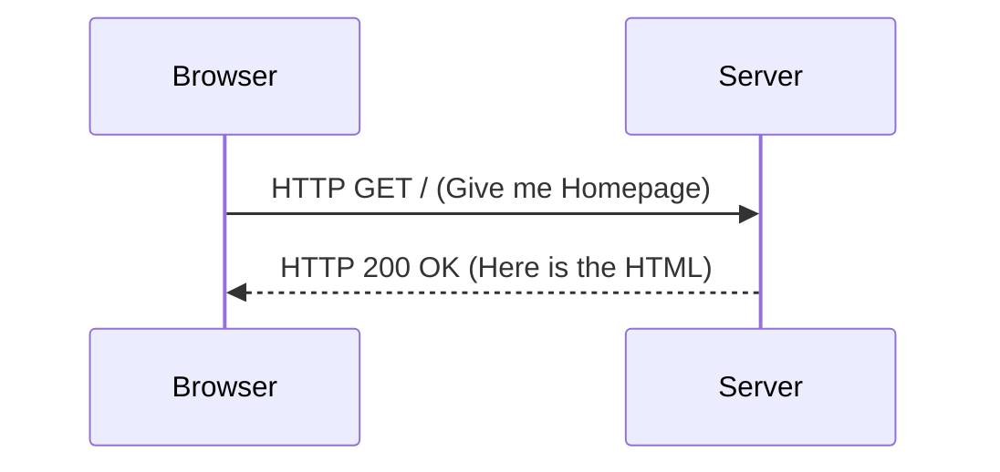
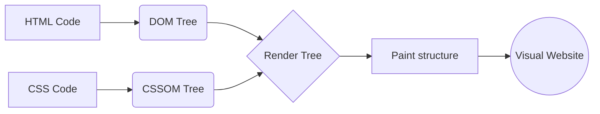
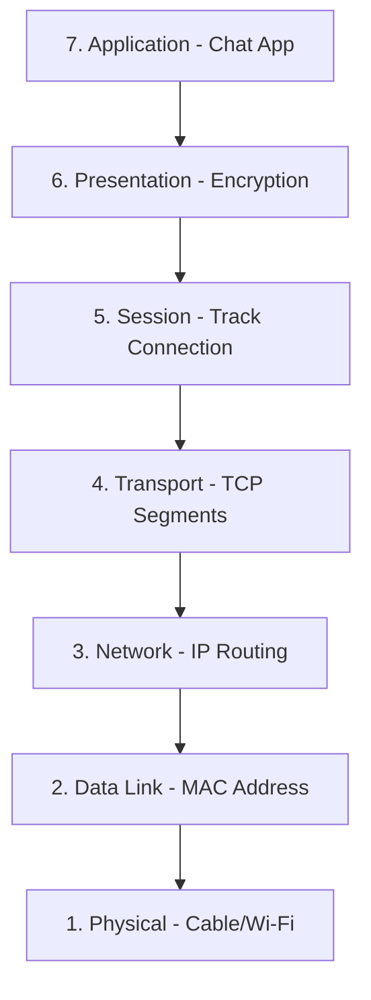
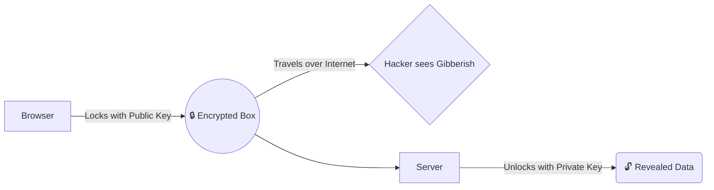
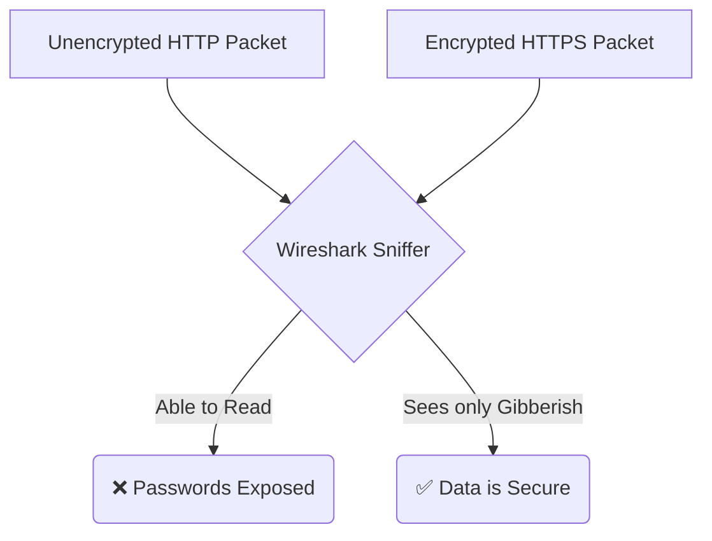
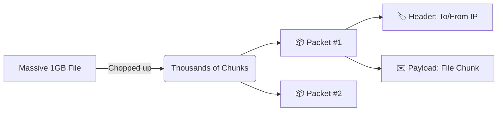

# 🌍 How the Web Works: From typing `www.github.com` to seeing the page!

Here is an extremely detailed, step-by-step breakdown of exactly what happens under the hood when you hit enter after typing a website name. We dive deep into the fundamental building blocks of the internet so you understand exactly how data travels.

## 🗺️ The Big Picture



---

## Step 1: DNS (Domain Name System) Resolution





### A. What it is
DNS is the phonebook of the internet. It translates human-readable domain names (like `github.com`) into computer-readable IP addresses (like `140.82.113.4`). It works hierarchically, checking your browser cache, router cache, ISP DNS, and finally Root DNS servers until it finds the IP.

### B. The Problem (Without DNS)
Computers route data across the globe strictly using numbers (IP addresses), but human brains are terrible at remembering long random strings of numbers. Imagine needing to type `140.82.113.3` instead of `github.com`. The internet would be unusable for regular people.

**Problem Code (Hard for Humans):**
```javascript
// ❌ Good luck remembering these numbers for every single website you visit!
const myFavoriteSite = "140.82.113.4"; 
const searchEngine = "142.250.190.46";
fetch(`http://${myFavoriteSite}`);
```

### C. The Solution (With DNS)
DNS acts as an automated translator. By providing a nice, readable name string, it queries a distributed database (DNS servers) to automatically fetch the proper IP address behind the scenes, allowing the computer to connect without burdening the user.

**Solution Code (Easy for Humans):**
```javascript
// ✅ The Browser handles the DNS lookup automatically!
const targetWebsite = "www.github.com"; 

async function findIP(domain) {
    // A simplified simulation of a DNS Server's "A Record" registry
    const dnsPhonebook = { 
        "www.github.com": "140.82.113.4",
        "www.google.com": "142.250.190.46" 
    };
    return dnsPhonebook[domain] || "IP Not Found";
}

console.log(`Connecting to: ${await findIP(targetWebsite)}`);
```

### D. Real-Life Analogy
💡 **Saving a Contact on Your Smartphone.** 
When you want to call your mom, you don't punch in her 11-digit phone number. You just search "Mom" in your Contacts app, and the phone dials the hard-to-remember number for you. DNS is the Contacts App for your web browser.

**Analogy Code:**
```typescript
class PhoneContacts {
    contacts: Record<string, string> = { "Mom": "+1234567890" };

    call(name: string) {
        const number = this.contacts[name];
        if (!number) return "Contact missing!";
        return `Dialing physical number ${number}...`; // You only needed the name!
    }
}
```

---

## Step 2: The TCP/IP Connection



### A. What it is
TCP (Transmission Control Protocol) is a set of strict rules that defines how computers establish a reliable, verified connection before they start exchanging actual data. It guarantees that packets are delivered in order and without errors.

### B. The Problem (Without TCP)
If your browser blindly threw the web request out into the internet (like UDP does), it wouldn't know if the GitHub server was online, busy, or currently turned off. Packets would get lost, and half of your webpage's images would be missing or corrupted.

**Problem Code (Blind fire):**
```javascript
// ❌ Sending data blindly without checking if the server is actually listening!
githubServer.receive("Hey send me the webpage!"); // Fails instantly if offline or drops data!
```

### C. The Solution (With TCP Handshake)
TCP uses a systematic "3-Way Handshake" to ensure both the client and server agree to communicate (SYN -> SYN-ACK -> ACK). They sync their sequence numbers and negotiate connection terms *before* sending a single byte of the webpage payload.

**Solution Code:**
```javascript
// ✅ Checking if connection is possible and establishing a virtual "pipe"
function tcpHandshake(client, server) {
    client.send("SYN: Hey, are you there? I want to talk.");
    server.send("SYN-ACK: Yes, I am here! Are you ready?");
    client.send("ACK: Yes! The connection is officially open.");
    return "Connection Established! 🤝 Ready to send HTTP.";
}
```

### D. Real-Life Analogy
💡 **Making a Standard Phone Call.** 
You don't just start blurting out your story the millisecond you dial. You wait for the other person to pick up and say "Hello?" (SYN-ACK), then you reply "Hi, it's me!" (ACK), and ONLY then do you start the actual core conversation (The Payload).

**Analogy Code:**
```typescript
class PhoneCall {
    connect() {
        console.log("Caller: Ring Ring! (SYN)");
        console.log("Receiver: Hello? (SYN-ACK)");
        console.log("Caller: Hey, can you hear me? (ACK)");
        return "Start Meaningful Conversation!";
    }
}
```

---

## Step 3: The HTTP Request & Response



### A. What it is
HTTP (Hypertext Transfer Protocol) is the standardized formatting language the browser and server use to communicate. The browser sends a detailed **Request** (e.g., "Give me the page"), and the server replies with a structured **Response** (e.g., "Here is the HTML file").

### B. The Problem (Without HTTP)
If there wasn't a standard, strict format for asking for data, the server wouldn't know exactly *what* you want or exactly *who* you are. Do you want an image? A video? The homepage? Are you logged in? Are you using Chrome or Safari?

**Problem Code:**
```javascript
// ❌ Vague, unformatted communication means the server has to guess your intent
server.ask("Give me github"); // Confusing! Which page? What format? Am I logged in?
```

### C. The Solution (With HTTP)
We communicate using a structured HTTP message. The request specifies the HTTP Method (`GET`, `POST`), the Path (`/`), and special metadata called Headers (like cookies). The server answers with an HTTP Status Code (`200 OK`, `404 Not Found`) and the actual content.

**Solution Code:**
```javascript
// ✅ Highly Structured HTTP Request & Response objects
const httpRequest = {
    method: "GET",
    path: "/user/profile",
    host: "www.github.com",
    headers: { "User-Agent": "Chrome", "Cookie": "session_id=123" }
};

const httpResponse = {
    status: 200,
    statusText: "OK",
    headers: { "Content-Type": "text/html" },
    body: "<html><h1>Welcome to your GitHub Profile!</h1></html>"
};
```

### D. Real-Life Analogy
💡 **Ordering at a Fast Food Restaurant.** 
You don't just yell "FOOD!" randomly at the cashier. You look at the menu and place a structured order: "I'll have 1 Burger (GET) from the Main Menu (Path), with no pickles (Headers)." The cashier then brings it on a tray and says "Enjoy your meal (200 OK)."

**Analogy Code:**
```typescript
class RestaurantCustomer {
    request = { action: "ORDER", item: "Burger", modifiers: "No Pickles" };
}

class Waiter {
    serve(order: any) {
        if (order.action === "ORDER" && order.item === "Burger") {
            return { status: "200 OK", food: "🍔 (No Pickles)" };
        }
        return { status: "404 Not Found - We don't sell that" };
    }
}
```

---

## Step 4: Browser Rendering



### A. What it is
Rendering is the critical final step where your Browser Engine takes the raw text files (HTML, CSS, and JavaScript) received from the server and visually paints them onto your monitor as a beautiful, interactive website.

### B. The Problem (Without Rendering)
Servers just send raw, plain text code. If you showed the raw HTML/CSS text directly to a standard user, they wouldn't understand anything. They need buttons, colors, and layouts, not angle brackets.

**Problem Code:**
```html
<!-- ❌ What the computer sees natively via HTTP (Raw Text String) -->
<div style="color: blue; text-align: center;">
   <button onclick="alert('Hi!')">Click Me!</button>
</div>
```

### C. The Solution (With Rendering)
The Browser has internal engines (like Google Chrome's V8 for JavaScript and Blink/Webkit for rendering). It parses the HTML to create a Document Object Model (DOM) tree, parses CSS to build a CSSOM for styling, merges them, and fundamentally calculates the exact pixels to paint on your screen.

**Solution Code:**
```javascript
// ✅ The Browser pipeline turns raw string code into visual, clickable UI nodes
function browserRenderingEngine(htmlString, cssString) {
    const domTree = parseHTML(htmlString);
    const styledTree = applyCSS(domTree, cssString);
    const layout = calculatePositions(styledTree);
    
    paintPixelsOnMonitor(layout);
}
```

### D. Real-Life Analogy
💡 **Building IKEA Furniture from a Manual.** 
The server delivers a flat-pack box filled with random sheets of wood and screws (the raw HTML/CSS/JS text). Your browser represents YOU reading the instruction manual, screwing the pieces together, and building the materials into a real, functional, 3D table (The Visual Website).

**Analogy Code:**
```typescript
class IkeaBuilder {
    build(boxOfParts: string[]) {
        if (boxOfParts.includes("WoodPieces") && boxOfParts.includes("Screws")) {
            return "🪑 Fully Assembled, Usable Table Made!";
        }
        return "Missing parts, cannot build.";
    }
}
```

---

## Step 5: The OSI Model (How Data Actually Travels)



### A. What it is
The OSI (Open Systems Interconnection) Model is a 7-layer theoretical framework that explains how software data physically travels from one computer's application (like Chrome), down through the operating system, across the physical copper cables/Wi-Fi under the ocean, and up into another computer's server application.

### B. The Problem (Without layers)
Imagine if a single developer or company had to write the code for EVERYTHING: the chat app, the operating system, the internet routers, and the underwater fiber-optic cables! If there was no segmented standard, a Mac wouldn't be able to talk to a Windows PC, and changing your Wi-Fi password might require rewriting your Web Browser.

**Problem Code (Monolithic System):**
```javascript
// ❌ One giant software function trying to do EVERYTHING
function sendWebData(message) {
    formatApplicationText(message);
    encryptData(message);
    findIPAddress();
    convertToElectricity();
    sendViaCopperCable(); // Hardcoded to copper! Breaks instantly if we switch to Wi-Fi!
}
```

### C. The Solution (The 7 Layers)
The OSI Model breaks the impossibly massive problem of "networking" into 7 manageable, strictly independent layers. If you change your physical connection from a Cable to Wi-Fi (Layer 1 Physical changes), the Web Browser (Layer 7 Application) doesn't know and doesn't care. The modularity allows the internet to function seamlessly.

**Solution Code (Layered Segregation):**
```javascript
// ✅ Each layer has ONE specific job, wraps the data, and passes it down to the next
class OSI_Model {
    layer7_Application(msg) { return this.layer6_Presentation(`[HTTP] ${msg}`); }
    layer6_Presentation(msg) { return this.layer5_Session(`[Encrypted SSL] ${msg}`); }
    layer5_Session(msg)   { return this.layer4_Transport(`[Session Tracked] ${msg}`); }
    layer4_Transport(msg) { return this.layer3_Network(`[TCP Segment (Port 80)] ${msg}`); }
    layer3_Network(msg)   { return this.layer2_DataLink(`[IP Packet (IP 140...)] ${msg}`); }
    layer2_DataLink(msg)  { return this.layer1_Physical(`[MAC Frame (Hardware Address)] ${msg}`); }
    layer1_Physical(msg)  { return `01010111 01100101 (Pulsing Electricity on Wi-Fi)`; }
}
```

### D. Real-Life Analogy
💡 **Sending a Physical registered Letter to a Friend overseas.**

1. **Application (L7):** You physically write the letter ("Hello!").
2. **Presentation (L6):** You translate it to Spanish so your friend understands.
3. **Session (L5):** You write "Please Reply" to establish a two-way channel.
4. **Transport (L4):** You send it via Registered Post to ensure it doesn't get lost.
5. **Network (L3):** The Post Office reads the Zip Code and routes it globally (Air vs Sea).
6. **Data Link (L2):** The local postman puts it into a specific local delivery van to drive.
7. **Physical (L1):** The letter physically travels in an airplane or truck over real roads and oceans.

**Analogy Code:**
```typescript
class PostalSystem {
    sendLetter(message: string, friendAddress: string) {
        const L7 = `Write: ${message}`;
        const L6 = `Translate -> Spanish: ${L7}`;
        const L4 = `Registered Mail Insurance: ${L6}`;
        const L3 = `Global Routing logic for ${friendAddress}`;
        const L1 = `✈️ Fly airplane physically across the world!`;
        console.log("Letter successfully handled modularly step-by-step!");
    }
}
```

---

## Step 6: End-to-End Encryption (RSA) 




### A. What it is
RSA is a brilliant mathematical security system (Asymmetric Encryption) that uses two mathematically linked but entirely different keys: a **Public Key** to lock (encrypt) a message, and a safely hidden **Private Key** to unlock (decrypt) it. It guarantees that when you type a password, hackers on the Wi-Fi cannot read it.

### B. The Problem (Without RSA)
If both the sender and receiver use the *exact same* password (Symmetric Key) to lock and unlock a message, they must find a way to share that password over the internet. If a hacker intercepts the password while it travels, they can decrypt and steal everything.

**Problem Code (Sharing the Secret Password):**
```javascript
// ❌ Anyone intercepting the network can see BOTH the message and the unlocking password!
function sendSecureMessage(message) {
    const secretPassword = "my_super_secret_password";
    const lockedMessage = encrypt(message, secretPassword);
    
    // Transmitting the password over the network gives hackers the key!
    server.receive(lockedMessage, secretPassword); 
}
```

### C. The Solution (Public & Private Keys)
The server mathematically generates a pair of keys. It gives everyone in the world the **Public Key** (which can ONLY lock data). You use it to lock your password. Once locked, the data can ONLY be unlocked by the server's securely hidden **Private Key**. You never transmit the unlocking key over the internet!

**Solution Code (End-to-End Secure):**
```javascript
// ✅ The server strictly guards the decryption key
const serverPrivateKey = "SERVER_SECRET_DECRYPT_KEY_NEVER_SHARED";
const serverPublicKey = "PUBLIC_LOCK_ONLY_SHARE_WITH_ANYONE";

// 1. Browser gets the public key and locks the payload
function sendSecureMessage(message, publicKey) {
    const lockedMessage = rsaEncrypt(message, publicKey);
    
    // Only the safely locked message is sent. NO passwords sent!
    server.receive(lockedMessage); 
}

// 2. Server safely unlocks it behind closed doors using its Private Key
const server = {
    receive: function(lockedMessage) {
        const originalMessage = rsaDecrypt(lockedMessage, serverPrivateKey);
        console.log("Safe and secure on server:", originalMessage);
    }
};
```

### D. Real-Life Analogy
💡 **The Open Padlock Protocol.** 
Imagine a Bank needs you to mail them your secret PIN securely. 
1. The Bank mails you an open, unlocked **Padlock** (Public Key). They keep the actual **Physical Key** (Private Key) deeply hidden inside their vault.
2. You put your PIN in a strongbox, attach the Bank's Padlock, and snap it shut.
3. Now, even YOU cannot open the box anymore! It only locks.
4. You mail the locked box. If a thief steals it, they can't open it because they don't have the vault key.
5. When the Bank receives it, they use their secret Key to open the padlock.

**Analogy Code:**
```typescript
class BankVault {
    private vaultKey = "Secret_Vault_Key"; // Private Key (Hidden)
    public openPadlock = "Bank_Open_Padlock"; // Public Key (Shared)

    unlockBox(lockedBox: string) {
        return `Box opened natively in vault with ${this.vaultKey}. Data retrieved!`;
    }
}

class UserClient {
    sendData(bankPadlock: string, myPin: number) {
        // Locks the data using the public padlock
        const lockedBox = `[LOCKED BOX: ${myPin} secured via ${bankPadlock}]`;
        return lockedBox; // 100% Safe to transmit via public mail
    }
}
```

---

## Step 7: Network Traffic Analysis with Wireshark



### A. What it is
Wireshark is a powerful graphical network protocol analyzer tool. It acts like a high-powered microscope for your internet connection, physically capturing and displaying the "packets" (chunks of data) traveling across your internet cables or Wi-Fi card in real-time.

### B. The Problem (Blind to the Network)
When building a modern web app, data travels invisibly over the air. If your web request fails, or if an API is surprisingly slow, or you accidentally send plain text passwords that get stolen, you normally have absolutely no way to "see" what actually traversed the cables to debug where it broke.

**Problem Code (Invisible Network Traffic):**
```javascript
// ❌ If the network drops or is intercepted, the underlying packet issue is hidden in the dark.
try {
    const response = await fetch("http://my-server.com/login"); 
    // You sit and wait blindly...
} catch (error) {
    console.error("Something failed... But what packet was lost? Was the TCP handshake broken? Was DNS wrong? I am blind!");
}
```

### C. The Solution (Packet Capturing)
Wireshark "sniffs" your network interface (like your MacBook's Wi-Fi adapter). It lets you physically inspect every single OSI layer: you can watch the TCP 3-Way Handshake step-by-step, view the DNS queries resolving, and read the HTTP headers. If you use standard HTTP, Wireshark exposes your plain text passwords. If you use HTTPS (using RSA), Wireshark sees the packet but shows the payload data as unreadable mathematical gibberish.

**Solution Code (Simulating a Wireshark Capture):**
```javascript
// ✅ Wireshark intercepts packets and logs exactly what is flying through the air.
const wiresharkCaptureLog = [
    { No: 1, Protocol: "DNS", Info: "Standard query A www.github.com" },
    { No: 2, Protocol: "TCP", Info: "443 [SYN] Seq=0 Win=65535 (Handshake Start)" },
    { No: 3, Protocol: "HTTP", Info: "POST /login (Unencrypted: 'password123' visible!)" },
    { No: 4, Protocol: "TLSv1.3", Info: "Application Data (Encrypted via RSA: 'x9$#kLzQ...')" }
];

// Evaluating this raw log helps you spot security leaks and routing bugs immediately.
console.table(wiresharkCaptureLog);
```

### D. Real-Life Analogy
💡 **The Post Office Customs Inspector.** 
Normally, you drop a letter in a mailbox and blindly hope it arrives. Wireshark is like an incredibly fast Customs Inspector standing on the sorting floor. The inspector catches every single letter (packet), verifies the sender and receiver stamps (IP addresses), and can even slice open the envelope to read the paper inside (HTTP). However, if you sent data sealed inside a titanium locked safe (HTTPS/RSA), the inspector can see the safe moving by, but cannot physically read the documents inside.

**Analogy Code:**
```typescript
class CustomsInspector {
    inspectPackage(packetData: string, isEncrypted: boolean) {
        console.log(`🔍 Wireshark intercepting package: ${packetData}`);
        
        if (isEncrypted) {
             return "✅ Security Status: Encypted payload. Cannot read contents!";
        } else {
             return `❌ Security Alert: Found plain text message: "${packetData}"`;
        }
    }
}

const wireshark = new CustomsInspector();
// Plain HTTP allows Wireshark to read everything
console.log(wireshark.inspectPackage("Login Data: Admin / Pass123", false)); 
// HTTPS (RSA) means Wireshark only sees encrypted junk
console.log(wireshark.inspectPackage("U2FsdGVkX1+x8PZ...", true)); 
```

---

## Step 8: Packets, Headers, and Payloads



### A. What it is
When data travels over the internet, a massive file (like a 1GB movie) is never sent as one giant piece. It is chopped up into thousands of tiny chunks called **Packets**. Every packet has two main parts: a **Header** (metadata like routing addresses) and a **Payload** (the actual chunk of the movie data).

### B. The Problem (Without Packets)
If you tried to send a 1GB file over the network as a single massive block and your internet dropped for exactly one second at 99%, the entire 1GB would be lost and you would have to start sending it from 0% again. This would clog the entire internet. Furthermore, the routing servers wouldn't know where the data is going without addressing metadata.

**Problem Code (Sending One Massive Block):**
```javascript
// ❌ Sending 1GB all at once!
function sendMovie(oneGigabyteDataBlock) {
    // If an error happens midway, the entire block is destroyed forever!
    networkChannel.send(oneGigabyteDataBlock); 
}
```

### C. The Solution (Chunking & Adding Headers)
We break the massive file into tiny 1500-byte **Packets**. To ensure the packets don't get lost, we attach a **Header** to the front of every single packet. The header contains the Destination IP, the Source IP, and the Sequence Number (so the receiver can stitch the chunks back together in the correct order). The **Payload** is the actual tiny piece of data being transported.

**Solution Code (Headers & Payloads):**
```javascript
// ✅ Chopping data into Packets with Headers for safe travel
function sendDataInPackets(hugeData) {
    const chunks = hugeData.split(1500); // Chop into 1500 byte pieces
    
    chunks.forEach((chunk, index) => {
        const packet = {
            // The Header tells the internet WHERE this packet goes and what order it is
            header: {
                destinationIP: "140.82.113.4",
                sourceIP: "192.168.1.5",
                sequenceNumber: index + 1
            },
            // The Payload is the actual useful data being sent
            payload: chunk 
        };
        networkChannel.send(packet);
    });
}
```

### D. Real-Life Analogy
💡 **Moving a Full House Across the Country via Mail.** 
You cannot fit your entire house into a single giant FedEx truck (No Packets). Instead, you disassemble your bed, tables, and TV, packing them into 100 smaller individual cardboard boxes (**Packets**). 

On the outside of every box, you tape a shipping label with the To/From addresses and "Box 1 of 100" (**Header**). Inside the box is the actual leg of a table (**Payload**). If Box #43 gets lost in transit, you only have to resend Box #43, not the whole house! The destination friend reads the labels (Headers) to reassemble the furniture (Payloads) in order.

**Analogy Code:**
```typescript
class MovingCompany {
    sendBoxes(furniturePieces: string[]) {
        furniturePieces.forEach((piece, index) => {
            const cardboardBox = {
                // Header (The Label on the outside)
                shippingLabel: `To: NY, From: CA, Box #${index + 1} of ${furniturePieces.length}`,
                
                // Payload (The contents inside)
                contents: piece 
            };
            console.log(`Shipping: [${cardboardBox.shippingLabel}] containing [${cardboardBox.contents}]`);
        });
    }
}
```
