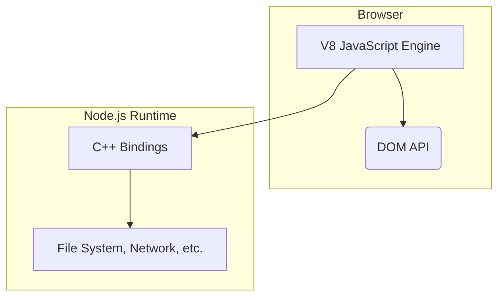
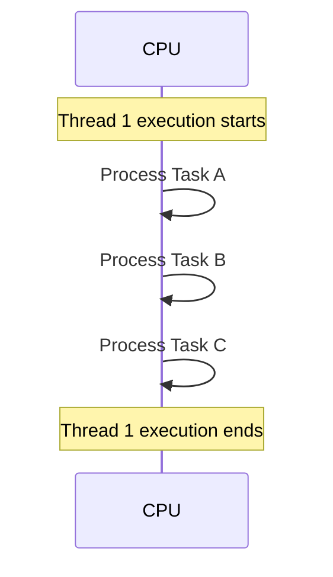
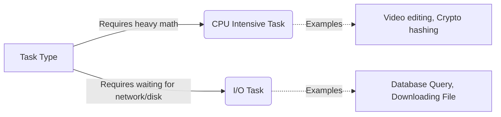
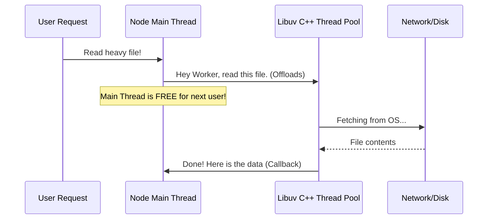
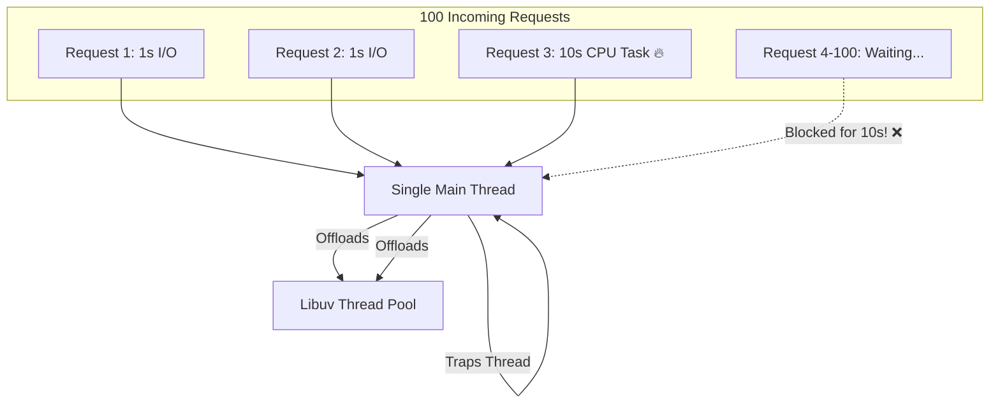
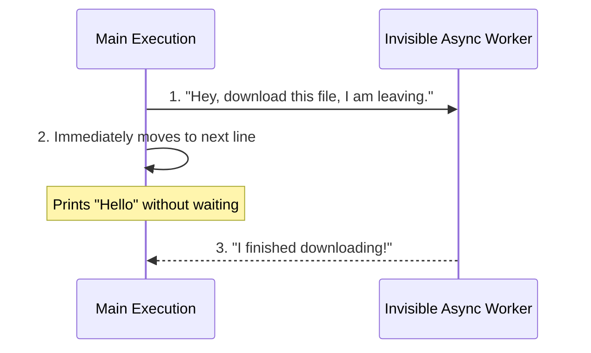
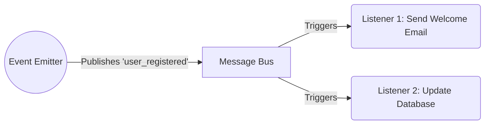
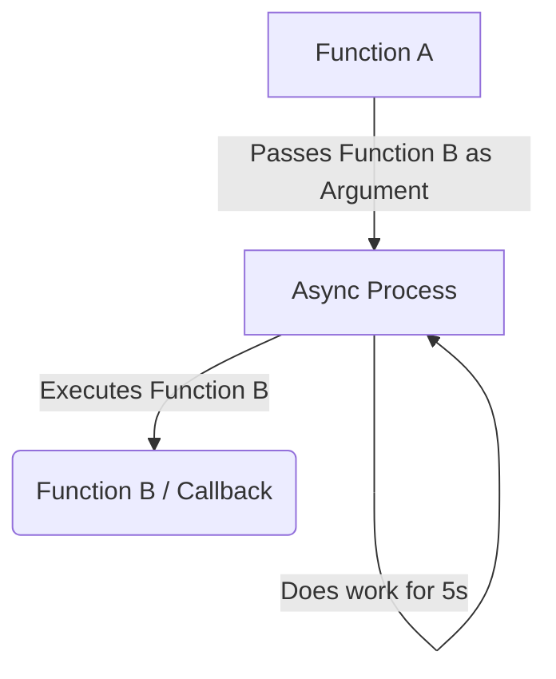
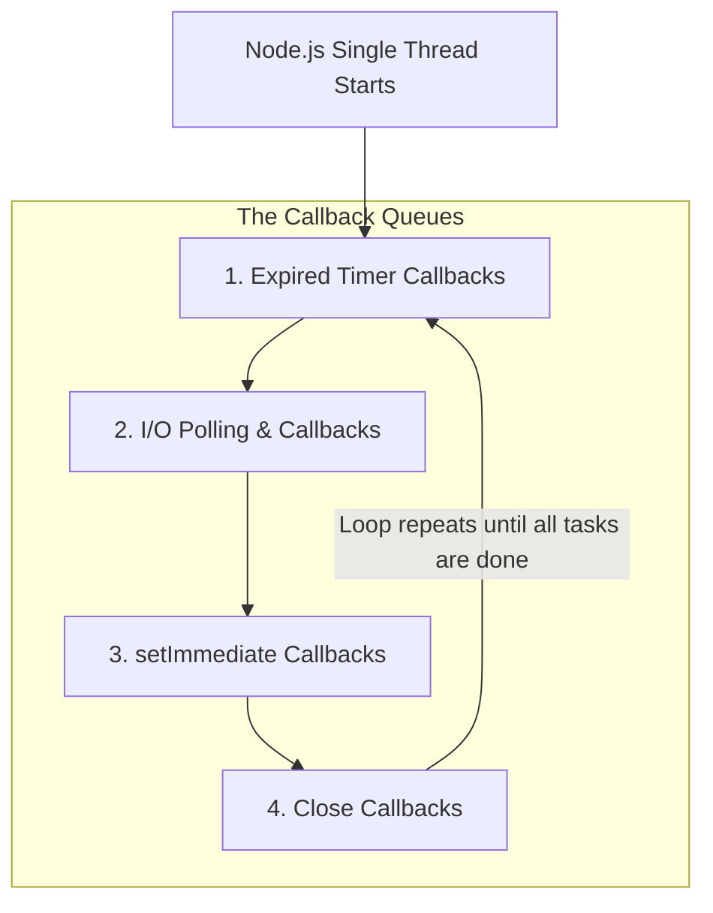
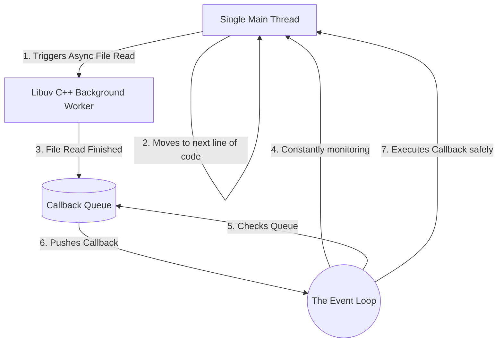

# 🚀 How Node.js Works: The Ultimate Beginner's Guide

This document breaks down the fundamental architecture of Node.js. 

---

## Step 1: What is a Runtime?



### A. What it is
A **Runtime** is the environment where your code runs. For a long time, JavaScript could only run inside the Web Browser (like Chrome). Node.js is a runtime that takes the V8 JavaScript engine out of the browser and places it directly on your computer's operating system, allowing JS to interact with files and networks.

### B. The Problem (Without a Server Runtime)
If you try to run JavaScript outside of a browser without a server runtime, it doesn't know how to talk to your computer. Brower-exclusive features like `window` or `document` don't exist on a server, and basic JS cannot read files on your hard drive natively.

**Problem Code:**
```javascript
// ❌ This code will crash outside of a Web Browser!
// A server has no "window" or screen to alert on.
window.alert("Hello World");
document.getElementById("btn").click();
```

### C. The Solution (With Node.js Runtime)
Node.js wraps the V8 engine and adds powerful C++ modules. This gives JavaScript superpowers to read files, connect to databases, and create web servers without needing a browser.

**Solution Code:**
```javascript
// ✅ Node.js provides global C++ backed modules to interact directly with the OS
// 1. We import the 'fs' (File System) and 'os' (Operating System) modules
const fs = require('fs');
const os = require('os');

// 2. We can now ask the computer what operating system it is running (Windows/Linux/Mac)
console.log(`Running on OS: ${os.platform()}`);

// 3. We can read files natively from our hard drive!
// In a browser, this is impossible for security reasons. Node.js makes it possible.
fs.readFile('database.txt', 'utf8', (err, data) => {
    // 4. Print the text inside the file to the terminal
    console.log("File content:", data);
});
```

### D. Real-Life Analogy
💡 **A Car Engine in a Boat.** 
Imagine the V8 JS Engine is a powerful sports car engine. Normally, it only drives cars (Web Browsers). Node.js is like taking that exact same engine out of the car and installing it inside a Speedboat (Server). It’s the same engine, but now it has new controls (C++ bindings) to navigate water (OS/Filesystem) instead of roads (DOM).

**Analogy Code:**
```typescript
class V8Engine {
    run() { return "Vroom vroom!"; }
}

class WebBrowser {
    constructor(private engine: V8Engine) {}
    drive() { return `${this.engine.run()} Driving on the Road 🛣️`; }
}

class NodeJSRuntime {
    constructor(private engine: V8Engine) {}
    sail() { return `${this.engine.run()} Sailing the Sea 🌊(File System/DB)`; }
}
```

---

## Step 2: What is a Thread?



### A. What it is
A **Thread** is a single sequence of instructions that your CPU executes. Think of it as a single timeline or a single pair of hands. If a program has one thread, it can only do exactly one thing at a specific millisecond.

### B. The Problem (Thread Blocking)
Because a thread can only execute one line of code at a time, if one task takes a very long time, it completely freezes the thread. Nothing else can happen until that heavy task finishes.

**Problem Code:**
```javascript
// ❌ If a single thread is stuck in an infinite or heavy loop, everything stops.
function heavyTask() {
    let count = 0;
    // The thread is trapped here for 5 seconds
    while (count < 10000000000) { 
        count++;
    }
}

heavyTask(); 
console.log("This will not print until heavyTask is completely done!");
```

### C. The Solution (Delegating/Asynchronous Flow)
Instead of forcing the thread to sit and wait blindly, we use asynchronous callbacks. We tell the thread to "schedule" the heavy task and immediately move on to the next line of code.

**Solution Code:**
```javascript
// ✅ Moving heavy/waiting tasks out of the main execution flow
setTimeout(() => {
    console.log("Heavy/Waiting task finished in the background!");
}, 5000);

// The thread is free to instantly execute this line!
console.log("This prints immediately! The thread is NOT blocked.");
```

### D. Real-Life Analogy
💡 **A Chef in a Kitchen.** 
A thread is a single Chef. If the Chef has 10 orders, they can only chop onions for one dish at a time. If the Chef decides to stare at a pot of boiling water for 10 minutes until it boils (Blocking), no other food gets cooked.

**Analogy Code:**
```typescript
class KitchenThread {
    chefName: string = "Chef Thread";

    cook(task: string) {
        console.log(`${this.chefName} is currently: ${task}`);
    }
}
const mainThread = new KitchenThread();
mainThread.cook("Chopping Onions"); // Can only do this one task right now!
```

---

## Step 3: CPU Intensive Task vs I/O Task



### A. What it is
*   **CPU Intensive Task:** Operations that require heavy mathematical calculations and drain your processor's brainpower (e.g., Image processing, sorting millions of numbers).
*   **I/O Task (Input/Output):** Operations where the CPU does almost no math, but instead just *waits* for data from an external source (e.g., Reading a hard drive file, waiting for an API response).

### B. The Problem (Mixing them badly)
If you treat I/O tasks like CPU tasks, your thread will sit totally idle. During an I/O task (like waiting for a database), the CPU isn't actually calculating anything; it's practically sleeping! 

**Problem Code:**
```javascript
// ❌ Treating I/O like a CPU task freezes your server for no reason
function getUserFromDatabase() {
    // Server is doing ZERO math, just waiting blindly for 5 seconds
    const data = database.pauseAndFetchSync(5000); 
    return data;
}
```

### C. The Solution (Distinguishing Task Types)
Node.js knows that I/O tasks don't need the CPU. So, whenever an I/O task occurs, Node.js offloads it to the operating system to wait in the background, keeping the CPU thread 100% free to do actual computational work for other users.

**Solution Code:**
```javascript
// ✅ Using async code to handle I/O tasks efficiently, leaving the CPU alone
function handleDBTask() {
    // 1. We ask the database for information. 
    // 2. Node.js offloads this "waiting" to the background OS!
    database.fetchAsync((data) => {
        // 4. Much later, when the DB finally replies, this code runs.
        console.log("Database finally replied:", data);
    });
}

function handleCPUTask() {
    // 3. While the DB is taking 5 seconds to reply in the background, 
    // the CPU (Main Thread) is instantly free to do heavy math right here!
    let mathResult = 100 * 500; 
    console.log("Doing math while waiting for the database!", mathResult);
}
```

### D. Real-Life Analogy
💡 **Oven Baking vs Chopping Vegetables.** 
*   **CPU Task (Chopping):** The chef actively uses their hands and energy constantly. They cannot step away.
*   **I/O Task (Oven Baking):** The chef puts an item in the oven and sets a timer. The chef doesn't stand there staring at the oven; they go back to chopping (CPU work) while the oven (Hard Drive/Network) does the work in the background.

**Analogy Code:**
```typescript
class Restaurant {
    cpuTask_ChopOnions() { return "Chef is actively busy chopping! 🔪"; }
    
    ioTask_BakePizza() { 
        return "Pizza is in the oven (Network). Chef is FREE to go chop onions! 🍕"; 
    }
}
```

---

## Step 4: Multi-Thread vs Single-Thread

```mermaid
flowchart TD
    subgraph Multi-Threaded Server (Java, PHP)
    Request1 --> T1[Thread 1: 2MB RAM]
    Request2 --> T2[Thread 2: 2MB RAM]
    Request3 --> T3[Thread 3: 2MB RAM]
    end
    
    subgraph Single-Threaded Server (Node.js)
    Request4 --> MT[Main Thread: Very light]
    Request5 --> MT
    Request6 --> MT
    end
```

### A. What it is
*   **Multi-Threaded Server:** Creates a brand-new Thread (worker) for every single user that connects.
*   **Single-Threaded Server (Node.js):** Uses only ONE main thread to handle thousands of users sequentially via an Event Loop.

### B. The Problem (Multi-Thread Memory & Complexity)
If an application creates a new thread for every user, and 10,000 users connect, it consumes massive amounts of RAM. Furthermore, multiple threads trying to modify the exact same variable at the same time causes disastrous bugs called **Race Conditions**.

**Problem Code (Multi-Thread Vulnerability):**
```java
// ❌ Imagine two threads running this code EXACTLY at the same millisecond
int userBalance = 100;

void makePurchase(int price) {
    if (userBalance >= price) { 
        // Thread 1 & Thread 2 both pass this check simultaneously!
        userBalance = userBalance - price; 
        // Both subtract, causing the balance to go into negative unexpectedly!
    }
}
```

### C. The Solution (Single Threaded Event-Loop)
Node.js avoids thread bloat and race conditions by using a Single Main Thread. Since there is only one thread handling the JavaScript code, two pieces of code literally cannot run at the exact same millisecond. Memory stays incredibly low, and variables are safe.

**Solution Code:**
```javascript
// ✅ Node.js handles it purely sequentially. No race conditions possible!
let userBalance = 100;

function makePurchase(price) {
    if (userBalance >= price) {
        // Node's single thread processes User A completely before moving to User B.
        // It is perfectly safe.
        userBalance -= price; 
    }
}
```

### D. Real-Life Analogy
💡 **The Bank Teller Model.** 
*   **Multi-Thread:** Hiring a brand new Bank Teller for every customer walking in the door. If 1,000 customers walk in, you need 1,000 tellers (High Cost/RAM).
*   **Single-Thread:** One super-fast Teller (Event Loop) who takes a customer's form, puts it in an inbox for processing, and immediately says "Next Customer please!".

**Analogy Code:**
```typescript
class SingleThreadTeller {
    handleCustomer(customerName: string) {
        console.log(`Teller asks ${customerName} to fill out a form...`);
        console.log(`Teller immediately serves the NEXT customer without waiting!`);
    }
}
```

---

## Step 5: How Node.js Handles Multi-Threading (Under the Hood)



### A. What it is
Though Node.js executes JavaScript on a single thread, it is secretly **Multi-Threaded behind the scenes**! It uses a library called **Libuv**, which maintains a pool of C++ worker threads (usually 4 to start) to handle heavy OS tasks in the background.

### B. The Problem (Single Thread Bottleneck)
If Node.js was *truly* 100% single-threaded, any heavy task (like encrypting a password or compressing a massive file) would block the one and only thread. If the main thread stops, the entire server shuts down for everyone.

**Problem Code:**
```javascript
// ❌ Heavy Crypto math blocks the single thread
const crypto = require('crypto');

// This stops the main thread! Thousands of users must wait for 2 seconds!
const hash = crypto.pbkdfSync('password', 'salt', 100000, 512, 'sha512');
```

### C. The Solution (The Hidden Worker Pool)
Whenever Node.js encounters heavy I/O or Crypto operations, the Main Thread hands the job over to the **Libuv Thread Pool**. The C++ workers do the heavy lifting in the background, and the Main Thread continues serving new users. When the worker finishes, it passes the result back via a callback.

**Solution Code:**
```javascript
// ✅ Using Async methods automatically leverages the hidden C++ Thread Pool
const crypto = require('crypto');

// 1. We start a heavy crypto math operation. Node.js realizes this is too heavy!
// 2. The Main Thread secretly offloads this to one of the 4 Libuv C++ Background Threads!
crypto.pbkdf2('password', 'salt', 100000, 512, 'sha512', (err, hash) => {
    // 4. This callback only runs when the C++ worker finishes the heavy lifting.
    console.log("C++ Worker Pool finished hashing in the background!");
});

// 3. Since the heavy lifting was moved to the background C++ Thread, 
// the single JS Main Thread is completely unblocked and executes this instantly!
console.log("Main Thread is instantly free to serve other users!");
```

### D. Real-Life Analogy
💡 **The Waiter and the Kitchen Staff.**
The Node.js Main Thread is the **Waiter**. The Waiter does not cook the food (Heavy Task). The Waiter takes your order and gives it to the **Kitchen Staff (Libuv Thread Pool)**. While the kitchen cooks (background thread), the Waiter is instantly free to go take orders from other tables!

**Analogy Code:**
```typescript
class NodeRestaurant {
    mainThreadWaiter(order: string) {
        console.log("Takes order from table...");
        this.libuvKitchenStaff(order, (food) => {
            console.log(`Waiter serves the finished ${food} back to table!`);
        });
        console.log("Waiter moves to the next table instantly!");
    }

    libuvKitchenStaff(order: string, callback: Function) {
        // Cooks in the background (C++ Thread Pool)
        setTimeout(() => callback(`Cooked ${order}`), 3000); 
    }
}
```

---

## Step 6: Why is Node.js called "Non-Blocking I/O"?

```mermaid
flowchart TD
    subgraph Blocking I/O
    B1[Request 1] --> B2[Wait for File to Read (5s Freeze)]
    B2 --> B3[Process Request 2]
    end
    
    subgraph Non-Blocking I/O
    NB1[Request 1] --> NB2[Start File Read (Background)]
    NB2 --> NB3[Process Request 2 IMMEDIATELY]
    end
```

### A. What it is
**Non-Blocking I/O** means that when your code asks the system to read a file or call an API, the main execution thread does *not* wait (block) for the response. It continues running subsequent lines of code, and handles the data later via an Event callback.

### B. The Problem (Blocking flow)
If I/O is blocking, a single slow operation ruins the speed of the entire software. If reading a log file takes 4 seconds, the whole app is completely paralyzed for 4 seconds. 

**Problem Code:**
```javascript
// ❌ Blocking I/O: Everything freezes until the file is completely read
const fs = require('fs');

console.log("1. Starting Program");
// The thread forcefully sits here and waits!
const fileData = fs.readFileSync('huge-file.txt', 'utf8'); 
console.log("2. File Read Done"); // Prints only AFTER file is read
console.log("3. Other operations..."); // Blocked!
```

### C. The Solution (Non-Blocking flow)
By utilizing event-driven callbacks or Promises, Node.js triggers the I/O action and immediately jumps to the next line of code. The event loop listens for the background task to say "I'm done!" and then triggers the callback.

**Solution Code:**
```javascript
// ✅ Non-Blocking I/O: The thread keeps moving!
const fs = require('fs');

console.log("1. Starting Program...");

// 2. We command the OS to read the file.
// 🔴 CRITICAL: The thread DOES NOT stand here and wait for the file! It moves on!
fs.readFile('huge-file.txt', 'utf8', (err, data) => { 
    // 4. Once the background OS finishes reading the file, THIS code runs.
    console.log("4. File Read Done (Printed later!)"); 
});

// 3. This prints almost instantly! It didn't have to wait for the 5-second file read.
console.log("2. Other operations immediately processing..."); 
console.log("3. Another task happening...");
```

### D. Real-Life Analogy
💡 **The Fast Food Buzzer.** 
*   **Blocking:** You order a burger, and you stand exactly at the counter staring at the cashier until they hand you the food. No other customers can order.
*   **Non-Blocking:** You order, they give you a **Buzzer (Callback)**, and you step aside. The cashier takes the next person's order. When your food is ready, your buzzer flashes, and you come back to get it.

**Analogy Code:**
```typescript
class FastFoodPlace {
    orderBurger(customerData: string) {
        console.log(`Giving buzzer to ${customerData}`);
        
        // Non-blocking wait
        setTimeout(() => {
            console.log(`🚨 Buzzer rings for ${customerData}! Burger ready.`);
        }, 4000);
    }
}

const mcdonalds = new FastFoodPlace();
mcdonalds.orderBurger("Customer A");
console.log("Taking order for Customer B instantly!"); 
// Outputs: 1. Buzzer A. 2. Taking order B. 3. (Wait) 4. Food ready.
```

---

## Step 7: The CPU Intensive Bottleneck (Why Node.js Crashes/Slows Down)



### A. What it is
Even though Node.js offloads **I/O Tasks** (like databases or files) to the Libuv Thread Pool, it does **not** automatically offload **CPU Intensive Tasks** (like custom heavy math or massive loop iterations). If a heavy CPU task hits the single Main Thread, it stays there and completely blocks the thread.

### B. The Problem (The Single Thread Crash/Slowdown)
Imagine 100 requests hit your Node.js server. If Request #3 is a massive 10-second mathematical calculation, the Main Thread gets trapped processing it. Requests #4 to #100 are literally frozen. They cannot even be acknowledged because the Single Thread is stuck doing math.

**Problem Code:**
```javascript
// ❌ Heavy custom math completely paralyses the Node server
app.get('/heavy-math', (req, res) => {
    let total = 0;
    // The CPU is forced to count to 50 Billion manually!
    // The Main Thread is fully blocked for ~10 seconds.
    for (let i = 0; i < 50000000000; i++) {
        total++;
    }
    res.send(`Result: ${total}`);
});

// Any other user hitting this simple route while the math is running WILL WAIT 10 SECONDS!
app.get('/simple', (req, res) => {
    res.send("Hi! Why did I have to wait 10 seconds for just this?");
});
```

### C. The Solution (Worker Threads)
To fix this, Node.js introduced **Worker Threads**. Just like Libuv handles I/O in the background, you can tell Node.js to spin up a manual extra background thread specifically to handle this heavy math. This frees up the Main Thread instantly to serve the remaining 97 users.

**Solution Code:**
```javascript
// ✅ Using Worker Threads to push CPU math to the background
const { Worker } = require('worker_threads');

app.get('/heavy-math-fixed', (req, res) => {
    // We create a new background thread specifically for this heavy math file
    const worker = new Worker('./math-worker.js');
    
    worker.on('message', (result) => {
        // Only runs when the background thread finishes its 10s task!
        res.send(`Result: ${result}`);
    });

    // The Main Thread is INSTANTLY free to help the next user!
});
```

### D. Real-Life Analogy
💡 **The Bank Teller and the Piggy Bank.**
You have ONE blazing fast Bank Teller (Node Main Thread). 
*   **I/O Task:** Customer A deposits a check; the Teller sends the check to the vault (Thread Pool) and instantly serves the next person.
*   **CPU Task:** Customer C comes in with a massive 500lb Piggy Bank and asks the Teller to manually count 50,000 pennies. The Teller must stand there for 3 hours counting (blocked). Customers D, E, and F are stuck in line furious. 
*   **The Solution (Worker Thread):** The Bank Teller sends Customer C to a special "Coin Counting Machine Desk" in the corner (Worker Thread), immediately freeing the Teller to serve Customer D.

**Analogy Code:**
```typescript
class BankTeller {
    handleCustomer(request: string) {
        if (request === "Count 50,000 Coins") {
            return "❌ Teller starts counting... Line is completely blocked!";
        }
        else if (request === "Delegated Coin Counting") {
            return "✅ Sent to background Coin Machine! Teller instantly takes next customer.";
        }
    }
}
```

---

## Step 8: What is an Asynchronous Operation?



### A. What it is
An **Asynchronous Operation** is code that starts a task but does **not** stop your program from moving on to the next line. It runs in the background. The program says, "You handle this, I'll keep going, tell me when you're done."

### B. The Problem (Waiting for everything)
If we couldn't make tasks asynchronous (i.e., everything was Synchronous), you would be forced to wait for every slow process to finish completely before your software could do literally anything else.

**Problem Code:**
```javascript
// ❌ Synchronous Code (Forced Waiting)
console.log("1. Ask for large file API...");
// 🛑 Software completely freezes for 5 seconds waiting for the API
const data = fetchSync("http://api.com/huge-data"); 

// Only runs after 5 long seconds. 
console.log("2. I am finally allowed to print!");
```

### C. The Solution (Start and keep moving)
Asynchronous code uses internal browser/Node APIs to push the heavy lifting to the side. The code continues executing instantly.

**Solution Code:**
```javascript
// ✅ Asynchronous Code (Keep Moving)
console.log("1. Ask for large file API...");

// 🏃‍♂️ Instantly pushed to background. Thread does not stop!
fetchAsync("http://api.com/huge-data").then(data => {
    console.log("3. Background API finally finished!");
});

// This prints instantly! No freezing!
console.log("2. I am moving on to other things!");
```

### D. Real-Life Analogy
💡 **Doing Laundry while Cooking.**
* **Synchronous:** You put clothes in the washing machine. You stand and aggressively stare at the washing machine for 45 minutes until it finishes. Only then do you go to the kitchen to chop onions.
* **Asynchronous:** You put clothes in the machine, press start, and **walk away**. You go to the kitchen and chop onions. When the machine beeps (finishes), you handle the clothes later.

**Analogy Code:**
```typescript
class ChoreHandler {
    doLaundryAsync() {
        console.log("1. Pushed Start on Washing Machine. Walking away!");
        setTimeout(() => console.log("3. 🧺 Machine Beep! Laundry Done!"), 5000);
    }
    
    chopOnions() {
        console.log("2. 🧅 Chopping onions right now while machine runs!");
    }
}
```

---

## Step 9: What is an Event (Event-Driven Architecture)?



### A. What it is
An **Event** is simply a digital signal that says, "Hey, something just happened!" Examples are: "a button was clicked", "a file finished downloading", or "a user logged in." Node.js uses **Event-Driven Architecture**, meaning the code sits quietly and only reacts when these digital signals are broadcasted.

### B. The Problem (Constant Polling)
If we didn't have events, the only way to know if something finished would be to constantly ask it over and over again in a tight loop. This wastes massive amounts of CPU resources.

**Problem Code:**
```javascript
// ❌ Polling: Asking constantly if the download is done
let isDownloaded = false;

function checkStatus() {
    if (isDownloaded) {
        console.log("Done!");
    } else {
        console.log("Are you done yet?");
        setTimeout(checkStatus, 100); // Checking 10 times a second! Very wasteful!
    }
}
```

### C. The Solution (Emit and Listen)
Instead of asking constantly, we use an **Event Emitter**. The function doing the work promises to "shout" (emit) an event when it's done. Our code just sets up an **Event Listener** that wakes up instantly when it hears that specific shout.

**Solution Code:**
```javascript
// ✅ Event-Driven logic
const EventEmitter = require('events');
const myEmitter = new EventEmitter();

// 1. We SETUP the Listener (It quietly waits)
myEmitter.on('download_complete', () => {
    console.log("✅ Woke up! The download is officially done.");
});

console.log("Doing other tasks...");

// 2. Later, when the download actually finishes, it EMITS the signal
setTimeout(() => {
    myEmitter.emit('download_complete'); // Shouts the signal!
}, 3000);
```

### D. Real-Life Analogy
💡 **The Doorbell vs Peeking outside.**
* **Polling (No Events):** You ordered a pizza. You don't have a doorbell. You walk to the front door, open it, check, close it, sit down. Five seconds later, you stand up, open the door, check, close it. You do this 500 times.
* **Event-Driven:** You have a **Doorbell (Event Listener)**. You sit comfortably on your couch watching TV. The delivery guy presses the doorbell emitting the `pizza_arrived` event. You instantly get up to grab the food.

**Analogy Code:**
```typescript
class DoorbellSystem {
    listenForPizza(callback: Function) {
        console.log("Watching TV quietly...");
        // Emulates waiting for the 'Ding Dong' Event
        setTimeout(() => callback(), 4000);
    }
}
```

---

## Step 10: What is a Callback?



### A. What it is
A **Callback** is simply a function that you pass as an argument into another function, with the strict instruction: *"Do not run this right now. Please execute this function later, when you are totally finished with your task."*

### B. The Problem (Blind Data Retrieval)
When you start an asynchronous task (like pushing work to the background), the main thread immediately moves on. Because it moved on, there's no native way to pull the final result from the background back into the main flow once it finishes.

**Problem Code:**
```javascript
// ❌ The data is lost! Main thread moves too fast and doesn't know how to catch it.
function readDataAsync() {
    let result = null; // 1. Start with an empty result
    
    // 2. Background task starts (takes 2 seconds)
    setTimeout(() => {
        // 4. Two seconds later, it fills the result. But it's too late!
        result = "Here is the data from the database"; 
    }, 2000);
    
    // 3. The main thread reaches here INSTANTLY (in 0.001 seconds).
    // It returns 'null' because the 2-second timer hasn't finished yet!
    return result; 
}

const finalAnswer = readDataAsync();
// This will print "null". The actual database data is completely lost into the void.
console.log(finalAnswer); 
```

### C. The Solution (Passing a Callback)
You pass a secondary function (the callback) into the primary function. The background task holds onto this function and forcefully executes it, passing the finished data into it, right at the magical moment when the work is complete.

**Solution Code:**
```javascript
// ✅ Passing a Callback function to safely catch the delayed data
// 1. We create the function to accept a "callbackFunction" as an Argument
function readDataAsync(callbackFunction) {
    
    // 2. We start the 2-second background task
    setTimeout(() => {
        const result = "Here is the data from the database";
        
        // 3. MAGIC HAPPENS HERE: The data is finally ready! 
        // We EXECUTE the function you gave us, passing the result inside it!
        callbackFunction(result); 
    }, 2000);
}

// 4. We actually CALL the async function, handing it a small inline function.
// We say: "Hey readDataAsync, here is a function. ONLY run it when you have the text!"
readDataAsync((finalAnswer) => {
    // 5. This block sleeps. It wakes up 2 seconds later when the callback is triggered!
    console.log("✅ I received the data safely:", finalAnswer); 
});
```

### D. Real-Life Analogy
💡 **Leaving your Phone Number at a Busy Restaurant.**
You go to a restaurant but there are no tables left. The host tells you a table will be ready in 30 minutes. 
* **The Callback:** You give the host your phone number (Function). You tell the host: *"I am going to walk next door to shop. Do not call me right now. Call this number **only when** my table is ready."* The host keeps your number on a clipboard and executes the call 30 minutes later.

**Analogy Code:**
```typescript
class Hostess {
    requestTable(customerName: string, phoneNumberCallback: Function) {
        console.log(`Table requested for ${customerName}`);
        
        // Waiting 45 minutes for a table...
        setTimeout(() => {
            // Desk is ready! We execute the phone number they gave us!
            phoneNumberCallback(`${customerName}, Table 4 is ready!`);
        }, 4000);
    }
}

const host = new Hostess();
// Passing the phone number (callback) as the second argument
host.requestTable("Aziz", (message: string) => {
    console.log(`📱 Phone Rings: ${message}`);
});
```

---

## Step 11: The 4 Stages of the Event Loop (Inside Node.js)



### A. What it is
The **Event Loop** isn't just one big bucket where all finished tasks are dumped. It is a highly organized wheel with **4 distinct priority stages (Queues)**. 
1. **Callback Queue:** When an asynchronous task (like reading a file or waiting for a timer) finishes in the background, its callback function is pushed into one of these specific queues to wait its turn.
2. **I/O Polling:** This is the phase where Node.js actively asks the Operating System, *"Hey, did that massive file finish downloading yet? Are there any new network connections?"* If yes, it throws their callbacks into the Queue.

**The 4 Stages in Order:**
1.  **Expired Timer Callbacks:** Executes functions wrapped in `setTimeout()` or `setInterval()` that have finished their countdown.
2.  **I/O Polling & Callbacks:** Executes callbacks for almost everything else (Reading files, Database queries, Network requests).
3.  **setImmediate Callbacks:** Special functions designed to execute *immediately after* the I/O Polling phase finishes.
4.  **Close Callbacks:** Housekeeping functions, like closing a database connection (`socket.on('close')`).

### B. The Problem (Chaos without Order)
If Node.js just had one giant, unorganized queue for every single event, total chaos would occur. Imagine a 1-second `setTimeout` timer fighting with a massive 10GB file read from the hard drive. If the file read gets in the first queue, your 1-second timer might be unfairly delayed by 10 minutes!

**Problem Code:**
```javascript
// ❌ If there was no priority or stages, this fast timer could get stuck behind heavy I/O
setTimeout(() => console.log("I should run exactly in 1 second!"), 1000);

// A massive, slow chunk of I/O data
fs.readFile('heavy-10-gb-file.txt', () => {
    // If the Event Loop processes this first and blocks the queue, the timer is ruined!
});
```

### C. The Solution (The 4-Stage Queue System)
Node.js solves this by strictly checking the queues phase-by-phase in a circle. It checks Timers first. When the Timer queue is completely empty, it moves to I/O callbacks. It processes them, then moves to `setImmediate`. This structured loop ensures that fast timers are never starved by heavy database tasks.

**Solution Code:**
```javascript
// ✅ Node.js expertly categorizes these into the 4 Phases
const fs = require('fs');

// Phase 1: Timer Queue
setTimeout(() => {
    console.log("Phase 1: I am an Expired Timer Callback!");
}, 0);

// Phase 2: I/O Queue
fs.readFile('example.txt', 'utf8', (err, data) => {
    console.log("Phase 2: I am an I/O Callback! (Database/Files)");
    
    // Phase 3: setImmediate Queue (Executed inside I/O to guarantee it runs right after I/O finishes)
    setImmediate(() => {
        console.log("Phase 3: I am a setImmediate Callback running right after I/O!");
    });
});

console.log("Main Thread Start!"); 
// Output Order:
// Main Thread Start!
// Phase 1 -> Phase 2 -> Phase 3
```

### D. Real-Life Analogy
💡 **The Hospital Priority System.**
Imagine the Event Loop as a strict Hospital System. The doctor (Single Thread) can only see one patient at a time, but patients are placed in different waiting rooms (Callback Queues) based on priority.

1.  **Timer Callbacks (Scheduled Appointments):** The doctor first checks if anyone has an exact appointment booked right now.
2.  **I/O Polling & Callbacks (Lab Results):** Next, the doctor checks the lab printer. Did any X-Rays or Blood Tests come back from the background lab technicians (Thread Pool)? If yes, he reads them.
3.  **setImmediate Callbacks (VIP Walk-ins):** After reading lab results, the doctor checks if there are any VIP walk-in patients who asked to be seen *immediately* after the lab results are cleared.
4.  **Close Callbacks (Janitor Housekeeping):** Finally, the doctor calls the janitor to formally close and clean up any empty rooms before starting the cycle over again.

**Analogy Code:**
```typescript
class HospitalEventLoop {
    tick() {
        console.log("🔄 Starting new Event Loop Tick...");
        this.phase1_Timers();
        this.phase2_IOPolling();
        this.phase3_SetImmediate();
        this.phase4_CloseCallbacks();
        console.log("🔄 Loop restarts!\n");
    }

    phase1_Timers() {
        console.log("1️⃣ Checking Scheduled Appointments (setTimeout)");
    }
    phase2_IOPolling() {
        console.log("2️⃣ Checking Lab Results from Background Workers (fs.readFile)");
    }
    phase3_SetImmediate() {
        console.log("3️⃣ Checking VIPs waiting specifically after Lab Results (setImmediate)");
    }
    phase4_CloseCallbacks() {
        console.log("4️⃣ Discharging patients and cleaning rooms (Close events)");
    }
}

const nodejsHospital = new HospitalEventLoop();
nodejsHospital.tick();
```



### A. What it is
The **Event Loop** is a continuous, looping automated mechanism inside Node.js that monitors exactly two things: The Main Thread (Execution Stack) and the Callback Queue. When **Libuv** finishes a background asynchronous task (like downloading a file), it doesn't just violently shove the result back into the Main Thread. Instead, it places a "Callback" function in the Queue. The Event Loop safely pulls from this Queue and executes the Callback *only* when the Main Thread is totally empty.

### B. The Problem (Collision)
If there was no Event Loop and Callback Queue, background threads would just arbitrarily throw data back into the Main Thread the exact microsecond they finish. If the Main Thread was in the middle of executing a user's purchase, randomly injecting file data right in the middle of it would cause horrible data corruption and app crashes.

**Problem Code:**
```javascript
// ❌ Imagine Libuv randomly disrupting code execution
let paymentStep = 1;

// Background task sent off...
libuv.readBigFile((data) => {
    paymentStep = 0; // Libuv forcibly injects this exactly right now!
});

paymentStep = 2; // Oh no, payment is ruined because of the random interruption!
```

### C. The Solution (The Queue & The Loop)
Libuv gently puts the finished `callback()` into the **Callback Queue** and walks away. The Event Loop acts like a protective traffic cop. It waits until the Main Thread has completely finished whatever JS it is currently running (`paymentStep = 2`). Only when the thread is completely idle does the Event Loop take the task from the Queue and say, "Okay, the thread is safe. You can run your callback now!"

**Solution Code:**
```javascript
// ✅ Safe, orderly execution via the Event Loop
const fs = require('fs');

console.log("1. Request File Read from Libuv");
fs.readFile('data.txt', () => {
    // 4. This is put in the Queue. 
    // The Event Loop waits until Step 3 is done before running this!
    console.log("4. ✅ Callback Executed safely by Event Loop!"); 
});

console.log("2. Math logic 1");
console.log("3. Math logic 2");
// Main thread is now empty! Event Loop releases the callback from the Queue!
```

### D. Real-Life Analogy
💡 **The Busy Waiter and the Kitchen Bell.**
*   **The Main Thread:** The Waiter taking orders.
*   **Libuv:** The Kitchen Staff cooking the food in the back.
*   **The Callback Queue:** The Kitchen Window (where plates of finished food are placed).
*   **The Event Loop:** The Waiter's Brain. 

When the Kitchen finishes cooking, the chef doesn't run out and aggressively shove the hot plate into the Waiter's hands while the Waiter is writing down a new order (Crash). The chef puts the food on the Window (Queue) and rings a bell. The Waiter's brain (Event Loop) hears the bell, finishes writing the current customer's order, and *only then* safely walks over to grab the plate from the Window.

**Analogy Code:**
```typescript
class RestaurantSystem {
    waiterBusy = true;
    kitchenWindowQueue: string[] = [];

    // Libuv finishes cooking
    kitchenFinishedCooking(food: string) {
        console.log(`👨‍🍳 Kitchen placed ${food} in the Window (Callback Queue).`);
        this.kitchenWindowQueue.push(food);
    }

    // The Event Loop checks if the Waiter is free
    eventLoopTick() {
        if (!this.waiterBusy && this.kitchenWindowQueue.length > 0) {
            const foodToDeliver = this.kitchenWindowQueue.shift();
            console.log(`🔁 Event Loop tells Waiter to deliver: ${foodToDeliver}`);
        } else {
            console.log("⏳ Event Loop waiting: Waiter is still busy...");
        }
    }
}
```