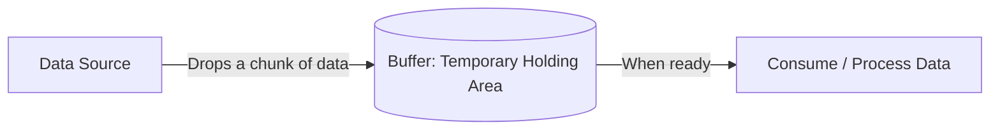
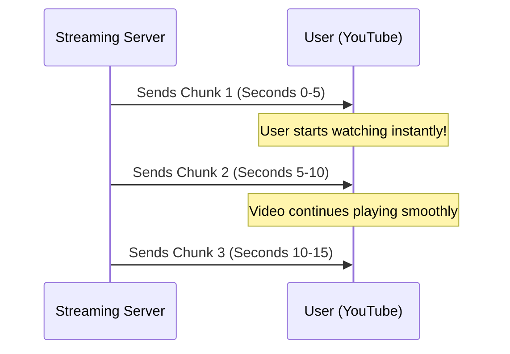

# 🍕 Stream and Buffer in Node.js: The Ultimate Beginner's Guide

When dealing with large amounts of data (like downloading a 5GB movie or reading a huge database), Node.js uses **Streams** and **Buffers** to keep your computer from crashing. Let's break down exactly how they work.

---

## Step 1: What is a Buffer?



### A. What it is
A **Buffer** is a temporary storage spot in your computer's RAM. When data is moving from one place to another, it rarely moves at the exact same speed it can be processed. A buffer catches and holds a small chunk of that data temporarily until your program is ready to process it.

### B. The Problem (Reading everything into RAM at once)
If you try to read a massive file without buffering chunks slowly, the computer attempts to load the *entire* file into the RAM all at the exact same time. If your server has 2GB of RAM and someone uploads a 5GB video, your server will instantly crash with an "Out of Memory" error.

**Problem Code:**
```javascript
// ❌ Loading the whole giant file directly into memory at once!
const fs = require('fs');

// 1. The computer tries to shove a 5GB movie into a 2GB RAM stick all at once.
// 2. 🛑 FATAL ERROR: RAM explodes, server crashes completely!
fs.readFile('heavy-5GB-movie.mp4', (err, wholeData) => {
    console.log("This will never print because the server is dead.");
});
```

### C. The Solution (Using Buffers)
Instead of loading everything at once, Node.js reads a little piece of the file, places it in a **Buffer**, processes it, and then empties the buffer to make room for the next piece. Memory usage stays extremely low and safe!

**Solution Code:**
```javascript
// ✅ Using a Buffer to read data in safe, tiny pieces
const fs = require('fs');

// 1. We create a temporary holding area (a tiny 64 Kilobyte Buffer by default)
const stream = fs.createReadStream('heavy-5GB-movie.mp4');

// 2. The file is poured into the buffer chunk by chunk.
stream.on('data', (bufferChunk) => {
    // 3. We process just this tiny piece (Buffer), then it gets destroyed.
    // The server only uses a few kilobytes of RAM to process a 5GB file!
    console.log("Received a tiny Buffer chunk of data:", bufferChunk.length, "bytes");
});
```

### D. Real-Life Analogy
💡 **The Pizza Slice in Your Hand.**
Imagine a massive 20-inch Family Pizza. 
*   **The Problem:** You cannot shove the entire 20-inch pizza directly into your mouth at the exact same time. You will choke (Server Crash / Out of Memory).
*   **The Buffer:** You cut a single **Slice** and hold that slice in your **Hand**. Your hand is the **Buffer**! It temporarily holds just enough pizza that you can safely chew right now. Once you finish that slice, your hand (Buffer) becomes empty and is ready to hold the next slice.

**Analogy Code:**
```typescript
class Person {
    mouthCapacity: number = 1; // You can only process 1 slice at a time
    handBuffer: string = "";   // This temporarily holds the slice

    eatPizzaSlowly(hugePizza: string[]) {
        // We only take one slice into the buffer at a time
        for (let slice of hugePizza) {
            this.handBuffer = slice; // 1. Put data in temporary holding area (Hand)
            console.log(`Holding ${this.handBuffer} in my hand (Buffer)...`);
            
            // 2. Process data safely
            console.log(`Chewing ${this.handBuffer} safely!`); 
            
            // 3. Buffer is now empty and ready for the next slice
            this.handBuffer = ""; 
        }
    }
}
```

---

## Step 2: What is a Stream?



### A. What it is
A **Stream** is an ongoing, continuous flow of data chunks over time. Instead of waiting for a file request to finish completely 100%, a stream starts sending the bits of data immediately, one by one, like water flowing through a pipe.

### B. The Problem (Waiting for the entire file)
If we didn't have streams, a user clicking "Play" on a 2-hour long YouTube video would have to wait for the *entire* 2-hour video file to download to their computer before the video player could start showing frame 1. The user would stare at a black screen for 10 minutes.

**Problem Code:**
```javascript
// ❌ Forced to wait for the entire data to arrive before consuming it
const database = require('mock-db');

console.log("1. User clicked Play. Waiting for 10GB file to download...");

// 2. The code sits here for 20 minutes doing nothing!
const entireVideo = database.downloadWholeFileSync("10-hour-video.mp4");

// 3. The user finally sees frame 1 after 20 minutes! They probably closed the tab.
videoPlayer.play(entireVideo); 
```

### C. The Solution (Streaming the Data)
By using Streams, the server sends the very first piece (Buffer) of the video immediately. The user's video player collects this first piece and starts playing the video *while* the rest of the chunks are still traveling over the internet! 

**Solution Code:**
```javascript
// ✅ Streaming data continuously so the user doesn't wait
const http = require('http');
const fs = require('fs');

http.createServer((req, res) => {
    console.log("1. User requested the video");
    
    // 2. We turn the video file into a continuous flowing Stream
    const videoStream = fs.createReadStream('10-hour-video.mp4');
    
    // 3. We immediately pipe (connect) the flowing video chunks directly to the user
    // The user starts watching exactly 0.5 seconds after clicking play!
    videoStream.pipe(res); 
}).listen(3000);
```

### D. Real-Life Analogy
💡 **Watching a YouTube Video Loading Bar.**
*   **Without Streams (Downloading):** You want to watch a movie. You must wait for the progress bar to go from 0% to 100%. Only at exactly 100% does the movie file open and let you watch.
*   **With Streams (Buffering & Flowing):** You go to YouTube. YouTube sends you the first 10 seconds of the video as a **Stream (Slice)**. The YouTube player holds it in its **Buffer (Hand)**. You start watching immediately. While you are watching second 5, YouTube silently sends the next 10 seconds in the background. The loading bar stays slightly ahead of the red playhead. The data is continuously streaming!

**Analogy Code:**
```typescript
class YouTubePlayer {
    playVideoStreaming() {
        console.log("▶️ User clicked Play on a 4-hour podcast!");
        
        // Emulating a continuous stream of video chunks
        setTimeout(() => console.log("📺 Chunk 1 arrived! Playing Sec 0-5 instantly!"), 1000);
        
        // While user is watching Chunk 1, the next chunk is streaming in!
        setTimeout(() => console.log("⏳ Buffering... Chunk 2 arrived in background."), 3000);
        setTimeout(() => console.log("📺 Playing Sec 5-10 seamlessly!"), 5000);
        
        setTimeout(() => console.log("⏳ Buffering... Chunk 3 arrived in background."), 7000);
        setTimeout(() => console.log("📺 Playing Sec 10-15 seamlessly!"), 9000);
    }
}

const player = new YouTubePlayer();
player.playVideoStreaming();
```