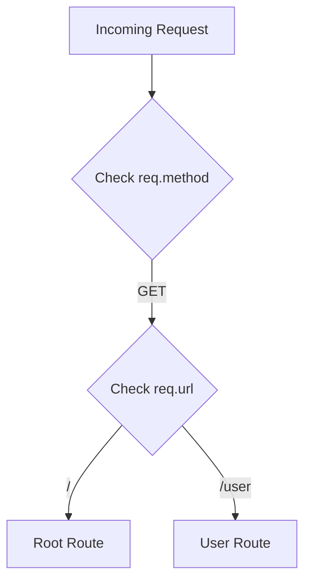
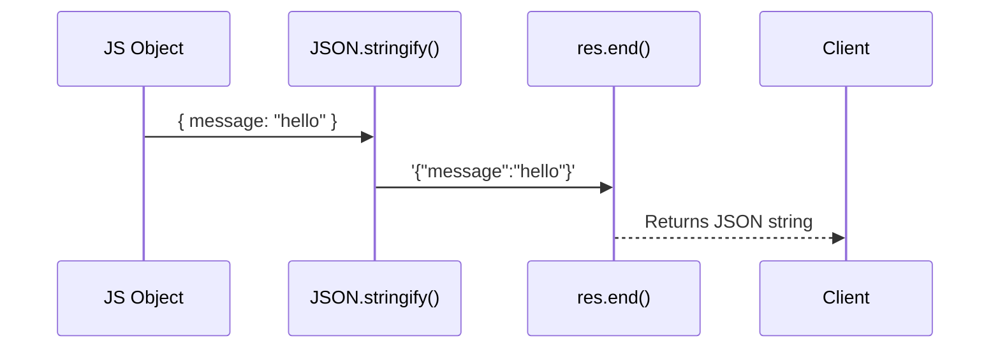
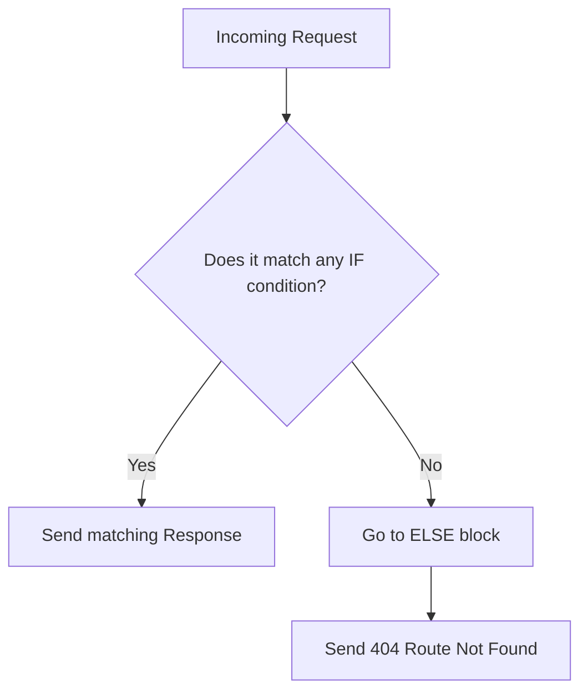

# 🌐 6-2: Route Handling, Request & Response

এই ডকুমেন্টে আমরা শিখব কীভাবে Node.js সার্ভারে রিকোয়েস্ট (`req`) থেকে URL এবং HTTP Method বের করে বিভিন্ন রাউট হ্যান্ডল করতে হয় এবং ক্লায়েন্টকে কীভাবে রেসপন্স (`res`) পাঠাতে হয়।

---

## 🛤️ Step 1: Basic Routing (`req.url` & `req.method`)



### A. What it is
রাউটিং হলো ক্লায়েন্টের রিকোয়েস্টের URL (লિંক) এবং HTTP Method (যেমন GET, POST) অনুযায়ী সার্ভারে আলাদা আলাদা কাজ করা। `req.url` দিয়ে আমরা লিংকের শেষের অংশটুকু জানতে পারি এবং `req.method` দিয়ে রিকোয়েস্টের ধরন বুঝতে পারি।

### B. The Problem (With Problem Code)
যদি আমরা URL বা Method চেক না করি, তাহলে ক্লায়েন্ট যে লিংকেই যাক না কেন, সার্ভার সবসময় একই কাজ করবে বা একই জিনিস দেখাবে।

```typescript
// ❌ Problem Code: No Routing Logic
const server = createServer((req, res) => {
    // If the user goes to "/", "/user", or "/product"
    // They will ALWAYS get the exact same response!
    console.log("Someone hit the server!");
});
```

### C. The Solution (With User's EXACT Code)
আমরা `req.url` এবং `req.method` ভেরিয়েবলে সেভ করে `if...else if` কন্ডিশন ব্যবহার করে বিভিন্ন রাউটের জন্য আলাদা লজিক লিখতে পারি।

```typescript
// ✅ Solution Code: Routing based on URL and Method
import { createServer, IncomingMessage, ServerResponse, Server } from "node:http";

const server: Server = createServer((req: IncomingMessage, res: ServerResponse) => {
    const url = req.url;
    const method = req.method;

    if (url === "/" && method === "GET") {
        console.log("this is root");
        res.writeHead(200, { "Content-Type": "text/plain" });
        res.write("Welcome to the root route");
        res.end();
    } else if (url === "/user" && method === "GET") {
        console.log("this is user");
    }
});
```

### D. Real-Life Analogy (With Analogy Code)
💡 **Analogy:** **রেস্টুরেন্টের ওয়েটার (Restaurant Waiter)**
একজন ওয়েটারের কাছে কাস্টমাররা বিভিন্ন রিকোয়েস্ট (Method) এবং আইটেমের নাম (URL) নিয়ে আসে। ওয়েটার কাস্টমারের রিকোয়েস্ট অনুযায়ী আলাদা খাবার সার্ভ করেন।

```typescript
// ✅ Analogy Code
class Waiter {
    takeOrder(action: string, item: string) {
        if (action === "ORDER" && item === "Burger") {
            return "Serving Burger 🍔";
        } else if (action === "ORDER" && item === "Pizza") {
            return "Serving Pizza 🍕";
        }
        return "Not available";
    }
}
const myWaiter = new Waiter();
console.log(myWaiter.takeOrder("ORDER", "Burger"));
```

---

## 📦 Step 2: Sending JSON Response (`JSON.stringify`)



### A. What it is
ব্রাউজার বা ক্লায়েন্ট ডাটা রিসিভ করার সময় প্লেইন টেক্সট বা স্ট্রিং হিসেবে তা এক্সপেক্ট করে। যখন আমরা কোনো জাভাস্ক্রিপ্ট অবজেক্ট বা JSON পাঠাতে চাই, তখন `Content-Type` পাল্টে `application/json` করতে হয় এবং অবজেক্টটিকে স্ট্রিংয়ে কনভার্ট করতে হয়।

### B. The Problem (With Problem Code)
`res.end()` মেথড সরাসরি কোনো জাভাস্ক্রিপ্ট অবজেক্ট গ্রহণ করতে পারে না। সরাসরি অবজেক্ট দিলে সার্ভার ক্র্যাশ করবে বা এরর দিবে।

```typescript
// ❌ Problem Code: Trying to send raw object
} else if (url === "/product" && method === "GET") {
    res.writeHead(200, { "Content-Type": "application/json" });
    
    // ERROR: Expected a string or Buffer, but got an Object!
    res.end({ message: "hello this is product route" }); 
}
```

### C. The Solution (With User's EXACT Code)
অবজেক্টকে টেক্সট বা স্ট্রিংয়ে কনভার্ট করার জন্য আমরা `JSON.stringify()` ব্যবহার করি এবং তারপর সেটি `res.end()`-এ পাস করি।

```typescript
// ✅ Solution Code: Using JSON.stringify
} else if (url === "/product" && method === "GET") {
    console.log("this is product");
    res.writeHead(200, { "Content-Type": "application/json" });
    
    // We convert the object to a string using JSON.stringify() method
    res.end(JSON.stringify({ message: "hello this is product route" }));
}
```

### D. Real-Life Analogy (With Analogy Code)
💡 **Analogy:** **চিঠি পাঠানো (Mailing a Thought)**
আপনার মাথায় একটি আইডিয়া বা চিন্তা (JavaScript Object) আছে। আপনি সেটি সরাসরি ডাকবক্সে ফেলতে পারবেন না। আপনাকে সেটি একটি কাগজে লিখে শব্দে রূপান্তর (JSON.stringify) করে তারপর পোস্ট (res.end) করতে হবে।

```typescript
// ✅ Analogy Code
class PostOffice {
    sendMail(content: string) {
        return `Mail sent: ${content}`;
    }
}

const ideaObject = { thought: "Happy Birthday!" };
// Cannot send ideaObject directly, must be stringified!
const writtenLetter = JSON.stringify(ideaObject);

const post = new PostOffice();
post.sendMail(writtenLetter);
```

---

## 🔗 Step 3: Dynamic Routes (`startsWith()` & `split()`)

```mermaid
flowchart LR
    A[URL: /product/12] --> B{startsWith('/product/')}
    B -->|Yes| C[split('/')]
    C --> D["['', 'product', '12']"]
    D --> E[Index 2 is productId '12']
```

### A. What it is
প্রায়ই আমাদের ডায়নামিক রাউটের প্রয়োজন হয় (যেমন `/product/1`, `/product/2`)। এগুলো একের পর এক `if-else` দিয়ে লেখা সম্ভব নয়। তাই আমরা `startsWith()` দিয়ে চেক করি এবং `split()` দিয়ে মূল আইডিটুকু (ID) বের করে আনি।

### B. The Problem (With Problem Code)
যদি আমরা স্ট্যাটিক বা হার্ডকোডেড পাথ ব্যবহার করি, তাহলে হাজার হাজার প্রডাক্টের জন্য হাজার হাজার `if` কন্ডিশন লিখতে হবে, যা ইম্পসিবল।

```typescript
// ❌ Problem Code: Hardcoding every single dynamic route
if (url === "/product/1") { /* send product 1 */ }
else if (url === "/product/2") { /* send product 2 */ }
else if (url === "/product/3") { /* send product 3 */ }
// We can't do this forever!
```

### C. The Solution (With User's EXACT Code)
আমরা `startsWith("/product/")` দিয়ে প্রথম অংশ চেক করি এবং `url.split("/")[2]` ব্যবহার করে প্রডাক্টের আইডিটি ডাইনামিক্যালি বের করে নিই।

```typescript
// ✅ Solution Code: Handling Dynamic Routes
} else if(url?.startsWith("/product/") && method === "GET"){
    // We use startsWith() to handle dynamic routes like /product/1
    
    // We use split() method to split the url and get the product id
    const productId = url.split("/")[2]; 
    
    console.log(`this is product with id ${productId}`);
    res.writeHead(200, { "Content-Type": "application/json" });
    res.end(JSON.stringify({ message: `hello this is product with id ${productId}` }));
}
```

### D. Real-Life Analogy (With Analogy Code)
💡 **Analogy:** **পোস্টকোড এরিয়া ট্র্যাকিং (Zip Code Sorting)**
ধরুন আপনি কুরিয়ার সার্ভিসে কাজ করেন। হাজার হাজার বাসার ঠিকানা মুখস্থ রাখার বদলে আপনি শুধু চেক করেন চিঠিটি "বনানী" (startsWith) এরিয়া দিয়ে শুরু কি না। এরপর আপনি হাইফেনের পরের বাসা নম্বর (split) দেখে ডেলিভারি করেন।

```typescript
// ✅ Analogy Code
class CourierService {
    deliverPackage(address: string) {
        // address example: "Banani-House45"
        if (address.startsWith("Banani-")) {
            const houseNumber = address.split("-")[1];
            return `Delivered to Banani, House ID: ${houseNumber}`;
        }
    }
}
const courier = new CourierService();
console.log(courier.deliverPackage("Banani-House45"));
```

---

## 🚫 Step 4: Fallback Route (404 Not Found)



### A. What it is
যদি কোনো ইউজার এমন একটি লিংকে যায় যার কোড আমরা লিখিনি (যেমন `/xyz`), তখন সার্ভারের একটি ডিফল্ট এরর মেসেজ বা 404 স্ট্যাটাস কোড পাঠানো উচিত।

### B. The Problem (With Problem Code)
ডিফল্ট বা `else` ব্লক না দিলে আননোন লিংকে গেলে সার্ভার কোনো রেসপন্সই দিবে না। ব্রাউজার শুধু ঘুরতেই থাকবে এবং সার্ভার ক্র্যাশ করতে পারে।

```typescript
// ❌ Problem Code: No fallback logic
if (url === "/") { res.end("Root"); }
else if (url === "/user") { res.end("User"); }
// What happens if url is "/abcd"? The browser hangs forever!
```

### C. The Solution (With User's EXACT Code)
সবগুলো `if-else if` শেষে একটি `else` ব্লক রাখতে হবে, যেখানে আমরা `404` স্ট্যাটাস কোড (মানে Not Found) সেট করে রেসপন্স এন্ড করে দিব।

```typescript
// ✅ Solution Code: Fallback handling
} else {
    res.writeHead(404, { "Content-Type": "text/plain" });
    res.write("Route not found");
    res.end();
}
```

### D. Real-Life Analogy (With Analogy Code)
💡 **Analogy:** **রঙ নম্বর হেল্পলাইন (Wrong Number Service)**
আপনি কাস্টমার কেয়ারে কল করে ১, ২, এবং ৩ চাপলে বিভিন্ন সার্ভিস পান। যদি আপনি ৯ চাপেন, তবে মেশিন চুপ হয়ে যায় না। সে একটি ডিফল্ট ভয়েস শোনায় "আপনি ভুল নাম্বার ডায়াল করেছেন" (404 Not Found)।

```typescript
// ✅ Analogy Code
class CustomerCare {
    pressButton(btn: number) {
        if (btn === 1) return "Balance info";
        else if (btn === 2) return "Offers";
        else {
            // Equivalent to 404
            return "Invalid Option. Please try again."; 
        }
    }
}
const bot = new CustomerCare();
console.log(bot.pressButton(9));
```
