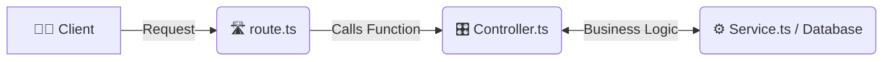

# 🏢 6-3: Modular Server Architecture (Route, Controller, Service)

এই ডকুমেন্টে আমরা শিখব কীভাবে একটি বড় প্রজেক্টকে সুন্দরভাবে ফোল্ডারে ফোল্ডারে ভাগ (Modularize) করতে হয়, যাতে `server.ts` ফাইলটি হিজিবিজি না হয়ে যায়। 

আপনার দেওয়া ইমেজ ও কোড অনুযায়ী আর্কিটেকচারটি ঠিক এরকম:
`Client ➔ route.ts ➔ Controller.ts ⮂ Service.ts`

---

## 📂 Step 1: Separation of Concerns (ফোল্ডার স্ট্রাকচার)



### A. What it is
সব কোড এক ফাইলে না লিখে কাজের ধরন অনুযায়ী কোডকে বিভিন্ন ফাইল ও ফোল্ডারে ভাগ করাকে Modular Architecture বা Separation of Concerns বলে। এখানে ৩টি মূল অংশ থাকে:
1. **Routes (`routes.ts`)**: শুধু চেক করবে ইউজার কোন লিংকে (URL) হিট করেছে এবং তাকে কোন কন্ট্রোলারের কাছে পাঠাতে হবে। 
2. **Controllers (`product.controller.ts`)**: ইউজারের রিকোয়েস্ট রিসিভ করবে, ডাটা ঠিক আছে কি না দেখবে এবং রেসপন্স (`res.end()`) পাঠাবে।
3. **Services / Database**: আসল বিজনেস লজিক বা ডাটাবেসের কাজগুলো করবে (যেমন আপনার `db.json`)।

### B. The Problem (With Problem Code)
পুরো রাউটিং, ডাটাবেস লজিক এবং রেসপন্স যদি শুধু `server.ts` ফাইলে লেখা হয়, তবে প্রজেক্ট বড় হলে ফাইলটিতে হাজার হাজার লাইন কোড হয়ে যাবে (যাকে স্প্যাগেটি কোড বলা হয়)। এটি মেইনটেইন করা অসম্ভব।

```typescript
// ❌ Problem Code: Spaghetti Code inside server.ts
import { createServer } from "node:http";

const server = createServer((req, res) => {
    if (req.url === "/product") {
        // 1. Routing checking...
        // 2. Database logic writing here...
        // 3. Error handling here...
        // 4. Response sending here...
        // VERY MESSY & HARD TO READ!
    }
});
```

### C. The Solution (With User's EXACT Code)
আপনি `src` ফোল্ডারের ভেতর আলাদা আলাদা ফোল্ডার তৈরি করেছেন:

**Your Structure:**
```bash
src/
 ├── routes/
 │    └── routes.ts                # Directs traffic based on URL
 ├── controller/
 │    └── product.controller.ts    # Handles the response logic
 ├── Database/
 │    └── db.json                  # Acts as the dummy database
 └── server.ts                     # Just starts the server
```
এইভাবে কাজ ভাগ করে দেওয়ার ফলে কোনো এক জায়গায় মডিফাই করতে হলে বাকি কোডগুলো নিয়ে চিন্তা করতে হয় না। একে অপরের ওপর নির্ভরশীলতা কমে যায়।

### D. Real-Life Analogy (With Analogy Code)
💡 **Analogy:** **একটি গোছানো রেস্টুরেন্ট (A Well-Organized Restaurant)**
- **Client (Customer):** কাস্টমার এসে খাবার অর্ডার দেয়।
- **Route (Waiter):** ওয়েটার (routes.ts) শুধু অর্ডার নেয় এবং ম্যানেজারকে জানায় কোন টেবিল থেকে অর্ডার এসেছে। সে নিজে রাঁধে না।
- **Controller (Manager):** ম্যানেজার (controller.ts) চেক করে সব ঠিক আছে কি না এবং শেফ/ডাটাবেসকে রান্না করতে বলে। শেষে কাস্টমারকে খাবার সার্ভ করে।
- **Database/Service (Chef):** শেফ (db.json/Service) শুধু খাবার প্রস্তুত করে (আসল ডাটা দেয়)।

```typescript
// ✅ Analogy Code (Super Simple Version)

// 1. Database/Service (Chef): শুধু ডেটা বা খাবার রিটার্ন করবে
const chef_database = () => {
    return "🍔 Delicious Burger Data";
};

// 2. Controller (Manager): ডেটাবেস থেকে পাওয়া ডেটা প্রসেস করে রেসপন্স তৈরি করবে
const manager_controller = () => {
    const data = chef_database();
    return `Sending ${data} to customer (res.end)`;
};

// 3. Route (Waiter): ইউজার কোন URL-এ অর্ডার করেছে সেটা চেক করে কন্ট্রোলারকে ডাকবে
const waiter_route = (url: string) => {
    if (url === "/order") {
        return manager_controller(); // Pass to controller
    }
};

// Execution / Test (কাস্টমার অর্ডার দিল)
console.log(waiter_route("/order"));
```
