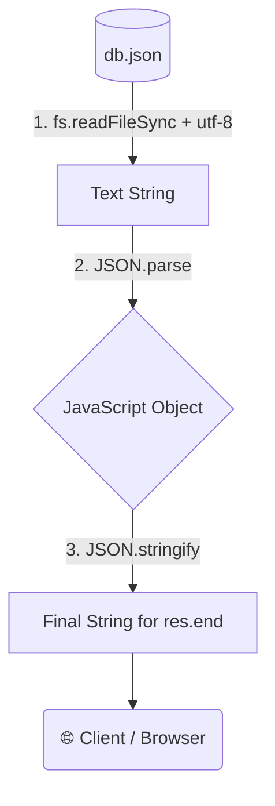

# 📁 6-4: Reading Files with `fs` Module & JSON Parsing

এই ডকুমেন্টে আমরা শিখব কীভাবে `node:fs` (File System) মডিউল ব্যবহার করে সার্ভারে রাখা ফাইল রিড করতে হয় এবং কেন ডেটা আদান-প্রদানের সময় `JSON.stringify()` ও `JSON.parse()` ব্যবহার করা এতটা জরুরি।

---

## 🗺️ System Flow (ফ্লো-চার্ট)



---

## 📂 Concept 1: Reading Files with `fs` Module 

### 1. What it is
Node.js-এ লোকাল ফাইল (যেমন: `db.json`) পড়ার জন্য `node:fs` মডিউল ব্যবহার করা হয়। এর ভেতরের `readFileSync()` মেথডটি ফাইলের ভেতরের জিনিসপত্র পড়ে নিয়ে আসে। এর ভেতর `"utf-8"` এনকোডিং ব্যবহার করা হয় যাতে ফাইলের লেখাগুলো অদ্ভুত মেশিন কোড (Buffer) এর বদলে মানুষের পড়ার মতো String বা টেক্সট হিসেবে আসে। 

### 2. The Problem (With Problem Code)
যদি আমরা `"utf-8"` ব্যবহার না করে ডিরেক্ট ফাইল রিড করি, তবে নোড.জেএস একটি `Buffer` রিটার্ন করবে, যা ক্লায়েন্ট বা আমাদের কোডটি সহজে বুঝতে পারবে না। 

```typescript
// ❌ Problem Code: Without "utf-8" encoding
import fs from "node:fs";

const rawData = fs.readFileSync(filePath);
console.log(rawData); // Output: <Buffer 7b 0a 20 20 22 70 72 6f 64 75 63 74 73 22 3a ...> (মানুষের পড়ার অযোগ্য)
```

### 3. The Solution (With User's EXACT Code)
আপনি `product.service.ts`-এ খুব সুন্দরভাবে `fs.readFileSync` এবং `"utf-8"` ব্যবহার করেছেন:

```typescript
// ✅ Solution Code: User's Exact Code (product.service.ts)
import path from "node:path";
import fs from "node:fs";

const filePath = path.join(process.cwd(), "./src/Database/db.json");

export const readProduct = () => {
    //filesytem module is used to read and write files in node.js
    //we can use fs module to read the file and log its content to the console
    const products = fs.readFileSync(filePath, "utf-8");
    
    //UTF-8 is used to read the file as a string instead of a buffer
    //Means that we want to read the file as a string instead of a buffer
    return products;
}
```

### 4. Real-Life Analogy (With Analogy Code)
💡 **Analogy:** **বিদেশি ভাষার চিঠি পড়া (Reading a Foreign Letter)**
ধরুন আপনার কাছে চায়নিজ ভাষায় লেখা একটা চিঠি আসলো (Buffer)। আপনি কিছুই বুঝবেন না। আপনার দরকার একজন অনুবাদক ("utf-8"), যে আপনার নিজের ভাষায় (String) চিঠিটা পড়ে শোনাবে। 

```typescript
// ✅ Analogy Code
const getLetter = (needsTranslator: boolean) => {
    if (needsTranslator === true) {
        return "Hey, welcome to Node.js!"; // utf-8 applied (String)
    } else {
        return "01001000 01100101 01111001"; // No utf-8 (Buffer/Machine Code)
    }
};

// Translator ইউজ করলে আমরা পড়তে পারবো!
console.log(getLetter(true)); 
```

---

## 🔀 Concept 2: Why we need `JSON.parse` and `JSON.stringify`

### 1. What it is
* **`JSON.parse()`**: একটি 'String' (টেক্সট) কে রিয়েল JavaScript Object-এ রূপান্তর করে। 
* **`JSON.stringify()`**: একটি JavaScript Object-কে 'String'-এ রূপান্তর করে। 

### 2. The Problem (With Problem Code)
আমাদের `fs.readFileSync` দিয়ে আনা ফাইলটি হলো একটি **String**। এই String-কে ডিরেক্ট ক্লায়েন্টের কাছে পাঠালে ক্লায়েন্ট এর ভেতরের প্রপার্টি (যেমন: `data.name`, `data.price`) অ্যাক্সেস করতে পারবে না। 
অন্যদিকে, `res.end()` শুধুমাত্র String বা Buffer গ্রহণ করে। আমরা চাইলে সরাসরি Object পাঠাতে পারবো না, কারণ ইন্টারনেটে ডেটা শুধুমাত্র Text ফরম্যাটেই যাতায়াত করতে পারে।

```typescript
// ❌ Problem Code: Wrong Data Types
const stringData = "{ 'price': 100 }";
console.log(stringData.price); // ERROR! String থেকে সরাসরি value পাওয়া যায় না।

const objData = { price: 100 };
res.end(objData); // ERROR! res.end() এর ভেতর Object দেওয়া যায় না, String দিতে হয়। 
```

### 3. The Solution (With User's EXACT Code)
আপনার `product.controller.ts` ফাইলে আপনি প্রথমে `JSON.parse(product)` করে ডাটাকে Object বানিয়েছেন, যেন সেটা আপনার রেসপন্স Object-এ ঠিকভাবে বসে। এরপর পুরো জিনিসটাকে ইন্টারনেটে পাঠানোর উপযুক্ত করতে `JSON.stringify` ব্যবহার করেছেন:

```typescript
// ✅ Solution Code: User's Exact Code (product.controller.ts)
const product = readProduct(); // This is a STRING from fs.readFileSync

res.end(
    JSON.stringify({
        message: `hello this is product with id ${productId}`,
        //if we not parse the product data to JSON, it will be sent as a string... 
        //So we need to parse the product data to JSON before sending it...
        
        data: JSON.parse(product), // 1️⃣ PARSE: String কে Object বানাচ্ছি 
    }), // 2️⃣ STRINGIFY: পুরো Object-কে String বানিয়ে ক্লায়েন্টকে পাঠাচ্ছি 
);
```

### 4. Real-Life Analogy (With Analogy Code)
💡 **Analogy:** **কুরিয়ারে ল্যাপটপ পাঠানো (Shipping a Laptop)**
* **`JSON.stringify()`:** একটি খোলা ল্যাপটপকে (Object) ডাকযোগে পাঠানোর জন্য শক্ত কার্ডবোর্ডের বক্সে টেপ দিয়ে প্যাক করা (String)। কারণ খোলা ল্যাপটপ কুরিয়ারে পাঠানো যায় না (Internet needs strings)।
* **`JSON.parse()`:** ডেলিভারি পাওয়ার পর কার্ডবোর্ডের বক্সটা (String) কাঁচি দিয়ে কেটে ভেতরে থাকা আসল ল্যাপটপটি (Object) বের করে আনা, যাতে সেটা ব্যবহার করা যায়!

```typescript
// ✅ Analogy Code
// পার্সেল প্যাকিং (Stringify)
const laptop = { brand: "MacBook", price: 150000 };
const boxedLaptop = JSON.stringify(laptop); // Now it's a boxed string, ready to ship over internet

// আনপ্যাকিং (Parse)
const receivedBox = '{"brand":"MacBook","price":150000}';
const usableLaptop = JSON.parse(receivedBox); // Now it's an object again
console.log(`Using my new ${usableLaptop.brand} laptop!`); // We can access properties!
```
