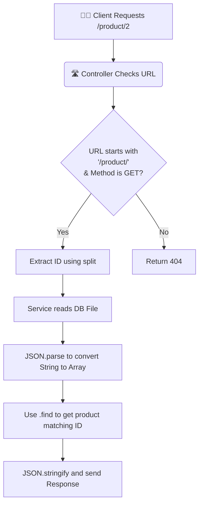

# 📡 6-5: Building GET Method (Single Product specific ID handling)

এই ডকুমেন্টে আমরা শিখবো কীভাবে একটি ডায়নামিক URL (যেমন: `/product/1` বা `/product/2`) থেকে ID বের করে, ডাটাবেস থেকে শুধু সেই নির্দিষ্ট প্রোডাক্টটি খুঁজে বের করে ক্লায়েন্টকে সার্ভ করতে হয়।

---

## 🗺️ System Flow (ফ্লো-চার্ট)



---

## 📝 Documenting the Code Learnings

### 1. What it is
GET Method ব্যবহার করে স্পেসিফিক কোনো ডাটা (যেমন: ১ বা ২ নাম্বার প্রোডাক্ট) আনাকে Dynamic Routing বা URL Parameter হ্যান্ডলিং বলে। এখানে আমরা URL-কে ভেঙে এর ভেতর থেকে নম্বরটি খুঁজে বের করি এবং সেই অনুযায়ী আমাদের ডাটাবেস থেকে সঠিক জিনিসটি রিটার্ন করি।

### 2. The Problem (With Problem Code)
যদি আমরা ডাইনামিক URL হ্যান্ডেল করতে না জানি, তবে প্রতিটি প্রোডাক্টের জন্য আমাদের আলাদা আলাদা `if` কন্ডিশন লিখতে হবে। যেটা আসলে অসম্ভব। 

```typescript
// ❌ Problem Code: Hardcoding every single route
if (url === "/product/1") {
   // send product 1
}
if (url === "/product/2") {
   // send product 2
}
// This will take thousands of lines for 1000 products! 
```

### 3. The Solution (With User's EXACT Code)
আপনার তৈরি করা `product.controller.ts` ফাইলে আপনি ৩টি খুব গুরুত্বপূর্ণ মেথড (`startsWith`, `split`, এবং `find`) ব্যবহার করে সমস্যাটির চমৎকার সমাধান করেছেন। 

```typescript
// ✅ Solution Code: User's Exact Code (product.controller.ts)

// 1. Dynamic Check: startsWith() ব্যবহার করে চেক করছি যে URL-এর শুরুতে "/product/" আছে কি না
if (url?.startsWith("/product/") && method === "GET") {
    
    // 2. ID Extraction: split() দিয়ে URL-কে স্লাইস করছি ID বের করার জন্য (/product/2 -> ["", "product", "2"])
    const productId = url.split("/")[2]; 
    console.log(`this is product with id ${productId}`);

    const product = readProduct(); // Getting the string from our service

    // 3. Parsing: String থেকে Array তে কনভার্ট করছি
    const parsedProducts = JSON.parse(product);

    // 4. Searching: find() মেথড ব্যবহার করে আমাদের কাঙ্ক্ষিত প্রোডাক্টটি খুঁজছি
    const singleProduct = parsedProducts.find(
      (p: IProduct) => p.id === parseInt(productId?.toString() || "0"),
    );

    if (!singleProduct) {
      res.writeHead(404, { "Content-Type": "application/json" });
      res.end(JSON.stringify({ message: `Product with id ${productId} not found` }));
      return;
    }

    // 5. Success Response
    res.writeHead(200, { "Content-Type": "application/json" });
    res.end(
      JSON.stringify({
        message: `hello this is product with id ${productId}`,
        data: singleProduct, 
      }),
    );
}
```

### 4. Real-Life Analogy (With Analogy Code)
💡 **Analogy:** **লাইব্রেরিয়ান এবং বই খোঁজা (The Librarian)**
- আপনি লাইব্রেরিয়ানের কাছে গিয়ে বললেন: "আমাকে হ্যারি পটার সিরিজের ২ নম্বর বইটি দিন।" (`/book/2`)
- লাইব্রেরিয়ান চেক করে দেখলেন আপনি সত্যিই বই চাচ্ছেন কিনা (`startsWith('/book/')`)।
- সে আপনার কথাটা ভেঙে শুধু '২' নাম্বারটা মাথায় নিল (`split('/')`)।
- এরপর সে তার পুরো আলমারি (Array) খুঁজলো (`find()`) যে ২ নাম্বার বইটি কোথায় আছে। 
- পেলে আপনাকে দিয়ে দিলো (`res.end(book)`), না পেলে বললো "বইটি নেই" (`404`)।

```typescript
// ✅ Analogy Code 

// Library data (Like our db.json parsed)
const libraryBooks = [
    { id: 1, title: "Harry Potter 1" },
    { id: 2, title: "Harry Potter 2" }
];

const askLibrarian = (request: string) => {
    // 1. URL pattern check
    if (request.startsWith("/book/")) {
        // 2. Split request to get the ID
        const requestedId = parseInt(request.split("/")[2]); 
        
        // 3. Find the exact book using Array.find()
        const foundBook = libraryBooks.find(b => b.id === requestedId);
        
        if (foundBook) {
            return `Librarian says: Here is your book - ${foundBook.title}`;
        } else {
            return "Librarian says: 404 Book Not Found!";
        }
    }
};

// Execution / Test
console.log(askLibrarian("/book/2")); // Outputs: Here is your book - Harry Potter 2
console.log(askLibrarian("/book/5")); // Outputs: 404 Book Not Found!
```

---

## 🏷️ Concept 2: Type Safety using `types` folder

### 1. What it is
TypeScript-এ প্রজেক্ট বড় হলে বিভিন্ন Object (যেমন: Product, User) এর ডাটা স্ট্রাকচার আগে থেকেই বলে দিতে হয়। এগুলোকে আলাদা একটি ফোল্ডারে (যেমন: `types`) সংরক্ষণ করাকে Type Declaration বা Interface Separation বলে। এতে করে কোড মেইনটেইন করা সহজ হয় এবং ভুল কম হয়।

### 2. The Problem (With Problem Code)
আমরা যদি Type ডিক্লেয়ার না করি, তবে TypeScript জানবে না `p` (Product) এর ভেতর কী কী প্রপার্টি আছে (`id`, `name`, `price`)। ফলে টাইপ করতে গিয়ে ভুলের কারণে `p.idd` লিখলেও কোড এডিটর কোনো এরর ধরবে না।

```typescript
// ❌ Problem Code: Missing Type Safety
const singleProduct = parsedProducts.find((p: any) => p.idd === 2); // 'idd' is a typo, but TS won't catch it!
```

### 3. The Solution (With User's EXACT Code)
আপনি `src/types/product.types.ts` ফাইলে খুব সুন্দর ভাবে `IProduct` ইন্টারফেস তৈরি করে টাইপগুলো ডিক্লেয়ার করেছেন এবং সেটি কন্ট্রোলারে `(p: IProduct)` হিসেবে ইম্পোর্ট করে ব্যবহার করেছেন:

```typescript
// ✅ Solution Code: User's Exact Code (product.types.ts)
export interface IProduct {
    id: number;
    name: string;
    price: number;
}

// User's Usage in Controller (product.controller.ts):
import type { IProduct } from "../types/product.types"; // Importing the type

// TypeScript এখন জানে 'p' এর ভেতর 'id', 'name', 'price' আছে।
const singleProduct = parsedProducts.find(
    (p: IProduct) => p.id === parseInt(productId?.toString() || "0"),
);
```

### 4. Real-Life Analogy (With Analogy Code)
💡 **Analogy:** **পুতুল বানানোর ছাঁচ (The Mold/Blueprint)**
- **বিনা টাইপে কাজ করা:** ধরুন আপনি একটা কারখানায় পুতুল বানাচ্ছেন তবে কোনো ছাঁচ নেই, প্রতিবার পুতুলের হাত-পা ছোট বড় হয়ে যেতে পারে (ভুল হওয়ার সম্ভাবনা থাকে)।
- **Interface/Type:** এটা হলো পুতুল বানানোর একটি নির্দিষ্ট **ছাঁচ (Mold/Blueprint)**। এই ছাঁচ ব্যবহার করলে সব পুতুল ঠিক একই মাপের ও ডিজাইনের হবে। যদি কোনো কারিগর ছাঁচের বাইরে কিছু বানায়, তবে সাথে সাথেই ধরা পড়বে (TypeScript Error দিবে)।

```typescript
// ✅ Analogy Code

// 1. The Blueprint (Mold)
interface IDoll {
    color: string;
    size: number;
}

// 2. Factory making dolls using the blueprint
const makeDoll = (doll: IDoll) => {
    return `Made a ${doll.color} doll of size ${doll.size}`;
};

// Checking Type Safety
makeDoll({ color: "Red", size: 10 }); // ✅ Works perfectly (Matches Mold)
// makeDoll({ colr: "Blue", sise: 10 }); // ❌ error: 'colr' does not exist in type 'IDoll' (Caught exactly!)
```
