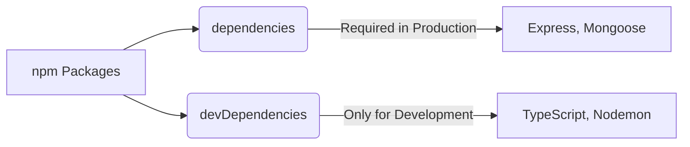
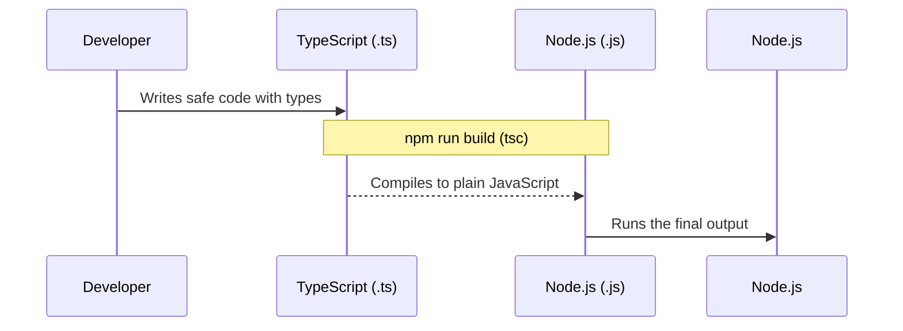
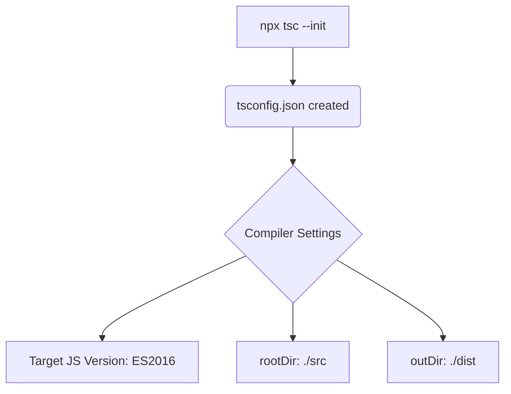
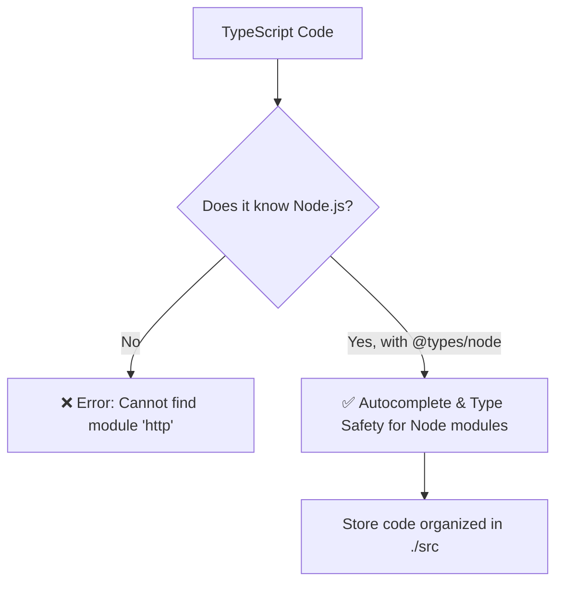
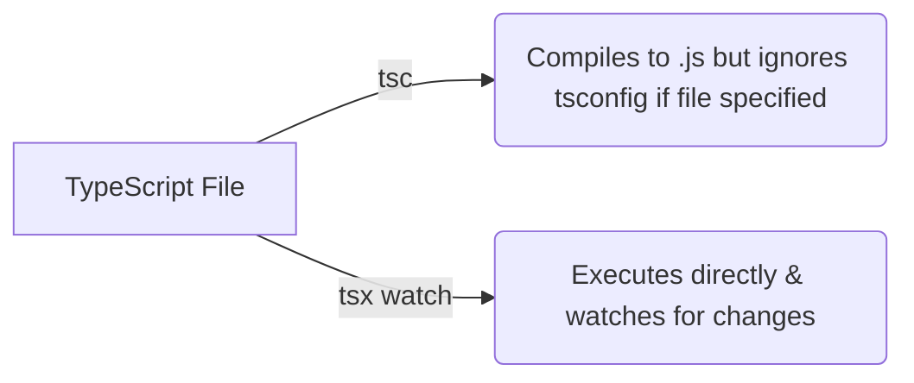
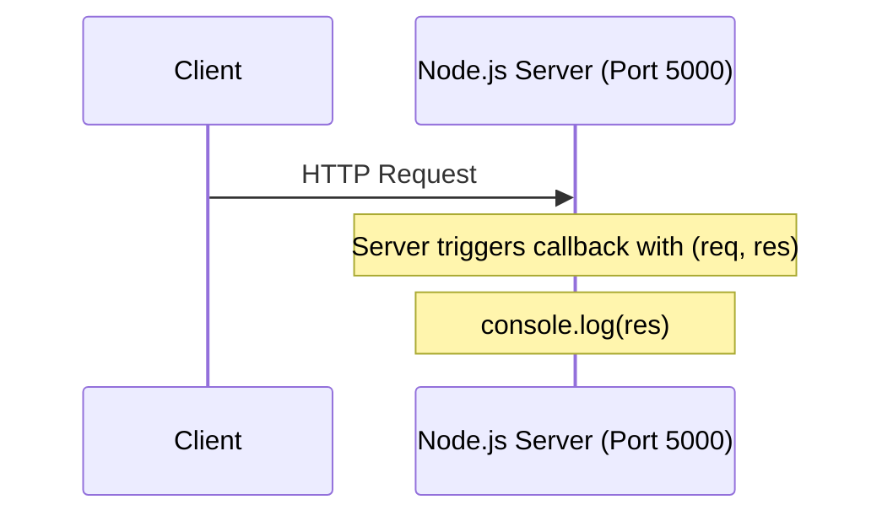

# 📦 Node.js Project Setup & Dependencies Guide

এই ডকুমেন্টে আমরা `package.json`-এর কিছু গুরুত্বপূর্ণ কনসেপ্ট এবং প্রোজেক্টে TypeScript-এর ব্যবহার নিয়ে আলোচনা করব।

## 🏗️ Step 1: Module System (`type: "commonjs"`)

```mermaid
flowchart TD
    A[JavaScript Module Systems]
    A --> B(CommonJS)
    A --> C(ES Modules)
    B -->|require() / module.exports| D[Default in Node.js]
    C -->|import / export| E[Modern Standard]
```

### A. What it is
`package.json`-এ `"type": "commonjs"` দিয়ে বোঝানো হয় যে এই প্রোজেক্টটি CommonJS মডিউল সিস্টেম ব্যবহার করবে, যা Node.js-এর ডিফল্ট সিস্টেম। এখানে `require()` দিয়ে ফাইল ইমপোর্ট করা হয়।

### B. The Problem (With Problem Code)
পুরোনো জাভাস্ক্রিপ্ট প্রোজেক্টে সবকিছু গ্লোবাল ভ্যারিয়েবল হিসেবে থাকত, যার ফলে একই নামের ভ্যারিয়েবল থাকলে কনফ্লিক্ট বা এরর হতো।

```javascript
// ❌ Problem Code: Without Module System
// File 1
var taxRate = 0.5;

// File 2
var taxRate = 1.2; // Overwrites the first one!
```

### C. The Solution (With User's EXACT Code)
CommonJS (বা ES Modules) কোডকে আলাদা আলাদা ফাইলে ভাগ করে এবং প্রাইভেট রাখে।

```json
// ✅ Solution Code: package.json
{
  "name": "module-06-nodejs-server",
  "version": "1.0.0",
  "type": "commonjs", 
  "main": "index.js"
}
```

### D. Real-Life Analogy (With Analogy Code)
💡 **Analogy:** **টিফিন বক্সের আলাদা খোপ (Tiffin Box Compartments)**
ধরুন আপনার টিফিন বক্সে ভাত আর তরকারি রাখা আছে। যদি খোপ না থাকে, সবকিছু মিশে একাকার হয়ে যাবে (Global State)। আর খোপ থাকলে (Module System), সবকিছু সুন্দরভাবে আলাদা থাকে।

```javascript
// ✅ Analogy Code
const TiffinBoxOne = { food: "Rice" };
const TiffinBoxTwo = { food: "Curry" };

// Safe to mix only when needed
module.exports = { TiffinBoxOne, TiffinBoxTwo };
```

---

## 🛠️ Step 2: Dependencies vs DevDependencies



### A. What it is
* **`dependencies`**: যে প্যাকেজগুলো প্রোজেক্ট রান করার জন্য *অবশ্যই* প্রয়োজন (যেমন: React, Express)। এগুলো প্রোডাকশনেও সার্ভারে যায়।
* **`devDependencies`**: যে প্যাকেজগুলো শুধু ডেভেলপারদের কাজ সহজ করার জন্য প্রয়োজন (যেমন: TypeScript, Prettier)। এগুলো প্রোডাকশন সার্ভারে যায় না।

### B. The Problem (With Problem Code)
আপনি যদি Development-কাজের জিনিসপত্র সাধারণ `dependencies`-এ রেখে দেন, তাহলে সার্ভারে খামোখাই অপ্রয়োজনীয় ভারী ফাইল চলে যাবে।

```json
// ❌ Problem Code: Mixing everything
"dependencies": {
  "express": "^4.18.2",
  "typescript": "^5.0.0", // Why does the live server need this?
  "jest": "^29.0.0"      // Live users don't run tests!
}
```

### C. The Solution (With User's EXACT Code)
আমরা `npm install -D typescript` (বা `--save-dev`) কমান্ড দিয়ে TypeScript-কে শুধুমাত্র `devDependencies` হিসেবে সেভ করি।

```json
// ✅ Solution Code: Separated Responsibilities (package.json)
{
  "name": "module-06-nodejs-server",
  "dependencies": {
    "express": "^4.18.2" 
  },
  "devDependencies": {
    "typescript": "^5.4.5" 
  }
}
```

### D. Real-Life Analogy (With Analogy Code)
💡 **Analogy:** **বাড়ি বানানো এবং মিস্ত্রি (Building a House)**
`dependencies` হলো বাড়ির ইট, বালি, রড—যেগুলো ছাড়া বাড়ি দাঁড়াবেই না (Production)। 
আর `devDependencies` হলো মিস্ত্রির হাতুড়ি, ড্রিল মেশিন—যেগুলো বাড়ি বানাতে সাহায্য করে, কিন্তু বাড়ি তৈরি হয়ে গেলে ওগুলো মিস্ত্রি নিয়ে চলে যায় (Development only)।

```javascript
// ✅ Analogy Code
class HouseBuildingProject {
    // These stay forever (dependencies)
    materials = ["Bricks", "Cement", "Steel"];

    // These leave after coding is done (devDependencies)
    tools = ["Hammer", "Drill", "Scaffolding"];

    goToProduction() {
        return this.materials; // Leaving tools behind!
    }
}
```

---

## 🚀 Step 3: TypeScript to JavaScript Execution



### A. What it is
Node.js সরাসরি TypeScript (`.ts`) ফাইল রান করতে পারেঠি না। Node.js শুধু JavaScript বুঝে। তাই আমরা TypeScript দিয়ে কোড লিখি, তারপর সেটিকে কম্পাইল করে জাভাস্ক্রিপ্ট বানাই।

### B. The Problem (With Problem Code)
Node.js কে সরাসরি `.ts` ফাইল চালালে সে টাইপ ডিক্লেয়ারেশন বুঝতে পারবে না এবং Error দিবে।

```typescript
// ❌ Problem Code: Running typescript directly in node
// If we run `node app.ts`
const age: number = 25; 
// Node error: Unexpected token ':'
```

### C. The Solution (With User's EXACT Code)
প্রথমে আমরা কোড লিখব TS-এ। এরপর `package.json` এর স্ক্রিপ্টে আমরা `build` কমান্ড রাখব, যা `.ts` থেকে `.js`-এ কনভার্ট করবে।

```json
// ✅ Solution Code: package.json scripts
"scripts": {
  "build": "tsc",
  "start": "node dist/index.js"
}
```

### D. Real-Life Analogy (With Analogy Code)
💡 **Analogy:** **বিদেশি ক্লায়েন্টের সাথে মিটিং (Language Translator).**
আপনি শুধু বাংলা (TypeScript) বলতে পারেন, কিন্তু আপনার ক্লায়েন্ট (Node.js) শুধু ইংলিশ বোঝে। তাই মাঝে একজন অনুবাদক (Compiler - `tsc`) রাখা হয়।

```typescript
// ✅ Analogy Code
class Developer {
    speakBangla() { return "ami code likhchi (TypeScript)"; }
}

class Translator {
    compile(speech: string) {
        return "I am writing code! (JavaScript)"; // Node.js accepts this
    }
}
```


---

## ⚙️ Step 4: Initializing TypeScript (`tsconfig.json`)



### A. What it is
`npx tsc --init` কমান্ডটি রান করলে আপনার প্রোজেক্টে একটি `tsconfig.json` ফাইল তৈরি হয়। এটি হলো TypeScript কম্পাইলারের (tsc) জন্য একটি "রুলবুক" বা গাইডলাইন।

### B. The Problem (With Problem Code)
TypeScript কম্পাইলার ডিফল্টভাবে সব জায়গায় ফাইল তৈরি করে এবং রুলস ছাড়াই কাজ করে। যদি `tsconfig.json` না থাকে, তাহলে কম্পাইল করা `.js` ফাইলগুলো `.ts` ফাইলের ঠিক পাশেই হিজিবিজিভাবে তৈরি হয়ে যাবে।

```bash
# ❌ Problem Code: Without strict rules and structure
src/
 ├── index.ts
 ├── index.js    <-- Cluttering the source folder!
 ├── user.ts
 └── user.js     <-- Messy!
```

### C. The Solution (With User's EXACT Code)
`npx tsc --init` কমান্ড দিয়ে ফাইল তৈরি করে আমরা রুলস সেট করে দিই। যেমন: আমাদের মূল কোড কোথায় থাকবে (`rootDir`) এবং কম্পাইল হওয়ার পর জাভাস্ক্রিপ্ট ফাইলগুলো কোথায় যাবে (`outDir`)।

```json
// ✅ Solution Code: Inside tsconfig.json
{
  "compilerOptions": {
    "target": "es2016",
    "rootDir": "./src",   /* Original .ts files here */
    "outDir": "./dist",   /* Compiled .js files go here */
    "strict": true
  }
}
```

### D. Real-Life Analogy (With Analogy Code)
💡 **Analogy:** **কারখানার ম্যানুয়াল (Factory Blueprint)**
ধরুন আপনার একটি খেলনা বানানোর কারখানা আছে (Compiler)। যদি শ্রমিকদের ম্যানুয়াল বা গাইডলাইন না দেন (Without `tsconfig`), তারা কাঁচামাল যেখানে-সেখানে ফেলে রাখবে। আর যদি ম্যানুয়াল দেন, তবে তারা জানবে কাঁচামাল (TS) এক রুমে থাকবে এবং ফাইনাল প্রোডাক্ট (JS) অন্য রুমে প্যাকেট হবে।

```typescript
// ✅ Analogy Code
class ToyFactory {
    constructor(public ruleBook: FactoryConfig) {}

    process(rawMaterialRoom: string) {
        return `Sending finished toys to ${this.ruleBook.deliveryRoom}`;
    }
}

// Our tsconfig.json acts like this config:
const factoryConfig = {
    materialsRoom: "./src",
    deliveryRoom: "./dist"
};
```

---

## ⚡ Step 5: Modern Module System (`module: "esnext"`)

```mermaid
flowchart LR
    A[TypeScript Code] --> B{module: "esnext"}
    B --> C[import / export]
    B --> D[Top-level await]
    B --> E[Modern JS Features]
```

### A. What it is
`tsconfig.json` ফাইলে `"module": "esnext"` সেট করার মানে হলো আমরা TypeScript-কে বলছি জাভাস্ক্রিপ্টের একদম লেটেস্ট মডিউল সিস্টেম (ES Modules) ব্যবহার করে ফাইল কম্পাইল করতে। এটি `require()` এর বদলে আধুনিক `import` / `export` সাপোর্ট করে।

### B. The Problem (With Problem Code)
পুরোনো মডিউল সিস্টেমে (যেমন CommonJS) মডার্ন ফিচার যেমন `top-level await` বা ডাইনামিক ইমপোর্ট সহজে কাজ করে না এবং কোড অপটিমাইজেশন (Tree-shaking) ভালো হয় না।

```javascript
// ❌ Problem Code: Old School CommonJS (No "esnext")
const express = require('express');

// We cannot use 'await' here directly without wrapping in an async function!
// await fetchSomething(); <-- ERROR!
```

### C. The Solution (With User's EXACT Code)
আমরা `tsconfig.json` ফাইলে `module` হিসেবে `"esnext"` সেট করে দিই। এতে করে আমরা লেটেস্ট ফিচারগুলো ব্যবহার করতে পারি।

```json
// ✅ Solution Code: tsconfig.json
{
  "compilerOptions": {
    "module": "esnext",
    "target": "esnext"
  }
}
```

```typescript
// Now we can easily use modern syntaxes
import express from 'express';

// Top-level await works perfectly!
// await fetchSomething(); 
```

### D. Real-Life Analogy (With Analogy Code)
💡 **Analogy:** **স্মার্টফোন বনাম টেলিফোন (Smartphone vs Landline)**
পুরোনো CommonJS হলো ল্যান্ডলাইন ফোনের মতো, যা দিয়ে শুধু কথা বলা যায় (সাধারণ ইমপোর্ট)। আর `esnext` হলো লেটেস্ট স্মার্টফোনের মতো, যা দিয়ে ভিডিও কল, ইন্টারনেট সবই করা যায় (আধুনিক সব ফিচার)।

```typescript
// ✅ Analogy Code
class CommunicationDevice {
    // Old Landline (CommonJS)
    makeVoiceCall() { return "Dialing number..."; }

    // Modern Smartphone (esnext)
    makeVideoCall() { return "Starting HD Video..."; }
}

const myPhone = new CommunicationDevice();
// "esnext" lets you access the latest features like video call!
myPhone.makeVideoCall();
```

---

## 🧠 Step 6: Node.js Types (`@types/node`) & Source Folder (`src/`)



### A. What it is
TypeScript নিজে থেকে Node.js-এর কোর মডিউলগুলো (যেমন `fs`, `http`, `path`) চেনে না। `@types/node` হলো সেই কোর মডিউলগুলোর জন্য টাইপ ডেফিনিশন, যা ইন্সটল করলে TypeScript বুঝতে পারে Node.js কীভাবে কাজ করে। আর `src` ફোল্ডারটি তৈরি করা হয় আমাদের সমস্ত মূল TypeScript ফাইলগুলো এক জায়গায় পরিষ্কারভাবে সাজিয়ে রাখার জন্য।

### B. The Problem (With Problem Code)
যদি আমরা `@types/node` ইন্সটল না করি, তাহলে Node.js-এর ডিফল্ট কোনো মডিউল ব্যবহার করতে গেলেই TypeScript এরর দিবে, কারণ সেগুলোর টাইপ সম্পর্কে তার কাছে কোনো তথ্য নেই।

```typescript
// ❌ Problem Code: Without @types/node
import http from 'http'; 
// 🔴 TS Error: Cannot find module 'http' or its corresponding type declarations.
```

### C. The Solution (With User's EXACT Code)
আমরা টার্মিনালে `npm install -D @types/node` রান করি এবং `tsconfig.json` এ `"types": ["node"]` যুক্ত করি (আর অপ্রয়োজনীয় `"jsx": "react-jsx"` কমেন্ট আউট করি)। এরপর আমরা আমাদের কোড লেখার জন্য `src` ফোল্ডার তৈরি করি।

```json
// ✅ Solution Code: tsconfig.json Setup
{
  "compilerOptions": {
    "rootDir": "./src",  // Code goes here
    "types": ["node"]    // Understands Node.js native modules
    // "jsx": "react-jsx" // We don't need React here
  }
}
```

### D. Real-Life Analogy (With Analogy Code)
💡 **Analogy:** **বিদেশি মেনুকার্ড এবং ডিকশনারি (Foreign Menu and Dictionary)**
ধরুন আপনি একটি চাইনিজ রেস্টুরেন্টে গেছেন, কিন্তু মেনু (Node.js Built-in features) চাইনিজ ভাষায় লেখা। আপনি (TypeScript) কিছু বুঝতে পারছেন না। তখন ওয়েটার আপনাকে একটি অনুবাদ করা ডিকশনারি বা গাইড (`@types/node`) দিল, যার ফলে আপনি বুঝতে পারলেন মেনুতে কী লেখা আছে।

```typescript
// ✅ Analogy Code
class TypeScriptDev {
    readMenu(dictionaryProvided: boolean) {
        if (!dictionaryProvided) {
            return "Error: What does 'fs' or 'http' mean?!";
        }
        return "Ah, 'http' is for servers! I understand now thanks to @types/node.";
    }
}

const me = new TypeScriptDev();
console.log(me.readMenu(true)); // Success!
```

---

## 🏃 Step 7: Running Server in Dev Mode (`tsx` vs `tsc`)



### A. What it is
TypeScript ফাইল রান করার জন্য দুটি উপায় আছে:
১. `tsc`: এটি শুধু ফাইল কম্পাইল করে `.js` ফাইল বানায়।
২. `tsx`: এটি ফাইল সরাসরি রান করে এবং সেভ করার সাথে সাথে অটো-রিস্টার্ট (watch) করে, যা ডেভেলপারদের জন্য পারফেক্ট।

### B. The Problem (With Problem Code)
আপনি `package.json`-এ ভুল করে `tsc watch` লিখেছিলেন। `tsc`-কে যখন কোনো নির্দিষ্ট ফাইলের নাম (যেমন `./src/server.ts`) বলে দেওয়া হয়, তখন সে আপনার এত কষ্ট করে বানানো `tsconfig.json` ফাইলটিকে পুরোপুরি ইগনোর (ignore) করে দেয়!

```json
// ❌ Problem Code: Typo and Invalid usage of tsc
"scripts": {
  "dev": "tsc watch ./src/server.ts" 
}
// Error: tsconfig.json is present but will not be loaded...
```

### C. The Solution (With User's EXACT Code)
আমি দেখতে পাচ্ছি আপনার প্রোজেক্টে আগে থেকেই `tsx` ইন্সটল করা আছে! তাই `tsc` (Compiler) এর বদলে `tsx` (TypeScript Execute) ব্যবহার করতে হবে। আমি আপনার `package.json` ঠিক করে দিয়েছি।

```json
// ✅ Solution Code: Use tsx for dev and tsc for build
"scripts": {
  "dev": "tsx watch ./src/server.ts", 
  "build": "tsc" 
}
```

### D. Real-Life Analogy (With Analogy Code)
💡 **Analogy:** **লাইভ কনসার্ট (tsx) বনাম ক্যাসেট রেকর্ডিং (tsc)**
`tsx watch` হলো লাইভ কনসার্টের মতো, আপনি স্টেজে যা গাইবেন, মানুষ সাথে সাথে শুনতে পাবে (Changes reflect dynamically)। 
আর `tsc` হলো ক্যাসেট রেকর্ড করার মতো। ফাইল বলে দিলে সে শুধু রেকর্ড করে (`.js` বানায়), স্পিকারে প্লে করে না।

```typescript
// ✅ Analogy Code
class ServerRunner {
    useTsc(file: string) {
        return `Recording ${file} to a tape...`; 
    }
    
    useTsx(file: string) {
        return `Live performing ${file} directly to the audience!`;
    }
}
```

---

## 🌐 Step 8: Building the Core Server & Listening to Port



### A. What it is
Node.js-এর `node:http` মডিউল ব্যবহার করে আমরা একটি সার্ভার বানাতে পারি। `createServer()` মেথডটি একটি কলব্যাক ফাংশন গ্রহণ করে, যা প্রতিবার কেউ রিকোয়েস্ট করলে কল হয়। এরপর `listen()` মেথড দিয়ে সার্ভারটিকে একটি নির্দিষ্ট পোর্টে (যেমন: 5000) চালু করতে হয়।

### B. The Problem (With Problem Code)
সার্ভার তৈরি করার পর যদি আমরা তাকে কোনো পোর্টে `listen` বা রান করতে না বলি, তাহলে সার্ভারটি কোনো রিকোয়েস্টই রিসিভ করতে পারবে না। প্রোগ্রামটি সাথে সাথে বন্ধ হয়ে যাবে।

```typescript
// ❌ Problem Code: Without listen()
import { createServer } from "node:http";

const server = createServer((req, res) => {
    console.log(res);
});

// The server is created, but it's not listening anywhere!
// The program will just exit immediately.
```

### C. The Solution (With User's EXACT Code)
আমরা `server.listen(5000)` ব্যবহার করে সার্ভারটিকে 5000 পোর্টে রান করাবো। এছাড়াও `req`-এর টাইপ হিসেবে `IncomingMessage` এবং সার্ভার অবজেক্টের টাইপ হিসেবে `Server` ব্যবহার করেছি।

```typescript
// ✅ Solution Code: server.ts
import { createServer, IncomingMessage, Server } from "node:http";

const server: Server = createServer((req: IncomingMessage, res) => {
    console.log(res); // Just logging the response object for now
});

server.listen(5000, () => {
    console.log("Server is running on port 5000");
});
```

### D. Real-Life Analogy (With Analogy Code)
💡 **Analogy:** **দোকান এবং দোকানদার (Shop & Shopkeeper)**
`createServer` হলো একটি দোকান খোলার মতো। কিন্তু দোকান খোলার পর যদি আপনি দরজায় তালা আটকে রাখেন (অর্থাৎ `listen` না করেন), তবে কেউ দোকানে ঢুকতে পারবে না। `listen(5000)` হলো দোকানের দরজা খুলে দিয়ে কাস্টমারদের জন্য অপেক্ষা করা।

```typescript
// ✅ Analogy Code
class Shop {
    openShop() {
        // Equivalent to createServer callback
        return (customerReq: string, shopkeeperRes: string) => {
            console.log("Examining what the shopkeeper has:", shopkeeperRes);
        };
    }

    openDoor(portNumber: number) {
        // Equivalent to server.listen()
        console.log(`Shop door is open at street ${portNumber}. Waiting for customers!`);
    }
}

const myShop = new Shop();
const handleCustomer = myShop.openShop();
myShop.openDoor(5000);
```

---

## 🎯 Quick Guide: Beginner's Server Setup Checklist

এতক্ষণ আমরা যা যা শিখলাম, সেগুলোকে একসাথে করে একজন বিগিনারের জন্য একদম স্ক্র্যাচ থেকে একটি Node.js + TypeScript সার্ভার সেটআপ করার শর্টকাট গাইড নিচে দেওয়া হলো:

### Step 1: প্রজেক্ট তৈরি করা 
প্রথমে একটি ফোল্ডার খুলে টার্মিনালে রান করুন:
```bash
npm init -y
```
*(এটি আপনার প্রজেক্টে একটি `package.json` ফাইল তৈরি করবে।)*

### Step 2: প্রয়োজনীয় প্যাকেজ (DevDependencies) ইন্সটল করা
প্রথমে TypeScript-কে ডেভেলপমেন্ট ডিপেন্ডেন্সি হিসেবে ইন্সটল করুন:
```bash
npm install -D typescript
```
এরপর Node.js এর টাইপস এবং অটো-রিস্টার্টের জন্য `tsx` ইন্সটল করুন:
```bash
npm install -D @types/node tsx
```

### Step 3: TypeScript কনফিগারেশন সেটআপ করা
টার্মিনালে রান করুন:
```bash
npx tsc --init
```
এরপর তৈরি হওয়া `tsconfig.json` ফাইলটি ওপেন করে নিচের জিনিসগুলো ঠিক করে দিন:
- `"target": "es2016",`
- `"module": "esnext",`  *(মডার্ন মডিউলের জন্য)*
- `"rootDir": "./src",`  *(আপনার কোড কোথায় থাকবে)*
- `"outDir": "./dist",`  *(কম্পাইল হওয়ার পর কোড কোথায় যাবে)*
- `"types": ["node"]`    *(Node.js এর কোর মডিউলগুলো চেনানোর জন্য যোগ করুন)*

### Step 4: `package.json` আপডেট করা
`package.json` ফাইলটি ওপেন করে `type` এবং `scripts` আপডেট করুন:
```json
{
  "type": "commonjs",
  "scripts": {
    "dev": "tsx watch ./src/server.ts",
    "build": "tsc"
  }
}
```

### Step 5: ফোল্ডার ও ফাইল তৈরি করা
আপনার প্রজেক্টে `src` নামে একটি ফোল্ডার তৈরি করুন এবং তার ভেতর `server.ts` ফাইল বানিয়ে সার্ভারের বেসিক কোড লিখুন:
```typescript
import { createServer, IncomingMessage, Server } from "node:http";

const server: Server = createServer((req: IncomingMessage, res) => {
    console.log(res);
});

server.listen(5000, () => {
    console.log("Server is running on port 5000");
});
```

### Step 6: সার্ভার রান করা
সবকিছু ঠিকঠাক থাকলে টার্মিনালে নিচের কমান্ডটি দিয়ে সার্ভার চালু করুন:
```bash
npm run dev
```
ব্যাস! আপনার প্রথম Node.js + TypeScript সার্ভার রেডি! 🎉
