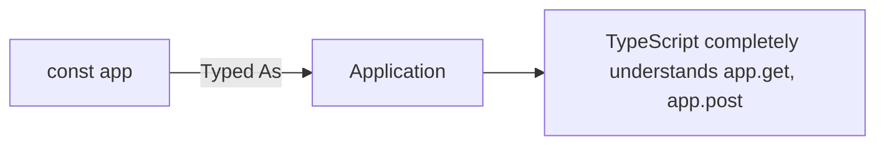
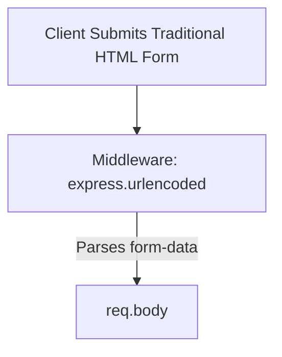
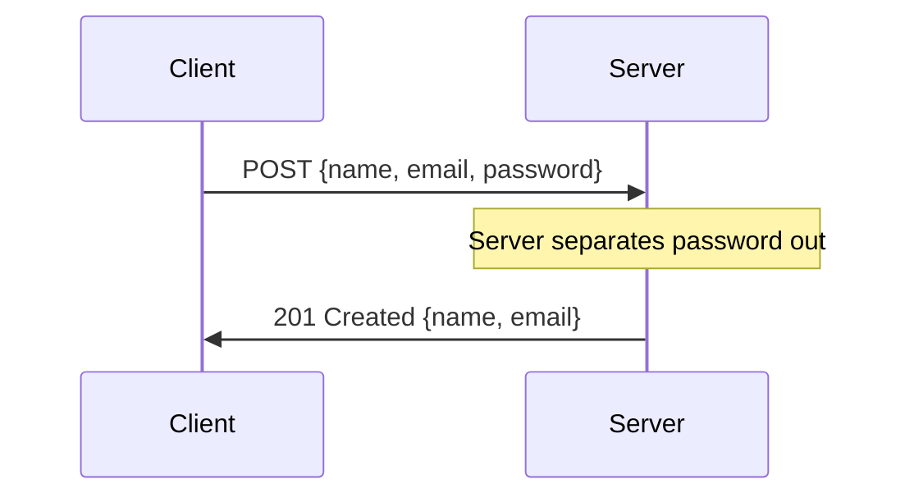
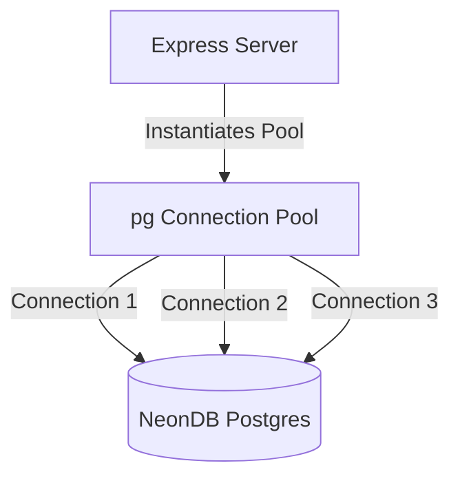

# 🚀 7-3: Advanced Express Concepts & PostgreSQL (NeonDB) Setup

Welcome to the documentation for your updated `server.ts`! In this module, we will explore strict application typing, URL-encoded data parsing, secure POST request handling, and establishing a connection to a Serverless Neon PostgreSQL database.

---

## 1. The `Application` Type in Express

*   **What it is:** Assigning the `Application` type from the `express` package to your `app` variable.
*   **The Problem:** By default, writing `const app = express()` relies on TypeScript's inference. In highly strict configurations, or when passing your `app` variable to other files as a parameter, TypeScript might not fully guarantee that `app` has all the built-in Express functions.
**Problem Code (Implicit inference):**
```typescript
const app = express(); // Works, but lacks explicit strictness if exported
```
*   **The Solution:** Import the `Application` type from `express` and explicitly attach it to `app`. This acts as a strict contract that `app` is a fully-fledged Express server.

**Solution Code:**
```typescript
import express, { type Application } from 'express';
// ✅ Strictly typed!
const app: Application = express();
```
*   💡 **Real-Life Analogy:** **The Official Manager Badge**. Anyone can claim to be the manager (`const app = express()`), but attaching the `Application` type is like giving them an Official Name Badge. Anyone who sees them instantly knows exactly what authority and abilities they have.

**Analogy Code:**
```typescript
type ManagerBadge = string;
const person = "John"; // Informal
const officialManager: ManagerBadge = "John"; // Strictly recognized
```

---

## 2. Parsing URL-Encoded Data

*   **What it is:** Middleware that parses incoming requests formatted as `application/x-www-form-urlencoded` (usually generated when users submit a standard HTML `<form>`).
*   **The Problem:** We already added `express.json()`, but not all data is sent as JSON. If a client submits a traditional HTML form, the data comes in URL-encoded format (e.g., `name=John&email=john%40example.com`). Without the right middleware, `req.body` will ignore it.
**Problem Code:**
```typescript
// If someone submits an HTML form without urlencoded middleware:
console.log(req.body); // OUTPUT: undefined (Data is lost)
```
*   **The Solution:** Add `app.use(express.urlencoded({ extended: true }))`. This tells Express to also intercept URL-encoded requests and cleanly place them inside `req.body`.

**Solution Code:**
```typescript
app.use(express.json()); // Parses JSON bodies
// ✅ Now it also parses traditional form submissions!
app.use(express.urlencoded({ extended: true })); 
```
*   💡 **Real-Life Analogy:** **A Bilingual Receptionist**. `express.json()` is a receptionist who understands English. However, if a customer arrives speaking Spanish (HTML Form Data), the receptionist won't understand. Hiring a second receptionist (`urlencoded`) ensures that Spanish speakers are also understood and their messages are passed to the boss (`req.body`).

---

## 3. Securely Processing POST Data (201 Status & Destructuring)

*   **What it is:** Receiving a JSON object, extracting specific key-value pairs (like `name` and `email`), dropping sensitive data (like `password`), and returning a `201` Status Code indicating successful resource creation.
*   **The Problem:** If you blindly return everything the user sent inside `req.body`, you risk exposing sensitive information (like passwords) back over the network. Furthermore, using a standard `200 OK` status for creating data is functionally okay, but technically incorrect according to web standards.
**Problem Code (Exposing Password & Wrong Status):**
```typescript
app.post('/data', async(req: Request, res: Response) => {
    // ❌ DANGEROUS: Sending back the raw body exposes the password!
    res.status(200).json(req.body); 
});
```
*   **The Solution:** Use **Object Destructuring** (`const { name, email, password } = data;`) to separate the keys. Then, send back only safe data (`name` and `email`), accompanied by a `201` (Created) status code.

**Solution Code:**
```typescript
app.post('/data', async(req: Request, res: Response) => {
  const data = req.body;
  // ✅ Extract keys
  const { name, email, password } = data; 
  console.log(data);

  // ✅ 201 Status = "Resource Successfully Created"
  // ✅ Only sending safe key-values back (no password!)
  res.status(201).json({
    message: 'Data created successfully',
    data: { name, email } 
  });
});
```
*   💡 **Real-Life Analogy:** **The Club Bouncer**. When entering a VIP club, you hand the Bouncer your wallet containing your ID and Credit Card (`req.body`). The Bouncer (Destructuring) pulls out only your ID (`name`, `email`) to verify you, and safely ignores your Credit Card (`password`). He then gives you an entry ticket (`201 Status`).

**Analogy Code:**
```typescript
class Bouncer {
    checkCustomer(wallet: any) {
        const { idCard, creditCard } = wallet;
        // Bouncer only looks at idCard, ignores creditCard
        return { message: "Access Granted", returnedItems: { idCard } };
    }
}
```

---

## 4. Connecting to Neon Serverless PostgreSQL Database

*   **What it is:** Integrating our Express app with **Neon Serverless Postgres**, a cloud-based PostgreSQL database that requires zero server management. We connect using a **Connection Pool** from the `pg` package.
*   **The Problem:** Express by itself has no memory; if the server restarts, all user data is gone. To fix this, we need a database. But if we open a completely new, separate connection to the database for every single user request, the server will become extremely slow and eventually crash.
**Problem Code (No Database or Bad Connections):**
*(The server crashes under heavy load because it opens thousands of individual connections).*
*   **The Solution:** 
    1.  Install the Postgres package: `npm i pg` and its TypeScript definitions `npm i -D @types/pg`.
    2.  Import `Pool` from `pg`.
    3.  Create a single `Pool` instance using your NeonDB connection string. The `Pool` efficiently manages multiple database connections behind the scenes, reusing them to maximize speed.

**Solution Code:**
```typescript
import { Pool } from 'pg'; // ✅ Import Pool from the installed 'pg' package

// ✅ Create an efficient pool of connections to Neon Serverless DB
const pool = new Pool({
  connectionString: "postgresql://<USERNAME>:<PASSWORD>@<HOST_URL>/neondb?sslmode=require&...", // Password Hidden
});
```
*   💡 **Real-Life Analogy:** **A Taxi Stand (Connection Pool)**. If 100 people need a ride, calling 100 separate taxis from the central city (single connections) will take forever. A Taxi Stand (`Pool`) keeps 10 taxis parked outside the hotel securely. When a request comes, a passenger jumps into a waiting taxi. When the ride is done, the taxi returns to the stand for the next person (efficient connection reuse).

**Analogy Code:**
```typescript
class TaxiStand {
    taxisWaiting: number = 10; // The Pool size
    
    requestRide(passenger: string) {
        this.taxisWaiting--; // Take one taxi from the pool
        return `${passenger} is on their way using an existing taxi!`;
    }
}
const hotelTaxiPool = new TaxiStand();
```