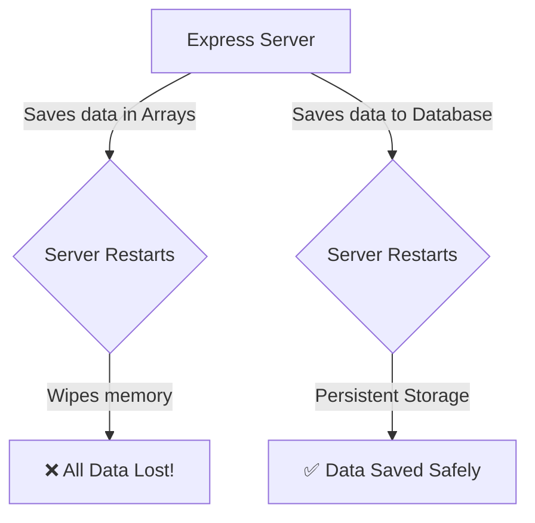
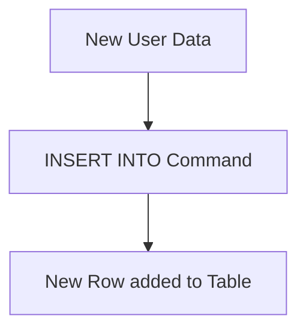
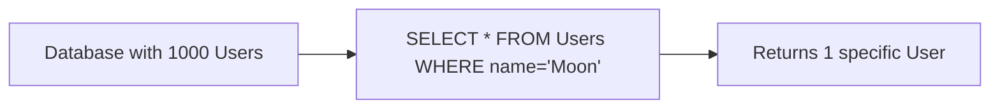

# 🗄️ SQL Overview: Storing Data the Right Way

Welcome to the beginner-friendly guide to SQL (Structured Query Language)! In our Express.js project, we need a Database to store user information permanently. 

---

## Step 1: Why We Need a Database

*   **What it is:** A Database is a secure, permanent storage system for your application's data. SQL is the language we use to talk to Relational Databases (like PostgreSQL or MySQL).
*   **The Problem:** If we just store incoming data inside a regular JavaScript array or variable inside our Express server, all that data gets completely erased the moment the server restarts or crashes.
**Problem Code (Using Memory):**
```typescript
// ❌ Problem: Storing in memory. If server restarts, this array becomes empty!
let usersDatabase: string[] = [];

app.post('/users', (req, res) => {
    usersDatabase.push(req.body.name);
    res.send("User saved... until restart!");
});
```
*   **The Solution:** We connect our Express app to an external structure (a Database).
**Solution Code (Concept):**
```typescript
// ✅ Solution: Sending data to a permanent Database using SQL
app.post('/users', async (req, res) => {
    await database.execute(`INSERT INTO Users (name) VALUES ('moon')`);
    res.send("User saved permanently!");
});
```
*   💡 **Real-Life Analogy:** **A Whiteboard vs. A Filing Cabinet**. Storing data in Node.js memory is like writing an important phone number on a classroom whiteboard; someone will eventually erase it when the class ends. A Database is like writing that number on a piece of paper, locking it in a metal filing cabinet, and keeping the key safe.

**Analogy Code:**
```typescript
class StorageSystem {
    whiteboard: string = "Temporary notes"; // Erased easily
    filingCabinet: string = "Permanent documents"; // Safe forever
    
    saveSafely(data: string) {
        this.filingCabinet = data;
    }
}
```

---

## Step 2: Structuring Data (`CREATE TABLE`)

*   **What it is:** In SQL, data is strictly organized into **Tables** (like Excel spreadsheets) consisting of Rows and Columns. `CREATE TABLE` is the command used to define this structure.
*   **The Problem:** If we just throw random data into our system without any rules, we end up with corrupted records (e.g., users without names, ages that are written as words instead of numbers).
**Problem Code (Unstructured Data):**
```javascript
// ❌ Messy data: One user has an age, the other has 'age' as a string. No rules!
const badData = [
    { id: 1, firstName: "moon" },
    { id: 2, name: "sun", age: "twenty" } 
];
```
*   **The Solution:** Use SQL to enforce strict rules. A User must have an `id` (Number) and a `name` (Text/VARCHAR).
**Solution Code:**
```sql
-- ✅ Creating a strict Table schema
CREATE TABLE Users (
    id INT PRIMARY KEY,
    name VARCHAR(100) NOT NULL,
    age INT
);
```
*   💡 **Real-Life Analogy:** **An Ice Cube Tray**. You can't just pour water loosely into a freezer; it makes a mess. `CREATE TABLE` is like buying an Ice Cube Tray. It creates perfectly shaped, rigid compartments. When you pour data in, it must perfectly fit those compartments.

**Analogy Code:**
```typescript
class IceCubeTray {
    compartments: number = 12;
    shape: string = "Square";
    // Data MUST fit the tray's rules
    freeze(waterAmount: number) {
        return `Created ${waterAmount} perfectly square ice cubes!`;
    }
}
```

---

## Step 3: Saving New Data (`INSERT INTO`)

*   **What it is:** `INSERT INTO` allows you to add a brand-new row of data into an existing table.
*   **The Problem:** Trying to manually append raw records to a file on your hard drive can lead to overlapping data, reading errors, and massive performance issues.
**Problem Code (The Bad Manual Way):**
```javascript
// ❌ Hard to maintain and prone to file corruption
const fs = require('fs');
fs.appendFileSync('users.txt', '1, moon, 25\n'); 
```
*   **The Solution:** Use `INSERT INTO` to safely and efficiently add records exactly where they belong in the structured database.
**Solution Code:**
```sql
-- ✅ Safely adding a new user into the database
INSERT INTO Users (id, name, age) 
VALUES (1, 'Moon', 25);
```
*   💡 **Real-Life Analogy:** **Checking into a Hotel**. When you arrive at a hotel, you don't just walk into a random room and sleep on the floor. You go to the receptionist (`INSERT INTO`), provide your details, and they place you safely into an assigned, numbered room (`Table Row`).

**Analogy Code:**
```typescript
class Hotel {
    rooms: any[] = [];
    checkIn(guestName: string, roomNumber: number) {
        this.rooms.push({ name: guestName, room: roomNumber });
    }
}
```

---

## Step 4: Finding Data (`SELECT`)

*   **What it is:** The `SELECT` command is used to read, search, or filter data from the database without changing it.
*   **The Problem:** If you have 1 million users and you want to find "Moon", using a loop in JavaScript to check every single user takes a massive amount of memory and slows down the server.
**Problem Code (Inefficient Searching):**
```javascript
// ❌ Very slow if 'allUsers' has 1 million items!
const targetUser = allUsers.find(user => user.name === 'Moon');
```
*   **The Solution:** Databases are mathematically optimized for searching. SQL's `SELECT` command finds exactly what you need in milliseconds.
**Solution Code:**
```sql
-- ✅ Extremely fast filtering
SELECT * FROM Users WHERE name = 'Moon';
```
*   💡 **Real-Life Analogy:** **A Librarian**. If you want a specific book, you don't manually read every book on every shelf (JavaScript Loop). You ask the Librarian (`SELECT` query) who looks at their organized index and instantly hands you the exact book you wanted.

**Analogy Code:**
```typescript
class Librarian {
    searchIndex(bookTitle: string) {
        return `Found the book optimized securely: ${bookTitle}`;
    }
}
```
