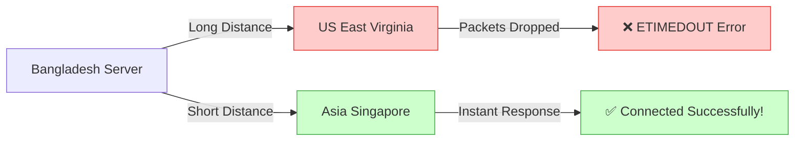
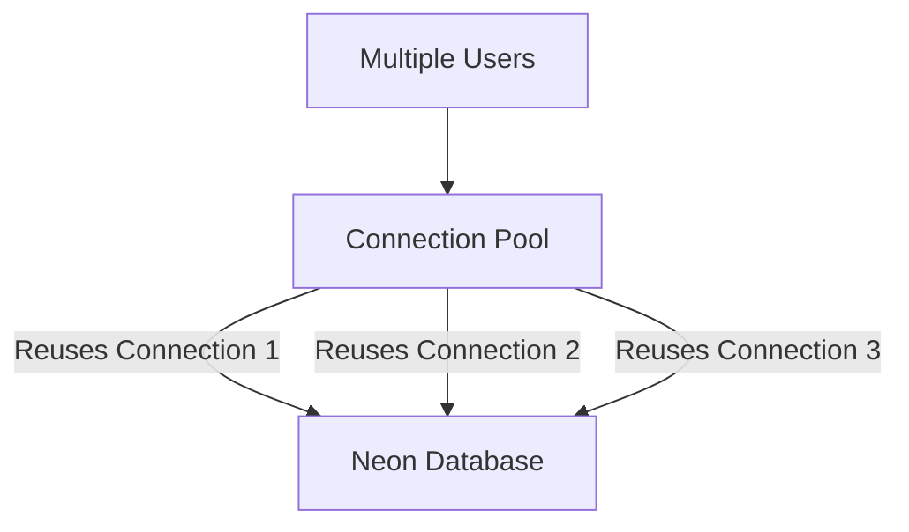
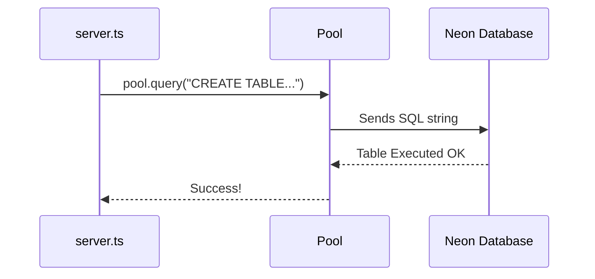
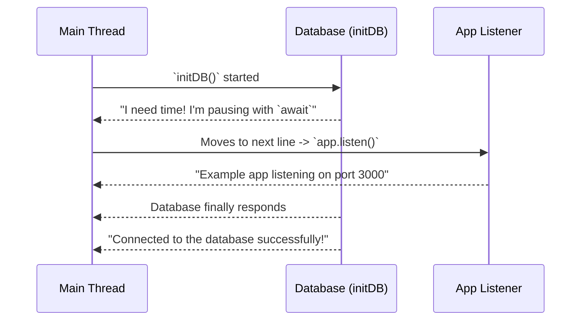
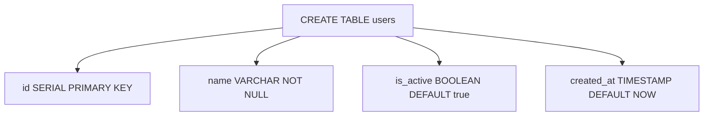

# 🚀 7-5: Executing Pool, Database Location, & Creating Tables

Welcome to the next big step! Now that we understand SQL, we need to correctly link our Node.js server to the actual database using a "Pool" and then run our SQL commands from the code. Also, we will cover a crucial lesson learned about Database Location!

---

## Step 1: Database Location & Region (Why the connection failed)


*   **What it is:** The "Region" is the actual physical country where your cloud database (NeonDB) is located. 
*   **The Problem:** Originally, you created your database in distant regions like America (`US-East`). Because data has to travel halfway across the world through underwater cables, the connection takes too long. Often, strict networks drop these slow requests, resulting in the dreaded `ETIMEDOUT` or `ENETUNREACH` errors.
**Problem Code (Connecting far away):**
```typescript
// ❌ Problem: The connection times out because the US server is too far!
const dbLocation = "US-East-1 (N. Virginia)";
// Result: Error connecting to the database: AggregateError [ETIMEDOUT]
```
*   **The Solution:** By creating a new database locally in **Asia (Singapore)**, the physical distance is dramatically reduced. The data travels fast, avoiding timeouts, and successfully connects!
**Solution Code:**
```typescript
// ✅ Solution: Connecting to a nearby region (Asia Singapore) is incredibly fast!
const initDB = async () => {
    const client = await pool.connect();
    console.log("Connected to the database successfully!"); // Instant success!
    client.release();
};
```
*   💡 **Real-Life Analogy:** **Calling a Plumber**. If a pipe breaks in your house in Dhaka, and you call a plumber from New York (US-East), they won't make it in time, and your house will flood (Timeout Error). If you call a plumber from your own city or a neighboring one like Singapore, they arrive instantly and fix the issue.

**Analogy Code:**
```typescript
class PlumberService {
    callPlumber(region: string) {
        if (region === "New York") {
            throw new Error("ETIMEDOUT: Taking too long to arrive!");
        }
        return "Arrived instantly and fixed the pipe!";
    }
}
const service = new PlumberService();
service.callPlumber("Singapore"); // ✅ Success!
```

---

## Step 2: The Connection Pool (`new Pool()`)


*   **What it is:** A `Pool` is a mechanism that creates and manages a group of reusable database connections instead of opening a brand-new connection for every single user.
*   **The Problem:** Connecting to a database securely takes heavy computation time. If 1,000 users visit your site simultaneously and you manually open a new connection and close it for *every single user*, your server will crash from memory overload.
**Problem Code (Creating raw connections manually):**
```typescript
// ❌ Creating a brand new, heavy connection for EVERY single request! Extremely slow.
import { Client } from "pg";
app.get('/users', async (req, res) => {
    const client = new Client({ connectionString: process.env.DATABASE_URL });
    await client.connect(); 
    // Do something...
    await client.end();
});
```
*   **The Solution:** We create a single `Pool` at the top of our file. When a user requests data, the pool hands them a ready-made, waiting connection. When the user is done, the connection goes back to the pool for the next person!
**Solution Code (From your exact file):**
```typescript
import { Pool } from "pg";

// ✅ Created ONCE globally. Efficient and fast!
const pool = new Pool({
  connectionString: process.env.DATABASE_URL, // Sensitive data hidden!
});

const initDB = async () => {
  try {
    const client = await pool.connect(); // Borrowing a connection from the pool
    console.log("Connected to the database successfully!");
    client.release(); // Giving it back to the pool
  } catch (err) {
    console.error(err);
  }
};
```
*   💡 **Real-Life Analogy:** **A Taxi Stand**. A `Pool` is exactly like an Airport Taxi Stand. Instead of building a brand-new car every time a passenger arrives (Problem), the Airport keeps 50 Taxis running at the stand. You get in one, go to your destination, and the taxi returns to the stand for the next person.

**Analogy Code:**
```typescript
class TaxiStand {
    availableTaxis = 10;
    
    borrowTaxi() {
        this.availableTaxis--;
        return "Taxi provided to customer!"; // client = await pool.connect()
    }
    
    returnTaxi() {
        this.availableTaxis++; // client.release()
    }
}
```

---

## Step 3: Executing SQL to Create a Table


*   **What it is:** To actually run SQL inside Node.js, we write our SQL commands inside JavaScript strings (text) and pass them to the `pool.query()` function to execute them on the actual database.
*   **The Problem:** Node.js only understands JavaScript/TypeScript. It cannot run raw SQL directly inside a `.ts` file. If you type raw SQL without sending it through the pool transporter, your app will instantly crash with syntax errors.
**Problem Code (Writing raw SQL out in the open):**
```typescript
// ❌ TypeScript triggers a Syntax Error. It doesn't know what "CREATE" means!
CREATE TABLE Users (
    name VARCHAR(100)
);
```
*   **The Solution:** We wrap our SQL logic inside a string template (using backticks `` ` ``) and execute it asynchronously using `pool.query()`. 
**Solution Code:**
```typescript
// ✅ Wrapping SQL in a string and sending it via the pool

const createTable = async () => {
    const tableQuery = `
        CREATE TABLE IF NOT EXISTS Users (
            id SERIAL PRIMARY KEY,
            name VARCHAR(100) NOT NULL,
            email VARCHAR(100) UNIQUE NOT NULL
        );
    `;
    
    try {
        await pool.query(tableQuery); // Transports the SQL to the DB
        console.log("Table created successfully!");
    } catch (err) {
         console.error("Error creating table", err);
    }
};

createTable();
```
*   💡 **Real-Life Analogy:** **Taking a Prescription to the Pharmacy**. Passing SQL through `pool.query()` is like writing a medical prescription. The Doctor (Node.js) speaks differently than the Pharmacist (Database). So, the Doctor writes the medicine request on a piece of paper (String) and hands it to the courier (Pool) to deliver to the Pharmacy to execute the order.

**Analogy Code:**
```typescript
class PostmanPool {
    async query(sqlMessage: string) {
        return `Delivering message to DB: ${sqlMessage}`;
    }
}

const messenger = new PostmanPool();
// Giving the string to the messenger
messenger.query("CREATE TABLE Medicine...");
```

---

## Step 4: Execution Order and `async/await` (Why the logs print in different order)


*   **What it is:** Node.js is **Asynchronous** and **Non-Blocking**. When you use `await pool.connect()`, it commands that specific local function (`initDB`) to pause and wait for the database, *but it does not freeze the rest of the file*.
*   **The Problem:** Why do you see `Example app listening on port 3000` printing BEFORE `Connected to the database successfully!`? Because connecting to a cloud database takes a few milliseconds. If Node.js waited (blocked) everything until the database connected, your server wouldn't be able to do anything else.
**Problem Code (Confusion of Output Order):**
```typescript
// ❌ The misconception: Code always runs exactly line-by-line.
initDB(); // This pauses internally because of 'await'

// Node skips ahead and runs this IMMEDIATELY while initDB is waiting!
app.listen(port, () => {
  console.log("Example app listening on port 3000"); // 1st output
});
// 2nd output: "Connected to the database successfully!"
```
*   **The Solution:** This is actually a feature, not a bug! You want your server to start listening for users immediately while the database boots up in the background. However, if you strictly want to force the server NOT to start until the database is definitely connected, you must put `app.listen` INSIDE the `async` flow, after the `await`.
**Solution Code (Forcing connection before server starts):**
```typescript
// ✅ Solution: Moving app.listen INSIDE the async function ensures strict order!
const startServer = async () => {
    try {
        await pool.connect(); 
        console.log("Connected to the database successfully!"); // 1st

        app.listen(port, () => {
            console.log(`Example app listening on port ${port}`); // 2nd
        });
    } catch (err) {
        console.error("Database connection failed, server stopped.");
    }
};

startServer();
```
*   💡 **Real-Life Analogy:** **The Coffee Shop Cashier**. If you order a Cappuccino (Database connection), it takes 3 minutes to brew (`await`). A bad cashier (synchronous) would stare at the coffee machine for 3 minutes, ignoring all other customers (Main thread blocked). A good Node.js cashier (asynchronous) tells the barista to make your coffee (`initDB`), and immediately turns to the next customer to take their order (`app.listen`).

**Analogy Code:**
```typescript
class Cashier {
    async serveCustomer1() {
        // Cashier delegates to Barista and waits.
        await this.baristaBrewCoffee(); 
        console.log("Coffee Ready for Customer 1!"); // Happens later
    }
    
    async baristaBrewCoffee() { /* Takes 3 minutes */ }

    serveCustomer2() {
        console.log("Hello Customer 2, ordering now!"); // Happens first!
    }
}

const cafe = new Cashier();
cafe.serveCustomer1(); // Starts, but pauses
cafe.serveCustomer2(); // Moves on instantly!
```

---

## Step 5: Advanced Table Creation (Understanding the SQL Data Types)


*   **What it is:** In `server.ts`, we took Table creation to the next level. We defined a robust `users` table using advanced PostgreSQL data types and constraints to make sure our data is clean and automatic.
*   **The Problem:** If we just define simple types like `VARCHAR` for everything, someone might forget to provide an email, or two people might register with the same email. Also, manually tracking *when* a user registered is tedious.
**Problem Code (Weak Table Structure):**
```sql
-- ❌ Problem: Weak structure. Duplicate emails allowed, no ID auto-generation!
CREATE TABLE users (
    id INT,
    name VARCHAR(100),
    email VARCHAR(100)
);
```
*   **The Solution:** Use PostgreSQL constraints. Here is what you did in your code:
    1.  `SERIAL`: Automatically counts up (1, 2, 3...) so you don't have to manually provide an ID.
    2.  `UNIQUE`: Ensured no two users can use the exact same email.
    3.  `NOT NULL`: Ensured `name`, `email`, and `password` cannot be empty.
    4.  `DEFAULT true`: If we don't specify if a user is active, they are considered active by default.
    5.  `TIMESTAMP DEFAULT NOW()`: The database automatically logs the exact millisecond the user registered!

**Solution Code (From your exact file):**
```typescript
// ✅ Built a highly structured and automatic table
await pool.query(`
  CREATE TABLE IF NOT EXISTS users (
    id SERIAL PRIMARY KEY,
    name VARCHAR(100) NOT NULL,
    email VARCHAR(100) NOT NULL UNIQUE,
    password VARCHAR(255) NOT NULL,
    is_active BOOLEAN DEFAULT true,
    age INT,
    created_at TIMESTAMP DEFAULT NOW(),
    updated_at TIMESTAMP DEFAULT NOW()
  );
`);
console.log("Connected and Table Ready!"); 
```
*   💡 **Real-Life Analogy:** **The Automated Passport Office**. A weak table is like a lazy office worker who accepts blank forms (NULL values) and gives out identical passport numbers (No UNIQUE rule). An advanced SQL constraint table is like an Automated Kiosk—it instantly stamps a unique serial number on your form (`SERIAL`), rejects forms with missing photos (`NOT NULL`), and automatically prints the exact time you submitted it (`DEFAULT NOW()`).

**Analogy Code:**
```typescript
class AutomatedKiosk {
    processForm(name: string, email: string) {
        if (!name || !email) throw new Error("Format rejected: missing fields!"); // NOT NULL
        return {
            id: Math.floor(Math.random() * 1000), // SERIAL
            timestamp: new Date() // DEFAULT NOW()
        };
    }
}
```
