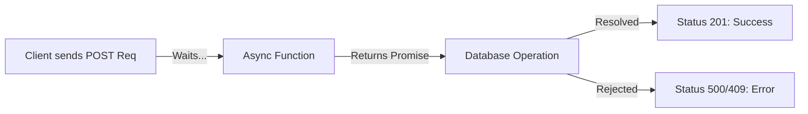
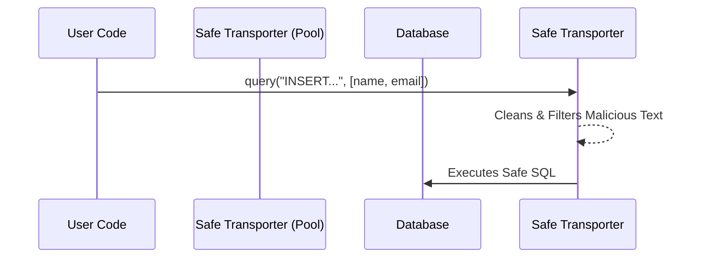

# 🚀 7-6: Creating First User (POST, Promises, Parameterized Queries & Error Handling)

Welcome! সার্ভারে ডেটা পাঠিয়ে ডাটাবেসে সেভ করার এই পার্টটি খুবই গুরুত্বপূর্ণ। আমরা এখানে `Promise<any>`, SQL ইনজেকশন ঠেকানোর উপায় (`$1, $2`), ডাটাবেস থেকে ইনস্ট্যান্ট রেসপন্স পাওয়া (`RETURNING *`), এবং স্মার্ট এরর হ্যান্ডলিং (`try-catch`) নিয়ে বিস্তারিত জানব।

---

## Step 1: Why `Promise<any>` in an Express Route?



*   **What it is:** TypeScript-এ `Promise<any>` বোঝায় যে আমাদের `async` ফাংশনটি ভবিষ্যতে একটি ভ্যালু রিটার্ন করবে, এবং সেই ভ্যালুটির টাইপ যেকোনো কিছু (`any`) হতে পারে। 
*   **The Problem:** Express-এ যখন আমরা কোনো `async` রাউট হ্যান্ডলার বানাই (যেমন `app.post('/data', async ...)`), তখন ফাংশনটি নিজে থেকে কিছু রিটার্ন করে না, বরং এটি রেসপন্স সেন্ড করে (`res.json()`)। কিন্তু TypeScript ডিফল্টভাবে এক্সপেক্ট করে যে একটি অ্যাসিনক্রোনাস ফাংশন সবসময় একটি নির্দিষ্ট টাইপের Promise রিটার্ন করবে।
**Problem Code (Type mismatching in strict mode):**
```typescript
// ❌ Problem: TypeScript might shout at you for not defining the return type of the promise.
app.post("/data", async (req: Request, res: Response) => {
    // some code...
});
```

*   **The Solution:** আমরা ফাংশনটির রিটার্ন টাইপ `Promise<any>` সেট করে দিই। এর মানে হলো, "এই ফাংশনটি একটি Promise, তবে কী রিটার্ন করবে তা নিয়ে মাথা ঘামাতে হবে না, তুমি শুধু রেসপন্স পাঠানোতে ফোকাস করো।"
**Solution Code:**
```typescript
// ✅ Solution: Telling TypeScript this async function handles any kind of promise.
app.post("/data", async (req: Request, res: Response): Promise<any> => {
    // Database logic here
    res.status(201).json({ message: "Done" });
});
```

*   💡 **Real-Life Analogy:** **The Restaurant Waiter (Promise)**. আপনি রেস্টুরেন্টে ওয়েটারকে (Async Function) অর্ডার দিয়েছেন। সে আপনাকে তখনই খাবার দেয় না, বরং একটি "টোকেন/রশিদ" (Promise) দেয় যে কিছুক্ষণ পরে খাবার আসবে। `Promise<any>` হলো এমন একটি রশিদ যেখানে "যেকোনো খাবার" আসতে পারে বলে লেখা আছে।
**Analogy Code:**
```typescript
class Waiter {
    // Promising to bring "any" dish after some time
    async takeOrder(): Promise<any> {
        return "Your food is ready!";
    }
}
```

---

## Step 2: Safe Data Insertion (Parameterized Queries `$1, $2`)



*   **What it is:** `VALUES ($1, $2, $3, $4)` অংশটিকে বলা হয় Parameterized Query। এখানে `$1` মানে হলো অ্যারের প্রথম ভ্যালু (`name`), `$2` মানে দ্বিতীয় ভ্যালু (`email`) ইত্যাদি।
*   **The Problem:** যদি আমরা সরাসরি ভেরিয়েবলগুলোকে SQL-এর ভেতরে ঢুকিয়ে দিই (String Concatenation), তাহলে হ্যাকাররা ম্যালিশিয়াস কোড পাঠিয়ে পুরো ডাটাবেস ডিলিট করে দিতে পারে! একে বলা হয় **SQL Injection**।
**Problem Code (Dangerous - Hacker can delete DB):**
```typescript
// ❌ Problem: Never do this! If email is "'; DROP TABLE users; --", your DB is gone!
const email = req.body.email;
await pool.query(`INSERT INTO users (email) VALUES ('${email}')`); 
```

*   **The Solution:** `pg` লাইব্রেরির অ্যারে বাইন্ডিং (`[$1, $2]`) ব্যবহার করা। এটি প্রথমে SQL স্ট্রাকচারটি ডাটাবেসে পাঠায়, এরপর ডাটাগুলোকে পুরোপুরি ফিল্টার ও ক্লিন করে ডাটাবেসে বসায়। ফলে হ্যাকার চাইলেও কোনো ক্ষতি করতে পারে না।
**Solution Code:**
```typescript
// ✅ Solution: Use placeholders ($1) and pass the actual data safely in an array!
const result = await pool.query(
    "INSERT INTO users (name, email, password, age) VALUES ($1, $2, $3, $4)",
    [name, email, password, age] // Safe matching: $1=name, $2=email
);
```

*   💡 **Real-Life Analogy:** **The VIP Mail Scanner**. String concatenation হলো সরাসরি ভিআইপি'র (Database) হাতে একটি খোলা চিঠি (SQL) তুলে দেওয়া, যার ভিতর বোমা থাকতে পারে! Parameterized query হলো একটি সিকিউরিটি স্ক্যানার—চিঠিটি মেশিনের একদিক দিয়ে যায়, এবং শুধুমাত্র নিরাপদ টেক্সটগুলো ($1, $2) ভিআইপির কাছে পৌঁছায়। 

---

## Step 3: Getting Data Back (`RETURNING *` and `result.rows[0]`)

*   **What it is:** ডাটা ইনসার্ট করার পর, আমরা সদ্য তৈরি হওয়া ডাটাটি চাই। `RETURNING *` কমান্ডটি সেই ডাটাগুলো ব্যাক করে, আর `result.rows[0]` সেই লিস্টের প্রথম রো (সদ্য তৈরি হওয়া ইউজার অবজেক্ট) সিলেক্ট করে।
*   **The Problem:** নরমালি ডাটাবেসে `INSERT` কমান্ড চালালে ডাটাবেস শুধু বলে, "ঠিক আছে, ডাটা সেভ করেছি।" কিন্তু নতুন আইডির (`id SERIAL`) নম্বর কত হলো, তা সে বলে না।
**Problem Code (Blind Creation):**
```typescript
// ❌ Problem: Returns a giant useless log, no user data!
const result = await pool.query("INSERT INTO users (name) VALUES ($1)", ["John"]);
console.log(result); // Logs random metadata, NOT John's ID!
```

*   **The Solution:** আপনার কোডে আপনি `RETURNING *` যোগ করেছেন। এর মানে হলো, ডাটাবেসকে বলছেন ইনসার্ট করার সাথে সাথে তার সম্পূর্ণ ডিটেইলস আমাকে ফেরত দাও। সেই ফেরত আসা ডাটা একটি অ্যারেতে থাকে, যার নাম `rows`। যেহেতু আমরা একজনই ইনসার্ট করেছি, তাই `result.rows[0]` হলো সেই প্রথম ব্যক্তি। 
**Solution Code:**
```typescript
// ✅ Solution: Ask for the return packet, and specifically extract the first row!
const result = await pool.query(
    "INSERT INTO users (name) VALUES ($1) RETURNING *", // Please send me the created object!
    [name]
);
console.log(result.rows[0]); // 👉 { id: 1, name: 'John', created_at: '2026-05-16...' }
```

*   💡 **Real-Life Analogy:** **The Bank Deposit**. আপনি ব্যাংকে টাকা জমা দিলেন (`INSERT`)। ব্যাংক শুধু মাথা নেড়ে বলল "হয়েছে" (Problem)। কিন্তু `RETURNING *` হলো ব্যাংক থেকে জমাস্লিপ বা রিসিট চাওয়া, যেখানে আপনার অ্যাকাউন্টে এখন কত টাকা আছে তা লেখা থাকে, এবং `result.rows[0]` হলো সেই রিসিটটি নিজের পকেটে রাখা।

---

## Step 4: Graceful Error Handling (`try-catch` & `error.code`)

*   **What it is:** `try-catch` ব্লকটি সার্ভারকে ক্র্যাশ হওয়া থেকে বাঁচায়। ডাটাবেস যদি বলে "এই ইমেইল তো আগেই আছে!", তাহলে সার্ভার বন্ধ না করে ইউজারকে সুন্দর মেসেজ দেওয়াই এর কাজ।
*   **The Problem:** ডাটাবেসে আমরা একটু আগেই `UNIQUE` কনস্ট্রেইন্ট বসিয়েছিলাম ইমেইলের ওপর। কেউ যদি একই ইমেইলে আবার রেজিস্টার করে, `pg` লাইব্রেরি সার্ভারে ভয়ংকর একটি এরর থ্রো করবে। `try-catch` না থাকলে আপনার পুরো Node.js সার্ভার চিরতরে বন্ধ হয়ে যাবে।
**Problem Code (Silent crashes!):**
```typescript
// ❌ Problem: If the query fails (e.g. duplicate email), the server instantly dies!
app.post("/data", async (req, res) => {
    // If error happens here, the app simply crashes completely.
    await pool.query("...");
});
```

*   **The Solution:** আমরা পুরো প্রসেসটিকে `try {}` এর ভেতর রাখি। কোনো ঝামেলা হলে এটি জাম্প করে `catch(error) {}` তে চলে আসে। এরপর আমরা ডাটাবেস এরর কোড চেক করি। PostgreSQL-এ ডুপ্লিকেট ভ্যালু এরর কোড হলো `'23505'`।
**Solution Code:**
```typescript
// ✅ Solution: Try safely, catch and inspect the exact database error!
try {
    const result = await pool.query("INSERT...");
    res.status(201).json(result.rows[0]); 
} catch (error: any) {
    if (error.code === '23505') { // Postgres specific error for Unique Violation!
        return res.status(409).json({ message: "This email is already registered!" });
    }
    res.status(500).json({ message: "Internal server error" });
}
```

*   💡 **Real-Life Analogy:** **The Bouncer at a Club**. সার্ভার হলো একটি নাইট ক্লাব। `try-catch` ছাড়াই কোড চালানো মানে ক্লাবের গেটে কোনো বাউন্সার নেই—কোনো মাতাল ঢুকলে (Error) পুরো পার্টি পণ্ড হয়ে যায় (Server crash)। `try...catch` হলো সেই শক্ত-পোক্ত বাউন্সার, যে মাতালকে ধরে সাইডে (`catch` block) নিয়ে যায়, তাকে জিজ্ঞেস করে "তুমি কে ভাই?" (`error.code === '23505'`), এবং তাকে বের করে দেয় (`res.status(409)`); আর ভেতরের পার্টি (Server) স্মুথলি চলতে থাকে।
