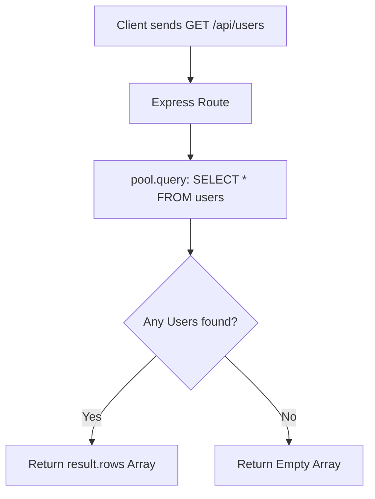
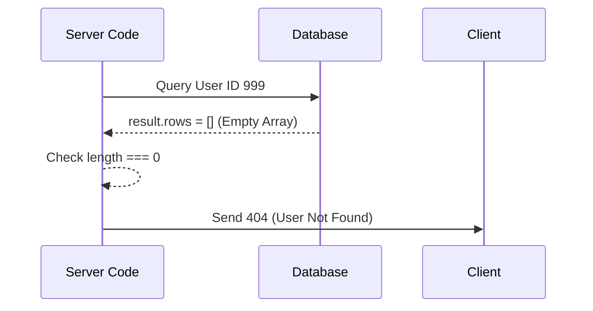

# 🚀 7-7: GET All Users & Single User (Params, Parameterized Queries & 404 Handling)

Welcome! ডাটাবেসে ইউজার সেভ করার পর, এবার তাদের ডাটা রিড করার (পড়ে আনার) পালা। এই আর্টিকেলে আমরা শিখব কীভাবে সব ইউজারকে একসাথে আনা যায়, এবং `req.params` ব্যবহার করে নির্দিষ্ট একজন ইউজারকে খুঁজে বের করা যায়।

---

## Step 1: Getting All Users (`SELECT *`)



*   **What it is:** সব ইউজারকে ডাটাবেস থেকে আনতে আমরা SQL এর `SELECT * FROM users` কমান্ডটি ব্যবহার করি। এখানে `*` মানে হলো "সব কলাম"।
*   **The Problem:** যদি আমরা ঠিকমতো কিউরি না লিখি বা ডাটাবেস থেকে শুধু `result` রিটার্ন করি, তাহলে ইউজারের ডাটার বদলে ডাটাবেসের অনেক হাবিজাবি মেটাডাটা চলে আসবে।
**Problem Code (Returning the whole unparsed object):**
```typescript
const result = await pool.query("SELECT * FROM users");
res.send(result); // ❌ Returns raw database packet (very confusing for frontend)
```

*   **The Solution:** আমরা শুধুমাত্র `result.rows` রিটার্ন করি। ডাটাবেস থেকে যতো ইউজার আসবে, তারা সবাই এই `rows` নামক অ্যারে-তে থাকবে। 
**Solution Code:**
```typescript
app.get("/api/users", async (req, res): Promise<any> => {
  try {
    const result = await pool.query("SELECT * FROM users");
    res.status(200).json({
      message: "Users retrieved successfully",
      data: result.rows, // ✅ Clean array of user objects
    });
  } catch (error) { ... }
});
```

*   💡 **Real-Life Analogy:** **The School Register**. ডাটাবেস হলো স্কুলের রেজিস্টার খাতা। `SELECT * FROM users` বলা মানে প্রিন্সিপাল আপনাকে বললেন, "স্কুলের সবার নামের লিস্ট নিয়ে আসো।" `result.rows` হলো সেই ফ্রেশ লিস্ট, যেটা আপনি তৈরি করে স্যারকে দিলেন (খাতার মলাট, পৃষ্ঠার সাইজ বা মেটাডাটা আপনি উনাকে দেন না)।

---

## Step 2: Fetching a Single User (Express `req.params`)

*   **What it is:** নির্দিষ্ট একজন ইউজারের ডাটা আনতে আমরা URL-এর শেষে তার ID পাঠাই (যেমন: `/api/users/5`)। Express.js এই URL থেকে ৫ নম্বরটি বের করে এনে `req.params.id`-এ রেখে দেয়।
*   **How it differs from pure Node.js:** র' Node.js-এ URL থেকে কোনো ভ্যালু বের করতে হলে আপনাকে ম্যানুয়ালি স্ট্রিং কাটাকাটি (`split("/")` বা Regex) করতে হতো, যা খুব ঝামেলার। Express আপনার কাজ অনেক সহজ করে দেয়; সে রাউটের `:id` অংশটিকে অটোমেটিক্যালি একটি ভেরিয়েবল হিসেবে চিনে নেয়!

**Express vs Node.js Code:**
```typescript
// ❌ Pure Node.js (Very complex to extract ID 5 from "/api/users/5")
const id = req.url.split('/')[3]; 

// ✅ Express.js (Automatically gives you the ID!)
app.get("/api/users/:id", (req, res) => {
    const userId = req.params.id; // Extremely easy!
});
```

---

## Step 3: Why we use `$1` and `[userId]` (Parameterized WHERE Clause)

*   **What it is:** আমরা SQL-এ লিখি `SELECT * FROM users WHERE id = $1`, আর কমা দিয়ে ব্র্যাকেটে পাস করি `[userId]`।
*   **The Problem:** আগের মতোই, সরাসরি `WHERE id = ${userId}` লিখলে ম্যালিশিয়াস হ্যাকাররা URL-এর শেষে SQL Injection চালিয়ে পুরো ডাটাবেস গায়েব করে দিতে পারে।
*   **The Solution:** আমরা `$1` প্লেসহোল্ডার ব্যবহার করি। `pg` লাইব্রেরি তখন জানে যে, "ব্র্যাকেটের ভেতরের অ্যারের প্রথম ভ্যালুটি (`[userId]`) এই `$1`-এর জায়গায় খুব সেফলি বসাতে হবে।"

**Solution Code:**
```typescript
// ✅ Safe search! Prevent SQL Injection
const result = await pool.query("SELECT * FROM users WHERE id = $1", [userId]);
```

---

## Step 4: The 404 Check (`if (result.rows.length === 0)`)



*   **What it is:** ডাটাবেসে আমরা এমন একজনের ID সার্চ করলাম যেটির কোনো অস্তিত্বই নেই (ধরুন `id=999`)। ডাটাবেস তখন কোনো এরর বা ক্র্যাশ করবে না, বরং সে একটি খালি অ্যারে (`[]`) রিটার্ন করবে।
*   **The Problem:** আপনি যদি খালি অ্যারে চেক না করেন, তাহলে সিস্টেম ভাববে সার্চ সাকসেসফুল হয়েছে, এবং ফ্রন্টএন্ডে ফাঁকা ডাটা পাঠিয়ে দেবে। ফ্রন্টএন্ড ডেভেলপার তখন বুঝবে না যে ইউজারটি আদোও আছে নাকি নেই!
**Problem Code (Assuming it always works):**
```typescript
// ❌ Problem: If user 999 isn't found, result.rows is [].
// Calling result.rows[0] on [] gives 'undefined', breaking the frontend!
res.status(200).json({ data: result.rows[0] }); 
```

*   **The Solution:** আমরা চেক করি `result.rows.length === 0` কি না। অ্যারের লেন্থ জিরো (০) হওয়ার মানে হলো, ডাটাবেস ওই ID-এর কাউকে খুঁজে পায়নি। তখন আমরা ইউজারকে বলি `404 Not Found`। আর খুঁজে পেলে `result.rows[0]` (অ্যারের প্রথম ও একমাত্র মেম্বারটি) পাঠিয়ে দিই।

**Solution Code (From your file):**
```typescript
// ✅ Solution: Always check if the array is empty!
if (result.rows.length === 0) {
    return res.status(404).json({
        success: false,
        message: "User not found", // Handled perfectly!
    });
}
res.status(200).json({ data: result.rows[0] });
```

*   💡 **Real-Life Analogy:** **Searching in a Library Directory**. আপনি লাইব্রেরিয়ানকে বললেন, "১০০ নম্বর সিরিয়ালের বইটি দিন" (`id = 100`)। লাইব্রেরিয়ান খুঁজে দেখল এই সিরিয়ালে কোনো বই নেই (Empty Array, `length === 0`)। এখন লাইব্রেরিয়ান যদি শুধু আপনার দিকে ফ্যালফ্যাল করে তাকিয়ে থাকে, তাহলে আপনি কনফিউজড হবেন (Problem)। এর সল্যুশন হলো, ডাটাবেস চেক করার পর লাইব্রেরিয়ান আপনাকে পরিষ্কারভাবে বলবে "দুঃখিত, বইটি খুঁজে পাওয়া যায়নি" (`404 User not found`)।
