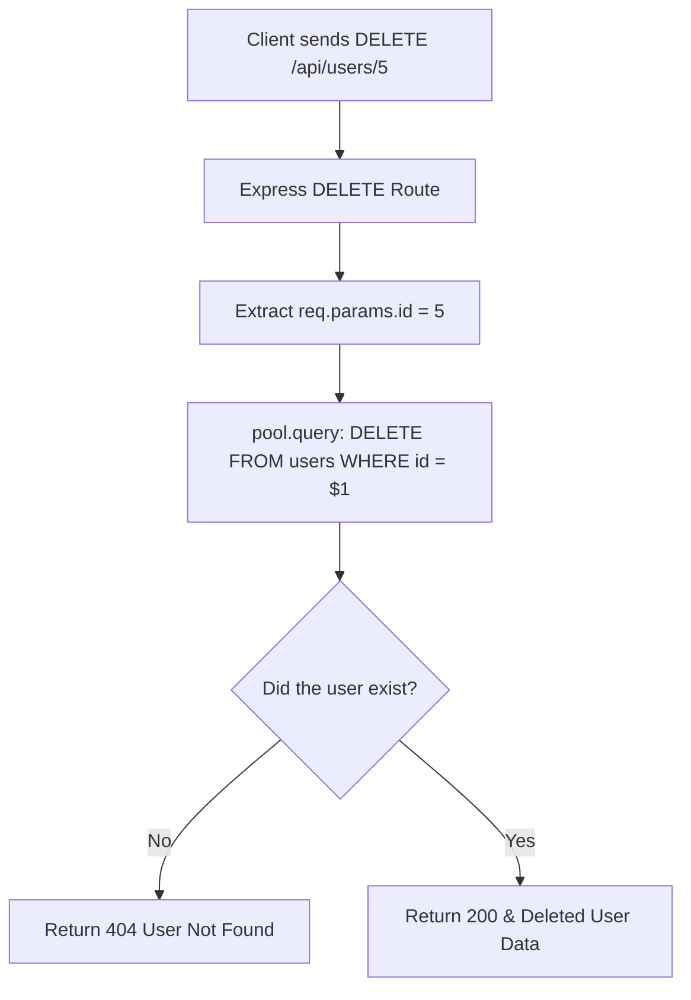

# 🚀 7-9: Deleting Users (The DELETE Method & Returning Deleted Data)

Welcome! CRUD (Create, Read, Update, Delete) অপারেশনের একদম শেষ ধাপে আমরা চলে এসেছি। এই আর্টিকেলে আমরা শিখব কীভাবে ডাটাবেস থেকে একজন ইউজারকে চিরতরে মুছে ফেলতে হয় (`DELETE`) এবং মুছে দেওয়ার পরও তার ডাটা কীভাবে দেখতে হয়।

---

## Step 1: The `DELETE` Route



*   **What it is:** ডাটাবেস থেকে স্পেসিফিক কোনো ডাটা মুছে ফেলার জন্য আমরা Express এর `app.delete()` মেথড ব্যবহার করি। SQL-এ এর জন্য `DELETE FROM tablename WHERE condition` কমান্ড লিখতে হয়।
*   **The Problem:** যদি আপনি ভুলে `WHERE` ক্লজ দিতে ভুলে যান, তাহলে ডাটাবেস থেকে **সব ইউজারের ডাটা চিরতরে ডিলিট হয়ে যাবে!**
**Problem Code (Dangerous - Deletes everyone):**
```typescript
// ❌ Disastrous! No WHERE clause means every single row gets deleted!
await pool.query("DELETE FROM users"); 
```

*   **The Solution:** সবসময় `WHERE` ক্লজ ব্যবহার করে নির্দিষ্ট আইডি (`id = $1`) বলে দেওয়া, যাতে শুধু টার্গেট করা ইউজার ডিলিট হয়।
**Solution Code:**
```typescript
// ✅ Safe! Only deletes the exact matched user ID.
const userId = req.params.id;
await pool.query("DELETE FROM users WHERE id = $1", [userId]);
```

*   💡 **Real-Life Analogy:** **The Sniper vs The Bomb**. নির্দিষ্ট আইডি দিয়ে ডিলিট করা (`WHERE id = 5`) হলো স্নাইপার দিয়ে পারফেক্ট টার্গেট শুট করা—শুধু যাকে চাই তাকেই সরানো। আর `WHERE` ছাড়া ডিলিট করা হলো পুরো শহরে বোম ফেলা—ভালো-খারাপ সবাই একবারে সাফ!

---

## Step 2: Knowing What Was Deleted (`RETURNING *`)

*   **What it is:** আমরা `DELETE` কমান্ডের শেষেও `RETURNING *` ব্যবহার করেছি।
*   **The Problem:** ডাটাবেস নরমালি ডিলিট করার পর শুধু বলে "হ্যাঁ, মুছে দিয়েছি।" কিন্তু ফ্রন্টএন্ড ডেভেলপার বা এডমিন প্যানেল অনেক সময় জানতে চায় যে "আসলে কোন জিনিসটা মুছে ফেলা হলো?" যাতে ভুল হলে জানা যায়।
**Problem Code:**
```typescript
// ❌ Doesn't tell us exactly who was kicked out
const result = await pool.query("DELETE FROM users WHERE id = $1", [userId]);
res.json({ message: "Deleted" }); 
```

*   **The Solution:** `RETURNING *` ব্যবহার করলে ডাটাবেস ডাটাটি পুরোপুরি মুছে ফেলার ঠিক আগ মুহূর্তে ওই ডাটাটি আমাদের কাছে একবার ফেরত পাঠায়। আমরা সেই ডাটা রেসপন্সে পাঠিয়ে দিই, যাতে ক্লায়েন্ট বুঝতে পারে ঠিক কী ডিলিট হয়েছে।

**Solution Code (From your exact file):**
```typescript
// ✅ Destroys the row but returns the ghost data back to us!
const result = await pool.query(
    "DELETE FROM users WHERE id = $1 RETURNING *", 
    [userId]
);

// If the array is empty, the user wasn't there to begin with
if (result.rows.length === 0) {
    return res.status(404).json({ message: "User not found" });
}

// Send the deleted user's info to the frontend
res.status(200).json({
    message: "User deleted successfully",
    data: result.rows[0], 
});
```

*   💡 **Real-Life Analogy:** **The Final Picture**. আপনি আপনার ক্যামেরা থেকে একটি ছবি ডিলিট করার বাটন চাপলেন। ক্যামেরা ছবিটি মেমরি থেকে মুছে ফেলার আগে আপনাকে ডিসপ্লেতে ১ সেকেন্ডের জন্য ছবিটি দেখিয়ে বলে, "এই যে, এই ছবিটি ডিলিট হয়ে গেল!" `RETURNING *` এর কাজ ঠিক এটাই।

---

## Summary of HTTP Methods (CRUD):
1. **`POST`** (Create) = নতুন ডাটা বানানো।
2. **`GET`** (Read) = ডাটা পড়ে আনা।
3. **`PUT` / `PATCH`** (Update) = ডাটা পরিবর্তন করা।
4. **`DELETE`** (Delete) = ডাটা ধ্বংস করা।
