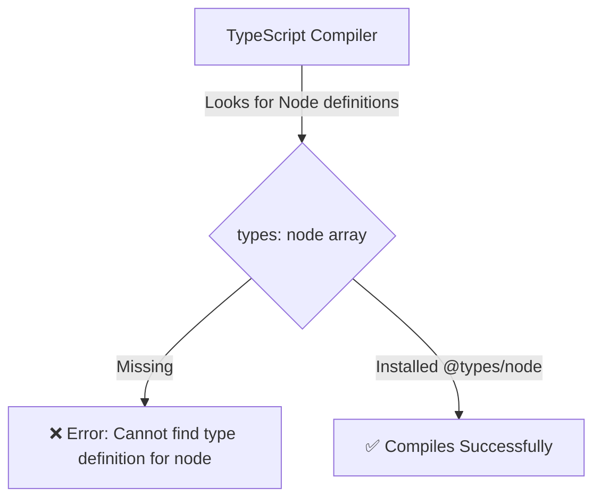
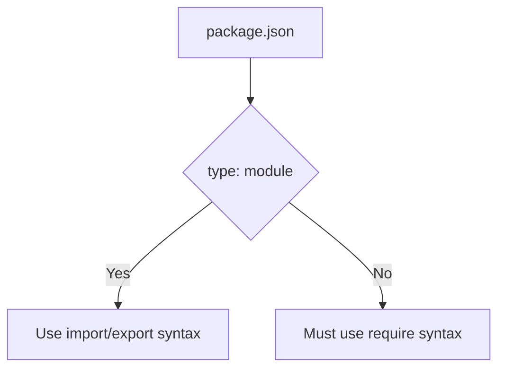
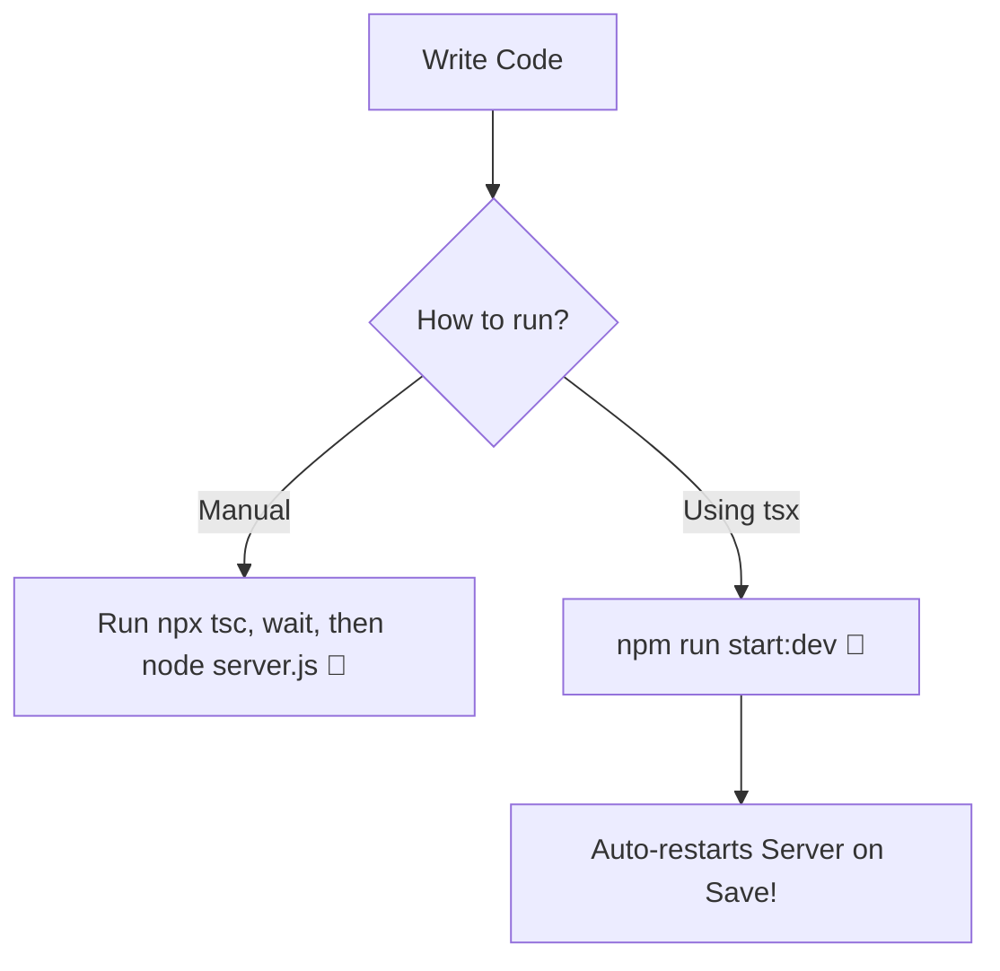
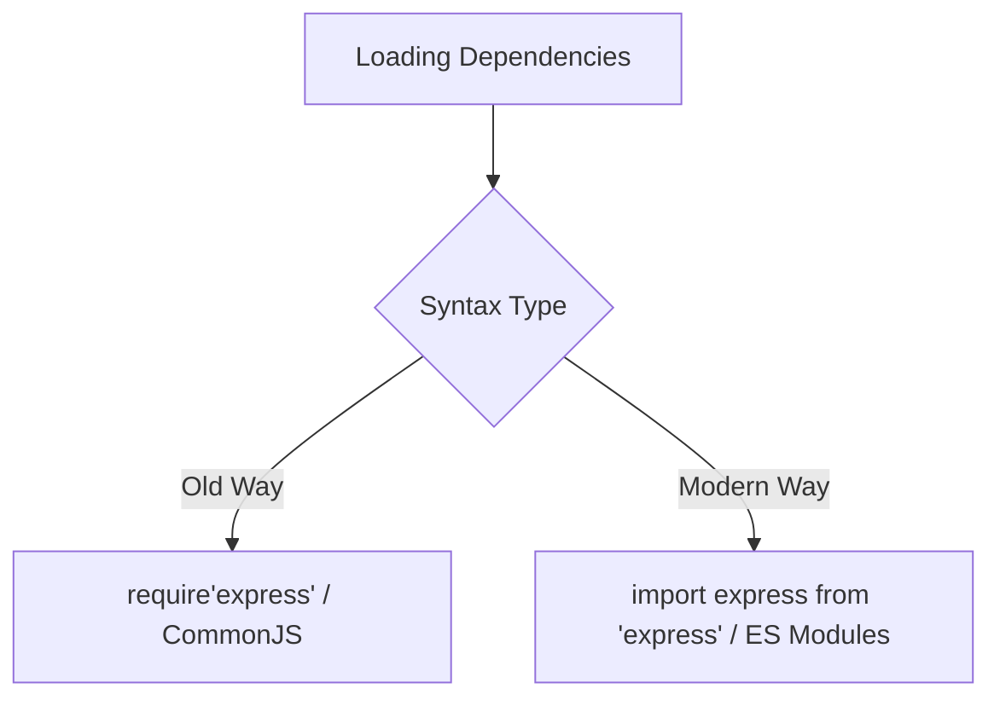
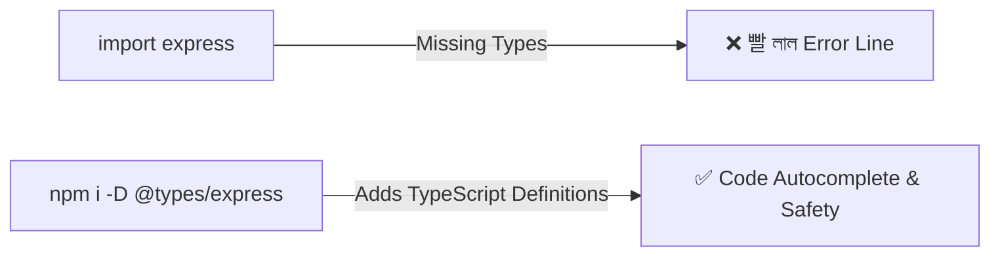
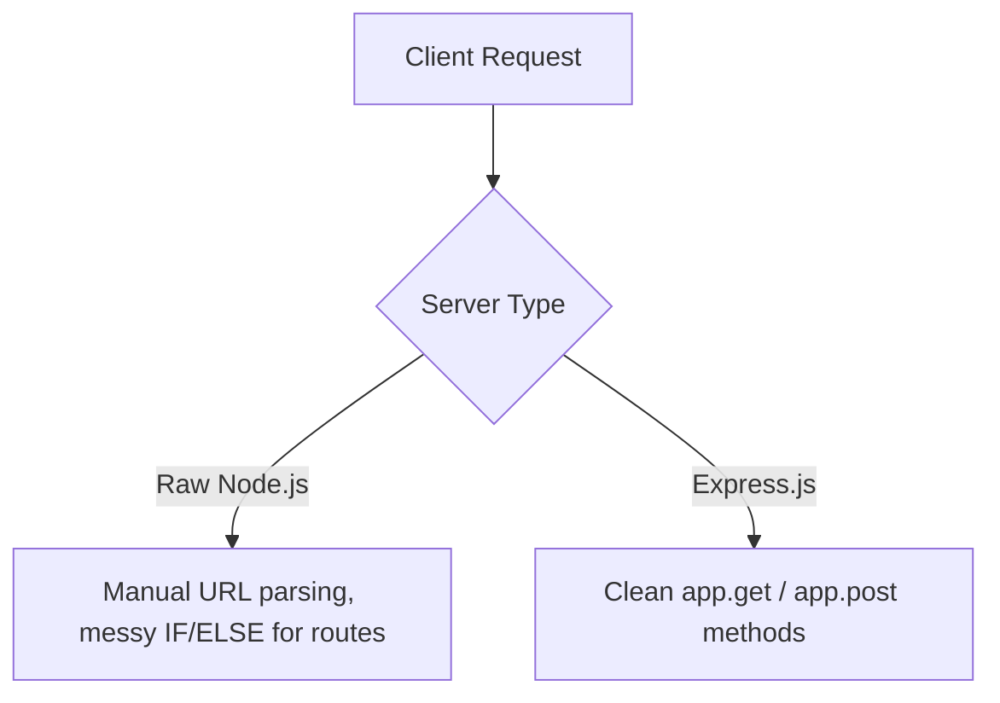
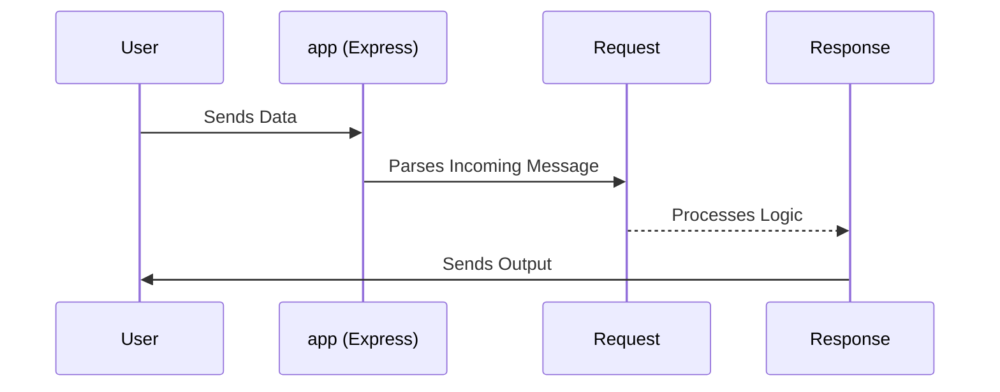
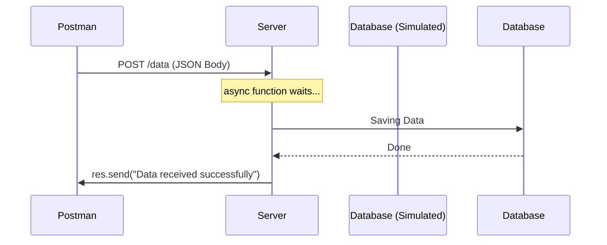
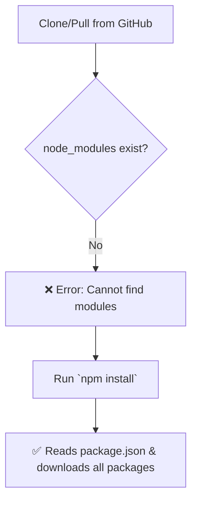

# 🚀 Module 07: Express.js Server Architecture & Database Integration

Welcome to the Express.js Server setup! This guide explains exactly what we did to initialize the project and how you can run the server.

## 🛠️ What We Did (Project Setup)

We initialized a basic Node.js project. Here is the step-by-step breakdown based on the terminal commands:

### 1. Initialize `package.json`
*   **What it is:** The `npm init` command creates a `package.json` file.
*   **The Process:** We ran `npm init` in the terminal. It asked a series of questions (like package name, version, description, entry point `index.js`, etc.).
*   **The Result:** It automatically generated a `package.json` file. This file acts as the heart of our project, keeping track of all the metadata and future dependencies.

### 2. Install TypeScript (`npm i -D typescript`)
*   **What it is:** The `npm i -D typescript` command installs the programming language TypeScript into our project. The `-D` flag saves it as a `devDependency` in our `package.json`.
*   **The Problem:** Plain JavaScript doesn't check for type errors before running the code. Furthermore, if we just run `npm i typescript` (without `-D`), the compiler tools get added to our final production app, which makes the app unnecessarily heavy. 
*   **The Solution:** Using the `-D` flag tells Node that we only need TypeScript during the development phase to write and check our code. Production servers only run the final compiled JavaScript.
*   💡 **Real-Life Analogy:** **Scaffolding for a Building**. When constructing a building, workers use scaffolding (TypeScript) to build safely and accurately. Once the building is finished and people move in (Production), the scaffolding is removed. You don't keep the scaffolding permanently!

### 3. Initialize TypeScript Config (`npx tsc --init`)
*   **What it is:** This command generates a `tsconfig.json` file inside your project. This file stores all the rules and settings for the TypeScript compiler.
*   **The Problem:** After installing TypeScript, it doesn't automatically know *how* to translate your code into standard JavaScript. It doesn't know which ECMAScript version you want, where to save the compiled files, or how strict the type-checking should be. 
*   **The Solution:** Running `npx tsc --init` solves this by giving us a central `tsconfig.json` rulebook. We can tell the compiler exactly how to behave for this specific project.
*   💡 **Real-Life Analogy:** **The Game Rulebook**. Playing a sport without rules leads to chaos. The `tsconfig.json` is your custom "Rulebook" that tells the referee (the TypeScript Compiler) exactly what moves are allowed, what's a foul, and how the game should be played.

### 4. Fixing the Node Types Error (`npm i -D @types/node`)

*   **What it is:** `@types/node` is a package that provides TypeScript definitions (types) for Node.js built-in modules.
*   **The Problem:** You encountered the error: `Cannot find type definition file for 'node'`. TypeScript is a completely separate language and has no idea what Node.js built-in properties (like `process`, `fs`, `http`) are by default. 
**Problem Code (Error output):**
```bash
Cannot find type definition file for 'node'.
The file is in the program because:
Entry point of type library 'node' specified in compilerOptions
```
*   **The Solution:** You need to install the Node types as a dev dependency by running `npm i -D @types/node`. This gives TypeScript the vocabulary to understand Node.js.
*   💡 **Real-Life Analogy:** **A Foreign Language Dictionary**. Imagine you (TypeScript) are reading a book written in French (Node.js). Without a French-to-English dictionary (`@types/node`), you'll throw an error saying "Cannot find definitions for these words."

**Analogy Code:**
```typescript
class Translator {
    dictionary: any = null; // No types attached yet (Problem: Error)
    
    // Solution: Installing the dictionary allows translation
    installDictionary(nodeDictionary: string[]) {
        this.dictionary = nodeDictionary;
    }
}
```

### 5. Configuring `tsconfig.json` Directory Rules

*   **What it is:** Updating the `tsconfig.json` file to manage where we keep source code and where the final code should go.
*   **The Problem:** By default, if we don't define `rootDir` and `outDir`, the generated JavaScript files will be dumped right next to our TypeScript files. This causes a giant, messy folder where production files and development files are mixed up. Also, we commented out `jsx` because we are building a backend server, not a React frontend.
**Problem Code (`tsconfig.json` before configuring):**
```json
// "rootDir": "./", 
// "outDir": "./",
// "jsx": "react-jsx", // Not needed for a Backend Express Server!
"types": ["node"] // We added this, but where is the output going?
```
*   **The Solution:** We uncomment and set `"rootDir": "./src"` (where we write TS) and `"outDir": "./dist"` (where compiled JS goes). We also comment out or remove `"jsx": "react-jsx"`. We set `"module": "esnext"` to allow modern import syntax.

**Solution Code:**
```json
{
  "compilerOptions": {
    "module": "esnext", 
    "rootDir": "./src", 
    "outDir": "./dist", 
    "types": ["node"]   
    // "jsx": "react-jsx" (Commented out because this is a backend)
  }
}
```
*   💡 **Real-Life Analogy:** **A Restaurant Kitchen Setup**. `rootDir` is your raw ingredients pantry. `outDir` is the packaging area where cooked meals are boxed for delivery. If you don't separate them, raw meat and cooked food get mixed up on the same table!

**Analogy Code:**
```typescript
class Kitchen {
    rootDir: string = "Raw Ingredients Pantry";
    outDir: string = "Finished Delivery Boxes";

    cookMeal(rawFood: string): string {
        return `Moved from ${this.rootDir} -> Cooked -> Placed in ${this.outDir}`;
    }
}
```

### 6. Enabling Modern Modules in `package.json`

*   **What it is:** Adding `"type": "module"` to the `package.json` file instructs Node.js to use the modern ECMAScript Module (ESM) system instead of the legacy CommonJS system.
*   **The Problem:** Node.js, by default, expects older `require()` syntax. If we try to write modern TypeScript code using `import express from 'express'`, Node.js will crash with a syntax error.
**Problem Code (`package.json` default):**
```json
{
  "type": "commonjs", // Node expects require()
}
// Inside a file, this would crash:
import express from 'express'; // ERROR!
```
*   **The Solution:** Add `"type": "module"` to `package.json`.

**Solution Code:**
```json
{
  "name": "module_07_express.js_server_architecture",
  "type": "module", 
  "devDependencies": {
      "typescript": "^6.0.3"
  }
}
```
*   💡 **Real-Life Analogy:** **Setting the Official Language**. If you walk into a government office in Japan (Node.js) and start speaking Spanish (ESM imports), they will reject your paperwork. By declaring `"type": "module"` at the entrance, you officially switch the building's language rules so everyone understands your modern dialect.

**Analogy Code:**
```typescript
class GovernmentOffice {
    officialLanguage: string;
    constructor(language: string) {
        this.officialLanguage = language;
    }
    processPaperwork(document: string) {
        if (this.officialLanguage !== "Modern") throw new Error("Language not supported!");
        return "Paperwork Approved!";
    }
}
const myOffice = new GovernmentOffice("Modern"); // Equals to "type": "module"
```

### 7. Creating the `src/server.ts` File

*   **What it is:** Creating our main server file where all our Express app logic will originate.
*   **The Problem:** Even with all configs ready, we have no actual file to run! 
**Problem Code:**
*(Folder is empty. No place to write server code).*
*   **The Solution:** Create a `src` folder (matching our `rootDir`), and place a `server.ts` file inside it to write our actual server code.

**Solution Code:**
```typescript
// Inside src/server.ts
import express from 'express'; // Now allowed because of our configs!

const app = express();
const port = 3000;

app.get('/', (req, res) => {
    res.send('Hello World');
});
```
*   💡 **Real-Life Analogy:** **Opening the Front Desk**. You've built the building (configs) and hired the staff (packages), but now you need to actually set up the front desk counter (`server.ts`) where customers (users) can come and make requests.

**Analogy Code:**
```typescript
class ServerBuilding {
    frontDesk: boolean = false; // Problem: Nowhere for users to go

    openFrontDesk() {
        this.frontDesk = true; // Solution: Create server.ts
        return "Server is ready to receive requests!";
    }
}
```

### 8. Live Reloading and Scripts (`npm i -D tsx`)

*   **What it is:** `tsx` is an execution engine that lets you run TypeScript files directly without compiling them first, and it supports "watch" mode to auto-restart the server when files change. We install it as a development dependency using `npm i -D tsx`. We also add custom shortcut commands inside the `"scripts"` section of the `package.json` file.
*   **The Problem:** Without a tool like `tsx`, every time you make a tiny change to your TypeScript code, you have to manually cancel the server, run the compiler (`tsc`), and then restart Node (`node ./dist/server.js`). This takes too much time and ruins the developer experience.
**Problem Code (Manual repetitive execution):**
```bash
# You have to manually do this EVERY time you save a file:
npx tsc
node ./dist/server.js
```
*   **The Solution:** First, install the live-reloading engine: `npm i -D tsx`. Then, define easy-to-use shortcut scripts in `package.json` called `"dev"` and `"prod"`. By using `tsx watch`, the server will automatically detect new changes, re-run itself, and save you from typing terminal commands repeatedly.

**Solution Code:**
```json
// Inside package.json
"scripts": {
  "build": "tsc",
  "dev": "tsx watch ./src/server.ts",
  "prod": "node ./dist/server.js",
  "test": "echo \"Error: no test specified\" && exit 1"
}
```

*   **Understanding the Scripts:**
    1.  `"build": "tsc"`: This tells the referee (TypeScript compiler) to read all your `.ts` files inside `src` and generate the final JS files inside the `dist` folder.
    2.  `"dev": "tsx watch ./src/server.ts"`: This is your **Development Mode**. `tsx` runs your TypeScript file directly, and `watch` keeps an eye on it. If you save a file, the server automatically restarts! *(Note: You can run this easily using `npm run dev`)*.
    3.  `"prod": "node ./dist/server.js"`: This is your **Production Mode**. It runs the final, compiled `.js` file from the `dist` folder. This is what you execute when your app is live on a real server using `npm run prod`.

*   💡 **Real-Life Analogy:** **A Translator vs. A Live Interpreter**. Compiling manually is like waiting for a book to be fully translated, printed, and delivered before you can read it. `tsx watch` is like having a Live Interpreter at a conference—they listen to you and instantly translate your words on the spot, reacting to your changes in real-time.

**Analogy Code:**
```typescript
class Translator {
    waitingTime: string = "Very slow!"; // Problem: Manual Compile
}

class LiveInterpreter {
    translateInstantly() {
        return "You speak -> I translate -> Audience hears instantly!"; // Solution: tsx watch
    }
}
```

---

## 🚀 Building the Express Server

### 9. Installing Express & Using ES Modules (`import` vs `require`)

*   **What it is:** Installing the Express framework (`npm install express --save`) and importing it into our code using modern syntax.
*   **The Problem:** The old way of loading packages in Node.js uses `require()`. It is synchronous (stops everything else while loading) and makes it harder for modern tools to analyze and optimize (tree-shake) the code.
**Problem Code (The Old Way):**
```javascript
const express = require('express'); // ❌ Old syntax (CommonJS)
```
*   **The Solution:** We set `"type": "module"` earlier, which allows us to use `import`. It is asynchronous, modern, cleaner, and standard across both frontend and backend JavaScript.
**Solution Code (The Modern Way):**
```typescript
import express from 'express'; // ✅ Modern, async, cleaner!
```
*   💡 **Real-Life Analogy:** **Sending a Letter vs. Email**. `require()` is like waiting for a physical letter before you can continue your work. `import` is like getting an email—it arrives fast, efficiently, and fits into the modern workflow perfectly. 

### 10. Fixing the Express TypeScript Error (`@types/express`)

*   **What it is:** Installing type definitions for Express (`npm i --save-dev @types/express`).
*   **The Problem:** Express was originally written in plain JavaScript. When you try to import it into a TypeScript file, TS says: "I don't know what this 'express' thing is—it has no types!"
**Problem Code (Error output):**
```bash
Could not find a declaration file for module 'express'.
Try `npm i --save-dev @types/express`
```
*   **The Solution:** Install the definitions as a DevDependency. Now TypeScript knows exactly what `express()`, `req`, and `res` are, providing magic auto-completion and error-checking as you type!

### 11. Raw Node.js vs. Express (Writing our Server Code)

*   **What it is:** Express is a framework built *on top* of Node.js. It simplifies the complicated process of making a web server.
*   **The Problem:** If we created a server using raw Node.js (`http` module), we would have to write complex, messy logic just to check what URL the user visited ("/", "/about", etc.).
**Problem Code (Raw Node.js - Hard to read):**
```javascript
// A nightmare to manage 100s of routes!
const http = require('http');
const server = http.createServer((req, res) => {
    if (req.url === '/' && req.method === 'GET') {
        res.end('Hello World!');
    }
});
server.listen(3000);
```
*   **The Solution:** Express abstracts (hides) all this ugly Node.js background work. Look how clean and beautiful the code becomes with Express. We define the app, set a port, create a simple GET route, and start listening!
**Solution Code (Your exact server.ts):**
```typescript
import express from 'express'
const app = express()
const port = 3000

app.get('/', (req, res) => {
  res.send('Hello World!')
})

app.listen(port, () => {
  console.log(`Example app listening on port ${port}`)
})
```
*   💡 **Real-Life Analogy:** **Building a Car**. Using Raw Node.js is like building a car completely from scratch (smelting the metal, building the engine piece by piece). Using Express is like buying a pre-built sports car chassis—the engine and wheels are already there, you just focus on painting it and driving!

**Analogy Code:**
```typescript
// Raw Node Concept
class RawNodeConstructor {
    buildEngine() { /* complex logic */ }
    attachWheels() { /* complex logic */ }
}

// Express Concept
class ExpressFramework {
    readyToDriveApp() {
        return "I already did the hard work. Just tell me where to go!";
    }
}
const myExpressApp = new ExpressFramework().readyToDriveApp();
```

---

## 🏗️ Deep Dive: Understanding the Express Server Code

### 12. App Instance and TypeScript Types (`Request` & `Response`)

*   **What it is:** `const app = express()` creates the main Express application. `Request` and `Response` are TypeScript types imported from `@types/express` (the `index.d.ts` file) used to strictly type the incoming message (`req`) and the outgoing message (`res`).
*   **The Problem:** If we don't define types for `req` and `res`, TypeScript will complain (`implicit 'any' type`) or we might accidentally misspell methods like `res.sends()` instead of `res.send()`.
**Problem Code (No Types):**
```typescript
// TypeScript doesn't know what 'req' and 'res' are!
app.get('/', (req, res) => {
    res.snd('Hello'); // TS won't catch this typo!
});
```
*   **The Solution:** Import explicitly `Request` and `Response` types. This acts as a contract. Now, your editor guarantees that `req` contains the user's incoming message and `res` handles the output methods correctly.

**Solution Code:**
```typescript
import express, { type Request, type Response } from 'express';
const app = express(); // The core application instance
```
*   💡 **Real-Life Analogy:** **The Restaurant Manager and Waiters**. The `app` is the Restaurant Manager. The `Request` is the Waiter taking the customer's exact order, and `Response` is the Waiter delivering the cooked food back to the table. By giving them name tags (Types), they never forget their jobs.

**Analogy Code:**
```typescript
type WaiterOrder = string; // Request Type
type ChefOutput = string;  // Response Type

class RestaurantManager {
    handleCustomer(req: WaiterOrder, res: ChefOutput) {
        return "Order taken and food delivered accurately!";
    }
}
```

### 13. Sending Structured Data: JSON and Status Codes

*   **What it is:** When the server responds, we should configure a **Status Code** (like `200` for OK, `404` for Not Found) and send the data clearly as **JSON**. The user can see this status in the Browser's Inspect tools (Network Tab -> Headers).
*   **The Problem:** In Raw Node.js, sending JSON is extremely tedious. You have to manually write headers and turn objects into stringified text.
**Problem Code (Raw Node.js manually writing headers):**
```javascript
// Raw Node.js
res.writeHead(200, { 'Content-Type': 'application/json' });
res.end(JSON.stringify({ message: "express server", author: "moon" })); // Messy!
```
*   **The Solution:** Express condenses this into one beautiful chain: `res.status(200).json()`. It automatically formats the header and sends the response.

**Solution Code:**
```typescript
app.get('/', (req: Request, res: Response) => {
  // Express handles stringify and headers automatically
  res.status(200).json({
    message: "express server",
    author: "moon"
  });
});
```
*   💡 **Real-Life Analogy:** **Sending a Certified Package**. Raw Node is like manually folding a cardboard box, taping it, writing the recipient address, and finding the postage stamp. Express `res.json()` is like handing it to a FedEx clerk who boxes, labels, and ships it all at once with a Tracking Number (Status Code).

**Analogy Code:**
```typescript
class FedExClerk {
    shipPackage(item: object, trackingCode: number) {
        return `Package shipped with Tracking Code: ${trackingCode}`;
    }
}
const clerk = new FedExClerk();
clerk.shipPackage({ message: 'express server' }, 200); // 200 is the status code
```

### 14. The POST Method & Asynchronous Handlers (`async/await`)

*   **What it is:** A `POST` route allows the server to *receive* new data from the client (usually tested using Postman by creating a Collection, a Folder, and a Request sending "raw" JSON). We use `async` because storing or processing data takes time.
*   **The Problem:** In raw Node.js, listening to incoming POST data is a massive headache. You have to listen to `data` bits and piece them together. Furthermore, if you don't use `async/await`, your code will freeze while waiting to save the data in the database.
**Problem Code (Raw Node.js POST logic):**
```javascript
// A nightmare to parse body chunks in raw Node.js
let body = '';
req.on('data', chunk => { body += chunk.toString(); });
req.on('end', () => { console.log(body); });
```
*   **The Solution:** `app.post()` handles the routing. By using `async`, Node.js can handle other users' requests while waiting for this specific code to finish. The client (Postman) sends the raw JSON, and the server deals with it cleanly.

**Solution Code:**
```typescript
app.post('/data', async (req: Request, res: Response) => {
  const data = req.body;
  // Node.js will wait here if we had await saveToDatabase(data)
  res.send('Data received successfully');
});
```
*   💡 **Real-Life Analogy:** **The Bank Teller (Async)**. If you hand a teller a complex check (POST request), they don't freeze the whole bank. They tell you to wait (`async/await`) while they verify it, allowing the bank to function while processing your request safely.

**Analogy Code:**
```typescript
class BankTeller {
    async processDeposit(money: number) {
        // Pauses ONLY this task, doesn't freeze the bank
        await this.verifyVault(); 
        return "Money received securely";
    }
    async verifyVault() { /* Verification logic */ }
}
```

### 15. Middleware (The Gatekeeper): `express.json()`

*   **What it is:** Middleware executes *in the middle*—after receiving the request, but before handing it to your route. `app.use(express.json())` translates the incoming raw text into a manageable JavaScript object.
*   **The Problem:** By default, Express is completely blind to JSON data. If a user posts `{ "name": "moon" }` via Postman, `req.body` will just be `undefined`. Historically, developers had to install a messy extra package called `body-parser`.
**Problem Code (Without Middleware):**
```typescript
// If app.use(express.json()) is missing:
app.post('/data', async (req: Request, res: Response) => {
  console.log(req.body); // OUTPUT: undefined (Data is lost!)
});
```
*   **The Solution:** Express recently built `body-parser` directly into its core! Calling `app.use(express.json())` ensures that all incoming request data is safely parsed and handed to `req.body`.

**Solution Code:**
```typescript
const app = express();

// ✅ The Middleware automatically translates raw JSON into JS objects
app.use(express.json());

app.post('/data', async (req: Request, res: Response) => {
  const data = req.body; // Now, data perfectly equals the JSON!
});
```
*   💡 **Real-Life Analogy:** **The Airport Customs Interpreter**. You arrive at an airport speaking a foreign language (JSON). Before you can talk to the city's Mayor (the Route), you *must* pass through Customs (Middleware). A Customs Interpreter (`express.json()`) translates your luggage so the Mayor (`req.body`) understands exactly what you brought.

**Analogy Code:**
```typescript
class CustomsInterpreter {
    translate(rawLuggage: string) {
        return JSON.parse(rawLuggage); // Transforms string to Object
    }
}
const myLuggage = new CustomsInterpreter().translate('{"item": "laptop"}');
```

---

## 🛠️ Bonus Learning: Recovering Packages After GitHub Pull

### 16. Installing Missing Dependencies (`npm install`)

*   **What it is:** The `npm install` command (or simply `npm i`) reads the `package.json` file and downloads all the missing dependencies required for the project to run on your local machine.
*   **The Problem:** When you pull or clone an existing project from GitHub, the `node_modules` folder (which contains the actual package files for Express, TypeScript, etc.) is ignored and NOT downloaded. Why? Because it's a massive folder. If you try to run your project (`npm run dev`) immediately after pulling, the app will instantly crash complaining about missing modules.
**Problem Code (Crashing in Terminal):**
```bash
# Trying to run immediately after 'git pull' without node_modules
> tsx watch ./src/server.ts
Error: Cannot find package 'express'
```
*   **The Solution:** Open your terminal in the project directory and run `npm install`. Node will read your `package.json` (the blueprint), connect to the npm registry, and securely download all the exact packages you and your teammates agreed upon.

**Solution Code (Terminal Command):**
```bash
# The magic command to restore all packages
npm install
```
*   💡 **Real-Life Analogy:** **IKEA Furniture Delivery**. When you order a massive wardrobe from IKEA (pulling from GitHub), they don't deliver it fully built because it's too big to transport (like `node_modules`). Instead, they give you a flat box with an Instruction Manual (`package.json`). When you get home, you call an assembler (`npm install`) who reads the manual and fetches all the exact screws and wood pieces to build it right in your living room!

**Analogy Code:**
```typescript
class ProjectBlueprint {
    // package.json acts as the instruction manual
    requiredTools = ["express", "typescript", "tsx"];
}

class NpmInstaller {
    downloadDependencies(blueprint: ProjectBlueprint) {
        // Reads the manual and downloads everything needed locally
        return `Successfully fetched: ${blueprint.requiredTools.join(', ')}`;
    }
}

const localSetup = new NpmInstaller();
localSetup.downloadDependencies(new ProjectBlueprint());
```