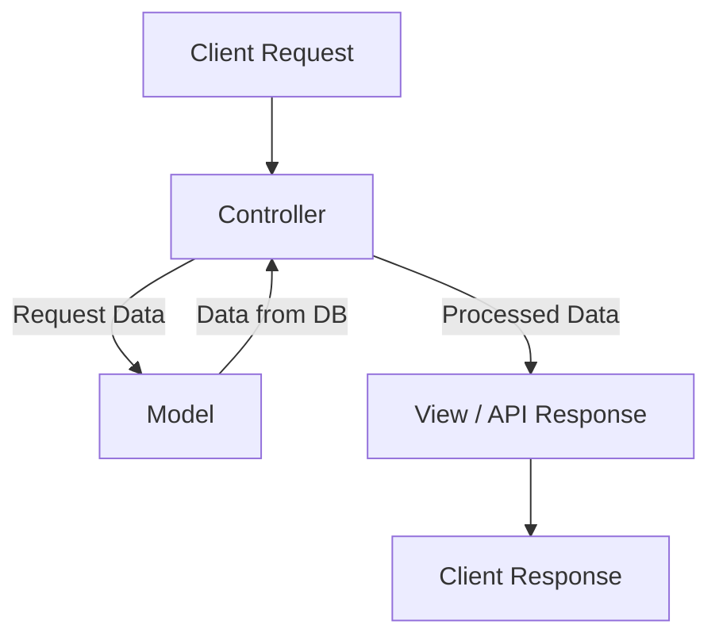
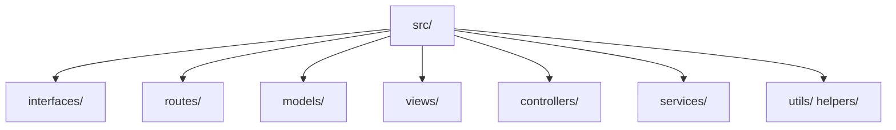
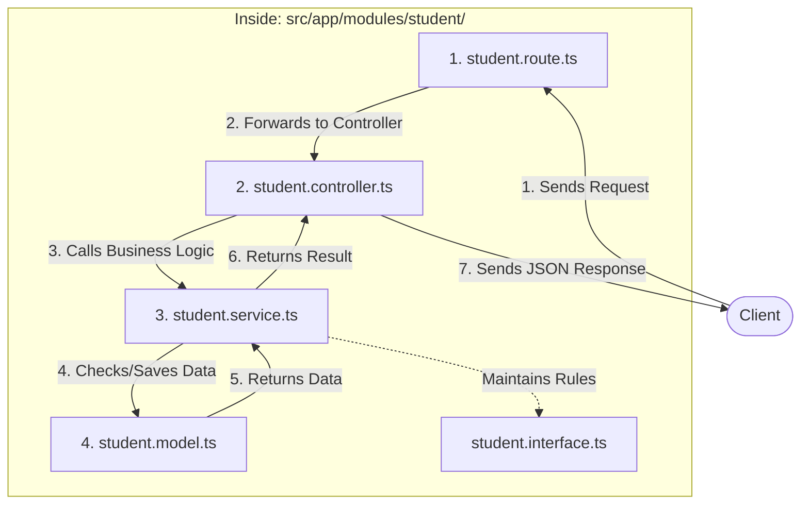
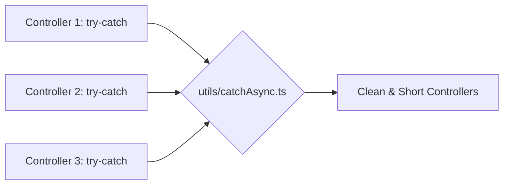
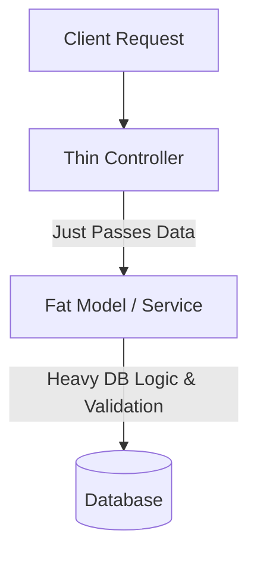
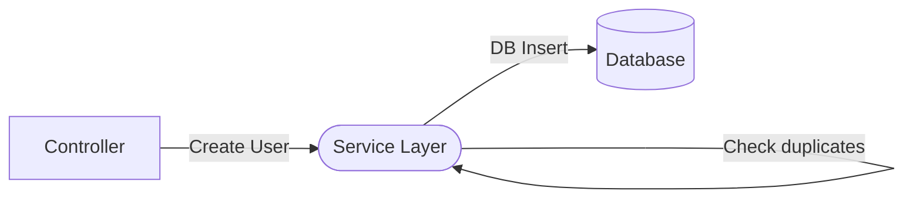
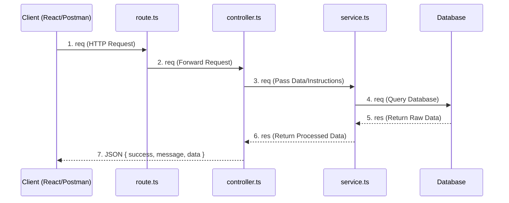
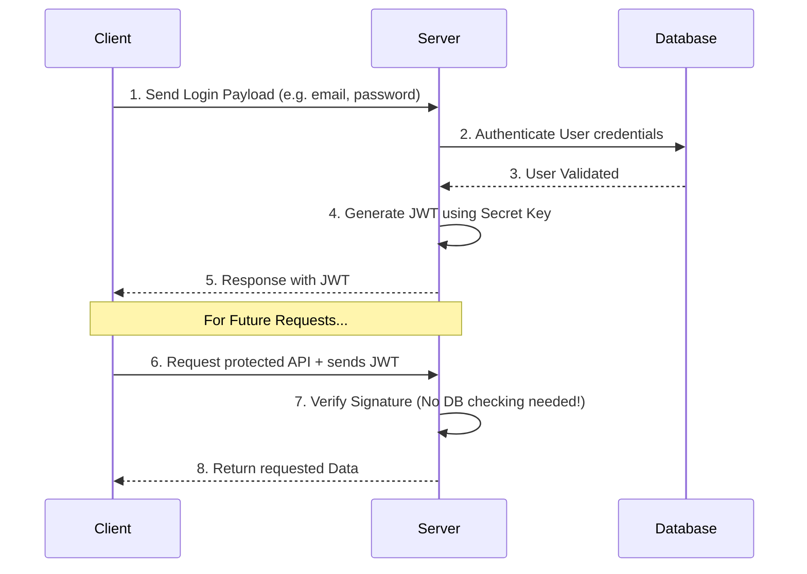

# 🏗️ Module 08: Advanced Backend Structuring

## Step 1: Software Design Pattern


### A. What it is
A **Software Design Pattern** is a reusable, proven blueprint or template for solving common problems in software design. It is a standard way to organize your code to make it scalable, clean, and easily understandable.

### B. The Problem
Imagine writing an entire backend application (database queries, validation logic, route definitions, error handling) in a single `server.ts` file. 
*   **The Issue:** The file becomes thousands of lines long. This is called **Spaghetti Code**—a tangled, chaotic mess that is incredibly hard to debug, read, or add new features to.

### C. The Solution
By applying a Software Design Pattern, we separate different concerns into specific modules and folders. This makes the codebase modular, easy to read, and simple for multiple developers to work on simultaneously.

### D. Real-Life Analogy
💡 **Building a High-Rise Tower:** 
If you just start pouring concrete and stacking bricks without a plan (No Pattern), the building will eventually collapse. But if you use an Architect's Blueprint (Design Pattern), every room, pipe, and wire is placed in an organized, structured way.

---

## Step 2: MVC Architecture (Model-View-Controller)



### A. What it is
**MVC** stands for Model-View-Controller. It is one of the most popular software design patterns used in web development. It divides the application logic into three interconnected parts exactly based on their specific responsibilities.

### B. The Problem
Mixing data-fetching (Database), business rules (Logic), and API response formatting in a single route handler makes the code bloated. If you want to change how the database works, you might accidentally break the API response format because they are tightly mixed together.

### C. The Solution: MVC Pattern
MVC solves this by giving exact responsibilities:
*   **Model:** Handles data logic. Interacts with the database (e.g., MongoDB/Mongoose), validates data, and saves it.
*   **View:** Displays the data. In backend APIs, this is usually the formatted JSON response sent back to the client.
*   **Controller:** The middleman or manager. It receives the request from the user, asks the Model for needed data, processes it, and then sends it to the View (Response).

### D. Real-Life Analogy
💡 **A Fine-Dining Restaurant:**
*   **Model (The Kitchen & Fridge):** Where the raw ingredients (Data) are stored and meals are prepared (Database queries).
*   **View (The Table/Customer):** The presentation of the final dish (JSON Response).
*   **Controller (The Waiter):** Takes the order (Request) from the Customer (Client), gives it to the Kitchen (Model), and brings the prepared food (Data) back to the Customer (View).

---

## Step 3: Folder Structure (Who Holds What!)



To implement a robust Modular architecture (an upgraded version of MVC used in modern Node.js backends), we organize our files into specific folders. Based on the pattern, here is what each folder holds and its job:

*   📂 **`interfaces/` (The Blueprint):**
    *   **Role:** TypeScript blueprints.
    *   **Job:** Holds all the `type` and `interface` definitions to keep the application strictly typed and error-free.
    *   **Examples:** `student.interface.ts`, `admin.interface.ts`, `faculty.interface.ts`
*   📂 **`routes/` (The Directory / Receptionist):** 
    *   **Role:** Holds all the API endpoints. 
    *   **Job:** Receives incoming requests and immediately forwards them to the correct Controller.
    *   **Examples:** `student.route.ts`, `admin.route.ts`, `faculty.route.ts`
*   📂 **`models/` (The Vault / Database Guard):**
    *   **Role:** Database schema and direct DB interactions.
    *   **Job:** Defines how data looks (Mongoose Schemas) and directly talks to the Database.
    *   **Examples:** `student.model.ts`, `admin.model.ts`, `faculty.model.ts`
*   📂 **`views/` (The Presentation):**
    *   **Role:** Displays data to the user.
    *   **Job:** Holds Template Engines (like `ejs`, `handlebars`, `pug`) for server-side rendering, or connects to Frontend Libraries/Frameworks (like `React`, `Vue`).
*   📂 **`controllers/` (The Waiter / Manager):**
    *   **Role:** Handles HTTP requests and responses.
    *   **Job:** Extracts data from `req.body`, sends it to the Service layer, and sends the response back to the user.
    *   **Examples:** `student.controller.ts`, `admin.controller.ts`, `faculty.controller.ts`
*   📂 **`services/` (The Brains / Factory Worker):**
    *   **Role:** Contains the core **Business Logic**.
    *   **Job:** This is where the actual complex work happens (e.g., calculating totals). It asks the Model for data, updates it, and returns the result to the Controller.
*   📂 **`utils/` or `helpers/`:**
    *   **Role:** Reusable tools.
    *   **Job:** Holds small helper functions used across the entire app (e.g., `catchAsync.ts`, `sendResponse.ts`).

---

## Step 4: Modular Pattern (Feature-Based Structure)



### A. What it is
The **Modular Pattern** is an architectural approach where the codebase is organized by **features or domains** (e.g., Student, Admin, Faculty) rather than by technical roles (e.g., all Controllers together). Each feature acts as a self-contained "module" holding its own routes, models, controllers, and services.

### B. The Problem (The Role-Based Mess)
In a standard role-based MVC structure, files are grouped strictly by their technical job (Controllers folder, Models folder, etc.).
*   **The Issue:** If you want to update or delete the "Student" feature, you have to hunt down `student.controller.ts` in the controllers folder, `student.model.ts` in the models folder, and so on. It scatters highly related files across the entire project, making it hard to scale.

**Problem File Structure:**
```text
src/
├── controllers/
│   ├── student.controller.ts
│   └── faculty.controller.ts
├── models/
│   ├── student.model.ts
│   └── faculty.model.ts
```

### C. The Solution (Feature-Based Modules)
The Modular Pattern solves this by keeping everything related to a single feature inside one specific folder. If you need to manage Students, you go to the `student` module folder. Everything you need is right there!

**Solution File Structure (Modular):**
```text
src/
└── app/
    └── modules/
        ├── student/
        │   ├── student.interface.ts
        │   ├── student.model.ts
        │   ├── student.controller.ts
        │   ├── student.service.ts
        │   └── student.route.ts
        └── faculty/
            ├── faculty.interface.ts
            ├── faculty.model.ts
            ├── faculty.controller.ts
            ├── faculty.service.ts
            └── faculty.route.ts
```

### D. Real-Life Analogy
💡 **A Supermarket vs. Specialized Brand Shops:**
*   **Role-Based (MVC - The Problem):** A giant supermarket where all the cash registers (Controllers) are on the 1st floor, all the trial rooms (Services) are on the 2nd floor, and all the clothing items (Models) are on the 3rd floor. Buying a shirt means running up and down three floors!
*   **Modular Pattern (The Solution):** A Shopping Mall with independent brand shops. The "Student Shop" (Module) has its own clothes (Model), its own trial room (Service), and its own cashier (Controller) perfectly organized inside one single room.

---

## Step 5: The DRY Principle (Don't Repeat Yourself)



### A. What it is
**DRY** stands for **Don't Repeat Yourself**. It is a fundamental rule in software development which states that you should not write the exact same code in multiple places. If you find yourself copying and pasting code, you should extract it into a reusable helper function (usually kept in the `utils/` folder).

### B. The Problem (Repetitive Code)
If every single API Controller needs to handle errors, writing `try-catch` blocks everywhere makes the code unnecessarily long and bloated.
*   **The Issue:** If you want to change how errors are logged later, you will have to manually edit 100 different files!

**Problem Code:**
```typescript
// ❌ Writing try-catch repeatedly in every single controller
const createStudent = async (req: Request, res: Response, next: NextFunction) => {
    try {
        // student creation logic
    } catch (error) {
        next(error);
    }
};

const createFaculty = async (req: Request, res: Response, next: NextFunction) => {
    try {
        // faculty creation logic
    } catch (error) {
        next(error);
    }
};
```

### C. The Solution (Using Utils)
We create a reusable function (e.g., `catchAsync`) in our `utils/` folder. Now, we simply wrap all our controllers in this utility, fully eliminating the repetitive `try-catch` code!

**Solution Code:**
```typescript
// ✅ utils/catchAsync.ts (Written exactly ONCE)
const catchAsync = (fn: RequestHandler) => {
    return (req: Request, res: Response, next: NextFunction) => {
        Promise.resolve(fn(req, res, next)).catch((err) => next(err));
    };
};

// ✅ controllers/student.controller.ts (DRY and Clean!)
const createStudent = catchAsync(async (req, res) => {
    // student creation logic ONLY (No try-catch blocks needed!)
});
```

### D. Real-Life Analogy
💡 **Company Logo Stamp:**
Imagine writing a letter to 500 customers. (Problem) Drawing the company logo by hand with a pen 500 times is a massive waste of time and prone to errors. (Solution) Instead, you make a **Rubber Stamp** (`utils` function) and just press it on every paper!

**Analogy Code:**
```typescript
// ❌ Problem: Drawing logo manually every time
const printLetter1 = () => "Dear User, 🖌️[Hand-Drawn Logo]🖌️...";
const printLetter2 = () => "Dear Client, 🖌️[Hand-Drawn Logo]🖌️...";

// ✅ Solution: Using a Stamp (DRY)
const applyLogoStamp = () => "🏭[Perfect Printed Logo]🏭";

const printLetterDRY = () => `Dear User, ${applyLogoStamp()}...`;
```

---

## Step 6: Fat Model / Thin Controller



### A. What it is
The **"Fat Model, Thin Controller"** principle states that a Controller should be extremely basic and lightweight ("Thin"). It should only receive requests and return responses. All the complex data manipulation, validations, and database queries should be pushed down into the Models or Services ("Fat").

### B. The Problem (The Fat Controller)
When developers are lazy, they put validation, database queries, password hashing, and calculations all inside the Controller file. 
*   **The Issue:** The controller becomes impossible to read, test, or reuse.

**Problem Code:**
```typescript
// ❌ Problem: Fat Controller doing way too much work
const registerUser = async (req: Request, res: Response) => {
    const { email, password, age } = req.body;
    
    // 1. Validation logic inside controller...
    if(age < 18) return res.status(400).send("Underage");
    
    // 2. Database logic inside controller...
    const existingUser = await UserDatabase.findOne({ email });
    if(existingUser) return res.status(400).send("User exists");
    
    // 3. Password hashing inside controller...
    const hashedPassword = hashNode(password);
    
    // 4. Finally... saving
    const newUser = await UserDatabase.create({ email, password: hashedPassword });
    res.status(200).json(newUser);
};
```

### C. The Solution (Thin Controller)
We strip everything out of the controller *except* grabbing the request, passing it to the database/service, and sending the response. The Controller is just a traffic cop.

**Solution Code:**
```typescript
// ✅ Solution: Thin Controller
const registerUser = async (req: Request, res: Response) => {
    // 1. Take data
    const userData = req.body;
    
    // 2. Pass entirely to Service/Model (Where the "Fat" logic lives)
    const newUser = await UserService.createUserLogic(userData);
    
    // 3. Send response
    res.status(200).json(newUser);
};
```

### D. Real-Life Analogy
💡 **The Restaurant Waiter (Controller) vs Kitchen (Model):**
A Waiter's (Thin Controller) ONLY job is to take your order and give you your food. (Problem) Imagine if the Waiter stopped beside your table, pulled out a pan, and started chopping onions and frying eggs (Fat Controller). It would be chaos! (Solution) The Waiter should just pass the order paper to the Kitchen (Fat Model/Service) where the complex cooking happens.

**Analogy Code:**
```typescript
// ❌ Problem: Waiter Cooks Food (Fat Waiter)
class FatWaiter {
    serveCustomer(order: string) { // Waiter chopping onions... }
}

// ✅ Solution: Waiter just passes info (Thin Waiter)
class Kitchen {
    cookFood(order: string) { return `Cooked ${order}`; } // Fat Logic
}
class ThinWaiter {
    takeOrder(order: string, kitchen: Kitchen) {
        return kitchen.cookFood(order); // Just passing the data!
    }
}
```

---

## Step 7: The Service Layer & Business Logic



### A. What it is
The **Service Layer** is a dedicated file (like `student.service.ts`) that holds your entire **Business Logic**. "Business Logic" means the actual real-world rules of your application (e.g., "A student cannot register without paying fees" or "Calculate 15% VAT on checkout").

### B. The Problem (Logic mixed with HTTP)
If you put your business logic inside the express `req, res` Controller, you cannot reuse that logic anywhere else (like a cron job, or a background worker) because it is eternally chained to an HTTP Request.

**Problem Code:**
```typescript
// ❌ Controller holds the Business Rules (Tax Calculation)
const checkout = async (req: Request, res: Response) => {
    const { price } = req.body;
    
    // Business Logic baked into the HTTP Controller
    const totalWithTax = price + (price * 0.15); 
    
    res.json({ total: totalWithTax });
};
```

### C. The Solution (Independent Service File)
Extract the actual logic into a completely separate Service file that knows *nothing* about HTTP, Extress, `req`, or `res`. It just takes raw data, applies rules, and returns raw data.

**Solution Code:**
```typescript
// ✅ services/checkout.service.ts (Holds Business Logic)
const calculateTotal = (price: number) => {
    return price + (price * 0.15); // The exact business rule
};

// ✅ controllers/checkout.controller.ts
const checkout = async (req: Request, res: Response) => {
    // Controller just calls the Service!
    const result = CheckoutService.calculateTotal(req.body.price); 
    res.json({ total: result });
};
```

### D. Real-Life Analogy
💡 **The Hospital Receptionist vs The Doctor:**
*   **Controller (Receptionist):** Takes your appointment paper and tells you to sit down. The receptionist DOES NOT diagnose your disease. 
*   **Service Layer (The Doctor):** The doctor has the actual **"Business Logic"** (Medical knowledge). The doctor evaluates your symptoms, performs checks (rules), and gives a prescription.

**Analogy Code:**
```typescript
// ✅ Service Layer (The Doctor holds medical rules)
class DoctorService {
    static diagnose(temperature: number) {
        if (temperature > 100) return "Fever"; // Business Logic!
        return "Healthy";
    }
}

// ✅ Controller (Receptionist just handles the patient)
class Receptionist {
    static handlePatient(temp: number) {
        const result = DoctorService.diagnose(temp);
        return `Patient diagnosis is: ${result}`;
    }
}
```

---

## Step 8: The Request-Response Flow (Modular Pattern)



### A. What it is
This flow describes the exact journey of a **Request (`req`)** coming from a user (like a React app or Postman) and how it travels through the Modular Pattern until a **Response (`res`)** is sent back. It is a one-way street in, and a one-way street out.

### B. The Problem (The Traffic Jam)
Without a strict flow, a request might go straight from the route to the database, or the service might try to send an HTTP response directly to the client. 
*   **The Issue:** If the Service sends the response, it becomes tied to HTTP. If the Route talks to the Database, it becomes too smart. This breaks all organizational rules and makes finding bugs a nightmare.

### C. The Solution (The Strict Pipeline)
The visual diagram enforces a very strict, step-by-step pipeline where every file does *only* its specific job:

1.  **Client (React/Vue/Postman):** Sends the initial Request (`req`).
2.  **`route.ts`:** First to receive the request. It acts as a traffic director and just forwards it to the correct controller.
3.  **`controller.ts`:** Receives the request, extracts exactly what is needed (e.g., user ID), and passes it down to the Service.
4.  **`service.ts`:** The brain. It takes the ID, talks to the **Database**, applies business logic, and gets the data back.
5.  **Return Journey (`res`):** The Service gives the processed data back to the Controller.
6.  **Final Output:** The Controller formats the standard API response (usually an object with `{ success, message, data }`) and sends it back to the Client. 

### D. Real-Life Analogy
💡 **Ordering at a High-End Restaurant:**

*   **Client (You):** You decide you want a burger and tell the receptionist.
*   **Route (Receptionist):** The receptionist says, "Ah, food order! Let me assign a Waiter for you."
*   **Controller (Waiter):** The waiter writes down your burger order and walks to the kitchen.
*   **Service (Chef):** The chef looks at the order, gets meat from the **Database (Fridge)**, cooks the burger (Business Logic), and puts it on a plate.
*   **The Return:** The chef gives the plate back to the Waiter (Controller).
*   **Final Response:** The Waiter brings you the burger beautifully arranged on a tray `{ success: true, message: "Enjoy!", data: Burger }`.

**Analogy Code:**
```typescript
// 1. Route forwards to Waiter
const route = (order) => WaiterController.takeOrder(order);

// 2. Controller passes to Chef, gives standard response back
class WaiterController {
    static takeOrder(order) {
        const food = ChefService.cook(order);
        return { success: true, message: "Here is your food", data: food };
    }
}

// 3. Service does the hard work with the Database (Fridge)
class ChefService {
    static cook(order) {
        const rawMeat = FridgeDatabase.get(order); // talks to DB
        return `${rawMeat} cooked to perfection!`;
    }
}
```

---

## Step 9: Error Handling in Service Layer (Throwing Errors vs HTTP Responses)

### A. What it is
In a modular architecture, the Service layer should never know about HTTP requests or responses (`req` or `res`). When an issue occurs (e.g., a user is not found), the Service simply **throws an Error**. It is the Controller's job to catch that error and send the appropriate HTTP status code (like 404) to the client.

### B. The Problem (Coupling Service to HTTP)
If we pass the `res` object into the Service just so we can send a `404` error, the Service becomes completely tied to the Express web framework. 
*   **The Issue:** If we later want to reuse `createProfileintoDB` from a background task, Cron Job, or CLI tool where there is no HTTP `res` object, the application will crash.

**Problem Code:**
```typescript
// ❌ Problem: Passing 'res' into the Service (Tightly Coupled)
const createProfileintoDB = async(payload: any, res: Response) => {
    // ... DB calls
    if (user.rows.length === 0) {
        // Service is doing Controller's job!
        return res.status(404).json({ message: "User not found" }); 
    }
};
```

### C. The Solution (Throwing Errors)
The Service should only throw a standard JavaScript Error. The Controller will catch this error in its `catch` block and formulate the proper HTTP Response. This keeps the Service pure, reusable, and framework-independent.

**Solution Code:**
```typescript
// ✅ Solution: Exact code from profile.service.ts (Pure and Reusable)
const createProfileintoDB = async(payload:any) => {
    try {
        const { user_id, bio, address,phone,gender } = payload;
        const client = await pool.connect();
        const user = await client.query(
           `SELECT * FROM users WHERE id = $1`, [user_id]
        );
        
        if (user.rows.length === 0) {
            client.release();
            // The Service ONLY throws the error. It doesn't know about HTTP!
            throw new Error("User not found");
        }
        
        // ... rest of the DB insertion code
    } catch (error) {
        console.error("Error creating profile in DB:", error);
        throw error;
    }
};
```

### D. Real-Life Analogy
💡 **The Cook and The Waiter:**
*   **Problem:** If the Cook (Service) finds out there are no more tomatoes, they shouldn't run out of the kitchen and talk directly to the Customer (res.json). It's unprofessional and breaks the flow.
*   **Solution:** The Cook should just yell "We are out of tomatoes!" (throw Error). The Waiter (Controller) hears this, walks to the Customer's table, and formally apologizes (HTTP 404 Response).

**Analogy Code:**
```typescript
// ✅ Analogy Code: Cook throws error, Waiter handles the customer
class CookService {
    static cookFood(ingredient: string) {
        if (ingredient === "none") {
            // Cook just yells (throws error), doesn't talk to customer!
            throw new Error("Ingredient not found"); 
        }
        return "Food is ready!";
    }
}

class WaiterController {
    static serveCustomer(res: any, ingredient: string) {
        try {
            const food = CookService.cookFood(ingredient);
            res.status(200).send(food);
        } catch (error: any) {
            // Waiter formally handles the customer's response
            res.status(404).json({ message: error.message });
        }
    }
}
```

---

## Step 10: JSON Web Token (JWT) & Authentication Process



### A. What it is
**JWT (JSON Web Token)** is an open standard used to securely share information between a client (Frontend) and a server (Backend) as a JSON object. It is mainly used for **Stateless Authentication**. 

A JWT has **3 parts** (separated by dots `.`):
1. **Header:** `eyJhbGciOiJIUzI1NiIsInR5cCI6IkpXVCJ9`
   * Decoded: `{ "alg": "HS256", "typ": "JWT" }`
   * **Job:** Tells what algorithm is used to sign the token.
2. **Payload:** `eyJpZCI6IjEyMzQ1Njc4OTAiLCJuYW1lIjoiTmV4dCBMZXZlbCJ9`
   * Decoded: `{ "id": "123456", "name": "Next Level", "role": "admin" }`
   * **Job:** Holds the actual user data. (Do not put passwords here, as anyone can decode it!).
3. **Signature:** `KMUFsIDTnFmyG3nMiGM6H9FNFUROf3wh7SmqJp-QV30`
   * Logic: `HMACSHA256( base64UrlEncode(header) + "." + base64UrlEncode(payload), secretKey )`
   * **Job:** The unique stamp of the server. It verifies that the token wasn't changed by a hacker.

### B. The Problem (Stateful Sessions)
Before JWT, servers used **Sessions**. When a user logged in, the server created a Session ID and saved it in its own memory or database. 
*   **The Issue:** The server has to *remember* every logged-in user. If you have 1 million users, the server's memory gets full. Also, if the server restarts, the memory clears, and everyone gets logged out!

**Problem Code:**
```typescript
// ❌ Problem: The Server MUST remember the session in its memory
const sessionMemory = {}; // Server's brain

const loginUser = (userPayload) => {
    // Check DB...
    const sessionId = "random_string_123";
    sessionMemory[sessionId] = userPayload.email; // Storing state!
    return sessionId; // Sends to client
};

const accessDashboard = (sessionId) => {
    // ❌ Server has to search its memory for every single request
    if (!sessionMemory[sessionId]) throw new Error("Not logged in!");
    return "Welcome to Dashboard";
};
```

### C. The Solution (Stateless JWT)
JWT solves this by being **Stateless**. The server doesn't remember anything! It simply takes the user's data (Payload), signs it with a `secretKey` to make a Token, and gives it to the user. Every time the user requests data, they show the Token. The server just checks if the signature is valid using its secret key. No memory, no database lookups!

**Solution Code:**
```typescript
// ✅ Solution: Stateless JWT (Server remembers nothing!)
import jwt from 'jsonwebtoken';

const loginUser = async (payload) => {
    // 1. Authenticate user from DB...
    
    // 2. Generate JWT (Server gives the user a signed token)
    const token = jwt.sign(
        { email: payload.email, role: 'admin' }, // Payload
        'my_super_secret_key',                   // Signature Secret
        { expiresIn: '1d' }                      // Expiration
    );
    return token; 
};

const accessDashboard = (token) => {
    // ✅ Server just mathematically verifies the signature. No DB checking!
    const decodedUser = jwt.verify(token, 'my_super_secret_key');
    return `Welcome ${decodedUser.email} to Dashboard`;
};
```

### D. Real-Life Analogy
💡 **The VIP Club Bouncer:**
*   **Problem (Session):** The Bouncer has a massive "Guest List Book" (Server Memory). Every time a guest wants to enter a room, the Bouncer has to flip through a 1000-page book to find their name. It's incredibly slow and exhausting.
*   **Solution (JWT):** The Bouncer just gives validated guests a **Special Stamped Wristband** (JWT). Now, when a guest walks around, the Bouncer doesn't need to check any books; they just look at the wristband to see if it has the authentic "Club Stamp" (Signature).

**Analogy Code:**
```typescript
// ❌ Problem: Searching the Big Book (Session)
class BouncerWithBook {
    checkEntry(guestName, hugeBook) {
        if (!hugeBook.includes(guestName)) {
            throw new Error("Wait, I have to read the whole book...");
        }
        return "Enter!";
    }
}

// ✅ Solution: Checking the Stamp (JWT Signature)
class SmartBouncer {
    checkEntry(wristband) {
        // Just checking the stamp. Fast and doesn't need a book!
        if (wristband.stamp !== "OFFICIAL_CLUB_STAMP") {
            throw new Error("Fake Wristband! Get out!");
        }
        return "Enter VIP Room!";
    }
}
```
